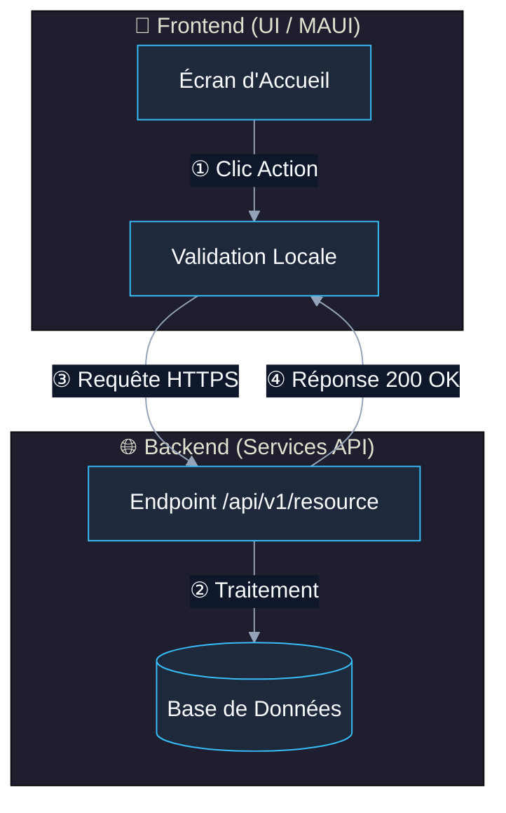
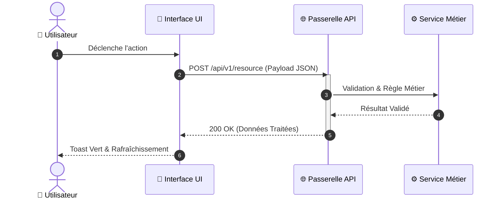
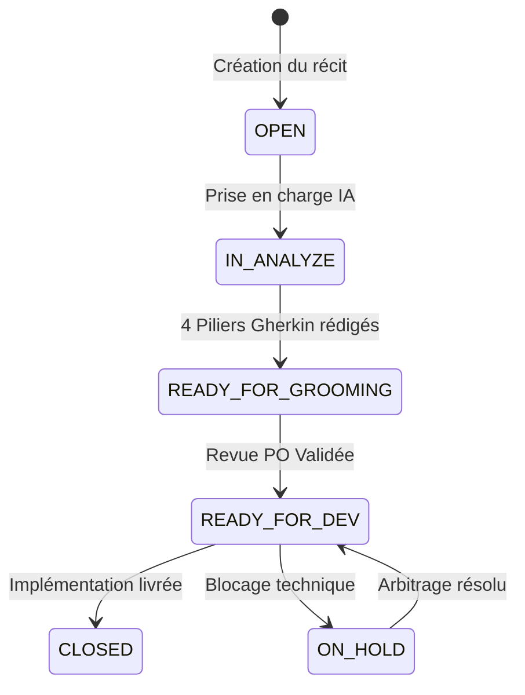

# 📊 Visual Mermaid (Moteur de Visualisation & Anti-Crash)

**Règle d'or :** Transformer les flux, architectures, machines à états et séquences réseau en diagrammes Mermaid d'une lisibilité maximale, tout en appliquant **100% des règles d'échappement anti-crash** pour garantir un rendu parfait dans Obsidian, GitHub et les visionneuses Markdown.

---

## ⚡ Quand l'utiliser (*When to Use*)
- Visualisation de flux métier, architectures de micro-services, arbres de décision et pipelines d'agents.
- Documentation des contrats d'API et interactions réseau sous forme de diagrammes de séquence (`sequenceDiagram`).
- Cycle de vie et transitions de statut sous forme de diagrammes d'états (`stateDiagram-v2`).
- Modélisation de domaines ou décompositions fonctionnelles hiérarchiques sous forme de Mindmap (`mindmap`).

## 🚫 Quand NE PAS l'utiliser (*When NOT to Use*)
- Schémas spatiaux infinis ou libres avec regroupements 2D complexes (utiliser `obsidian-canvas` ou `visual-excalidraw`).
- Simples listes de 2 ou 3 étapes linéaires sans embranchement (un simple format de texte clair suffit).

---

## 🛡️ Règles Critiques Anti-Crash (Zero-Error Mermaid)

1. **Règle Anti-Collision de Liste Ordonnée (Erreur #1)** :
   - ❌ **Interdit** : `[1. Action]`, `[2. Traitement]` (provoque le crash `Parse error: Unsupported markdown: list`).
   - ✅ **Obligatoire** : `[① Action]` (chiffres cerclés), `[1.Action]` (sans espace), ou `[Étape 1 : Action]`.
   - *Référence de chiffres cerclés* : `① ② ③ ④ ⑤ ⑥ ⑦ ⑧ ⑨ ⑩ ⑪ ⑫ ⑬ ⑭ ⑮ ⑯ ⑰ ⑱ ⑲ ⑳`
2. **Règle de Nommage des Sous-Graphes (Subgraphs)** :
   - ❌ **Interdit** : `subgraph Couche API` (espace dans le nom sans ID).
   - ✅ **Obligatoire** : `subgraph api["🌐 Couche API Backend"]` et référencement par ID (`client --> api`).
3. **Règle d'Échappement des Nœuds & Libellés** :
   - Toujours encadrer les labels comportant parenthèses, crochets ou ponctuations par des guillemets : `A["Nom du Service (v2.1)"]`.
   - Toujours référencer les flèches via les IDs de nœuds (`A --> B`) et jamais par le texte d'affichage.

---

## 🎨 Gabarits Standards Prêts à l'Emploi

### 1. Flux de Processus & Architecture Déclarative (graph TD / LR)

### 2. Diagramme de Séquence API & Interception

### 3. Diagramme d'États & Cycle de Vie

