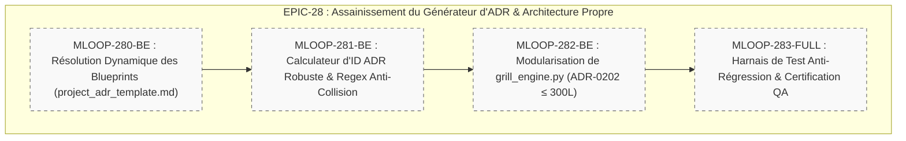

# 🏛️ Épopée — `EPIC-28-ADR-CLEAN-ARCHITECTURE` : Assainissement du Générateur d'ADR & Raccordement Dynamique des Blueprints

---

> **Référence d'Architecture** : [ADR-0320](../../../../standards/adr-system/0320-grill-me-frontier-design-tree-alignment.md) · [ADR-0202](../../../../standards/adr-system/0202-modularite-interne-agents.md) (Modularité ≤ 300L) · [ADR-0375](../../../../standards/adr-system/0375-standard-preuve-epistemique-et-tracabilite-radicale.md) (Traçabilité Radicale) · [ADR-0376](../../../../standards/adr-system/0376-standard-rigueur-zero-blindspot-ecosysteme-mloop.md) (Rigueur 360° Zéro Blindspot) · [ADR-012](../../../docs/01-architecture/ADR-012_epic-28_assainissement_generateur_adr_clean_architecture.md) (Arbitrages Macro-Grill EPIC-28)  
> **Composant(s)** : `Pipelines/Grill`, `Standards/Blueprints`, `Core/Templates`  
> **Origine / Déclencheur** : Audit post-veille du 24/09/2026 mettant en évidence une dette technique historique : `src/pipelines/grill_engine.py` utilise une constante Python en dur (`ADR_TEMPLATE`), ignore le blueprint officiel [`standards/blueprints/project_adr_template.md`](../../../../standards/blueprints/project_adr_template.md), utilise une incrémentation d'ID naïve (`len(existing) + 1`) génératrice de collisions et dépasse le plafond modulaire (440 lignes > 300L).  
> **Statut** : `DONE` — Épopée livrée et certifiée le 24/09/2026 (4/4 récits `DONE_TESTED`, 19 tests verts, vibe-check 23P/1W/0F)  
> **Décideurs** : Équipe Architecture mLoop, Lead Développeur, Product Owner (validation explicite le 24/09/2026)  

---

## 🎯 1. Contexte & Intention Stratégique

L'inspection du code de génération d'ADRs (`GrillEngine.record_adr()`) a révélé un décalage flagrant entre les standards documentaires et l'implémentation logicielle. Alors que le gabarit `project_adr_template.md` a été standardisé le 16 septembre 2026, le moteur Python n'a jamais été raccordé à ce fichier et continue de générer des ADRs depuis une chaîne de caractères codée en dur dans le fichier source depuis l'initial commit (`a4faa5a`).

De plus, l'attribution d'ID basée sur `len(existing_adrs) + 1` présente un risque avéré d'écrasement ou d'erreur si la numérotation n'est pas strictement contiguë. Enfin, `grill_engine.py` culmine à 440 lignes, violant le plafond modulaire `RULE-AST-01` (300L).

### Points de Friction Résolus / Objectifs Mesurables :
1. **Liaison Dynamique des Gabarits** : Raccorder formellement `GrillEngine` au blueprint officiel `standards/blueprints/project_adr_template.md` avec fallback gracieux en mémoire en cas d'absence.
2. **Attribution d'ID Anti-Collision** : Implémenter un calculateur d'identifiant basé sur le parsing regex du numéro maximal existant (`max(ids) + 1`).
3. **Résorption de Dette Modulaire (ADR-0202)** : Scinder le moteur en sous-modules de moins de 300 lignes sous `src/pipelines/grill/`.

---

## 🧭 2. Vérité Terrain & Ancrage Normatif

> En application de l'**ADR-0375** (Traçabilité Radicale) et de l'**ADR-0376** (Zéro Blindspot), cette épopée s'ancre sur les sources vérifiées suivantes :

* **Source de Référence** : `standards/blueprints/project_adr_template.md`
* **Preuve / Code Source** : `src/pipelines/grill_engine.py:19-40` (`ADR_TEMPLATE = """..."""`)
* **ADR Décisionnel Associé** : [`standards/adr-system/0320-grill-me-frontier-design-tree-alignment.md`](../../../../standards/adr-system/0320-grill-me-frontier-design-tree-alignment.md)

### Extraits Verbatim Clés :
```python
# Extrait src/pipelines/grill_engine.py:179-183 (Dette technique avérée)
existing_adrs = list(self.docs_dir.glob("ADR-*.md"))
next_id = len(existing_adrs) + 1  # ⚠️ Naïf : collisions en cas de trou de numérotation
```

---

## 🗺️ 3. Cartographie de l'Épopée (Story Mapping)



---

## 📋 4. Découpage en Récits Utilisateurs (Livrés & Certifiés)
 
| Récit ID | Rôle | Titre du Récit | Taille | Dépendances | Statut | Fichier Story |
| :--- | :---: | :--- | :---: | :--- | :---: | :--- |
| **MLOOP-280-BE** | `BE` | Résolution Dynamique du Gabarit `project_adr_template.md` | `S` | Aucune | 🟢 `DONE_TESTED` (Livré 24/09) | [`stories/MLOOP-280-BE.md`](../stories/MLOOP-280-BE.md) |
| **MLOOP-281-BE** | `BE` | Calculateur d'ID ADR Robuste par Regex Anti-Collision | `S` | `MLOOP-280-BE` | 🟢 `DONE_TESTED` (Livré 24/09) | [`stories/MLOOP-281-BE.md`](../stories/MLOOP-281-BE.md) |
| **MLOOP-282-BE** | `BE` | Scission Modulaire de `grill_engine.py` (Plafond ≤ 300L) | `M` | `MLOOP-281-BE` | 🟢 `DONE_TESTED` (Livré 24/09) | [`stories/MLOOP-282-BE.md`](../stories/MLOOP-282-BE.md) |
| **MLOOP-283-FULL**| `FULL`| Harnais de Tests de Non-Régression & Certification Vibe-Check | `S` | `MLOOP-282-BE` | 🟢 `DONE_TESTED` (Livré 24/09) | [`stories/MLOOP-283-FULL.md`](../stories/MLOOP-283-FULL.md) |


---

## 🛡️ 5. Matrice d'Impact Transversal Zéro Blindspot (ADR-0376)

| Couche ECOSYSTEM_RIGOR | Impact Identifié | Action Prévue | Statut |
| :--- | :--- | :--- | :---: |
| **Couche 1 : Blueprints** | Gabarit `project_adr_template.md` sanctuarisé | Validation de la cohérence des balises `{{TAG}}` | `PENDING` |
| **Couche 2 : Protocoles** | `grill_with_docs_protocol.md` | Précision de la résolution de template | `PENDING` |
| **Couche 3 : Architecture ADR**| ADR-0202, ADR-0320 | Respect strict et suppression des dérives | `SCELLED` |
| **Couche 4 : Directives Agents**| `.agents/skills/grill/` | Raccordement à la nouvelle structure modulaire | `PENDING` |
| **Couche 5 : Skills Portables**| `grill` | Import transparent via shim de rétrocompatibilité | `PENDING` |
| **Couche 6 : Core Python & CLI**| `src/pipelines/grill_engine.py` | Package `src/pipelines/grill/` avec modules ≤ 300L | `PENDING` |
| **Couche 7 : Tests & Parité** | `tests/test_grill_engine.py` | Enrichissement tests unitaires et `vibe-check` | `PENDING` |

---

## 🏁 6. Critères de Sortie & Clôture de l'Épopée (DoD)

1. [ ] Aucun gabarit d'ADR n'est codé en dur dans le code Python source (`ADR_TEMPLATE` string supprimée).
2. [ ] Le calcul d'ID ADR s'appuie sur `max(ids) + 1` via regex et ne génère aucune collision en cas de trous.
3. [ ] Aucun fichier sous `src/pipelines/grill/` ne dépasse 300 lignes (`RULE-AST-01` PASS).
4. [ ] 100% des tests unitaires existants et nouveaux sont verts (`pytest tests/test_grill_engine.py`).
5. [ ] `python src/swarm.py vibe-check --project mLoop` retourne `0 FAIL`.