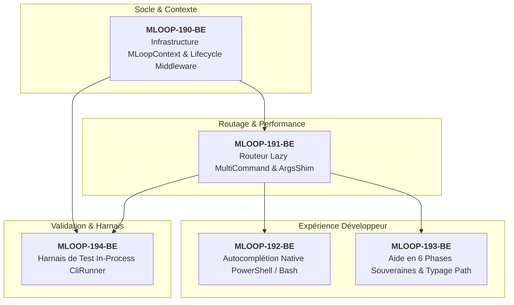

# Épopée EPIC-19-CLICK-CLI-ENGINE : Modernisation du Moteur CLI mLoop via Click

> **Référence Architecture** : ADR-0202 (Modularité < 300 lignes) · ADR-0339 (Quality Gate Enforcement) · ADR-0369 (Standards Python Senior) · ADR-0370 (Résilience Registre CLI)  
> **Composant** : Moteur d'exécution CLI (`src/cli/`, `src/commands/router.py`, `src/swarm.py`)  
> **Origine** : Audit d'ergonomie et analyse comparative du moteur Click (Pallets Click 8.5+)  
> **Statut** : `DONE` — Livré 24/09/2026 (MLOOP-190-BE à MLOOP-194-BE en statut `DONE`, 5/5) — moteur Click opérationnel sous flag `MLOOP_CLI_ENGINE` (défaut argparse, rollback assuré), EvidencePacks complets, dette A2 (stdout) recommandée au PO  

---

## Contexte & Intention Stratégique

L'infrastructure en ligne de commande de mLoop (`src/commands/router.py` et `src/commands/_registry.py`) repose historiquement sur un parseur déclaratif utilisant le module standard `argparse`. 

Avec l'expansion du framework à plus de 58 commandes réparties sur 6 phases souveraines, cette architecture monolithique montre plusieurs limites pénalisantes :
1. **Surcoût au démarrage (Cold-Start Latency)** : À chaque exécution d'une commande unitaire (`python src/swarm.py <cmd>`), la fonction `_build_parser()` instancie et configure les 58 sous-parseurs et leurs arguments, induisant une latence mesurable préjudiciable aux agents autonomes exécutant des rafales de commandes.
2. **Absence d'Autocomplétion Shell** : `argparse` ne fournit pas d'autocomplétion native pour PowerShell (l'environnement prédominant sur les postes Windows de développement et pour l'agent local), ni pour les entités dynamiques (noms de projets sous `Projects/`, identifiants de récits du backlog actif).
3. **Restitution d'Aide Monolithique** : L'aide par défaut (`--help`) affiche une liste alphabétique dense de 58 commandes sans faire émerger les 6 phases souveraines du cycle de développement mLoop (Phase 0 Inception à Phase 5 Ship).
4. **Gestion Impérative du Contexte et des Portes de Sécurité** : La résolution du projet, le chargement de `LoopState` et le contrôle pré-vol des *Lifecycle Gates* (ADR-0339) sont codés de manière procédurale dans `_run_cli()`.
5. **Dette Modulaire Déclarative** : Le fichier `src/commands/_registry.py` dépasse les 2028 lignes, ce qui viole le plafond souverain `RULE-AST-01` (ADR-0202) documenté dans `EPIC-17-MODULAR-REFACTORING`.

### Intention de l'Épopée

Basculer le moteur d'exécution vers **Click** (version 8.5+ issue de l'écosystème Pallets) afin d'apporter :
- Un démarrage instantané par lazy-loading des commandes (`click.MultiCommand`).
- L'autocomplétion native multi-shells (PowerShell 5.1+ / pwsh 7+, Bash, Zsh) avec compléteurs dynamiques.
- Un objet de contexte unifié (`MLoopContext`) et des intercepteurs propres pour l'audit des *Lifecycle Gates*.
- Une aide formatée par phase souveraine et une validation stricte des chemins (`click.Path`).
- Un harnais de test in-process ultra-rapide (`click.testing.CliRunner`).
- **Garantie de non-régression absolue** : Un adaptateur d'arguments transparent (`ArgsShim`) permet aux 58 handlers existants de continuer à fonctionner sans modification de signature.

---

## Cartographie de l'Épopée

---

## Registre des Récits

### 1. MLOOP-190-BE : Infrastructure de Contexte Click & Middleware d'Enforcement des Lifecycle Gates
- **Type** : Feature & Architecture Core
- **Composant** : `src/cli/click_engine/context.py`
- **Statut** : `READY_FOR_DEV`
- **Description** :
  En tant qu'Architecte mLoop,  
  je veux encapsuler l'état du projet et le middleware de contrôle de cycle de vie dans un contexte d'exécution Click (`MLoopContext`),  
  afin d'auditer et d'intercepter de manière déterministe les violations de Lifecycle Gates avant l'exécution de tout handler.

---

### 2. MLOOP-191-BE : Routeur de Commandes Dynamique Lazy-Loading (`click.MultiCommand`)
- **Type** : Performance & Core Router
- **Composant** : `src/cli/click_engine/router.py`, `src/swarm.py`
- **Statut** : `READY_FOR_DEV`
- **Description** :
  En tant qu'Ingénieur mLoop,  
  je veux que le routeur de commandes charge paresseusement les handlers à la volée via `click.MultiCommand` avec un adaptateur `ArgsShim`,  
  afin de supprimer le coût de parsing des 58 commandes au démarrage tout en garantissant 100% de rétrocompatibilité avec les handlers existants.

---

### 3. MLOOP-192-BE : Complétion Shell Native (PowerShell 5.1+ / pwsh / Bash) & Compléteurs Dynamiques
- **Type** : Developer Experience & Tooling
- **Composant** : `src/cli/click_engine/completion.py`
- **Statut** : `READY_FOR_DEV`
- **Description** :
  En tant qu'Utilisateur et Agent développant sous Windows/PowerShell,  
  je veux bénéficier de l'autocomplétion native Click pour les commandes, les options et les projets sous `Projects/`,  
  afin de naviguer et d'exécuter les pipelines sans erreur de frappe ni consultation manuelle du disque.

---

### 4. MLOOP-193-BE : Structuration de l'Aide par Phases Souveraines & Typage `click.Path`
- **Type** : Governance & Formatting
- **Composant** : `src/cli/click_engine/formatter.py`
- **Statut** : `READY_FOR_DEV`
- **Description** :
  En tant qu'Ingénieur mLoop,  
  je veux un formateur d'aide regroupant les commandes par phase souveraine (Phases 0 à 5) et validant nativement les chemins de fichiers via `click.Path`,  
  afin d'aligner l'aide CLI sur les standards de gouvernance mLoop et d'échouer au plus tôt en cas de chemin inexistant.

---

### 5. MLOOP-194-BE : Harnais de Test In-Process `CliRunner` & Validation Non-Régression
- **Type** : Testing & Quality Assurance
- **Composant** : `tests/test_click_cli_engine.py`
- **Statut** : `READY_FOR_DEV`
- **Description** :
  En tant que Responsable QA,  
  je veux une suite de tests unitaires in-process exploitant `click.testing.CliRunner`,  
  afin de valider le comportement et les codes de sortie de l'ensemble des commandes critiques en quelques millisecondes sans appel système subprocess.

---

## Critères de Sortie d'Épopée (Definition of Done)

1. **Temps de boot divisé par ≥ 3** sur l'exécution d'une commande simple (mesuré avant/après).
2. **Couverture des tests** : Suite de tests `tests/test_click_cli_engine.py` 100% verte sur les commandes vitales (`vibe-check`, `gate-approve`, `sync`, `crawl`, `lifecycle-status`).
3. **Zéro Régression** : Les scripts appelant `python src/swarm.py <cmd>` et `loop <cmd>` conservent strictement le même comportement et les mêmes codes de retour.
4. **Conformité AST (RULE-AST-01)** : Chaque nouveau sous-module sous `src/cli/click_engine/` respecte scrupuleusement la limite des 300 lignes.
5. **Autocomplétion validée** sous PowerShell 5.1 / pwsh 7+ et bash.
