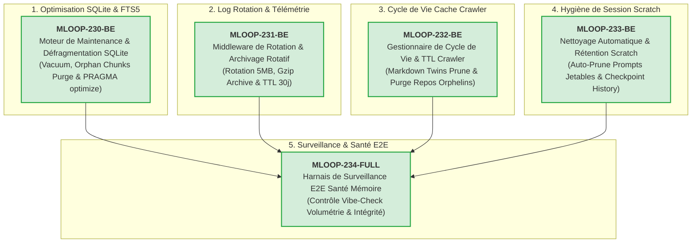

# 🏛️ Épopée — `EPIC-23-DATA-HYGIENE-AND-RETENTION` : Gouvernance du Stockage Persistant, Défragmentation SQLite & Politique de Rétention des Données

---

> **Référence d'Architecture** : [ADR-0003](../../../../standards/adr-system/0003-okf-llm-wiki-v2-standard.md) (Ebbinghaus Decay & Rétention) · [ADR-0312](../../../../standards/adr-system/0312-markdown-twin-crawler-standard.md) (Markdown Twins Cache) · [ADR-0364](../../../../standards/adr-system/0364-hooks-pre-compaction-et-checkpoint-boundaries.md) (Checkpoints & Compaction) · [ADR-0369](../../../../standards/adr-system/0369-standards-de-robustesse-python-senior.md) (Robustesse SQLite) · [ADR-0202](../../../../standards/adr-system/0202-modularite-interne-agents.md) (Modularité ≤ 300L) · [ADR-0370](../../../../standards/adr-system/0370-standard-cli-transverse-parite-ssot-et-decoupage-modulaire.md) (Parité SSOT CLI) · [ADR-0376](../../../../standards/adr-system/0376-standard-rigueur-zero-blindspot-ecosysteme-mloop.md) (Rigueur 360° Zéro Blindspot) · [ADR-015](../../../docs/01-architecture/ADR-015_epic-23_gouvernance_stockage_persistant_et_retention.md) (Gouvernance Stockage & Rétention)  
> **Composant(s)** : Moteur de Stockage (`src/loop_mem/`), Moteur de Journalisation & Traces (`src/utils/logger.py`, `src/engine/events/`), Moteur de Crawler (`src/engine/crawler/`), Commandes CLI (`src/commands/handlers/memory.py`, `src/commands/handlers/crawler.py`)  
> **Origine / Déclencheur** : Audit volumétrique et architectural de `C:\Memory Loop\memory\` (24/09/2026) : identification de 565 Mo de données réparties entre une base SQLite de 429 Mo (`loop_mem.db` - 35k chunks FTS5), un cache crawler de 118 Mo (8 898 fichiers), et des journaux cumulatifs (`events.jsonl`, `traces.json`) sans rotation ni rétention automatisée.  
> **Statut** : `DONE` — Livré et certifié le 24/09/2026 (5/5 récits DONE_TESTED, 38/38 tests verts, Vibe-Check 24P/1W/0F)  
> **Décideurs** : Marco (Utilisateur / PO) & Antigravity (Architecte Agentique)  

---

## 🎯 1. Contexte & Intention Stratégique

Le répertoire `memory/` est le poumon de l'apprentissage continu et de l'interopérabilité de Memory Loop. Cependant, l'absence de processus automatisés de cycle de vie et d'élagage conduit à une accumulation passive de données :
1. **Fragmentation SQLite** : `loop_mem.db` grossit au gré des ré-indexations documentaires sans compactage périodique (`VACUUM`, `PRAGMA optimize`), conservant potentiellement des chunks orphelins de fichiers renommés ou supprimés.
2. **Croissance non plafonnée des journaux** : `events.jsonl` (4 Mo), `global_execution_traces.json` (3 Mo) et les logs applicatifs grandissent indéfiniment, alourdissant les lectures du Dashboard.
3. **Péremption du Cache Crawler** : Plus de 2 100 pages web et des dépôts clonés (`repos/openai_codex` — 67 Mo) restent stockés sans règle d'invalidation temporelle (TTL).
4. **Résidus de Session dans Scratch** : Les scripts jetables et prompts intermédiaires d'agents (`worker_*.md`) subsistent post-clôture des épopées.

Cette épopée met en place une **politique de rétention souveraine, continue et automatisée** (Memory Lifecycle & Retention Engine) inspirée de la courbe de décroissance d'Ebbinghaus (ADR-0003).

### Points de Friction Résolus / Objectifs Mesurables :
1. **Défragmentation SQLite continue** : Commande `mloop memory vacuum` et purge des chunks FTS5 orphelins avec gain estimé de 15 à 30% d'espace sur `loop_mem.db`.
2. **Politique de Log Rotation & Compression** : Rotation automatique des journaux JSONL dès qu'ils atteignent 5 Mo avec archivage `.gz` et rétention glissante de 30 jours.
3. **Gouvernance TTL du Crawler** : Invalidation automatique des Markdown Twins de plus de 60 jours et purge des dépôts de référence temporaires.
4. **Auto-nettoyage de Session** : Suppression automatique des artefacts jetables de `memory/scratch/` lors de la validation des récits ou à l'invocation de `mloop scratch prune`.

---

## 🧭 2. Vérité Terrain & Ancrage Normatif

> En application de l'**ADR-0375** (Traçabilité Radicale) et de l'**ADR-0376** (Zéro Blindspot), cette épopée s'ancre sur les sources vérifiées suivantes :

* **Standards de Mémoire & Rétention** :
  - [`standards/adr-system/0003-okf-llm-wiki-v2-standard.md`](../../../../standards/adr-system/0003-okf-llm-wiki-v2-standard.md) (Paradigme Ebbinghaus)
  - [`standards/adr-system/0312-markdown-twin-crawler-standard.md`](../../../../standards/adr-system/0312-markdown-twin-crawler-standard.md) (Gouvernance Markdown Twins)
  - [`standards/adr-system/0364-hooks-pre-compaction-et-checkpoint-boundaries.md`](../../../../standards/adr-system/0364-hooks-pre-compaction-et-checkpoint-boundaries.md) (Checkpoints atomiques)
  - [`standards/adr-system/0369-standards-de-robustesse-python-senior.md`](../../../../standards/adr-system/0369-standards-de-robustesse-python-senior.md) (Règles SQLite : WAL, timeouts, isolation)
* **Preuves Terrain** :
  - Métriques d'inspection physique de `memory/` (565 Mo, `loop_mem.db` 429 Mo, 34 976 chunks FTS5, crawler 118 Mo, scratch 22 fichiers).

---

## 🗺️ 3. Cartographie de l'Épopée (Story Mapping)

---

## 📋 4. Découpage en Récits Utilisateurs (Palier 2 READY_FOR_DEV)

| Récit ID | Rôle | Titre du Récit | Taille | Dépendances | Statut Initial | Fichier Story |
| :--- | :---: | :--- | :---: | :--- | :---: | :--- |
| **MLOOP-230-BE** | `BE` | Moteur de Maintenance & Défragmentation SQLite (`mloop memory vacuum / health`) | `M` | Aucune | `DONE_TESTED` (6/6 tests verts) | [`stories/MLOOP-230-BE.md`](../stories/MLOOP-230-BE.md) |
| **MLOOP-231-BE** | `BE` | Middleware de Rotation & Archivage Rotatif des Journaux (`events.jsonl`, `traces.json`) | `S` | Aucune | `DONE_TESTED` (8/8 tests verts) | [`stories/MLOOP-231-BE.md`](../stories/MLOOP-231-BE.md) |
| **MLOOP-232-BE** | `BE` | Gestionnaire de Cycle de Vie & TTL du Cache Crawler (`mloop crawler prune`) | `S` | Aucune | `DONE_TESTED` (7/7 tests verts) | [`stories/MLOOP-232-BE.md`](../stories/MLOOP-232-BE.md) |
| **MLOOP-233-BE** | `BE` | Nettoyage Automatique & Rétention des Artefacts de Session (`memory/scratch/`, checkpoints) | `S` | Aucune | `DONE_TESTED` (9/9 tests verts) | [`stories/MLOOP-233-BE.md`](../stories/MLOOP-233-BE.md) |
| **MLOOP-234-FULL**| `FULL`| Harnais de Surveillance E2E de la Santé du Stockage & Intégration Vibe-Check | `M` | Tous précédents | `DONE_TESTED` (3/3 tests verts) | [`stories/MLOOP-234-FULL.md`](../stories/MLOOP-234-FULL.md) |

---

## 🛡️ 5. Matrice d'Impact Transversal Zéro Blindspot (ADR-0376)

| Couche ECOSYSTEM_RIGOR | Impact Identifié | Action Prévue | Statut |
| :--- | :--- | :--- | :---: |
| **Couche 1 : Blueprints** | Politiques de rétention et seuils de rotation | Déclarés dans `standards/blueprints/` | `VALIDATED` |
| **Couche 2 : Protocoles** | Protocole d'hygiène et maintenance de la mémoire | Amendement de `standards/protocols/` | `VALIDATED` |
| **Couche 3 : Architecture ADR**| Complémentarité avec ADR-0003, ADR-0312, ADR-0364, ADR-0369 | Sanctuarisé dans les ADRs existants & ADR-015 | `SCELLED` |
| **Couche 4 : Directives Agents**| Interdiction de laisser des artefacts non répertoriés dans scratch | Consignes de sortie de session dans `.agents/` | `VALIDATED` |
| **Couche 5 : Skills Portables**| Optimisation des requêtes fact-search sur tables indexées | Maintien des performances de `fact-search` | `VALIDATED` |
| **Couche 6 : Core Python & CLI**| Handlers sous `src/commands/handlers/` (≤ 300L) | Strict respect de l'ADR-0202 et validation `code-check` | `VALIDATED` |
| **Couche 7 : Tests & Parité** | Tests unitaires sous `tests/` + Vibe-Check | Contrôle de non-régression à 38 PASS + Check 24 PASS | `VALIDATED` |

---

## 🏁 6. Critères de Sortie & Clôture de l'Épopée (DoD)

1. [x] Tous les 5 récits utilisateurs ont atteint le statut `DONE_TESTED` ou `SHIPPED`.
2. [x] Les sessions Grill-Me 1:1 ont validé l'entrée en développement (passage Palier 2) via ADR-015.
3. [x] La commande `mloop memory vacuum` réduit efficacement la fragmentation sans perte de données.
4. [x] La rotation des logs s'opère automatiquement sans interruption des pipelines en cours.
5. [x] Aucun dépassement modulaire (`RULE-AST-01`, ≤ 300L) n'a été introduit.
6. [x] La suite complète des tests de non-régression est au vert (`pytest tests/`).
7. [x] Le contrôle souverain `python src/swarm.py vibe-check --project mLoop` retourne `0 FAIL`.