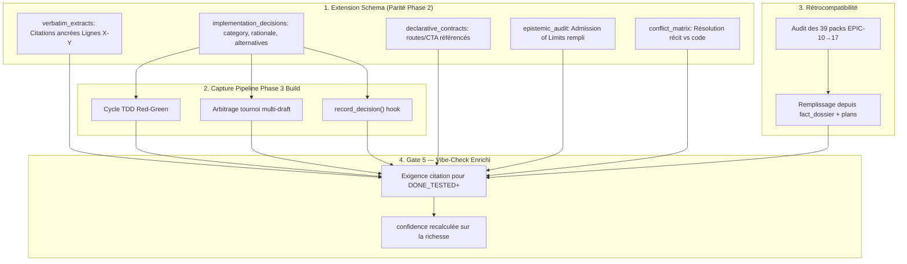

# 🏛️ Épopée — `EPIC-18-EVIDENCE-PARITY-PHASE3` : Parité Épistémique des EvidencePacks Phase 3 vs Dossiers de Preuves Phase 2

---

> **Référence d'Architecture** : ADR-0320 (Passage-Level Grounding) · ADR-0326 (EvidencePacks) · ADR-0335 (Grounding Épistémique) · ADR-0361 (Plans d'Intention Abstraits Interdits) · ADR-0375 (Cycle de Vie 5 Phases)
> **Composant Cœur** : `src/pipelines/evidence_pack.py` (EvidencePackEngine)
> **Origine** : Validation Phase 3 Build (22/09/2026) — constat que les EvidencePacks Phase 3 sont **structurellement pauvres** comparés aux dossiers de preuves Phase 2, et qu'ils omettent les décisions d'implémentation
> **Statut** : `OPEN` — En attente de découpage Grill-Me 1:1

---

## 🎯 Contexte & Intention Stratégique

Lors de la session de validation des EvidencePacks pour la Phase 3 Build, un audit comparatif a mesuré un **écart épistémique majeur** entre les deux paliers de preuves du cycle de vie :

| Capacité | Phase 2 — `fact_dossier.md` | Phase 3 — `evidence.json` |
| :--- | :---: | :---: |
| Extraits verbatim sourcés (« Citation ») | ✅ | ❌ |
| Ancrage ligne précis (Lignes X-Y) | ✅ | ❌ |
| Matrice de résolution des conflits | ✅ | ❌ |
| Fait établi / non prouvé détaillé | ✅ | ⚠️ Terse |
| Décisions d'implémentation documentées | — | ❌ |
| Contrats déclaratifs cibles (REST/CTA) | ✅ | ❌ |
| Admission of Limits (Frontière active) | ✅ | ⚠️ Vide |
| Scénarios Gherkin (4 piliers) | ❌ | ✅ |
| Score de confiance chiffré | ❌ | ✅ |

**Constat** : la Phase 3 Build produit des preuves *quantitativement* présentes mais *qualitativement* vides — un `evidence.json` de 6 Ko qui ne cite jamais une ligne de code, jamais une décision, jamais un contrat. Inversement, la Phase 2 produit un dossier riche mais ignore le Gherkin et le score de confiance.

### L'objectif de parité

Rendre l'EvidencePack Phase 3 **aussi éloquent** que le dossier Phase 2, sans perdre ses atouts propres :

1. **Extraits verbatim ancrés** : chaque fait `facts_verified` cite la source avec `« Citation »` + `Lignes X-Y`.
2. **Décisions d'implémentation** : champ `implementation_decisions` typé (category, rationale, alternatives).
3. **Contrats déclaratifs** : les routes/CTA utilisées par le code sont référencés, pas inventés.
4. **Admission of Limits** : `epistemic_audit` réellement rempli (`what_it_does_not_prove`).
5. **Matrice de conflits** : résolution documentée quand récit et code divergent.

### Pourquoi c'est critique

- **ADR-0361** interdit les plans d'intention abstraits — un pack sans citation est une intention abstraite.
- **Handoff aval** : un développeur qui reprend le code a besoin du *pourquoi*, pas seulement du *quoi*.
- **Audit ADR-0369** : les 7 standards Python Senior imposent des choix qui doivent être tracés.
- **Résilience RHO** : le flow erreur → fix a besoin du contexte décisionnel et factuel.

### Pourquoi un epic distinct

- `EvidencePackEngine` est un composant SSOT critique (656 lignes) — modification = audit 360° (ADR-0376).
- L'intégration avec le pipeline Phase 3 Build (harnais TDD, tournoi multi-draft) est transverse.
- La backfill des 39 EvidencePacks existants (EPIC-10 à 17) nécessite une stratégie dédiée.

---

## 🗺️ Cartographie de l'Épopée : `EPIC-18-EVIDENCE-PARITY-PHASE3`



---

## 📋 Registre Détaillé des Récits Utilisateurs (esquisses — à grill)

---

### 1. `MLOOP-180-BE` : Extension du Schema EvidencePackEngine (Parité Phase 2)

- **Type** : Feature & SSOT Schema
- **Composant** : `src/pipelines/evidence_pack.py`
- **Macro Size** : L
- **Description** :
  **En tant qu'** Architecte mLoop,
  **je veux** étendre le schema EvidencePackEngine avec les 5 champs manquants de parité (`verbatim_extracts`, `implementation_decisions`, `declarative_contracts`, `epistemic_audit` riche, `conflict_matrix`),
  **afin de** rendre le pack Phase 3 aussi éloquent que le dossier de preuves Phase 2.
- **Règles d'affaires** :
  - **[Schema Rétrocompatible]** : les 5 champs sont `Optional` — les packs existants restent valides.
  - **[Ancrage Ligne Obligatoire]** : chaque `verbatim_extract` porte `source_file`, `lines: [start, end]`, `quote`, `established_fact`.
  - **[Typage Décision Strict]** : `decision_id`, `category` (liste fermée), `rationale`, `alternatives_considered`, `timestamp`.
  - **[Admission of Limits Requis]** : `epistemic_audit.what_it_does_not_prove` doit être une liste non vide pour un pack `VALIDATED`.
- **Gherkin Nominal** :
  ```gherkin
  Scénario: Génération d'un pack de parité
    Étant donné un récit Phase 3 avec 2 décisions, 3 citations et 1 contrat
    Quand EvidencePackEngine.extract_evidence est exécuté
    Alors implementation_decisions contient 2 entrées typées
    Et verbatim_extracts contient 3 citations avec leurs numéros de ligne
    Et declarative_contracts référence le contrat sans l'inventer
  ```

---

### 2. `MLOOP-181-BE` : Intégration avec le Harnais Phase 3 Build

- **Type** : Feature & Pipeline Integration
- **Composant** : `src/pipelines/build_harness.py` + `src/pipelines/evidence_pack.py`
- **Macro Size** : L
- **Description** :
  **En tant qu'** Ingénieur du framework mLoop,
  **je veux** que le harnais Phase 3 Build capture automatiquement décisions, citations ancrées et contrats dans l'EvidencePack,
  **afin d**'obtenir un pack éloquent sans effort manuel.
- **Règles d'affaires** :
  - **[Capture Automatique]** : tournoi multi-draft, cycle TDD et hook `record_decision()` injectent leurs entrées.
  - **[Citation Depuis le Code]** : les extraits verbatim sont extraits des fichiers effectivement modifiés (avec numéros de lignes réels).
  - **[Zéro Doublon]** : décision/citation identique non répétée (hash category+rationale / quote+lines).
  - **[Timestamp UTC]** : chaque entrée horodatée ISO 8601.
- **Gherkin Nominal** :
  ```gherkin
  Scénario: Arbitrage tournoi capturé comme décision
    Étant donné un tournoi multi-draft avec 3 candidats
    Quand l'arbitrage Pareto sélectionne le candidat B
    Alors une décision architecture est ajoutée au pack
    Et le rationale cite le score Pareto retenu
  ```

---

### 3. `MLOOP-182-BE` : Backfill Rétroactif des EvidencePacks Existants

- **Type** : Maintenance & Rétrocompatibilité
- **Composant** : `src/pipelines/evidence_pack.py` + `Projects/mLoop/memory/evidence/`
- **Macro Size** : M
- **Description** :
  **En tant qu'** Auditeur mLoop,
  **je veux** un backfill qui enrichit les 39 EvidencePacks existants (EPIC-10 à 17) avec les décisions, citations et contrats extraits des fact_dossiers et plans d'implémentation,
  **afin de** rattraper l'écart de richesse sur tout le backlog non-legacy.
- **Règles d'affaires** :
  - **[Extraction Documentaire]** : sources = `fact_dossier.md`, `implementation_plan_*.md`, sections `Règles d'affaires` — jamais inventé.
  - **[Idempotent]** : re-exécution = aucun changement si les champs sont déjà non vides.
  - **[Périmètre Étroit]** : EPIC-10 à 17 uniquement — EPIC 1-9 legacy exclus.
  - **[Hash Mis à Jour]** : SHA-256 et timestamp régénérés après injection.
- **Gherkin Nominal** :
  ```gherkin
  Scénario: Backfill d'un pack existant
    Étant donné le pack MLOOP-160-BE sans implementation_decisions
    Quand le backfill est exécuté
    Alors le champ est peuplé depuis le fact_dossier associé
    Et le hash SHA-256 est mis à jour
    Et le pack MLOOP-101-BE legacy n'est pas modifié
  ```

---

## 📊 Matrice de Traçabilité & Séquence

| Ordre | User Story | Portée | Statut |
| :---: | :--- | :--- | :---: |
| 1 | `MLOOP-180-BE` | Extension schema (5 champs de parité) | `IN_QA` |
| 2 | `MLOOP-181-BE` | Intégration harnais Phase 3 Build | `READY_FOR_DEV` |
| 3 | `MLOOP-182-BE` | Backfill rétroactif EPIC-10 à 17 | `READY_FOR_DEV` |

**Dépendances** : `180-BE` (schema) → `181-BE` (intégration) → `182-BE` (backfill).

---

## ✅ Décisions Actées — Grill-Me 1:1 (22/09/2026, 6/6)

| # | Question | Décision | Impact |
| :--: | :--- | :--- | :--- |
| 1 | Granularité citations | **D — Hybride** : 1 citation/fichier modifié **+** 1 citation/décision | `verbatim_extracts` dense mais ciblé, couplage décision↔citation |
| 2 | Source des décisions | **D — Toutes sources + hook** : tournoi + TDD + fact_dossier + plan + `record_decision()` manuel | Couverture max, dédoublonnage hash category+rationale obligatoire |
| 3 | Emplacement | **D — Hybride** : décisions dans `<SID>_evidence.json`, citations dans `<SID>_fact_dossier.md` | 2 fichiers max/story, réutilise artefact Phase 2, couplage assumé |
| 4 | Gate 5 | **D — Blocking new only** : legacy EPIC 10→17 exempté (warning), **nouveau récit `DONE_TESTED`+ exige ≥ 1 citation** | Progressif, zéro régression legacy, force la parité à venir |
| 5 | `confidence_score` | **D — Multiplicateur + détail** : `score × (0.7 + 0.3 × min(1, richesse/max))` + `richness_penalty` dans `epistemic_audit` | Score honnête, traçable, auditable (ADR-0369) |
| 6 | Legacy EPIC 1-9 | **A — Strictement exclus** : jamais touchés par backfill ni Gate 5 | **Focus prioritaire : EPIC 10→18**, code parfait exigé, dette legacy non comblée |

> **Périmètre validé par le PO** : les EPIC **10 à 18** constituent la nouvelle structure mLoop et doivent être **parfaits** (parité épistémique complète). Les EPIC **1-9** restent `legacy` — hors backfill, hors Gate 5 bloquant.
