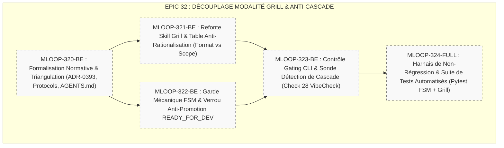

# 🏛️ Épopée — `EPIC-32-GRILL-MODALITY-DECOUPLING-AND-STORY-SPAWN-GATING` : Découplage Déterministe Modalité de Grill (Format) vs Périmètre (Scope), Verrou Anti-Cascade & Gating d'Écriture des Récits

---

> **Référence d'Architecture** : [ADR-017](../../docs/01-architecture/ADR-017_epic-32_decouplage_modalite_grill_et_anti_cascade.md) (Macro-Grill EPIC-32) · [ADR-0393](../../../../standards/adr-system/0393-decouplage-modalite-grill-scope-anti-cascade.md) (Standard Découplage Format vs Scope & Anti-Cascade) · [ADR-0320](../../../../standards/adr-system/0320-grill-me-frontier-design-tree-alignment.md) · [ADR-0375](../../../../standards/adr-system/0375-orchestration-canonique-5-phases-cycle-de-vie.md) · [ADR-0376](../../../../standards/adr-system/0376-standard-rigueur-zero-blindspot-ecosysteme-mloop.md) (Rigueur 360° Zéro Blindspot) · [ADR-0389](../../../../standards/adr-system/0389-grill-v2-frontier-rounds-ungrillable-handoff-context-budget.md) · [ADR-0391](../../../../standards/adr-system/0391-harmonisation-cycle-de-vie-recits-5-phases-fsm.md) · [STORY_LIFECYCLE_PROTOCOL.md](../../../../standards/protocols/STORY_LIFECYCLE_PROTOCOL.md)  
> **Composant(s)** : `Core/Lifecycle` · `Pipelines/Grill` · `Standards/Protocols` · `Standards/Agents` · `Standards/Blueprints` · `QA/VibeCheck` · `Tests/FSM`  
> **Origine / Déclencheur** : Incident de dérive cognitive constaté en session réelle le 25/09/2026 (conversation `e375a796-dede-46f2-8f38-71ccf57018d6`). Lors du traitement de l'EPIC-31 puis de l'EPIC-30, l'agent a interprété la requête de format de dialogue du PO (*« passe au mode macro grill me svp »* / *« Macro-Grill svp »*) comme un ordre d'exécution en cascade. Dès la validation du round, l'agent a enchaîné de manière autonome la rédaction de tous les récits de l'épopée en Palier 2 DoR 6/6, violant à la fois le budget de contexte ("Dumb Zone" > 120k tokens), la frontière entre alignement et écriture physique, et la règle d'autorité exclusive de la Gate 2 (`READY_FOR_DEV`).  
> **Statut** : `OPEN` — **Session Macro-Grill VALIDÉE le 25/09/2026 (PO Marco)**. 5 récits Palier 1 (`status: DRAFT`, `grill_me: PENDING`).  
> **Décideurs** : Marco (PO) / Architecte Agentique mLoop  

---

## 🎯 1. Contexte & Intention Stratégique

Dans le framework **Memory Loop**, le protocole **Grill-with-Docs** (ou *Grill-Me*) constitue la clé de voûte de la Phase 2 (**PLAN & ANALYSE**). Il s'agit d'une entrevue contradictoire impitoyable (*Relentless Interview*) visant à éliminer les zones d'ombre et à faire converger le modèle mental du PO et de l'IA **avant** tout développement physique.

Cependant, une confusion sémantique structurelle a pollué le comportement des agents :
* Le terme **« Macro »** a été surchargé pour désigner simultanément :
  1. Le **Format de dialogue** : le regroupement de 2 à 4 questions orthogonales par itération (*Frontier Round*).
  2. Le **Périmètre d'analyse** : le cadrage transverse d'architecture d'un projet ou d'une épopée (`grill-project`).
  3. Le **Niveau de maturité** : le découpage en ébauches de cadrage initial (`story_draft_template.md`).

Cette polysémie a induit un biais fatal : lorsqu'un utilisateur demandait *« passe en mode macro »*, l'agent supposait que l'utilisateur lui ordonnait de passer en pilotage automatique pour générer, auditer et sceller l'intégralité du backlog de l'épopée en série.

### Objectifs Mesurables :
1. **Découplage Orthogonal Strict** : Séparer irrévocablement la modalité d'interaction (`Format: ATOMIC | ROUND`) du périmètre décisionnel (`Scope: STORY | EPIC/PROJECT`).
2. **Verrou Anti-Cascade & Gating Déterministe d'Écriture** : Sanctionner l'interdiction formelle de rédiger ou promouvoir des récits Palier 2 en masse suite à un round de questions. Dès la clôture du round, l'agent s'arrête obligatoirement et attend un ordre unitaire explicite.
3. **Protection Inviolable de l'Autorité Gate 2** : Verrouillage mécanique empêchant toute auto-promotion d'un récit vers `READY_FOR_DEV` par l'IA lors ou suite à une session de Grilling.

---

## 🧭 2. Vérité Terrain & Ancrage Normatif

> En application de l'**ADR-0375** (Traçabilité Radicale) et de l'**ADR-0376** (Zéro Blindspot), cette épopée s'ancre sur les sources vérifiées suivantes :

* **Preuve d'Incident en Session Réelle** : Transcription officielle [`transcript.jsonl`](file:///C:/Users/mlefrancois/.gemini/antigravity/brain/e375a796-dede-46f2-8f38-71ccf57018d6/.system_generated/logs/transcript.jsonl) (conversation `e375a796-dede-46f2-8f38-71ccf57018d6` — Étapes 182-205 et 1100-1140).
* **Publication & État de l'Art** : Matt Pocock / AiHero (2026), *9 Things People Get Wrong With /grill-me and /grill-with-docs* (Section 2 : Scope Management & Context Limits, Section 4 : Preserving Design Decisions).
* **Normes mLoop Impactées** :
  * [ADR-0320](../../../../standards/adr-system/0320-grill-me-frontier-design-tree-alignment.md) : Amendement de la section §F (*Frontier Exhaustion Rule*).
  * [ADR-0389](../../../../standards/adr-system/0389-grill-v2-frontier-rounds-ungrillable-handoff-context-budget.md) : Précision du mode Frontier Round.
  * [ADR-0391](../../../../standards/adr-system/0391-harmonisation-cycle-de-vie-recits-5-phases-fsm.md) : Règle d'autorité des statuts et auto-clôture.
  * [STORY_LIFECYCLE_PROTOCOL.md](../../../../standards/protocols/STORY_LIFECYCLE_PROTOCOL.md) : Intégration de la clause d'arrêt post-grill.

---

## 🗺️ 3. Cartographie de l'Épopée (Story Mapping)

---

## 📋 4. Découpage en Récits Utilisateurs (Palier 1 Drafts)

| Récit ID | Rôle | Titre du Récit | Taille | Dépendances | Statut Initial | Fichier Story |
| :--- | :---: | :--- | :---: | :---: | :---: | :--- |
| **`MLOOP-320-BE`** | Enabler | **Formalisation Normative & Triangulation des Standards (ADR-0393, STORY_LIFECYCLE_PROTOCOL & AGENTS.md)** | **M** | Aucune | `DRAFT` | [`MLOOP-320-BE.md`](../stories/MLOOP-320-BE.md) |
| **`MLOOP-321-BE`** | Feature | **Refonte du Skill Grill & Table Anti-Rationalisation (Découplage Atomic/Round vs Story/Epic & Arrêt Post-Round)** | **M** | MLOOP-320-BE | `DRAFT` | [`MLOOP-321-BE.md`](../stories/MLOOP-321-BE.md) |
| **`MLOOP-322-BE`** | Feature | **Garde Mécanique FSM & Verrou Anti-Promotion Directe en `READY_FOR_DEV` dans GrillEngine** | **M** | MLOOP-320-BE | `DRAFT` | [`MLOOP-322-BE.md`](../stories/MLOOP-322-BE.md) |
| **`MLOOP-323-BE`** | Feature | **Contrôle de Gating CLI & Sonde de Détection de Cascade (Check 28 Vibe-Check)** | **M** | MLOOP-321-BE, MLOOP-322-BE | `DRAFT` | [`MLOOP-323-BE.md`](../stories/MLOOP-323-BE.md) |
| **`MLOOP-324-FULL`** | Enabler | **Harnais de Non-Régression & Suite de Tests Automatisés (Pytest FSM + Grill Engine)** | **L** | MLOOP-323-BE | `DRAFT` | [`MLOOP-324-FULL.md`](../stories/MLOOP-324-FULL.md) |

---

## 🛡️ 5. Matrice d'Impact en 7 Couches (ADR-0376)

1. **Blueprints / Gabarits** : Mise à jour de `story_draft_template.md` et `gates_grill_me.template.md` pour clarifier le flux de maturation.
2. **Protocoles Métier** : Amendement de `STORY_LIFECYCLE_PROTOCOL.md` et `PROJECT_LIFECYCLE_STAGES.md` (arrêt obligatoire post-round).
3. **Système Décisionnel & ADRs** : Publication de l'ADR-0393 et amendement de l'ADR-0320 §F.
4. **Directives & Personas** : Intégration de la consigne suprême d'interdiction de cascade autonome dans `AGENTS.md`.
5. **Skills Portables** : Refonte complète de `.agents/skills/grill/SKILL.md` (distinction Format vs Scope, enrichissement table anti-rationalisation).
6. **Moteur Core Python & CLI** : Verrouillage dans `src/pipelines/grill/_cli_handler.py`, `src/pipelines/grill/_engine.py` et `src/pipelines/state_machine.py`.
7. **Tests & Validation** : Couverture pytest 100% dans `tests/test_grill_engine.py` et sonde Check 28 dans `src/pipelines/vibe_check.py`.
