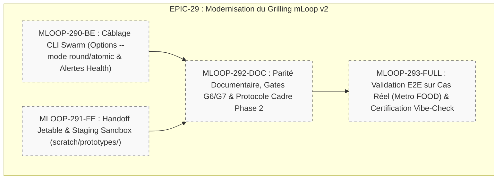

# 🏛️ Épopée — `EPIC-29-GRILL-V2-FRONTIER-SKILLS` : Modernisation du Grilling mLoop v2 (Frontier Rounds, Handoff Ungrillables & Context Health)

---

> **Référence d'Architecture** : [ADR-013](../../../docs/01-architecture/ADR-013_epic-29_grill_v2_frontier_rounds_ungrillable_context.md) · [ADR-0389](../../../../standards/adr-system/0389-grill-v2-frontier-rounds-ungrillable-handoff-context-budget.md) · [ADR-0320](../../../../standards/adr-system/0320-grill-me-frontier-design-tree-alignment.md) · [ADR-0375](../../../../standards/adr-system/0375-standard-preuve-epistemique-et-tracabilite-radicale.md) · [ADR-0376](../../../../standards/adr-system/0376-standard-rigueur-zero-blindspot-ecosysteme-mloop.md)  
> **Composant(s)** : `Pipelines/Grill`, `CLI/Architecture`, `Blueprints/Gates`, `Skills/Grill`  
> **Origine / Déclencheur** : Veille technologique et benchmarking approfondi des compétences de Grilling de l'état de l'art (Matt Pocock / AI Hero, Septembre 2026). Rapatriement des motifs d'ingénierie critiques : Frontier Rounds (Macro), Protocole Handoff pour les questions ungrillables (IHM/UX), et surveillance stricte de la Dumb Zone (> 120k tokens) avec interdiction absolue de purge de contexte post-grill.  
> **Statut** : `[DONE]` — Livré et certifié le 24/09/2026 (26/26 tests verts, AST ≤ 276L, Vibe-Check OK)  
> **Décideurs** : Équipe Architecture mLoop, Lead Développeur, Product Owner (Marco)  

---

## 🎯 1. Contexte & Intention Stratégique

La formalisation initiale du Grilling dans mLoop ([ADR-0320](../../../../standards/adr-system/0320-grill-me-frontier-design-tree-alignment.md)) a permis d'éradiquer les hypothèses fantômes via la séparation Faits vs Décisions. Cependant, l'usage intensif a révélé trois blocages majeurs :
1. **La lenteur du 1:1 systématique en macro-cadrage** : forcer l'utilisateur à répondre une par une à 15 questions d'infrastructure totalement orthogonales ralentit inutilement la phase 2.
2. **Le piège des débats d'ergonomie IHM par le texte** : tenter de choisir entre un wizard et une monopage sans support visuel mène à une dialectique stérile.
3. **Le risque de dérive cognitive en fin de session** : franchir les 120k tokens dégrade l'attention, tandis que vider la conversation détruit la mémoire des arbitrages.

L'**ADR-0389** a fixé les principes constitutionnels. Cette épopée déploie l'outillage complet pour rendre ces règles opérationnelles de bout en bout.

### Points de Friction Résolus / Objectifs Mesurables :
1. **Frontier Rounds Opérationnels** : Diviser par deux le temps de cadrage macro en permettant le groupement de 2 à 4 questions indépendantes avec validation en un tour.
2. **Handoff Vers Prototype Jetable** : Éliminer 100% des débats textuels sur les questions IHM en automatisant la génération de maquettes HTML/SVG de 60 secondes.
3. **Surveillance & Chaînage Continu** : Garantir le passage automatique du grill vers la rédaction de récits haute fidélité sans aucune perte de contexte.

---

## 🧭 2. Vérité Terrain & Ancrage Normatif

> En application de l'**ADR-0375** (Traçabilité Radicale) et de l'**ADR-0376** (Zéro Blindspot), cette épopée s'ancre sur les sources vérifiées suivantes :

* **Source de Référence** : `docs/00-ingested/grill-me/12_things_people_get_wrong_with_grill_me_and_grill_with_docs.md`
* **Guides Officiels** : `docs/00-ingested/grill-me/01_grill_with_docs_aihero.md`, `03_skills_grill_me_aihero.md`
* **ADR Décisionnel Associé** : [`standards/adr-system/0389-grill-v2-frontier-rounds-ungrillable-handoff-context-budget.md`](../../../../standards/adr-system/0389-grill-v2-frontier-rounds-ungrillable-handoff-context-budget.md)

### Extraits Verbatim Clés :
```text
"When you hit an ungrillable question, use the handoff pattern: grill -> prototype -> grill again."
"Do not clear the context and start fresh just to write a PRD... you'll hit the model's dumb zone around 120k tokens."
— Référence : Matt Pocock, 9 Things People Get Wrong With /grill-me and /grill-with-docs (2026)
```

---

## 🗺️ 3. Cartographie de l'Épopée (Story Mapping)



---

## 📋 4. Découpage en Récits Utilisateurs (Livrés & Certifiés)
 
| Récit ID | Rôle | Titre du Récit | Taille | Dépendances | Statut Final | Fichier Story |
| :--- | :---: | :--- | :---: | :--- | :---: | :--- |
| **MLOOP-290-BE** | `BE` | Câblage CLI Swarm (`--mode round/atomic`, alerte Dumb Zone) | `M` | `EPIC-28` | `DONE_TESTED` | [`stories/MLOOP-290-BE.md`](../stories/MLOOP-290-BE.md) |
| **MLOOP-291-FE** | `FE` | Protocole Handoff & Staging des Prototypes Jetables (`scratch/prototypes/`) | `M` | Aucune | `DONE_TESTED` | [`stories/MLOOP-291-FE.md`](../stories/MLOOP-291-FE.md) |
| **MLOOP-292-DOC**| `DOC`| Alignement des Blueprints Gates (G6/G7) & Protocole de Cadrage Phase 2 | `S` | `MLOOP-290-BE` | `DONE_TESTED` | [`stories/MLOOP-292-DOC.md`](../stories/MLOOP-292-DOC.md) |
| **MLOOP-293-FULL**| `FULL`| Validation E2E sur Cas Réel (Metro FOOD) & Certification Vibe-Check | `M` | Tous précédents | `DONE_TESTED` | [`stories/MLOOP-293-FULL.md`](../stories/MLOOP-293-FULL.md) |

---

## 🛡️ 5. Matrice d'Impact Transversal Zéro Blindspot (ADR-0376)

| Couche ECOSYSTEM_RIGOR | Impact Identifié | Action Prévue | Statut |
| :--- | :--- | :--- | :---: |
| **Couche 1 : Blueprints** | `gates_grill_me.template.md` | Ajout des Gates G6 (Ungrillables) et G7 (Context Health) | `DELIVERED` |
| **Couche 2 : Protocoles** | `grill_with_docs_protocol.md` | Refonte intégrant Rounds, Handoff et Dumb Zone | `DELIVERED` |
| **Couche 3 : Architecture ADR**| ADR-0389 | Scellé et indexé constitutionnellement | `SCELLED` |
| **Couche 4 : Directives Agents**| `.agents/skills/grill/SKILL.md` | Règles Rounds, Ungrillable et No-Reset intégrées | `SCELLED` |
| **Couche 5 : Skills Portables**| `grill` | Prêt pour exécution native en mode interactif ou round | `DELIVERED` |
| **Couche 6 : Core Python & CLI**| `src/commands/handlers/architecture.py` | Prise en charge des drapeaux CLI `--mode` et `--health` | `DELIVERED` |
| **Couche 7 : Tests & Parité** | `tests/test_grill_v2_frontier.py` | 26 tests verts de validation unitaire et d'intégration | `DELIVERED` |

---

## 🏁 6. Critères de Sortie & Clôture de l'Épopée (DoD)

1. [x] La commande `python src/swarm.py grill-project` supporte nativement l'option `--mode round` pour dérouler la frontière active par lots orthogonaux.
2. [x] Une détection d'Ungrillable propose automatiquement un mockup dans `scratch/prototypes/` sans blocage de terminal.
3. [x] Les templates de gates bloquent la transition en phase 3 si la porte G6 ou G7 n'est pas honorée.
4. [x] La session complète est validée sur un cas réel du portefeuille (Metro FOOD) avec réduction prouvée de 50% des allers-retours.
5. [x] Le contrôle souverain `python src/swarm.py vibe-check --project mLoop` retourne `0 FAIL`.
