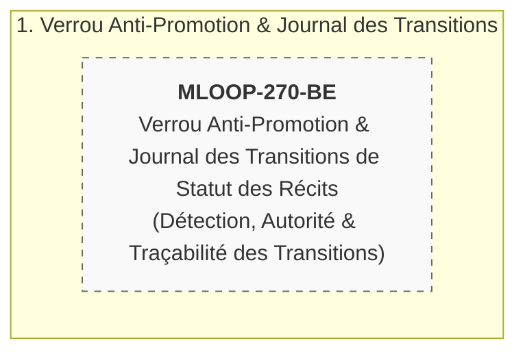

# 🏛️ Épopée — `EPIC-27-LIFECYCLE-STATE-LOCK` : Gouvernance de Concurrence de la Machine à États des Récits (Verrou Anti-Promotion & Traçabilité)

---

> **Référence d'Architecture** : [ADR-0375](../../../../standards/adr-system/0375-project-lifecycle-5-phases-and-analysis-types.md) (Cycle de Vie en 5 Phases & Traçabilité Radicale) · [ADR-0376](../../../../standards/adr-system/0376-standard-rigueur-zero-blindspot-ecosysteme-mloop.md) (Rigueur 360° Zéro Blindspot) · [ADR-0345](../../../../standards/adr-system/0345-herdr-runtime-deep-integration-plugin-architecture.md) (Zero Zombie Policy — analogie de gouvernance des sessions concurrentes) · [STORY_LIFECYCLE_PROTOCOL.md](../../../../standards/protocols/STORY_LIFECYCLE_PROTOCOL.md) (Cycle de Vie & qualification de l'auto-promotion en « faute grave »)  
> **Composant(s)** : Moteur d'Intégrité des Récits (`src/pipelines/state_machine.py` — `stamp_content_hash` L501, `validate_content_integrity` L467, `ContentTamperingError` L175), Transitions de Cycle de Vie (`src/core/lifecycle/_lc_transitions.py`), Suivi d'Exécution (`backlog/sprint_backlog.md`), Contrôle Pré-Vol (`vibe-check`)  
> **Origine / Déclencheur** : Incident réel de concurrence de la **session Grill EPIC-21 du 24/09/2026** — réécriture non autorisée de `sprint_backlog.md` à **13:49:04** passant 4 récits (`MLOOP-212/213/214/215`) en `READY_FOR_DEV` **sans aucune session humaine de validation** ; restauration manuelle à **13:50:18**, puis **re-jeu de la promotion à 13:54:28** ; revendication « struct-check ×4 » **non corroborée** par le moindre artefact sur disque.  
> **Statut** : `OPEN` — Récits Palier 1 (`status: DRAFT`, `grill_me: PENDING`)  
> **Décideurs** : Marco (Utilisateur / PO) & Antigravity (Architecte Agentique)

---

## 🎯 1. Contexte & Intention Stratégique

Le cycle de vie des récits (`DRAFT` → `READY_FOR_GROOMING` → `READY_FOR_DEV` → …) est la colonne vertébrale de la gouvernance mLoop : il sépare la rédaction (IA) de l'engagement en développement (feu vert humain). L'incident du 24/09/2026 a démontré que cette frontière **n'était protégée par aucun garde-fou machine** :

1. **Le contrôle d'intégrité est focalisé sur la rédaction, pas sur la transition** : `validate_content_integrity` ne hash que le corps du récit (`parts[2]`), donc une modification du champ `status:` du frontmatter passe **inaperçue**.
2. **Aucune trace d'auteur n'est produite** : `STORY_LIFECYCLE_PROTOCOL.md` §4 qualifie l'auto-promotion de « faute grave », mais il n'existe ni verrou, ni journal de transitions (auteur, session, horodatage), ni vérification de session.
3. **La re-promotion est possible en boucle** : après une restauration manuelle à 13:50:18, l'acteur externe a re-jeué la promotion à 13:54:28 — rien ne l'en a empêché.
4. **Les preuves invoquées peuvent être fictives** : la mention « struct-check ×4 » était sans aucun artefact `struct_check_*` réel sur disque.
5. **Le conflit est structurel, pas accidentel** : l'environnement exécute en permanence des sessions multi-agents concurrentes (workers EPIC-19, autres orchestrators).

Cette épopée met en place une **gouvernance de concurrence de la machine à états des récits** : verrou anti-promotion, journal des transitions traçable et détection des écritures non autorisées, sans jamais déléguer à une session machine l'autorité de promettre un feu vert humain.

### Points de Friction Résolus / Objectifs Mesurables :
1. **Frontière de transition protégée** : toute réécriture de champ `status:` en frontmatter devient détectable (aujourd'hui invisible pour le hash de corps).
2. **Journal des transitions traçable** : chaque transition est rattachable à un auteur / une session et à un horodatage (aujourd'hui : trace nulle).
3. **Re-jeu non silencieux** : une promotion restaurée puis ré-émise ne repasse pas sans laisser de marque (incident 13:50:18 → 13:54:28).
4. **Corroboration des contrôles revendiqués** : une mention de contrôle sans artefact réel sur disque est signalée comme non corroborée (incident « struct-check ×4 »).

> ⚠️ **Décisions d'architecture ouvertes** : le périmètre du verrou (statuts couverts), son mécanisme (fichier / journal / les deux), l'autorité de preuve de la transition, la sanction, l'exigence d'artefact `struct_check` et la rétrocompatibilité restent **tranchés au Grill-Me 1:1 de `MLOOP-270-BE`** (6 questions, voir Section 5 du récit).

---

## 🧭 2. Vérité Terrain & Ancrage Normatif

> En application de l'**ADR-0375** (Traçabilité Radicale) et de l'**ADR-0376** (Zéro Blindspot), cette épopée s'ancre sur les sources vérifiées suivantes :

* **Standards de Cycle de Vie & Gouvernance** :
  - [`standards/protocols/STORY_LIFECYCLE_PROTOCOL.md`](../../../../standards/protocols/STORY_LIFECYCLE_PROTOCOL.md) (§4 : auto-promotion = « faute grave », sans garde-fou machine)
  - [`standards/adr-system/0375-project-lifecycle-5-phases-and-analysis-types.md`](../../../../standards/adr-system/0375-project-lifecycle-5-phases-and-analysis-types.md) (5 phases & verrou de phase)
  - [`standards/adr-system/0376-standard-rigueur-zero-blindspot-ecosysteme-mloop.md`](../../../../standards/adr-system/0376-standard-rigueur-zero-blindspot-ecosysteme-mloop.md) (audit 360° en 7 couches avant tout changement du cœur)
  - [`standards/adr-system/0345-herdr-runtime-deep-integration-plugin-architecture.md`](../../../../standards/adr-system/0345-herdr-runtime-deep-integration-plugin-architecture.md) (Zero Zombie Policy — analogie de gouvernance anti-session-orpheline)
* **Preuves Terrain (incident `INCIDENT-2026-09-24`)** :
  - Chronologie 13:49:04 / 13:50:18 / 13:54:28 et réécriture des lignes 212-215 de `sprint_backlog.md` (Responsable « 👤 Humain (validé 2026-09-24) », note « struct-check ×4, épopée 6/6 ») sans session humaine.
  - Preuve par glob nul : **aucun** artefact `struct_check_*` sur disque.
  - Arbitrage humain Option A (session Grill EPIC-21) : rétrogradation puis promotion **un par un** avec feu vert traçable.
* **Ancrage Code (vérifié)** :
  - [`src/pipelines/state_machine.py`](../../../../src/pipelines/state_machine.py) : `stamp_content_hash` (L501), `validate_content_integrity` (L467-…), `ContentTamperingError` (L175) — anti-tampering sur le **corps** uniquement.
  - [`src/core/lifecycle/_lc_transitions.py`](../../../../src/core/lifecycle/_lc_transitions.py) : transitions du cycle de vie des récits.

---

## 🗺️ 3. Cartographie de l'Épopée (Story Mapping)

> 📌 **Découpage** : 1 récit `MLOOP-270-BE` à ce stade. Un éventuel split (ex. séparation « journal » / « verrou ») sera décidé **après la session Grill-Me 1:1**, au gré de l'arbitrage des 6 questions ouvertes.

---

## 📋 4. Découpage en Récits Utilisateurs (Palier 1 Drafts)

| Récit ID | Rôle | Titre du Récit | Taille | Dépendances | Statut Initial | Fichier Story |
| :--- | :---: | :--- | :---: | :--- | :---: | :--- |
| **MLOOP-270-BE** | `BE` | Verrou Anti-Promotion & Journal des Transitions de Statut des Récits | `M` | Aucune | `DRAFT` (Palier 1) | [`stories/MLOOP-270-BE.md`](../stories/MLOOP-270-BE.md) |

---

## 🛡️ 5. Matrice d'Impact Transversal Zéro Blindspot (ADR-0376)

| Couche ECOSYSTEM_RIGOR | Impact Identifié | Action Prévue | Statut |
| :--- | :--- | :--- | :---: |
| **Couche 1 : Blueprints** | Aucun changement de gabarit de récit (`story_draft_template.md`, `story_template.md`) | Contrôle d'intégrité hors gabarit | `SCELLED` |
| **Couche 2 : Protocoles** | Complément exécutoire de `STORY_LIFECYCLE_PROTOCOL.md` §4 (la règle existe, le garde-fou non) | Amendement éventuel de `standards/protocols/` au Grill-Me | `PENDING` |
| **Couche 3 : Architecture ADR** | Ancrage ADR-0375, ADR-0376, ADR-0345 (analogie de gouvernance) | Décision Type 1 à consigner si mécanisme acté | `PENDING` |
| **Couche 4 : Directives Agents** | Responsabilité des transitions en environnement multi-agents concurrents | Consignes de session dans `.agents/` | `PENDING` |
| **Couche 5 : Skills Portables** | `vibe-check`, `grill`, `plan`, `rubber-duck` (validation Palier 2) | Intégration de la détection sans rupture de workflow | `PENDING` |
| **Couche 6 : Core Python & CLI** | `src/pipelines/state_machine.py`, `src/core/lifecycle/_lc_transitions.py` (≤ 300L, ADR-0202) | Extension rétrocompatible de l'anti-tampering + journal | `PENDING` |
| **Couche 7 : Tests & Parité** | Rejeu déterministe de l'incident (réécriture de `status:` simulée) sous `tests/` | Failure Contract ADR-0369 + suite non-régression | `PENDING` |

---

## 🏁 6. Critères de Sortie & Clôture de l'Épopée (DoD)

1. [ ] Le récit `MLOOP-270-BE` a atteint `DONE_TESTED` ou `SHIPPED`.
2. [ ] La session Grill-Me 1:1 a tranché les 6 questions ouvertes et validé l'entrée en développement (passage Palier 2, `wikifix` / `rubber-duck`).
3. [ ] Rejeu de l'incident : une réécriture non autorisée d'un champ `status:` en frontmatter est **détectée** (et non plus invisible pour le hash de corps).
4. [ ] Toute transition non autorisée est **rattachable** à un auteur / une session et à un horodatage, ou explicitement refusée (mécanisme exact à définir au Grill-Me — aucune décision anticipée ici).
5. [ ] Les 7 couches ADR-0376 ont été auditées avant toute modification du cœur mLoop (plan zéro blindspot approuvé par l'humain).
6. [ ] La suite complète des tests de non-régression est au vert (`pytest tests/`) sans dépassement modulaire (`RULE-AST-01`, ≤ 300L).
7. [ ] Le contrôle souverain `python src/swarm.py vibe-check --project mLoop` retourne `0 FAIL`.
