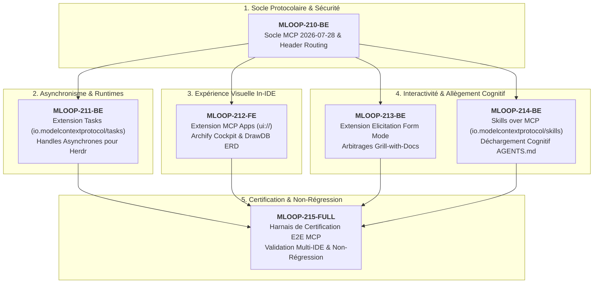

# 🏛️ Épopée — `EPIC-21-MCP-MODERN-SUITE` : Intégration des Standards MCP 2026-07-28 & Extensions (Tasks, MCP Apps, Elicitation, Skills over MCP)

---

> **Référence d'Architecture** : [ADR-0387](../../../../standards/adr-system/0387-mcp-modern-spec-2026-07-28-tasks-ui-elicitation-architecture.md) (MCP 2026-07-28) · [ADR-0202](../../../../standards/adr-system/0202-modularite-interne-agents.md) (Modularité ≤ 300L) · [ADR-0308](../../../../standards/adr-system/0308-mcp-prompts-and-evals-engine.md) (Prompts & Skills) · [ADR-0374](../../../../standards/adr-system/0374-standard-mcp-cyber-resilience-et-workflows-deterministes.md) (Cyber-Résilience MCP) · [ADR-0376](../../../../standards/adr-system/0376-standard-rigueur-zero-blindspot-ecosysteme-mloop.md) (Rigueur 360° Zéro Blindspot)  
> **Composant** : Bridges MCP (`src/bridges/`), Moteur Herdr Asynchrone (`src/core/herdr_daemon.py`), Visualiseurs (`tools/archify/`, `tools/drawdb/`), Protocole interactif Grill-Me (`src/pipelines/grill/`)  
> **Origine** : Audit d'évolution protocolaire MCP 2026-07-28 & éradication des timeouts, intégration d'Archify/DrawDB en iframes IDE, et déblocage de l'interactivité autonome  
> **Statut** : `OPEN` — **épopée 6/6 en `READY_FOR_DEV`** (210/211 validés tôt 2026-09-24 ; 212-215 validés humain le 2026-09-24, session Grill EPIC-21, après Grill-Me 1:1 + conversion Palier 2 + Rubber Duck PASS ×4).  
> **Décideurs** : Marco (Utilisateur) & Antigravity (Agentic Architect)

---

## 🎯 Contexte & Intention Stratégique

L'intégration des spécifications **Model Context Protocol (MCP) du 28 juillet 2026** résout les 3 points de blocage structurels de mLoop :
1. **Élimination des Timeouts d'Exécution** : Les opérations longues (> 5s) bloquaient le transport JSON-RPC. L'extension `Tasks` (`io.modelcontextprotocol/tasks`) apporte un découplage natif asynchrone par `task handles` persistants.
2. **Rendu Visuel In-IDE** : Les visualisations **Archify Cockpit** et **DrawDB ERD** nécessitaient l'ouverture d'un navigateur externe. L'extension `MCP Apps` (`io.modelcontextprotocol/ui`) permet de les projeter en iframes interactives directement dans le chat de l'IDE.
3. **Dialogue Interactif pour Workers Autonomes** : Le mode non-supervisé interdisait les questions interactives. L'extension `Elicitation` (Form Mode) permet d'afficher des formulaires de choix d'architecture directement dans l'interface de l'IDE hôte.

---

## 🗺️ Cartographie de l'Épopée : `EPIC-21-MCP-MODERN-SUITE`

---

## 📋 Tableau des Récits Découpés

| Récit | Composant | Titre du Récit | Priorité | Taille | Bloqué par | Statut |
| :--- | :--- | :--- | :---: | :---: | :---: | :---: |
| **MLOOP-210-BE** | Bridges/Core | Socle Protocolaire MCP 2026-07-28 : Négociation de Version, Header Routing & MCP-Protocol-Version | P0 | S | - | `DONE_TESTED` |
| **MLOOP-211-BE** | Bridges/Herdr | Extension Tasks (`io.modelcontextprotocol/tasks`) : Handles Asynchrones & Call-Now-Fetch-Later pour Herdr | P0 | M | MLOOP-210-BE | `READY_FOR_DEV` |
| **MLOOP-212-FE** | Bridges/UI | Extension MCP Apps (`io.modelcontextprotocol/ui`) : Exposition `ui://` pour Archify Cockpit & DrawDB ERD | P1 | M | MLOOP-210-BE | `READY_FOR_DEV` |
| **MLOOP-213-BE** | Bridges/Grill | Extension Elicitation : Formulaire Interactif Form Mode pour le Protocole Grill-with-Docs | P1 | S | MLOOP-210-BE | `READY_FOR_DEV` |
| **MLOOP-214-BE** | Bridges/Skills | Standard Skills over MCP (`io.modelcontextprotocol/skills`) : Exposition Dynamique des Compétences mLoop | P2 | S | MLOOP-210-BE | `READY_FOR_DEV` |
| **MLOOP-215-FULL** | QA/Certification | Harnais de Certification & Conformité E2E MCP 2026-07-28 & Non-Régression Multi-IDE | P0 | M | MLOOP-210 to 214 | `READY_FOR_DEV` |
