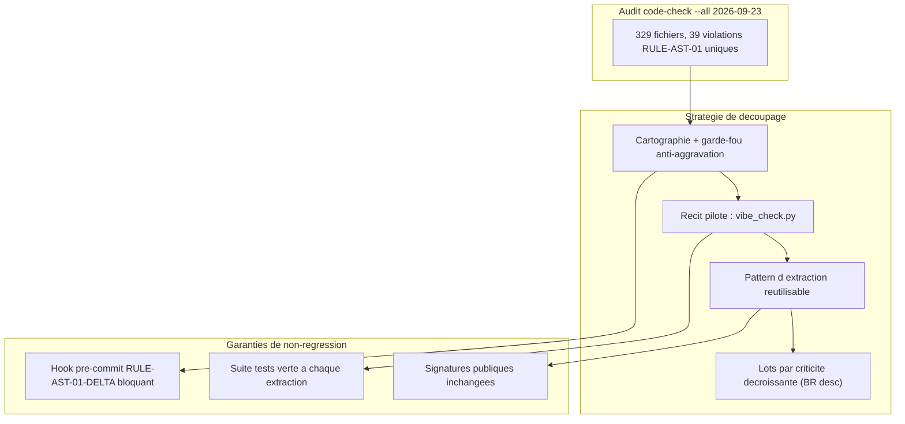

# Epopee EPIC-17-MODULAR-REFACTORING : Resorption de la Dette Modulaire AST (RULE-AST-01)

> **Reference Architecture** : ADR-0202 (Modularite < 300 lignes) · ADR-0369 (Standards Python Senior) · ADR-0376 (Audit 360 en 7 Couches)
> **Composant** : Modules `src/` depassant le plafond modulaire
> **Origine** : EPIC-15 — hook pre-commit bloque sur `RULE-AST-01` (dette preexistante `vibe_check.py`)
> **Statut** : `OPEN` — En cours (MLOOP-171-BE DONE, MLOOP-172-BE DONE_TESTED, MLOOP-170-BE DONE_TESTED)

---

## Contexte & Intention Strategique

Lors de la livraison d'EPIC-15 (Directives SSOT), le hook pre-commit a bloque sur deux violations `RULE-AST-01` du fichier `src/pipelines/vibe_check.py` (plafond de 300 lignes / 15 Ko depasse). L'investigation a revele que cette violation etait **preexistante** (le fichier faisait deja 743 lignes avant l'intervention) et qu'elle n'etait pas un cas isole.

Un audit `code-check --all` a quantifie la dette a l'echelle du codebase :
- **329 fichiers analyses** (audit 2026-09-23), 290 conformes.
- **65 violations totales**, dont **39 fichiers uniques en depassement RULE-AST-01** (+1 vs baseline 38 : `archify.py` cree hors plafond par EPIC-16).

Cette dette a ete contournee pour EPIC-15 via l'echappatoire souveraine `MLOOP_SKIP_HOOKS=1`, avec engagement explicite de la traiter dans cette epopee.

### Pourquoi un epic distinct
- Le refactoring d'un module critique comme `vibe_check.py` (34 callers, 10 fichiers de tests) merite son propre audit 360 et son propre plan zero blindspot.
- La dette est transverse (39 fichiers) : elle appelle une strategie coherente, pas des correctifs opportunistes disperses.

---

## Cartographie de l'Epopee

---

## Registre des Recits

### 1. MLOOP-170-BE : Recit Pilote — Refactoring Modulaire de vibe_check.py

- **Type** : Refactoring & SSOT Hygiene
- **Composant** : `src/pipelines/vibe_check.py` (880 lignes -> cible < 300 par module)
- **Statut** : `DONE_TESTED` (2026-09-23)
- **Description** :
  En tant qu'Ingenieur du framework mLoop,
  je veux decouper `vibe_check.py` en sous-modules coherents,
  afin de ramener chaque unite sous le plafond de 300 lignes sans alterer le comportement du guardrail ni casser ses 34 callers.
- **Regles** :
  - [Signature Publique Inchangee] : `run_vibe_check` conserve sa signature exacte ; les 34 callers ne subissent aucune modification.
  - [Extraction par Famille de Controles] : les 21 checks sont groupes en sous-modules thematiques.
  - [Non-Regression Totale] : `tests/test_vibe_check_*.py` reste integralement vert.

---

### 2. MLOOP-171-BE : Cartographie & Priorisation des 39 Modules en Depassement

- **Type** : Analyse & Planification
- **Composant** : Rapport `code-check --all` + garde-fou anti-aggravation
- **Statut** : `DONE` (2026-09-23)
- **Livrables produits** :
  - `Projects/mLoop/memory/evidence/codecheck_audit_epic17.txt` — sortie brute archivee
  - `Projects/mLoop/memory/evidence/epic17_prioritization_matrix.md` — 39 fichiers, tri BR desc, sequence Beachhead
  - `src/pipelines/ast_delta_checker.py` (297L, PASS code-check) — garde-fou RULE-AST-01-DELTA
  - `standards/blueprints/git_pre_commit_hook.sh` — mis a jour : appel delta checker + printf audit MLOOP_SKIP_HOOKS
  - `tests/test_ast_delta_checker.py` — **23/23 PASS**
- **Description** :
  En tant qu'Architecte mLoop,
  je veux un inventaire priorise des 39 fichiers depassant le plafond modulaire, classes par blast radius et criticite fonctionnelle,
  afin de sequencer le refactoring du plus risque au moins risque sans big-bang.
- **Arbitrages Grill-Me** :
  - OQ-171-01 : Blast radius d'abord (callers max en priorite)
  - OQ-171-02 : Garde-fou bloquant : rejet de tout commit agrandissant un fichier deja >300L (DONE)
  - OQ-171-03 : archify.py + server.py integres dans la file (Lot 3)
  - OQ-171-04 : Zero derogation — plafond 300L strict, _registry.py inclus
  - OQ-171-05 : Strategie Beachhead — Lot 0 pilote, Lot 1 top 5 critiques, Lots 2+ residus adaptatifs

---

### 3. MLOOP-172-BE : Etablissement du Pattern d'Extraction Reutilisable

- **Type** : Standard & Documentation
- **Composant** : `standards/protocols/` (guide de refactoring modulaire)
- **Statut** : `READY_FOR_GROOMING`
- **Description** :
  En tant qu'Ingenieur du framework,
  je veux un pattern d'extraction documente et valide sur le recit pilote,
  afin d'appliquer une methode coherente et sure aux 38 fichiers restants.
- **Regles** :
  - [Pattern Issu du Pilote] : extrait de l'experience reelle du refactoring de `vibe_check.py`.
  - [Retrocompatibilite des Imports] : re-export depuis le module d'origine si necessaire.

---

## Matrice de Tracabilite & Sequence

| Ordre | User Story | Portee | Statut |
| :---: | :--- | :--- | :---: |
| 1 | MLOOP-171-BE | Cartographie 39 fichiers + garde-fou delta | `DONE` (2026-09-23) |
| 2 | MLOOP-170-BE | Refactoring pilote `vibe_check.py` | `DONE_TESTED` (2026-09-23) |
| 3 | MLOOP-172-BE | Pattern d'extraction reutilisable | `DONE_TESTED` (2026-09-23) |
| 4 | MLOOP-173-BE | Refactoring Lot 1 : `src/state.py` (770L, BR=78) — §3.2 Singletons | `DRAFT` |
| 5 | MLOOP-174-BE | Refactoring Lot 1 : `src/core/lifecycle.py` (852L, BR=8) — cas général | `DRAFT` |
| 6 | MLOOP-175-BE | Refactoring Lot 1 : `src/commands/_registry.py` (2028L, BR=3) — §3.1 Registres | `DRAFT` |
| 7 | MLOOP-176-BE | Refactoring Lot 3 : `src/converters/svg_to_md.py` (991L, BR=2) — cas général | `DRAFT` |
| 8 | MLOOP-177-BE | Refactoring Lot 3 : `src/dashboard/server.py` (1634L, BR=0) — OQ-171-03 | `DRAFT` |
| 9 | MLOOP-178-BE | Refactoring Lot 1 : `src/loop_mem/db.py` (956L, BR=20) — cas général §2 DB/SQLite | `DRAFT` |
| 10 | MLOOP-179-BE | Refactoring Lot 1 : `src/pipelines/sync.py` (542L, BR=10) — cas général §2 Sync/Jira/Git | `DRAFT` |
| 11+ | (a decouper) | Refactoring Lots 1-2 residuels : 32 fichiers BR 2-7 restants | `OPEN` |

**Dependances** : 171-BE (cartographie + garde-fou) -> 170-BE (pilote) -> 172-BE (pattern) -> Lots suivants.

---

## Sequence Beachhead Detaillee (OQ-171-05)

| Lot | Fichiers | BR | Statut |
|:---:|:---------|---:|:------:|
| Lot 0 Pilote | `vibe_check.py` -> `src/pipelines/vibe_check/` | 34 | DONE_TESTED |
| Lot 1 Top 5 | `state.py` (BR=78) · `db.py` (BR=20) · `sync.py` (BR=10) · `lifecycle.py` (BR=8) · `_registry.py` (BR=3, 2028L) | 78-3 | Recits a creer |
| Lot 2 BR 2-7 | `ingest_agent.py` · `retriever.py` · `standards_graph.py` · `state_machine.py` · `graphify/agent.py` · `crawler.py` · `critic.py` · `llm_client.py` · `evidence_pack.py` · `compaction.py` · `gates.py` · `struct_checker.py` · `domain_invariants.py` | 7-2 | Lots adaptatifs |
| Lot 3 Residus | 21 fichiers BR 0-1 dont `archify.py` + `server.py` (OQ-171-03) | 1-0 | Lots adaptatifs |

---

### 4. MLOOP-173-BE : Extraction Modulaire de src/state.py — Singleton d'État Partagé

- **Type** : Refactoring modulaire
- **Composant** : `src/state.py` (770 L, 31.1 Ko, BR=78)
- **Lot** : Lot 1
- **Cas spécial protocole** : §3.2 Singletons d'état partagé
- **Statut** : `DRAFT` · `grill_me: PENDING` (créé 2026-09-23)
- **Bloqué par** : MLOOP-172-BE (DONE_TESTED)

---

### 5. MLOOP-174-BE : Extraction Modulaire de src/core/lifecycle.py — Gates & Transitions d'État

- **Type** : Refactoring modulaire
- **Composant** : `src/core/lifecycle.py` (852 L, 38.6 Ko, BR=8)
- **Lot** : Lot 1
- **Cas spécial protocole** : Cas général §2 (découpe par famille de responsabilités)
- **Statut** : `DRAFT` · `grill_me: PENDING` (créé 2026-09-23)
- **Bloqué par** : MLOOP-172-BE, MLOOP-173-BE

---

### 6. MLOOP-175-BE : Extraction Modulaire de src/commands/_registry.py — Registre Déclaratif CLI

- **Type** : Refactoring modulaire
- **Composant** : `src/commands/_registry.py` (2028 L, 73.1 Ko, BR=3)
- **Lot** : Lot 1
- **Cas spécial protocole** : §3.1 Registres déclaratifs · Obligation ADR-0370 guide --sync
- **Statut** : `DRAFT` · `grill_me: PENDING` (créé 2026-09-23)
- **Bloqué par** : MLOOP-172-BE

---

### 7. MLOOP-176-BE : Extraction Modulaire de src/converters/svg_to_md.py — Convertisseur OCR/SVG

- **Type** : Refactoring modulaire
- **Composant** : `src/converters/svg_to_md.py` (991 L, 37.8 Ko, BR=2)
- **Lot** : Lot 3
- **Cas spécial protocole** : Cas général §2 (famille OCR/converters)
- **Statut** : `DRAFT` · `grill_me: PENDING` (créé 2026-09-23)
- **Bloqué par** : MLOOP-172-BE

---

### 8. MLOOP-177-BE : Extraction Modulaire de src/dashboard/server.py — Routeurs FastAPI

- **Type** : Refactoring modulaire
- **Composant** : `src/dashboard/server.py` (1634 L, 65.9 Ko, BR=0)
- **Lot** : Lot 3 (OQ-171-03)
- **Cas spécial protocole** : Cas général §2 (routeurs FastAPI par domaine)
- **Statut** : `DRAFT` · `grill_me: PENDING` (créé 2026-09-23)
- **Bloqué par** : MLOOP-172-BE

---

### 9. MLOOP-178-BE : Extraction Modulaire de src/loop_mem/db.py — Couche SQLite

- **Type** : Refactoring modulaire
- **Composant** : `src/loop_mem/db.py` (956 L, 36.6 Ko, BR=20)
- **Lot** : Lot 1
- **Cas général protocole** : §2 (famille DB/SQLite) + ADR-0369 context managers obligatoires
- **Statut** : `DRAFT` · `grill_me: PENDING` (créé 2026-09-23)
- **Bloqué par** : MLOOP-172-BE
- **Questions clés Grill-Me** : frontière connection pool vs queries ; effets de bord import (connexions globales ?) ; rollback BR=20 ; séquençage vs state.py ; ADR-0369 `with` sur 100% des accès SQLite.

---

### 10. MLOOP-179-BE : Extraction Modulaire de src/pipelines/sync.py — Pipeline Sync

- **Type** : Refactoring modulaire
- **Composant** : `src/pipelines/sync.py` (542 L, 22.7 Ko, BR=10)
- **Lot** : Lot 1
- **Cas général protocole** : §2 (famille Sync/Jira/Git) + ADR-0369 timeouts réseau obligatoires
- **Statut** : `DRAFT` · `grill_me: PENDING` (créé 2026-09-23)
- **Bloqué par** : MLOOP-172-BE
- **Questions clés Grill-Me** : famille Git vs Jira vs hypergraphe ; timeouts réseau obligatoires ; rollback BR=10 ; séquençage vs db.py ; dépendances sur state/lifecycle.

---

## Decisions Ouvertes

- **Grill Macro 2026-09-23 (Q1-Q4 tranchées, frontière épuisée)** : voir `memory/evidence/EPIC17_grill_macro_fact_dossier.md`.
  - Q1 : création des 2 DRAFTs manquantes Lot 1 (178 db / 179 sync).
  - Q2 : séquence stricte 1-par-1 Beachhead (`state→db→sync→lifecycle→_registry`), un worker à la fois, Lot 3 gelé.
  - Q3 : rollback = revert Git immédiat, 0 FAIL strict, arbitrage humain si BR≥20.
  - Q4 : sortie Lot 1 = barre stricte 5/5 `DONE_TESTED` + zéro RULE-AST-01 sur les 5 cibles + pytest vert + resync ; aucun dégel Lot 3 avant.
- Toutes les OQ MLOOP-171-BE (OQ-171-01 a OQ-171-05) sont closes et arbitrees.
- Decisions restantes pour MLOOP-172-BE : strategie d'extraction (module par famille vs registre auto-decouverte), retrocompatibilite des imports.