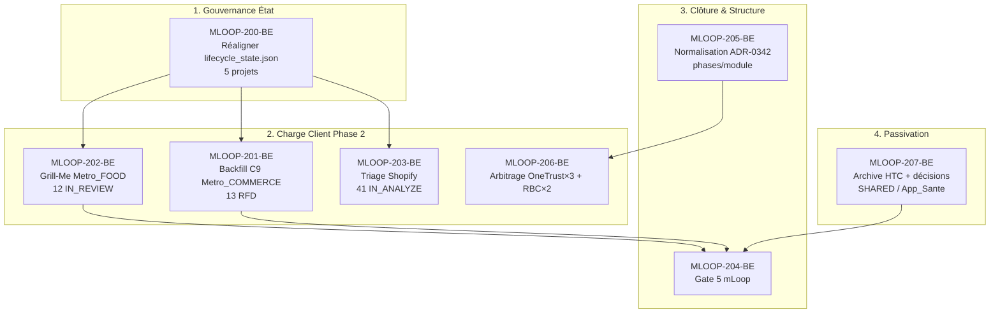

# 🏛️ Épopée — `EPIC-20-PORTFOLIO-GOVERNANCE` : Gouvernance du Portefeuille Actif mLoop (Réalignement Lifecycle, Grill Massif, Gate 5 & Passivation)

---

> **Référence d'Architecture** : ADR-0339 (Lifecycle & Gates) · ADR-0342 (Architecture Modulaire) · ADR-0375 (Cycle 5 Phases) · ADR-0361 (Plans d'Intention Interdits) · ADR-0326 (EvidencePacks)
> **Origine** : Inventaire portefeuille du 23/09/2026 — 6 projets actifs, désalignements `lifecycle_state.json`, charge Grill-Me Metro_FOOD, absence fact_dossiers Metro_COMMERCE, Gate 5 mLoop non scellée, HTC à archiver
> **Statut** : `DONE` — 8/8 récits exécutés + Gate 5 scellée (2026-09-24) · approvals humaines successives (23–24/09/2026) · Zéro sync Jira (moratoire PO)
> **Décideur** : Humain (validation 1/2/3 du 23/09/2026 : 8 drafts 1:1 · hôte mLoop · archive HTC)

---

## 🎯 Contexte & Intention Stratégique

L'inventaire multi-projets du 23/09/2026 a révélé un **écart entre le badge projet-atomique de phase et la réalité hétérogène des modules et des backlogs** :

| Constat | Détail |
| :--- | :--- |
| **Désalignement lifecycle** | Metro_FOOD / Metro_COMMERCE / Metro_SANTE / BoireFrere / Shopify : `lifecycle_state.json` = `STAGE_0` sans gates vs CLI = Phase 1–2 |
| **Charge Grill-Me** | Metro_FOOD : 12 récits `IN_REVIEW` + 7 `ON_HOLD` |
| **Risque Gate C9** | Metro_COMMERCE : 13 `READY_FOR_DEV` mais **0 fact_dossier** |
| **Gueule béante** | Shopify_AI_Item_Creator : 41/41 `IN_ANALYZE`, 0 prêt dev |
| **Gate 5 ouverte** | mLoop : Gates 1–4 ✅, Gate 5 EN COURS (jira_sync, supersession, tests non scellés) |
| ** dette structurelle** | Naming modulaire inégal, OneTrust ×3, RBC ×2, phase badge-atomique |
| **Passivation** | HTC (legacy non normalisé) à archiver ; Metro_SHARED / App_Sante sans backlog |

**Intention** : traiter le portefeuille comme un **épopée de gouvernance unique hébergée sur mLoop**, en tranches verticales INVEST, sans scinder les projets clients (conformité ADR-0342) et sans auto-approbation `READY_FOR_DEV` (Grill-Me 1:1 obligatoire).

---

## 🗺️ Cartographie de l'Épopée : `EPIC-20-PORTFOLIO-GOVERNANCE`

---

## 📋 Registre des Récits (esquisses Palier 1 — à Grill)

| # | ID | Titre | Layer | Macro | Priorité |
| :--: | :--- | :--- | :---: | :--: | :---: |
| P1 | `MLOOP-200-BE` | Réaligner `lifecycle_state.json` sur la vérité CLI (5 projets) + corriger parse errors | backend | M | 🔴 |
| P3 | `MLOOP-201-BE` | Backfill fact_dossiers Gate C9 — Metro_COMMERCE (13 RFD) | backend | M | 🔴 |
| P2 | `MLOOP-202-BE` | Séquence Grill-Me 1:1 — Metro_FOOD (12 IN_REVIEW → DoR) | fullstack | L | 🔴 |
| P4 | `MLOOP-203-BE` | Triage Shopify — 41 IN_ANALYZE → DRAFT / RFD / BACKLOG | backend | M | 🟠 |
| P6 | `MLOOP-204-BE` | Clôture Gate 5 mLoop — jira_sync Fail-Closed, supersession, tests | backend | S | 🟠 |
| P7 | `MLOOP-205-BE` | Normalisation modules ADR-0342 + colonnes phase/module sprint_backlog | backend | M | 🟡 |
| P8 | `MLOOP-206-BE` | Grill-project transverse — OneTrust ×3 + RBC ×2 (matrice §3) | backend | S | 🟡 |
| P9–P10 | `MLOOP-207-BE` | Passivation HTC → `_archive` + décisions SHARED / App_Sante | backend | XS | 🟡 |

---

## 🚫 Frontières Actives (Admission of Limits)

- **Hors périmètre** : scission de Metro_* / BoireFrere en micro-projets (interdit ADR-0342 tant que docs/schémas partagés).
- **Hors périmètre** : correction du corps source legacy US-07-FOOD / US-13-FOOD (décision humaine 23/09/2026 — won't fix, déjà livré).
- **Hors périmètre** : promotion `READY_FOR_DEV` sans Grill-Me 1:1 interactif (règle inviolable ADR-0375).
- **Dépendance** : `MLOOP-204-BE` (Gate 5) demande un feu vert humain explicite pour `git push`.
- **Numérotation** : IDs `MLOOP-200`…`207` — les `MLOOP-190`…`197` sont réservés à `EPIC-19-CLICK-CLI-ENGINE`.

---

*Dernière mise à jour : 2026-09-23*
