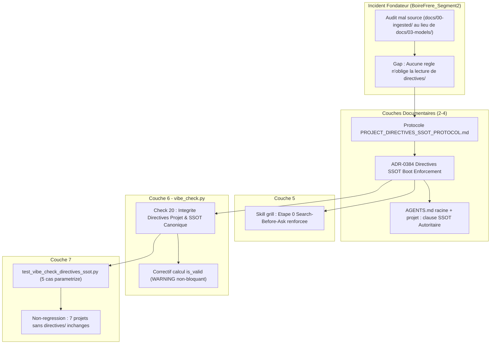

# 🏛️ Épopée — `EPIC-15-DIRECTIVES-SSOT-ENFORCEMENT` : Application du Chargement des Directives Projet & Ancrage SSOT Canonique

---

> **Référence d'Architecture** : `standards/adr-system/0384-project-directives-ssot-boot-enforcement.md` *(à créer)*
> **Protocole Normatif** : `standards/protocols/ECOSYSTEM_RIGOR_PROTOCOL.md` (ADR-0376 — Audit 360° en 7 Couches)
> **Composant Cœur** : `src/pipelines/vibe_check.py` (nouveau Check 20)
> **Origine** : Découverte terrain sur le projet `BoireFrere_Segment2` — session de revue des récits REC-009→REC-014
> **Statut** : `OPEN` — Grill-Me 1:1 de cadrage macro **COMPLÉTÉ le 22/09/2026** (6 décisions tranchées, voir §Décisions Actées). En attente de découpage Palier 2 (rédaction des récits au gabarit haute-fidélité).

---

## 🎯 Contexte & Intention Stratégique (Post-Mortem de l'Incident Fondateur)

### L'incident déclencheur
Lors d'une revue contradictoire (Sentinel / rubber-duck) des récits `REC-009` à `REC-014` du projet `BoireFrere_Segment2`, l'orchestrateur mLoop a délégué l'audit de conformité SSOT à 3 sous-agents en les briefant sur les mauvaises sources documentaires (`docs/00-ingested/`, sources d'ingestion amont) au lieu du SSOT canonique réel (`docs/03-models/Structure-de-données.md`). Cette erreur a produit un faux diagnostic de « conflit de modèles de données non résolu » nécessitant un arbitrage humain (`grill-project`), alors que la hiérarchie SSOT était **déjà tranchée** dans `Projects/BoireFrere_Segment2/directives/tech.md` (L15) et `directives/business.md` (L36) :

> « Le document maître consolidé `docs/03-models/Structure-de-données.md` fait foi absolue […]. Le document historique `reference/Structure-de-données.md` […] n'est plus autoritaire pour le modèle applicatif dès lors qu'il diverge du maître. »

### Cause racine (diagnostic vérifié)
Un balayage à froid des 7 couches de gouvernance mLoop confirme qu'**aucune règle** n'oblige l'orchestrateur à charger `directives/` avant d'agir :
- `AGENTS.md` racine : ne mentionne `directives/` que pour le framework mLoop lui-même (interdiction de modification non auditée), jamais pour un projet client.
- `AGENTS.md` du projet Boire : liste les 3 piliers (`reference/`, `docs/`, `backlog/`) mais **ne mentionne même pas `directives/`**, et pointe `reference/` comme source « officielle » — ce qui contredit la hiérarchie réelle.
- `.agents/rules/` (3 règles auto-injectées) : une seule occurrence de « directives », relative au framework mLoop, pas aux projets clients.
- Boot Sequence (ADR-0322) : `resume` → `vibe-check` → `focus`. Aucune étape de lecture des directives projet.
- Les 20 checks actuels de `vibe_check.py` : aucun ne vérifie la présence, la fraîcheur ou la prise en compte de `directives/tech.md` / `directives/business.md`.

Le principe « les directives sont les Lois Fondamentales » est pourtant **archi-documenté** dans la documentation d'architecture du framework (`docs/01-architecture/framework/directives_best_practices.md`, `mloop_5_pillars_mapping.md`, personas `.agents/agents/sentinel.md`, `.agents/agents/plan.md`) — mais **jamais encodé comme contrôle opposable** à l'orchestrateur principal. C'est un **gap de gouvernance**, pas une violation de règle existante.

### Blindspots additionnels découverts (audit demandé explicitement par l'humain)
La lecture complète de `directives/business.md` (projet Boire) a révélé **3 autres familles de directives à haut risque** qu'un modèle peut rater de la même manière :

| Famille | Directive | Nature & Mécanisme de gouvernance |
| :--- | :--- | :--- |
| **Contrat Visuel Premier** | `business.md §26` : les maquettes Figma sont la **SSOT première** ; tout récit sans écran Figma est réputé *non requis* | **Principe framework UNIVERSEL** — intrinsèque à la fonction d'analyste fonctionnel (déjà porté par le Check 10 « Contrat Visuel Lisible » et l'interdiction AGENTS.md « Maquettes = SSOT »). Couvert par un **check mécanique dédié** (Mécanisme A → récit `MLOOP-165-BE`). |
| **Périmètre Déprécié** | `business.md §27` : les identifiants `REC-013` (Annulation) et `REC-014` (Correction) sont **formellement dépréciés et archivés** (ADR-007) | **Directive projet IMPÉRATIVE** (non négligeable). Couverte par le **chargement forcé** (Mécanisme B → Check 20 : l'agent DOIT lire et respecter `business.md`), sans hardcoding projet dans le cœur framework. |
| **Règles de Saisie Transverses** | `business.md §20-24` : Delta-only (jamais modifier le stock existant directement), raccourci « Max » obligatoire, Gating de validation à 2 conditions | **Directive projet IMPÉRATIVE** (non négligeable). Couverte par le **chargement forcé** (Mécanisme B → Check 20), idem. |

**Deux mécanismes de gouvernance, une seule exigence — la considération obligatoire :**
- **Mécanisme A (Check mécanique générique)** : pour les principes universels codables en dur, valables pour TOUS les projets (Contrat Visuel Premier).
- **Mécanisme B (Chargement forcé + lecture obligatoire)** : pour les directives propres à un projet, quel que soit leur contenu présent ou futur (Périmètre Déprécié, Règles de Saisie). Le framework n'a pas besoin de « connaître » ces directives : il garantit que l'agent les a **lues avant d'agir**. C'est précisément la mission du Check 20.

> ⚠️ Ces directives projet ne sont **pas** de simples « exemples pédagogiques » : ce sont des directives **impératives**. Elles ne relèvent simplement pas du même mécanisme d'application que le Contrat Visuel.

### Portée de l'épopée
Combler ce gap à travers les **7 couches de l'écosystème mLoop** (ADR-0376), avec un design **conditionnel et strictement non-régressif** : sur 8 projets réels audités, seul `BoireFrere_Segment2` possède `directives/tech.md` + `business.md` (7 autres projets — Metro_FOOD, Metro_SANTE, Metro_COMMERCE, App_Sante, HTC, Shopify_AI_Item_Creator, mLoop — n'ont que `CONTEXT.md`/`AGENTS.md` ou rien). Le nouveau contrôle ne doit **jamais** faire échouer le Vibe-Check d'un projet qui n'a pas de `directives/`.

---

## 🗺️ Cartographie de l'Épopée : `EPIC-15-DIRECTIVES-SSOT-ENFORCEMENT`



---

## 📋 Registre Détaillé des Récits Utilisateurs (User Stories)

---

### 1. `MLOOP-160-BE` : Protocole Normatif — Hiérarchie SSOT & Chargement des Directives Projet

- **Type** : Documentation Normative & Gouvernance
- **Composant** : `standards/protocols/PROJECT_DIRECTIVES_SSOT_PROTOCOL.md` *(nouveau)*
- **Titre** : Rédaction du Protocole de Hiérarchie SSOT Canonique
- **Description** :
  **En tant qu'**Architecte en Chef mLoop,
  **je veux** un protocole normatif court et déterministe déclarant la hiérarchie documentaire (SSOT canonique > sources d'ingestion amont > staging local) et l'obligation de charger `directives/tech.md` + `directives/business.md` avant tout cadrage, audit ou brief de sous-agent,
  **afin d'**éliminer la classe d'erreur qui a causé le faux diagnostic de « conflit de modèle de données » sur le projet Boire.
- **Règles d'affaires** :
  - **RM-001 Hiérarchie Documentaire à 3 Niveaux** : (1) SSOT canonique déclaré par le projet (ex: `docs/03-models/`) — fait foi absolue ; (2) sources d'ingestion amont (`docs/00-ingested/`) — non autoritaires en cas de divergence ; (3) staging brut (`reference/`) — jamais lu directement, jamais autoritaire.
  - **RM-002 Obligation de Localisation Avant Brief** : Avant de déléguer une tâche d'audit ou d'analyse à un sous-agent (`task`, `worker-spawn`), l'orchestrateur DOIT avoir identifié et cité le SSOT canonique du projet actif.
  - **RM-003 Catalogue de Directives Projet Impératives** : Le protocole liste explicitement les directives projet **impératives** que le chargement obligatoire (Check 20) garantit de considérer, quelle que soit leur nature. Cas réels démontrant *pourquoi* la lecture forcée existe : Périmètre Déprécié (`REC-013`/`REC-014` archivés) et Règles de Saisie Transverses (Delta-only, Max, Gating). Le Contrat Visuel Premier y est cité comme principe framework universel relevant du Mécanisme A (check dédié `MLOOP-165-BE`), et non du chargement forcé. **Aucune de ces directives n'est un « exemple pédagogique » négligeable ; ce sont des impératifs à considération obligatoire.**
- **Gherkin Nominal** :
  ```gherkin
  Scénario: Consultation du protocole avant délégation d'audit
    Étant donné un orchestrateur sur le point de déléguer un audit SSOT à un sous-agent
    Quand il consulte PROJECT_DIRECTIVES_SSOT_PROTOCOL.md
    Alors il identifie le SSOT canonique déclaré par le projet actif
    Et il cite ce SSOT dans le brief transmis au sous-agent
  ```

---

### 2. `MLOOP-161-BE` : ADR-0384 — Décision d'Architecture & Amendement AGENTS.md

- **Type** : Architecture & Décision (Type 1)
- **Composant** : `standards/adr-system/0384-project-directives-ssot-boot-enforcement.md` *(nouveau)*, `standards/adr-system/README.md`, `AGENTS.md` (racine + miroirs), `AGENTS.md` (projet Boire)
- **Titre** : Consignation Formelle de la Décision & Mise à Jour des Directives Racine
- **Description** :
  **En tant que** Système de Gouvernance mLoop,
  **je veux** consigner cette décision sous forme d'ADR indexé et amender `AGENTS.md` (racine + projet Boire) avec une clause explicite « SSOT Autoritaire »,
  **afin de** rendre la règle traçable, citable et non-régressive dans le temps.
- **Règles d'affaires** :
  - **RM-001 ADR Type 1 Non-Écrasant** : L'ADR-0384 ne réécrit aucun ADR antérieur ; il ajoute une couche de gouvernance additive sur la Boot Sequence (ADR-0322) et le Grill (ADR-0320).
  - **RM-002 Clause AGENTS.md Racine** : Ajout dans `§4.1 Always do` d'une clause « Chargement des Directives Projet & SSOT Canonique » : en Phase ≥ 2, lecture de `directives/tech.md`+`business.md` (si présents) et identification du SSOT autoritaire avant tout cadrage.
  - **RM-003 Correctif AGENTS.md Projet Boire** : Le fichier `Projects/BoireFrere_Segment2/AGENTS.md` doit désormais lister `directives/` dans sa section « Séparation des 3 Piliers » et déclarer explicitement `docs/03-models/` comme SSOT (au lieu de pointer `reference/` comme « officiel »).
- **Gherkin Nominal** :
  ```gherkin
  Scénario: Traçabilité de la décision dans le catalogue ADR
    Étant donné le catalogue standards/adr-system/README.md
    Quand l'ADR-0384 est consigné
    Alors il apparaît indexé par thème avec un lien direct
    Et AGENTS.md racine contient la clause SSOT Autoritaire dans sa version miroir GEMINI.md/CLAUDE.md
  ```

---

### 3. `MLOOP-162-BE` : Renforcement Skill `grill` — Étape 0 Search-Before-Ask

- **Type** : Skills Portables
- **Composant** : `.agents/skills/grill/SKILL.md`
- **Titre** : Ajout de la Localisation SSOT Obligatoire dans l'Étape 0
- **Description** :
  **En tant qu'**Agent exécutant une session Grill (macro ou micro),
  **je veux** que l'Étape 0 « Search-Before-Ask » m'oblige explicitement à localiser et citer le SSOT canonique via `directives/` avant toute formulation de question ou tout brief de sous-agent,
  **afin de** ne plus jamais reproduire l'erreur de source constatée sur le projet Boire.
- **Règles d'affaires** :
  - **RM-001 Ordre de Recherche Imposé** : L'Étape 0 précise un ordre de recherche : `directives/tech.md`+`business.md` → `AGENTS.md` projet → `docs/01-architecture/`, avant toute recherche FTS5 générale.
  - **RM-002 Interdiction de Brief Non Sourcé** : Aucun brief transmis à un sous-agent (`task`) ne doit référencer un chemin de modèle de données sans que ce chemin ait été confirmé comme SSOT canonique.
- **Gherkin Nominal** :
  ```gherkin
  Scénario: Grill-Me avec localisation SSOT préalable
    Étant donné une session grill-project sur un projet avec directives/
    Quand l'agent exécute l'Étape 0
    Alors il lit directives/tech.md et directives/business.md avant toute question
    Et il cite la hiérarchie SSOT identifiée dans le Dossier de Preuves
  ```

---

### 4. `MLOOP-163-BE` : Check 20 Vibe-Check — Intégrité des Directives Projet & SSOT Canonique

- **Type** : Core & CLI Python — Guardrail Déterministe
- **Composant** : `src/pipelines/vibe_check.py`
- **Titre** : Contrôle Conditionnel Non-Régressif de Présence & Fraîcheur des Directives
- **Description** :
  **En tant que** Guardrail Vibe-Check Pré-Vol,
  **je veux** vérifier — uniquement si `Projects/<projet>/directives/` existe — que `tech.md` et `business.md` sont non-vides et qu'au moins l'un des deux référence explicitement un chemin de SSOT canonique,
  **afin de** détecter mécaniquement les projets dont la gouvernance documentaire est incomplète, sans jamais pénaliser les projets qui n'utilisent pas ce standard.
- **Règles d'affaires** :
  - **RM-001 Conditionnalité Stricte (Zero-Regression)** : Si `project_dir/directives/` n'existe pas → statut `PASS` immédiat avec message « Directives projet non applicables ». Aucun impact sur les 7 projets existants sans ce dossier.
  - **RM-002 Contrôle de Contenu Minimal** : Si `directives/` existe → vérifier (a) `tech.md` et `business.md` présents et non-vides, (b) `CONTEXT.md` présent à la racine projet, (c) au moins une mention d'un chemin `docs/03-models/` ou d'une déclaration de hiérarchie SSOT dans l'un des deux fichiers.
  - **RM-003 Sévérité Non-Bloquante (Palier 1)** : Toute non-conformité produit un statut `WARNING` (jamais `FAIL`), à l'image du Check 17 (Certification QA Sprint).
  - **RM-004 Correctif du Calcul Global (Sémantique Tri-État)** : Le calcul `is_valid` de `run_vibe_check` est corrigé pour distinguer trois états — `PASS` / `WARNING` (non-bloquant) / `FAIL` (bloquant) — afin que les statuts `WARNING` ne fassent pas chuter le résultat sous « valide ». Alignement avec l'intention déjà passive du Check 17 (actuellement bugué : `passed_count == total_count` traite WARNING comme un échec). **Décision D1 (Grill 22/09) : le recalcul s'applique au fil de l'eau à chaque projet ré-audité — aucune exigence de parité de score cross-projets. RM-004 reste dans ce récit (pas de récit isolé).**
- **Gherkin Nominal** :
  ```gherkin
  Scénario: Vibe-check sur un projet avec directives conformes
    Étant donné le projet BoireFrere_Segment2 avec directives/tech.md et business.md non-vides référençant docs/03-models/
    Quand python src/swarm.py vibe-check --project BoireFrere_Segment2 est exécuté
    Alors le Check 20 retourne PASS
    Et le score global reste 20/20 (ou 21/21 après ajout du check)
  ```
- **Gherkin Non-Régression** :
  ```gherkin
  Scénario: Vibe-check sur un projet sans dossier directives/
    Étant donné le projet Metro_FOOD sans dossier directives/
    Quand python src/swarm.py vibe-check --project Metro_FOOD est exécuté
    Alors le Check 20 retourne PASS avec le message "Directives projet non applicables"
    Et le score global de Metro_FOOD reste strictement identique à avant l'ajout du check
  ```

---

### 5. `MLOOP-164-BE` : Suite de Tests & Non-Régression Cross-Projets

- **Type** : Tests & Parité (Couche 7)
- **Composant** : `tests/test_vibe_check_directives_ssot.py` *(nouveau)*, suite `tests/test_vibe_check_*.py` (existante)
- **Titre** : Couverture Paramétrée du Check 20 & Réalignement des Tests sur la Sémantique Tri-État
- **Description** :
  **En tant qu'**Ingénieur QA du framework mLoop,
  **je veux** une suite de tests paramétrée couvrant les cas conditionnels du Check 20, et le **réalignement** des tests vibe-check existants qui encodaient l'ancienne sémantique binaire du score,
  **afin de** garantir que `uv run pytest` reste 100% vert avec la nouvelle règle tri-état — sans chercher à préserver les anciens scores des projets (Décision D1).
- **Règles d'affaires** :
  - **RM-001 Couverture Paramétrée (5 cas minimum)** : (1) directives conformes → PASS ; (2) absence totale de `directives/` → PASS ; (3) `directives/` présent mais SSOT non déclaré → WARNING ; (4) `tech.md` vide → WARNING ; (5) un WARNING ne fait pas basculer le résultat global à FAIL.
  - **RM-002 Réalignement Explicite des Tests (Décision D1)** : Les tests existants (`tests/test_vibe_check_*.py`) qui encodaient `is_valid = passed == total` sont **mis à jour** (`[MODIFY]` assumé) pour refléter la sémantique tri-état. Ce n'est PAS une garantie de non-régression passive : c'est un réalignement volontaire. Objectif final : `uv run pytest` 100% vert.
  - **RM-003 Zéro Dérive Guide CLI** : Confirmer qu'aucune commande n'est ajoutée à `src/commands/_registry.py` (les Checks 20 et 155 sont internes à `vibe-check`, pas de nouvelles commandes CLI) — donc aucune synchronisation `guide --sync` requise.
- **Gherkin Nominal** :
  ```gherkin
  Scénario: Suite de tests paramétrée du Check 20
    Étant donné les 5 cas de test parametrize pour le Check 20
    Quand uv run pytest tests/test_vibe_check_directives_ssot.py est exécuté
    Alors les 5 cas passent
    Et la suite complète tests/test_vibe_check_*.py reste 100% verte
  ```

---

### 6. `MLOOP-165-BE` : Check Ancrage Visuel des Récits Frontend (Contrat Visuel Premier)

- **Type** : Core & CLI Python — Guardrail Déterministe (Mécanisme A)
- **Composant** : `src/pipelines/vibe_check.py` (extension de l'infra du Check 10 existant)
- **Titre** : Détection des Récits Frontend Dépourvus d'Ancrage Maquette
- **Description** :
  **En tant qu'**Analyste Fonctionnel mLoop (pour qui le Contrat Visuel Premier est un principe de métier intrinsèque),
  **je veux** qu'un contrôle vérifie, pour tout récit `layer: frontend` en Phase ≥ 2, la présence d'une référence de maquette,
  **afin de** matérialiser mécaniquement le principe universel « Maquettes = SSOT première » — un écran spécifié sans ancrage visuel étant un signal d'alerte pour l'analyse.
- **Justification (Décision D5 / D5-bis, Grill 22/09)** : Contrairement aux directives projet impératives (Périmètre Déprécié, Règles de Saisie — couvertes par le chargement forcé du Check 20, Mécanisme B), le Contrat Visuel Premier est **universel à tous les projets UI** et intrinsèque à la fonction d'analyste. Il mérite donc un check mécanique dédié (Mécanisme A), et non un simple chargement documentaire.
- **Règles d'affaires** :
  - **RM-001 Cible Frontend en Phase Active** : Le contrôle ne s'applique qu'aux récits dont le frontmatter porte `layer: frontend` (ou `fullstack`) et uniquement en Phase ≥ 2. Les récits `backend` headless sont explicitement exclus.
  - **RM-002 Détection Multi-Sources d'Ancrage** : Une référence de maquette valide est reconnue si le récit contient au moins l'un de : lien vers `docs/05-assets/`, lien Figma HTTPS, ou une section « Maquettes SSOT ». L'absence des trois déclenche l'alerte.
  - **RM-003 Sévérité WARNING (cohérent D3)** : Toute détection d'un récit frontend sans ancrage visuel produit un `WARNING` (jamais `FAIL`), listant les récits concernés.
  - **RM-004 Réutilisation de l'Infra Check 10** : L'implémentation étend la logique existante du Check 10 (« Contrat Visuel Lisible ») plutôt que de dupliquer la traversée des récits, pour rester DRY.
- **Gherkin Nominal** :
  ```gherkin
  Scénario: Récit frontend sans ancrage maquette
    Étant donné un récit avec layer: frontend en Phase 2 sans lien maquette ni section Maquettes SSOT
    Quand python src/swarm.py vibe-check est exécuté
    Alors le Check Ancrage Visuel retourne WARNING
    Et le message liste l'identifiant du récit non ancré
  ```
- **Gherkin Exclusion** :
  ```gherkin
  Scénario: Récit backend headless non concerné
    Étant donné un récit avec layer: backend sans référence maquette
    Quand le contrôle d'ancrage visuel s'exécute
    Alors ce récit est ignoré (hors périmètre du contrôle)
    Et il ne génère aucun WARNING d'ancrage visuel
  ```

---

## 📊 Matrice de Traçabilité & Séquence d'Exécution Atomique

| Ordre | User Story | Couche ADR-0376 | Fichiers Impactés | Statut |
| :---: | :--- | :--- | :--- | :---: |
| 1 | `MLOOP-160-BE` | Couche 2 (Protocoles) | `standards/protocols/PROJECT_DIRECTIVES_SSOT_PROTOCOL.md` (autonome, ~40L) | `OPEN` |
| 2 | `MLOOP-161-BE` | Couche 3+4 (ADR + AGENTS.md) | `standards/adr-system/0384-*.md` (+ garde de re-numérotation), `README.md`, `AGENTS.md`×2 (+miroirs), `Projects/BoireFrere_Segment2/AGENTS.md` | `OPEN` |
| 3 | `MLOOP-162-BE` | Couche 5 (Skills) | `.agents/skills/grill/SKILL.md` | `OPEN` |
| 4 | `MLOOP-163-BE` | Couche 6 (Core Python) | `src/pipelines/vibe_check.py` (Check 20 + correctif tri-état `is_valid`) | `OPEN` (bloqué par 150, 151) |
| 5 | `MLOOP-164-BE` | Couche 7 (Tests) | `tests/test_vibe_check_directives_ssot.py` + réalignement `tests/test_vibe_check_*.py` | `OPEN` (bloqué par 153) |
| 6 | `MLOOP-165-BE` | Couche 6 (Core Python) | `src/pipelines/vibe_check.py` (extension Check 10 — ancrage visuel frontend) | `OPEN` (bloqué par 153 pour la sémantique tri-état) |

**Dépendances** : `150-BE` → `151-BE` → `152-BE` ∥ `153-BE` → `154-BE` ∥ `153-BE` → `155-BE`
**Couche 1 (Blueprints)** : Aucun impact — `[NO-OP]` confirmé (aucun gabarit de story créé/modifié).

---

## ✅ Décisions Actées — Grill-Me 1:1 de Cadrage Macro (22/09/2026)

| # | Sujet | Décision retenue |
| :--- | :--- | :--- |
| **D1** | Sémantique tri-état & non-régression | Recalcul assumé au fil de l'eau, projet par projet. **Aucune** exigence de parité de score cross-projets. Les tests existants sont **réalignés** (`[MODIFY]`), pas préservés. RM-004 **reste dans MLOOP-163-BE** (pas de récit isolé). |
| **D2** | Format du protocole normatif | **Fichier autonome court** (~40 lignes), `PROJECT_DIRECTIVES_SSOT_PROTOCOL.md`. Refus d'enfouissement dans un protocole existant (principe transverse méritant un ancrage citable). |
| **D3** | Sévérité du Check 20 | **Palier 1 — WARNING seul.** Aucune clause d'escalade automatique gravée. Le rempart comportemental repose sur la lecture forcée amont (AGENTS.md + grill), pas la sanction aval. |
| **D4** | Numérotation ADR | **`0384` figé** comme référence de travail + **règle de garde** : reconfirmer le slot libre au moment du build (récit 151) et re-numéroter si collision. |
| **D5** | Nature des blindspots métier | Contrat Visuel Premier = **principe framework universel** (Mécanisme A). Périmètre Déprécié + Règles de Saisie = **directives projet impératives** couvertes par le chargement forcé (Mécanisme B). Reformulation : plus de « exemples pédagogiques ». |
| **D5-bis** | Contrat Visuel mécanique | **Nouveau récit `MLOOP-165-BE`** — check dédié d'ancrage visuel des récits frontend (WARNING). Épopée portée à **6 récits**. |
| **D6** | Reprise du dossier Boire | **Complètement distincte, hors epic.** Aucun récit MLOOP ne touche à Boire (herméticité + confinement multi-tenant). Trace conservée comme note de suivi ci-dessous. |

### 📌 Note de suivi (hors périmètre epic)
Une fois `EPIC-15` livrée, **rejouer la revue des récits `REC-009→REC-014` du projet `BoireFrere_Segment2`** avec les bonnes sources SSOT (`docs/03-models/`). Session projet client distincte, à déclencher sur décision humaine, avec le framework désormais durci contre la rechute d'erreur de source.
