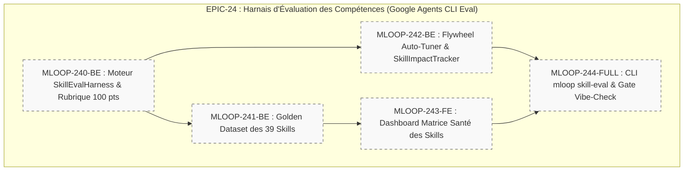

# 🏛️ Épopée — `EPIC-24-SKILLS-EVAL-HARNESS` : Harnais Industriel d'Évaluation des Compétences Agentiques (Google Agents CLI Eval Standard)

---

> **Référence d'Architecture** : [ADR-0308](../../../../standards/adr-system/0308-continuous-semantic-evaluation-harness.md) · [ADR-0202](../../../../standards/adr-system/0202-modularite-interne-agents.md) (Modularité ≤ 300L) · [ADR-0348](../../../../standards/adr-system/0348-wikiskill-ecosystem-agent-skills-consolidation.md) (WikiSkill & SkillDoctor) · [ADR-0375](../../../../standards/adr-system/0375-standard-preuve-epistemique-et-tracabilite-radicale.md) (Traçabilité Radicale) · [ADR-0376](../../../../standards/adr-system/0376-standard-rigueur-zero-blindspot-ecosysteme-mloop.md) (Rigueur 360° Zéro Blindspot)  
> **Composant(s)** : `Pipelines/SkillsEval` · `Core/SkillRegistry` · `Core/SkillImpact` · `Dashboard/Skills` · `CLI/Evals`  
> **Origine / Déclencheur** : Standardisation sur Google Agents CLI Eval & besoin stratégique d'évaluer objectivement l'intégralité des 39 compétences (.agents/skills/*) et skills Antigravity pour éliminer le Context Rot, la suractivation (trigger pollution) et les dérives comportementales.  
> **Statut** : `DONE` — 5/5 récits `DONE_TESTED` (27/27 tests verts) · Grill validé 2026-09-24 · [ADR-0389](../../../../standards/adr-system/0389-skill-eval-harness-framework.md)  
> **Décideurs** : PO mLoop / Architecte Agentique  

---

## 🎯 1. Contexte & Intention Stratégique

L'écosystème mLoop compte aujourd'hui **39 compétences déclarées** sous `.agents/skills/` ainsi que des compétences intégrées (Antigravity, OpenCode, Claude Code).
Jusqu'à présent, l'audit des compétences reposait essentiellement sur deux approches partielles :
1. **L'hygiène statique & budgétaire** via `SkillDoctor` (ADR-0348) : mesure du nombre de jetons, longueur des descriptions, contrôle du budget global (15 000 jetons max). *« Lint is a floor »*.
2. **L'évaluation des récits** via `RubberDuckEngine` et `evals.py` : orienté uniquement vers la qualité du backlog Markdown, sans tester la trajectoire d'exécution des compétences elles-mêmes.

L'objectif de cette épopée est d'industrialiser un **Harnais d'Évaluation de Compétences (Skill Eval Harness)** conforme à l'état de l'art Google Agents CLI Eval :
- Construire un **Golden Dataset de cas de test (`EvalTestCase`) pour chaque compétence** de la plateforme (cas nominaux, cas limites, cas pièges/adversariaux).
- Mettre en place la **rubrique d'évaluation 100 points dédiée aux skills** (Précision du déclencheur, Rigueur des règles, Ancrage physique vérité terrain, Résilience/Dégradation gracieuse).
- Boucler avec le **SkillAutoTuner** et le **SkillImpactTracker** pour créer une véritable boucle d'amélioration continue sans amnésie (*Eval Flywheel*).
- Exposer la santé et les scores de chaque compétence dans le **Dashboard mLoop** et dans la commande souveraine `mloop skill-eval --all`.

### Points de Friction Résolus / Objectifs Mesurables :
1. **Élimination de la Suractivation (Trigger Pollution)** : Garantir que les descriptions de compétences ne déclenchent pas d'appels intempestifs sur des requêtes non pertinentes (Anti-False-Positive).
2. **Mesure Objective de l'Efficacité (Outcome-Based)** : Vérifier que l'exécution de la compétence résout l'intention utilisateur sans inventer de routes, sans fuite de code d'implémentation et sans casser le confinement Sandbox (ADR-0379).
3. **Boucle de Non-Régression Automatique** : Tout échec d'évaluation est capturé dans `memory/evals/skills/` et consigné dans `skill_impact.jsonl` pour empêcher toute régression future.

---

## 🧭 2. Vérité Terrain & Ancrage Normatif

> En application de l'**ADR-0375** (Traçabilité Radicale) et de l'**ADR-0376** (Zéro Blindspot), cette épopée s'ancre sur les sources vérifiées suivantes :

* **Source de Référence** : `Google Agents CLI (agents-cli) — Evaluation Module & Skill Eval Flywheel`
* **Spécification Officielle** : `Agent Development Lifecycle (ADLC) — Harness Engineering & Adaptive Rubrics`
* **Dossier de Preuves Local** : `standards/adr-system/0308-continuous-semantic-evaluation-harness.md`, `standards/adr-system/0348-wikiskill-ecosystem-agent-skills-consolidation.md`, `.agents/skills/*/SKILL.md`

### Extraits Verbatim Clés :
```text
"Lint is a floor, not the goal : une compétence peut être parfaitement formatée en Markdown tout en dérivant dans des boucles de récursion inutiles ou en inventant des dépendances non documentées."
— Google Agents CLI Eval Framework Specification
```

---

## 🗺️ 3. Cartographie de l'Épopée (Story Mapping)



---

## 📋 4. Découpage en Récits Utilisateurs (Palier 1 Drafts)

| Récit ID | Rôle | Titre du Récit | Taille | Dépendances | Statut Initial | Fichier Story |
| :--- | :---: | :--- | :---: | :---: | :---: | :--- |
| **MLOOP-240-BE** | Backend | Moteur d'Évaluation Déterministe & Rubrique Sémantique 100 pts pour Compétences | `M` | - | `DRAFT` / `grill_me: PENDING` | [`MLOOP-240-BE.md`](../stories/MLOOP-240-BE.md) |
| **MLOOP-241-BE** | Backend | Référentiel Golden Datasets d'Évaluation pour les 39 Skills (`memory/evals/skills/`) | `L` | MLOOP-240-BE | `DRAFT` / `grill_me: PENDING` | [`MLOOP-241-BE.md`](../stories/MLOOP-241-BE.md) |
| **MLOOP-242-BE** | Backend | Boucle d'Amélioration Fermée (Eval Flywheel) : Couplage Auto-Tuner, Harvester & Anti-Amnésie | `M` | MLOOP-240-BE | `DRAFT` / `grill_me: PENDING` | [`MLOOP-242-BE.md`](../stories/MLOOP-242-BE.md) |
| **MLOOP-243-FE** | Frontend | Matrice Visuelle & Radar de Santé des Compétences dans le Dashboard mLoop | `M` | MLOOP-241-BE | `DRAFT` / `grill_me: PENDING` | [`MLOOP-243-FE.md`](../stories/MLOOP-243-FE.md) |
| **MLOOP-244-FULL**| Fullstack | Commande CLI `mloop skill-eval --all` & Contrôle de Vol Pré-Vol Vibe-Check | `L` | MLOOP-242-BE, MLOOP-243-FE | `DRAFT` / `grill_me: PENDING` | [`MLOOP-244-FULL.md`](../stories/MLOOP-244-FULL.md) |

---

## 🛡️ 5. Matrice d'Impacts sur les 7 Couches du Framework

| Couche | Statut | Impact Anticipé |
| :--- | :---: | :--- |
| **1. Blueprints** | 🟢 Alignée | Utilisation de `standards/blueprints/story_draft_template.md` pour tous les récits de l'épopée. |
| **2. Protocoles** | 🟡 Étendue | Formalisation du protocole d'évaluation de compétence dans `standards/protocols/SKILL_EVALUATION_PROTOCOL.md`. |
| **3. Architecture (ADR)** | 🟢 Aligné | Consolidation d'ADR-0308 et ADR-0348 vers un ADR dédié si nécessaire (`0389-skill-eval-harness-framework.md`). |
| **4. Directives Agents** | 🟢 Préservée | Respect strict du rôle `sentinel` pour la notation LLM-as-a-judge et `explorer` pour la collecte de faits. |
| **5. Skills Portables** | 🟢 Renforcée | Audit qualitatif des 39 skills sous `.agents/skills/`. |
| **6. Cœur Python** | 🟡 Étendue | Nouveaux modules sous `src/pipelines/skill_eval/` (respect strict ADR-0202 ≤ 300L). |
| **7. Tests & Validation** | 🟢 Renforcée | Suite `tests/test_skill_eval_harness.py` et intégration dans `vibe-check`. |
