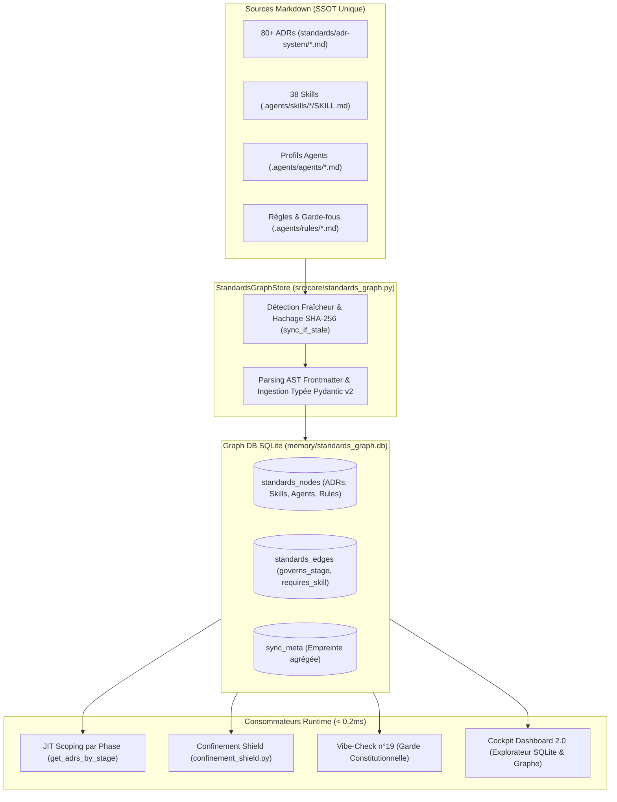

# 🏛️ Backlog Produit Rétrospectif — Épopée StandardsGraph & Portage des ADRs en Graph DB

---

> **Référence d'Architecture** : [`standards/adr-system/0379-standards-graph-and-runtime-confinement-shield.md`](file:///C:/Memory%20Loop/standards/adr-system/0379-standards-graph-and-runtime-confinement-shield.md)  
> **Changelog mLoop** : Version 2.31.0 (18-19 Septembre 2026)  
> **Composant Cœur** : `src/core/standards_graph.py` & `src/core/confinement_shield.py`  
> **Base de Données Matérialisée** : `memory/standards_graph.db` (SQLite Graph Store, WAL mode, `< 0.2ms`)  
> **Certification Pré-Vol** : Contrôle Vibe-Check n°19 (`PASS`)

---

## 🎯 Contexte & Intention Stratégique

Avant cette initiative, l'écosystème mLoop subissait une **double dérive critique** :
1. **La latence I/O et la saturation** : Parser à chaque invocation CLI plus de 80 fichiers Markdown d'ADRs, 38 compétences (`.agents/skills`) et 5 profils d'agents ralentissait l'exécution et risquait de saturer les contextes LLM avec des règles hors sujet.
2. **La dérive du double standard (Dual-SSOT Drift)** : Des constantes de cycle de vie et des listes d'outils étaient dupliquées en dur dans le code Python ou dans des fichiers intermédiaires (`standards/agents/*.toml`, `standards/adr-contracts.json`).
3. **Le risque de contournement des agents (Lazy LLMs)** : Sans confinement physique au runtime, les agents rapides contournaient les directives documentaires (écriture prématurée de code, hallucination d'outils non autorisés).

**La solution apportée** : La conservation du Markdown comme unique SSOT rédigée par l'humain et l'agent, combinée à sa **compilation instantanée en base de données graphe SQLite locale (`standards_graph.db`)** avec requêtage JIT (*Just-In-Time Scoping*) et bouclier de confinement physique au runtime.

---

## 🗺️ Cartographie de l'Épopée : `EPIC-STANDARDS-GRAPH-DB`



---

## 📋 Registre Détaillé des Récits Utilisateurs (User Stories)

---

### 1. `ST-GRAPH-001` : Schéma Relationnel & Moteur Graphe SQLite Déterministe
- **Type** : Architecture & Persistance
- **Composant** : `src/core/standards_graph.py`
- **Titre** : Moteur SQLite Central `StandardsGraphStore` et Tables de Nœuds/Arêtes
- **Description** :
  **En tant que** Système d'exécution mLoop,  
  **je veux** disposer d'une base relationnelle SQLite embarquée configurée en mode WAL avec indexation topologique,  
  **afin de** stocker les entités normatives (nœuds) et leurs relations de dépendance (arêtes) avec un temps d'accès inférieur à 0.2 milliseconde.
- **Règles d'affaires** :
  - **RM-001 Schéma Graphe Bipartite** : La table `standards_nodes` stocke les attributs complets (métadonnées JSON, empreinte SHA-256, mtime, corps markdown), et la table `standards_edges` matérialise les relations orientées avec intégrité référentielle en cascade (`ON DELETE CASCADE`).
  - **RM-002 Mode WAL & Concurrence Thread-Safe** : Activation systématique de `PRAGMA journal_mode=WAL;` et `PRAGMA busy_timeout=10000;` avec fermeture étanche via gestionnaire de contexte `with self._get_connection()`.
- **Gherkin Nominal** :
  ```gherkin
  Scénario: Initialisation et accès haute performance à la base graphe
    Étant donné le démarrage du framework mLoop
    Quand StandardsGraphStore instancie la connexion à memory/standards_graph.db
    Alors les tables standards_nodes, standards_edges et sync_meta sont créées si absentes
    Et une requête par clé primaire répond en moins de 0.2 milliseconde
  ```

---

### 2. `ST-GRAPH-002` : Synchronisation Incrémentale & Ingestion des 80+ ADRs
- **Type** : Ingestion & Traitement Sémantique
- **Composant** : `src/core/standards_graph.py`
- **Titre** : Détection de Fraîcheur par Hachage SHA-256 et Ingestion Typée des ADRs
- **Description** :
  **En tant qu'** Agent de synchronisation,  
  **je veux** détecter instantanément si les fichiers Markdown sous `standards/adr-system/` ont été modifiés via un hachage d'empreinte cumulatif,  
  **afin de** ne réindexer que les documents modifiés sans coût de relecture disque lors des exécutions stables.
- **Règles d'affaires** :
  - **RM-001 Court-Circuit à Froid (Cache-First)** : Si l'empreinte agrégée dans `sync_meta` correspond au répertoire sur disque, `sync_if_stale` sort immédiatement sans parser aucun fichier.
  - **RM-002 Contrat Typé Pydantic v2** : Chaque ADR est validé selon le modèle `ADRContract` avec extraction de ses `validation_rules`, de son domaine, de son statut et de sa phase d'application (`stage`).
- **Gherkin Nominal** :
  ```gherkin
  Scénario: Synchronisation incrémentale suite à modification d'un ADR
    Étant donné un fichier ADR mis à jour avec une nouvelle règle de validation
    Quand le store exécute sync_if_stale
    Alors le nœud correspondant dans standards_nodes est mis à jour
    Et l'empreinte aggregate_hash dans sync_meta est actualisée
  ```

---

### 3. `ST-GRAPH-003` : Topologie des Dépendances & Relations d'Arêtes Orientées
- **Type** : Graph Intelligence
- **Composant** : `src/core/standards_graph.py`
- **Titre** : Extraction Automatique des Liens `governs_stage` et `requires_skill`
- **Description** :
  **En tant qu'** Orchestrateur de gouvernance,  
  **je veux** relier automatiquement les ADRs à leurs étapes de cycle de vie et les agents à leurs compétences autorisées,  
  **afin de** naviguer dans le graphe de dépendances normatives pour valider la conformité d'exécution.
- **Règles d'affaires** :
  - **RM-001 Arêtes de Gouvernance d'Étape** : Tout ADR déclarant un `stage` distinct de `GLOBAL` génère une arête `(node_id) -[governs_stage]-> (stage:STAGE_X)`.
  - **RM-002 Arêtes d'Exigence de Compétence** : Tout profil d'agent déclarant une liste de `skills` génère les arêtes `(agent:nom) -[requires_skill]-> (skill:nom)`.
- **Gherkin Nominal** :
  ```gherkin
  Scénario: Requêtage des compétences requises par un profil agent
    Étant donné le profil de l'agent explorer déclarant ['fact-search', 'markitdown']
    Quand la méthode get_agent_skills('explorer') est invoquée
    Alors le graphe traverse les arêtes requires_skill
    Et renvoie la liste exhaustive des compétences liées sans hardcoding Python
  ```

---

### 4. `ST-GRAPH-004` : Scoping JIT des Directives & Isolation Contextuelle
- **Type** : Context Management & Performance LLM
- **Composant** : `src/core/standards_graph.py`
- **Titre** : Extraction Ciblée Just-In-Time (`get_adrs_by_stage`) par Phase Active
- **Description** :
  **En tant qu'** Agent en cours d'exécution dans une phase donnée (ex: Phase 1 INGEST),  
  **je veux** recevoir exclusivement les ADRs et règles applicables à cette phase,  
  **afin de** ne pas gaspiller de tokens de fenêtre de contexte ni risquer d'halluciner des règles propres à la Phase 3 (Build).
- **Règles d'affaires** :
  - **RM-001 Filtrage Strict de Phase** : La méthode `get_adrs_by_stage(stage)` ne renvoie que les contrats dont le champ `stage` correspond à la phase demandée ou au périmètre `GLOBAL`.
  - **RM-002 Divulgation Progressive** : Les métadonnées légères sont injectées pour l'aiguillage, et le texte intégral du body markdown n'est chargé que si l'agent sollicite une lecture explicite.
- **Gherkin Nominal** :
  ```gherkin
  Scénario: Isolation contextuelle en Phase 1 INGEST
    Étant donné une commande lancée en Phase 1 d'ingestion
    Quand le pipeline interroge StandardsGraph pour charger les règles actives
    Alors seuls l'ADR-0101, l'ADR-0378 et les ADRs globaux sont retournés
    Et les ADRs de Phase 3 (TDD, AST Tournament) sont omis du prompt
  ```

---

### 5. `ST-GRAPH-005` : Unification des Compétences & Profils d'Agents Markdown
- **Type** : Refactoring & SSOT Hygiene
- **Composant** : `src/core/standards_graph.py`, `src/core/skill_registry.py`
- **Titre** : Découverte des 38 Skills et Éradication des Fichiers `.toml`
- **Description** :
  **En tant que** Développeur et Opérateur CLI,  
  **je veux** que `python src/swarm.py skill-list` liste l'ensemble des compétences réelles documentées dans `.agents/skills/*/SKILL.md`,  
  **afin de** supprimer définitivement les doublons de configuration `.toml` et avoir un catalogue 100% découvrable.
- **Règles d'affaires** :
  - **RM-001 Zéro Dérive Markdown Unique** : Les fichiers `standards/agents/*.toml` sont supprimés. Les frontmatters YAML de `.agents/agents/*.md` contiennent tous les paramètres d'exécution (`model`, `sandbox_mode`, `allowed_write_paths`, `skills`).
  - **RM-002 Catalogue de Compétences Vivant** : Le registre `skill_registry.py` délègue sa découverte à `StandardsGraphStore.get_skills()`, garantissant la parité immédiate avec le disque.
- **Gherkin Nominal** :
  ```gherkin
  Scénario: Consultation du catalogue complet des compétences via CLI
    Étant donné 38 compétences documentées avec SKILL.md
    Quand l'utilisateur lance la commande swarm skill-list
    Alors le catalogue affiche les 38 compétences avec leurs descriptions réelles
    Et aucun dictionnaire codé en dur dans le code Python n'est utilisé
  ```

---

### 6. `ST-GRAPH-006` : Bouclier Runtime Anti-Outrepassage (*Confinement Shield*)
- **Type** : Sécurité & Gouvernance d'Exécution
- **Composant** : `src/core/confinement_shield.py`
- **Titre** : Verrous Physiques d'Appels d'Outils et Prison de Système de Fichiers
- **Description** :
  **En tant que** Sentinelle d'Intégrité du Système,  
  **je veux** intercepter physiquement les invocations de compétences et les écritures sur disque des agents,  
  **afin d'** interdire à un modèle de langage d'outrepasser ses prérogatives déclarées dans son profil d'agent.
- **Règles d'affaires** :
  - **RM-001 Tool Whitelisting Bloquant** : Si l'agent `explorer` tente d'invoquer une compétence absente de son profil (ex: `forbidden-skill-canary`), le runtime intercepte l'appel et lève une `PermissionDeniedError (Code 403)`.
  - **RM-002 Filesystem Write-Jail** : Toute tentative d'écriture hors des répertoires autorisés (`allowed_write_paths`) ou ciblant un dossier interdit (`forbidden_write_paths` comme `backlog/stories/` en Phase 1) est bloquée avec `SandboxViolationError`.
- **Gherkin Nominal** :
  ```gherkin
  Scénario: Interception bloquante d'une compétence non autorisée
    Étant donné un contexte d'exécution AgentContext('explorer')
    Quand le modèle tente d'appeler une compétence non déclarée
    Alors le bouclier ConfinementShield bloque l'appel immédiatement
    Et émet un refus 403 consigné dans les journaux d'audit
  ```

---

### 7. `ST-GRAPH-007` : Contrôle Vibe-Check n°19 & Observabilité Dashboard Cockpit
- **Type** : Observabilité & Assurance Qualité
- **Composant** : `src/pipelines/vibe_check.py`, `src/dashboard/routers/database.py`
- **Titre** : Sonde Pré-Vol Constitutionnelle et Explorateur Interactif de Base Graphe
- **Description** :
  **En tant qu'** Ingénieur QA et Observateur Système,  
  **je veux** vérifier l'intégrité de la base graphe lors du `vibe-check` et pouvoir l'inspecter visuellement dans le Dashboard Cockpit 2.0,  
  **afin de** certifier la synchronisation permanente entre les fichiers Markdown et la base SQLite.
- **Règles d'affaires** :
  - **RM-001 Contrôle Pré-Vol n°19** : Le script `vibe-check.py` valide la présence de `memory/standards_graph.db`, la concordance des empreintes de synchronisation et la réponse `< 0.2ms`.
  - **RM-002 Visualisation Cockpit SQLite** : L'API `/api/database/records?db=standards_graph.db&table=standards_nodes` permet la pagination et l'inspection de l'ensemble des nœuds et arêtes sans rupture de sécurité SQL.
- **Gherkin Nominal** :
  ```gherkin
  Scénario: Exécution du contrôle Vibe-Check n°19
    Étant donné la base standards_graph.db synchronisée
    Quand la commande python src/swarm.py vibe-check est lancée
    Alors le contrôle n°19 'Intégrité StandardsGraph & Bouclier de Confinement SSOT' affiche PASS
    Et le bilan global atteste de 19/19 contrôles validés
  ```

---

## 📊 Matrice de Traçabilité & Preuves de Test Déjà Scellées

| User Story | Fichier d'Implémentation | Lignes de Code | Suite de Tests Associée | Statut Test |
| :--- | :--- | :---: | :--- | :---: |
| **ST-GRAPH-001** | `src/core/standards_graph.py` | L112-L177 | `tests/test_standards_graph.py::test_standards_graph_initialization_and_sync` | **PASS** |
| **ST-GRAPH-002** | `src/core/standards_graph.py` | L179-L384 | `tests/test_standards_graph.py::test_standards_graph_initialization_and_sync` | **PASS** |
| **ST-GRAPH-003** | `src/core/standards_graph.py` | L373-L459 | `tests/test_standards_graph.py::test_standards_graph_agents_unification` | **PASS** |
| **ST-GRAPH-004** | `src/core/standards_graph.py` | L528-L543 | `tests/test_standards_graph.py::test_standards_graph_adrs_scoping_by_stage` | **PASS** |
| **ST-GRAPH-005** | `src/core/standards_graph.py` | L544-L560 | `tests/test_standards_graph.py::test_standards_graph_skills_discovery` | **PASS** |
| **ST-GRAPH-006** | `src/core/confinement_shield.py` | ~150L | `tests/test_standards_graph.py::test_confinement_shield_tool_whitelisting` | **PASS** |
| **ST-GRAPH-007** | `src/pipelines/vibe_check.py` | L571-L615 | `tests/test_dashboard_graph_database.py` (4/4 tests) | **PASS** |
