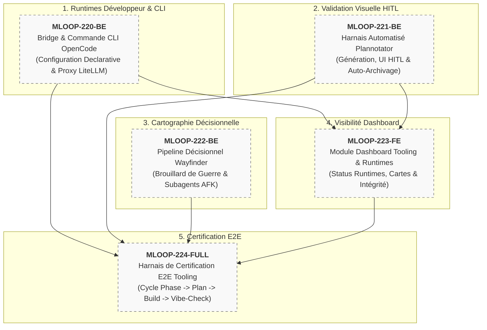

# 🏛️ Épopée — `EPIC-22-TOOLING-ECOSYSTEM-HARNESS` : Intégration Opérationnelle de l'Écosystème Tooling & Runtimes Développeur (OpenCode CLI, Harnais Plannotator, Pipeline Wayfinder)

---

> **Référence d'Architecture** : [KN-050](../../../../docs/06-knowledge/06-tooling-ecosystem/KN-050_opencode_cli_runtime.md) · [KN-051](../../../../docs/06-knowledge/06-tooling-ecosystem/KN-051_plannotator_workflow.md) · [KN-052](../../../../docs/06-knowledge/06-tooling-ecosystem/KN-052_wayfinder_fog_of_war.md) · [PHASE_FILES_AND_TEST_PLAN.md](../../../../standards/protocols/PHASE_FILES_AND_TEST_PLAN.md) · [ADR-0202](../../../../standards/adr-system/0202-modularite-interne-agents.md) (Modularité ≤ 300L) · [ADR-0370](../../../../standards/adr-system/0370-standard-cli-transverse-parite-ssot-et-decoupage-modulaire.md) (Parité CLI SSOT) · [ADR-0376](../../../../standards/adr-system/0376-standard-rigueur-zero-blindspot-ecosysteme-mloop.md) (Rigueur 360° Zéro Blindspot)  
> **Composant(s)** : CLI & Bridges (`src/commands/handlers/`, `src/bridges/`), Pipelines (`src/pipelines/`), Dashboard (`src/dashboard/routers/`), Standards (`standards/protocols/`)  
> **Origine / Déclencheur** : Rationalisation des outils de développement mLoop (Q4 2026) : création du domaine `06-tooling-ecosystem/` (KN-050, KN-051, KN-052), sanctuarisation de Plannotator sous `%LOCALAPPDATA%`, et nécessité d'un pont d'orchestration unifié sans dossiers orphelins à la racine.  
> **Statut** : `DONE` — Cadrage Macro-Grill VALIDÉ le 24/09/2026 ([ADR-014](../../../docs/01-architecture/ADR-014_epic-22_integration_operationnelle_ecosysteme_tooling.md)) — Récits livrés (`status: DONE_TESTED`)  
> **Décideurs** : Marco (Utilisateur / PO) & Antigravity (Architecte Agentique)  

---

## 🎯 1. Contexte & Intention Stratégique

La montée en puissance de l'écosystème d'ingénierie logicielle autonome de Memory Loop repose sur trois outils tiers hautement complémentaires :
1. **OpenCode CLI** : Runtime d'exécution rapide, scriptable et TUI, configurable via `opencode.json` et nativement compatible avec nos proxies LiteLLM et modèles Anthropic/Google.
2. **Plannotator** : Outil visuel interactif (HITL) d'inspection, d'annotation et d'approbation humaine des plans de phase et de test avant que les agents ne touchent au code.
3. **Wayfinder** : Méthode de cartographie décisionnelle permettant de décomposer des initiatives complexes et nébuleuses (« brouillard de guerre ») en tickets de décision avant toute tentative de spécification technique fine.

Jusqu'alors, ces outils étaient gérés de manière ad-hoc (dossiers racines orphelins comme `plannotator/` ou `output/`, invocations manuelles non standardisées). Cette épopée établit un **harnais d'intégration souverain et robuste** dans mLoop, garantissant la traçabilité radicale, l'automatisation sans régression et le respect strict du plafond modulaire de 300 lignes (ADR-0202).

### Points de Friction Résolus / Objectifs Mesurables :
1. **Éradication des répertoires orphelins à la racine** : Les plans sont confinés sous `Projects/<project>/memory/plan/` et les binaires dans l'environnement système (`%LOCALAPPDATA%\plannotator\`).
2. **Commande CLI mLoop unifiée pour OpenCode** : Pilotage direct du runtime OpenCode (`init`, `run`, `status`) avec synchronisation automatique des configurations LiteLLM/Anthropic.
3. **Pipeline Wayfinder complet** : Création et progression de cartes de décisions (`wayfinder:map`) avec répartition claire entre arbitrage humain (HITL) et recherche autonome (AFK).
4. **Visibilité Dashboard** : Vue synthétique de l'état de l'outillage et des runtimes développeur accessible dans le Dashboard mLoop.

---

## 🧭 2. Vérité Terrain & Ancrage Normatif

> En application de l'**ADR-0375** (Traçabilité Radicale) et de l'**ADR-0376** (Zéro Blindspot), cette épopée s'ancre sur les sources vérifiées suivantes :

* **Fiches de Savoir SSOT** :
  - [`docs/06-knowledge/06-tooling-ecosystem/KN-050_opencode_cli_runtime.md`](../../../../docs/06-knowledge/06-tooling-ecosystem/KN-050_opencode_cli_runtime.md)
  - [`docs/06-knowledge/06-tooling-ecosystem/KN-051_plannotator_workflow.md`](../../../../docs/06-knowledge/06-tooling-ecosystem/KN-051_plannotator_workflow.md)
  - [`docs/06-knowledge/06-tooling-ecosystem/KN-052_wayfinder_fog_of_war.md`](../../../../docs/06-knowledge/06-tooling-ecosystem/KN-052_wayfinder_fog_of_war.md)
* **Protocole Souverain de Plans** : [`standards/protocols/PHASE_FILES_AND_TEST_PLAN.md`](../../../../standards/protocols/PHASE_FILES_AND_TEST_PLAN.md)
* **Ingestion de Référence** : [`docs/00-ingested/opencode/`](../../../../docs/00-ingested/opencode/) et [`docs/00-ingested/wayfinder/`](../../../../docs/00-ingested/wayfinder/)

---

## 🗺️ 3. Cartographie de l'Épopée (Story Mapping)

---

## 📋 4. Découpage en Récits Utilisateurs (Livrés - DONE_TESTED)

| Récit ID | Rôle | Titre du Récit | Taille | Dépendances | Statut Initial | Fichier Story |
| :--- | :---: | :--- | :---: | :--- | :---: | :--- |
| **MLOOP-220-BE** | `BE` | Bridge d'Exécution & Commande CLI OpenCode (Intégration Declarative opencode.json) | `S` | Aucune | `DONE_TESTED` | [`stories/MLOOP-220-BE.md`](../stories/MLOOP-220-BE.md) |
| **MLOOP-221-BE** | `BE` | Harnais Automatisé Plannotator (Génération, Validation Visuelle HITL & Archivage Canonique) | `M` | Aucune | `DONE_TESTED` | [`stories/MLOOP-221-BE.md`](../stories/MLOOP-221-BE.md) |
| **MLOOP-222-BE** | `BE` | Pipeline Décisionnel Wayfinder (Cartographie de Décisions & Sous-Agents Asynchrones AFK) | `M` | Aucune | `DONE_TESTED` | [`stories/MLOOP-222-BE.md`](../stories/MLOOP-222-BE.md) |
| **MLOOP-223-FE** | `FE` | Module Dashboard pour l'Écosystème Tooling & Visualisation des Runtimes Développeur | `M` | `MLOOP-220-BE`, `MLOOP-221-BE` | `DONE_TESTED` | [`stories/MLOOP-223-FE.md`](../stories/MLOOP-223-FE.md) |
| **MLOOP-224-FULL**| `FULL`| Harnais de Certification E2E du Cycle Tooling (Phase -> Plan Visuel -> Build -> Vibe-Check) | `L` | Tous précédents | `DONE_TESTED` | [`stories/MLOOP-224-FULL.md`](../stories/MLOOP-224-FULL.md) |

---

## 🛡️ 5. Matrice d'Impact Transversal Zéro Blindspot (ADR-0376)

| Couche ECOSYSTEM_RIGOR | Impact Identifié | Action Prévue | Statut |
| :--- | :--- | :--- | :---: |
| **Couche 1 : Blueprints** | Format standardisé de plan et carte décisionnelle | Ancré sur `PHASE_FILES_AND_TEST_PLAN.md` et gabarits Markdown | `VALIDATED` |
| **Couche 2 : Protocoles** | Protocole d'approbation HITL et transition Phase -> Build | Formalisé dans `standards/protocols/` | `VALIDATED` |
| **Couche 3 : Architecture ADR**| Complémentarité avec ADR-0040, ADR-0100, ADR-0201, ADR-0370 | Fiches OKF KN-050 à KN-052 reliées aux ADRs actifs | `SCELLED` |
| **Couche 4 : Directives Agents**| Personas Plan et Build informés de l'étape Plannotator | Consignes dans `.agents/agents/plan.md` et `build.md` | `VALIDATED` |
| **Couche 5 : Skills Portables**| Intégration du skill `wayfinder` dans le registre portable | Référencé dans `.agents/skills/` | `VALIDATED` |
| **Couche 6 : Core Python & CLI**| Handlers sous `src/commands/handlers/` et `src/pipelines/` (≤ 300L) | Strict respect de l'ADR-0202 et validation par `code-check` | `VALIDATED` |
| **Couche 7 : Tests & Parité** | Tests unitaires sous `tests/` + Vibe-Check à 22+ PASS | Validation continue avec 0 régression (24 tests verts) | `VALIDATED` |

---

## 🏁 6. Critères de Sortie & Clôture de l'Épopée (DoD)

1. [x] Tous les 5 récits utilisateurs de l'épopée ont atteint le statut `DONE_TESTED` ou `SHIPPED`.
2. [x] Les sessions Grill-Me 1:1 ont validé chaque récit pour passage au Palier 2 (`READY_FOR_DEV`).
3. [x] Aucun dépassement modulaire (`RULE-AST-01`, plafond 300L) n'a été introduit dans le code Python.
4. [x] La suite complète des tests de non-régression est au vert (`pytest tests/`).
5. [x] Le contrôle souverain `python src/swarm.py vibe-check --project mLoop` retourne `0 FAIL`.
6. [x] La table `Projects/mLoop/backlog/sprint_backlog.md` est rigoureusement synchronisée.