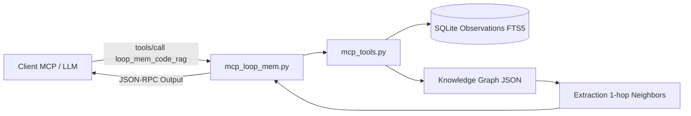

# [EPIC-2-HYBRID-MEMORY] Serveur MCP mcp_loop_mem et Recherche 1-hop (MLOOP-010-BE)

---

## Description
**En tant qu'** Agent Autonome ou Développeur interagissant avec l'écosystème mLoop via le protocole MCP,  
**je veux** disposer d'un serveur MCP stdio modulaire offrant une recherche hybride textuelle et une expansion 1-hop dans le graphe de connaissances,  
**afin d'** extraire instantanément le contexte technique et les relations immédiates d'un composant sans surcharger la fenêtre de contexte.

---

## Contexte & Périmètre

### Contexte Métier
Le pont MCP `src/bridges/mcp_loop_mem.py` permet aux assistants de développement (Claude, Gemini, etc.) d'interroger la mémoire de session SQLite FTS5 et le graphe de connaissances (Graphify). Le récit assure la conformité modulaire ADR-0202 et formalise la recherche 1-hop (`loop_mem_code_rag`) avec traversée des arêtes adjacentes.

### In-Scope
- Implémentation modulaire conforme ADR-0202 ($\le 300$ lignes par module) via `mcp_tools.py`, `mcp_resources.py` et `mcp_loop_mem.py`.
- Outil `loop_mem_search` pour l'index condensé FTS5 des observations de session.
- Outil `loop_mem_code_rag` avec expansion 1-hop (relations source -> cible et cible <- source).
- Outils de gestion de session : `loop_mem_set_project`, `loop_mem_preload_context`, `loop_mem_clear_preloaded_context`.
- Suite de tests unitaire dédiée dans `tests/test_mcp_loop_mem.py`.

### Out-of-Scope
- Implémentation du protocole d'exposition de compétences `skill://` (couvert spécifiquement par `MLOOP-011-BE`).

---

## Maquettes & Diagrammes



---

## Spécifications & Contrats d'Interface

### Endpoints & Outils MCP
- `loop_mem_search(query: str, project: str = None, type: str = None)` : Retourne un index condensé d'observations pour minimiser la consommation de jetons.
- `loop_mem_code_rag(query: str)` : Recherche sémantique de snippets de code et adjonction des 5 relations 1-hop les plus proches dans le graphe.
- `loop_mem_timeline(project: str)` : Historique chronologique des observations.

---

## Critères d'acceptation

### Règles d'affaires

- **RM-001 Modularité et Conformance AST** : Les modules MCP doivent respecter strictement ADR-0202 ($\le 300$ lignes, $\le 15$ Ko) sans aucune exception silencieuse `except Exception: pass`.
- **RM-002 Expansion 1-hop des Voisins** : L'outil `loop_mem_code_rag` doit injecter les relations directes (edges `-> (relation) -> target` ou `<- (relation) <- source`) trouvées dans le graphe de connaissances pour les nœuds correspondants.
- **RM-003 Isolation Stdio et Logging Sécurisé** : Aucun affichage non JSON-RPC ne doit transiter par `stdout`; toute trace ou avertissement est dirigé vers `sys.stderr`.

---

## Scénarios de test

```gherkin
# language: fr
Fonctionnalité: Serveur MCP mcp_loop_mem et Recherche 1-hop

  # CHEMIN NOMINAL
  Scénario: Recherche de code avec expansion 1-hop des relations
    Étant donné un graphe de connaissances contenant un nœud avec des relations sortantes
    Quand l'agent appelle l'outil loop_mem_code_rag avec une requête pertinente
    Alors la réponse contient l'extrait de code du nœud
    Et la liste des relations 1-hop associées est incluse dans le résultat

  # EXCEPTIONS & REJETS MÉTIER
  Scénario: Requête sur un outil MCP non répertorié
    Étant donné un client MCP connecté au serveur
    Quand une requête tools/call est reçue pour un outil inconnu
    Alors le serveur retourne un résultat d'erreur JSON-RPC explicite
    Et le statut isError est positionné à vrai

  # RÉSILIENCE TECHNIQUE & MODE DÉGRADÉ
  Scénario: Résilience en l'absence de fichier knowledge_graph.json
    Étant donné un projet sans graphe de connaissances précalculé
    Quand l'outil loop_mem_code_rag est exécuté
    Alors le serveur renvoie les résultats textuels disponibles sans planter
    Et l'expansion 1-hop se résout gracieusement sous forme vide

  # UX, OBSERVABILITÉ & EMPTY STATE
  Scénario: Recherche FTS5 ne retournant aucun résultat
    Étant donné une requête ne correspondant à aucune observation enregistrée
    Quand l'outil loop_mem_search est exécuté
    Alors un message d'information guidé avec astuces de correction est renvoyé
    Et le format JSON-RPC reste strictement valide
```
