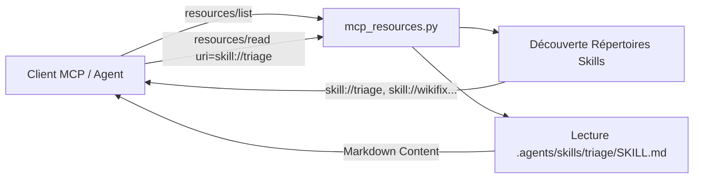

# [EPIC-2-HYBRID-MEMORY] Standard SEP-2640 et Exposition des Compétences via skill:// (MLOOP-011-BE)

---

## Description
**En tant qu'** Agent Autonome ou Environnement Hôte MCP,  
**je veux** accéder aux compétences (.agents/skills) sous forme de ressources standardisées via le schéma d'URI `skill://<skill_name>`,  
**afin de** découvrir dynamiquement le catalogue de compétences sans dépendre de chemins de fichiers rigides ou couplés à l'OS.

---

## Contexte & Périmètre

### Contexte Métier
Le standard SEP-2640 définit l'unification des compétences d'agent comme ressources MCP accessibles via le schéma d'URI `skill://`. Ce mécanisme permet à n'importe quel LLM client MCP de lister les compétences disponibles via `resources/list` et de lire leur spécification complète (`SKILL.md`) via `resources/read` avec l'URI canonique `skill://{skill_name}`.

### In-Scope
- Exposition des compétences découvertes dans `.agents/skills` et `standards/skills` via `resources/list` sous l'URI `skill://{skill_name}`.
- Résolution et lecture du fichier `SKILL.md` correspondant via `resources/read` avec le MIME type `text/markdown`.
- Outil d'assistance `read_skill` dans le catalogue des outils MCP pour accès direct par nom de compétence.
- Gestion d'erreur explicite si la compétence demandée est introuvable.
- Suite de tests unitaire dédiée dans `tests/test_mcp_loop_mem.py`.

### Out-of-Scope
- Modification des compétences physiques existantes sous `.agents/skills`.

---

## Maquettes & Diagrammes



---

## Spécifications & Contrats d'Interface

### Schéma de Ressources MCP
- URI Scheme : `skill://<skill_name>` (ex: `skill://triage`, `skill://vibe-check`).
- MIME Type : `text/markdown`.
- Contenu retourné : Le texte intégral du fichier `SKILL.md`.

---

## Critères d'acceptation

### Règles d'affaires

- **RM-001 Résolution Déterministe de l'URI skill://** : Toute requête `resources/read` ciblant une URI débutant par `skill://` doit localiser le répertoire de la compétence sous `.agents/skills` ou `standards/skills` et retourner le contenu du `SKILL.md` associé.
- **RM-002 Découverte dans resources/list** : La liste des ressources renvoyée par `resources/list` doit inclure l'ensemble des compétences valides découvertes sur le disque avec le préfixe `skill://`.
- **RM-003 Rejet Propre pour Compétence Inconnue** : Si l'identifiant de la compétence demandée ne correspond à aucun répertoire ou fichier `SKILL.md`, le serveur retourne un bloc de contenu d'erreur avec `isError: True`.

---

## Scénarios de test

```gherkin
# language: fr
Fonctionnalité: Standard SEP-2640 et Exposition des Compétences via skill://

  # CHEMIN NOMINAL
  Scénario: Lecture d'une compétence existante via son URI canonique
    Étant donné une compétence installée sous .agents/skills/triage/SKILL.md
    Quand le client MCP demande la lecture de la ressource "skill://triage"
    Alors le contenu Markdown du SKILL.md est retourné
    Et le type MIME text/markdown est spécifié

  # EXCEPTIONS & REJETS MÉTIER
  Scénario: Demande de lecture pour une compétence inexistante
    Étant donné un client demandant la ressource "skill://competence_fantome"
    Quand le serveur résout l'URI
    Alors une réponse d'erreur est renvoyée avec isError positionné à vrai
    Et un message explicite signale que la compétence est introuvable

  # RÉSILIENCE TECHNIQUE & MODE DÉGRADÉ
  Scénario: Énumération robuste lorsque aucun répertoire de skill n'est accessible
    Étant donné un environnement où les dossiers de compétences sont absents
    Quand le client invoque resources/list
    Alors la liste des ressources est retournée sans exception
    Et les ressources par défaut sont préservées

  # UX, OBSERVABILITÉ & EMPTY STATE
  Scénario: Liste exhaustive des compétences dans resources/list
    Étant donné plusieurs compétences configurées dans .agents/skills
    Quand le client exécute la commande resources/list
    Alors chaque compétence apparaît avec son URI au format skill://nom
    Et une description sommaire est attachée à chaque entrée
```
