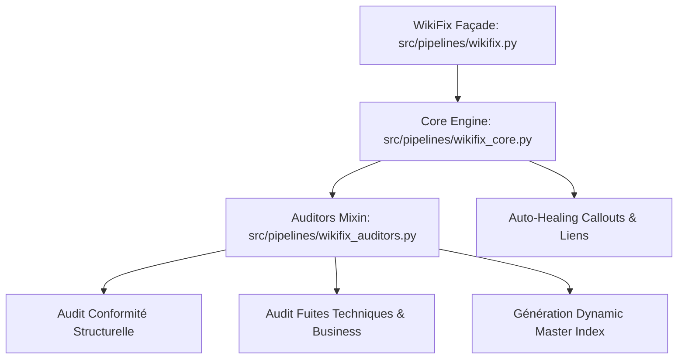

# [EPIC-3-SAFETY-GOVERNANCE] Linter Sémantique WikiFix et Découpage Modulaire Conforme ADR-0202 (MLOOP-021-BE)

---

## Description
**En tant que** Gardien de la Cohérence Sémantique et d'Hygiène du Code,  
**je veux** scinder le monolithe `src/pipelines/wikifix.py` en modules hautement cohésifs et déterministes strictement conformes à ADR-0202 ($\le 300$ lignes, $\le 15$ Ko),  
**afin de** garantir la maintenabilité, l'élimination des exceptions silencieuses (`RULE-AST-04`) et la pérennité de l'audit continu de la base documentaire.

---

## Contexte & Périmètre

### Contexte Métier
Le composant `WikiFix` est le moteur central d'audit sémantique (Système 1) chargé de l'auto-healing des callouts, de la résolution des liens brisés, du repérage des orphelins et de la conformité INVEST du backlog. Avec le temps, son implémentation unique a dépassé 1 000 lignes, introduisant des captures d'exceptions génériques (`except Exception: pass`) et une violation de la règle `RULE-AST-01`.

### In-Scope
- Refactorisation modulaire de `wikifix.py` en :
  - `src/pipelines/wikifix_auditors.py` ($\le 290$ lignes) : mixin d'audit (conformité structurelle, exclusions métier, fuites techniques, master index).
  - `src/pipelines/wikifix_core.py` ($\le 270$ lignes) : classe principale `WikiFixAgent`, boucle d'exécution décomposée et auto-healing.
  - `src/pipelines/wikifix.py` ($\le 30$ lignes) : façade d'import rétrocompatible.
- Remplacement systématique de tous les `except Exception: pass` par du logging de debug explicite (`RULE-AST-04`).
- Banc de tests unitaire dédié dans `tests/test_wikifix.py`.

### Out-of-Scope
- Modification des contrats de retour de `WikiFixAgent.execute()`.
- Altération des règles d'exclusion dynamique RHO ou de la grammaire Gherkin.

---

## Maquettes & Diagrammes



---

## Spécifications & Contrats d'Interface

### Endpoints & Classes Backend
- `WikiFixAgent` : Classe d'orchestration exposant la méthode publique `execute(state: LoopState, verbose: bool = False, story_filter: str = None) -> LoopState`.
- `WikiFixAuditMixin` : Classe mère regroupant les audits déterministes.
- `os_relative_path(from_dir: Path, to_file: Path) -> str` : Utilitaire de calcul de chemin relatif normalisé POSIX.

---

## Critères d'acceptation

### Règles d'affaires

- **RM-001 Modularité et Taille Conforme ADR-0202** : Chaque module résultant (`wikifix_core.py`, `wikifix_auditors.py`, `wikifix.py`) doit contenir strictement moins de 300 lignes de code et ne comporter aucune violation de linter AST.
- **RM-002 Préservation Complète de l'Auto-Healing** : La correction automatique des callouts Obsidian (`[!note]` vers `[!NOTE]`) et la résolution des liens relatifs brisés via `basename_map` doivent demeurer fonctionnellement identiques.
- **RM-003 Traçabilité des Erreurs et Zéro Exception Silencieuse** : Aucune clause `except Exception: pass` n'est tolérée; chaque capture doit être tracée via `logger.debug` avec information d'exception.

---

## Scénarios de test

```gherkin
# language: fr
Fonctionnalité: Linter Sémantique WikiFix et Découpage Modulaire

  # CHEMIN NOMINAL
  Scénario: Exécution complète de l'audit et auto-healing des callouts
    Étant donné un projet avec des fichiers markdown contenant des callouts minuscules
    Quand WikiFixAgent exécute l'audit sémantique
    Alors les callouts sont automatiquement normalisés en majuscules standard
    Et le rapport d'audit wikifix_report.md est généré sans erreur

  # EXCEPTIONS & REJETS MÉTIER
  Scénario: Détection bloquante de non-conformité structurelle INVEST
    Étant donné un fichier de story sans section Scénarios de test
    Quand WikiFixAgent valide la conformité du backlog
    Alors une violation INVEST est consignée dans les échecs structurels
    Et le linter émet une alerte bloquante

  # RÉSILIENCE TECHNIQUE & MODE DÉGRADÉ
  Scénario: Résilience lors d'erreurs I/O avec traçabilité explicite
    Étant donné un fichier corrompu ou illisible dans les répertoires scannés
    Quand la boucle d'audit inspecte les fichiers
    Alors l'erreur de lecture est journalisée sans écrasement silencieux
    Et l'audit continue sur les fichiers restants

  # UX, OBSERVABILITÉ & EMPTY STATE
  Scénario: Traitement gracieux d'un projet sans fichiers markdown
    Étant donné un projet vierge ne contenant aucun document markdown
    Quand WikiFixAgent est déclenché
    Alors un message informatif est consigné
    Et l'état du projet est retourné intact
```
