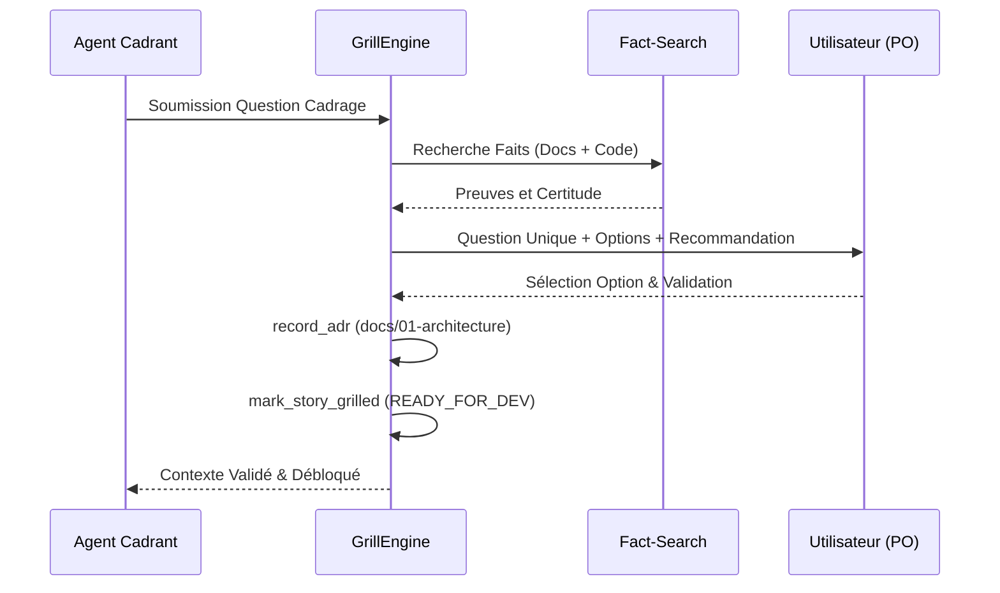

# [EPIC-4-SKILL-ECOSYSTEM] Protocole Grill with Docs à Question Unique et Recommandation (MLOOP-030-BE)

---

## Description
**En tant qu'** Agent Cadrant ou Product Owner Technique de Phase 2,  
**je veux** soumettre les ambiguïtés et choix d'architecture via un protocole strict d'interrogatoire à question unique doté d'options typées et d'une recommandation explicite,  
**afin d'** aligner les décisions techniques avec la documentation existante (Fact-Search) et sceller les arbitrages dans des ADRs traçables sans saturer l'attention humaine.

---

## Contexte & Périmètre

### Contexte Métier
Le protocole *Grill with Docs* (ADR-0302, ADR-0320) régit la phase d'analyse critique préalable au développement. Il interdit le "spray and pray" de questions multiples en forçant une seule question focalisée par tour d'échange, enrichie des faits vérifiés par le moteur `Fact-Search` et d'une recommandation argumentée.

### In-Scope
- Moteur d'interrogatoire `GrillEngine` dans `src/pipelines/grill_engine.py`.
- Validation préalable des faits via recherche documentaire et code source (`_search_code_source`).
- Graduation de la certitude épistémique (`_grade_certainty`).
- Enregistrement automatique des ADRs validés (`record_adr`) sous `docs/01-architecture/`.
- Marquage déterministe du statut des récits cadrés (`mark_story_grilled`).
- Suite de tests unitaire dédiée dans `tests/test_grill_engine.py`.

### Out-of-Scope
- Interface graphique Web de Grill-me (couverte par le Dashboard d'observabilité).

---

## Maquettes & Diagrammes



---

## Spécifications & Contrats d'Interface

### Classes & Méthodes Backend
- `GrillEngine(project_path: Path)` : Moteur d'exécution de l'interrogatoire.
- `search_facts(query: str) -> List[Dict[str, Any]]` : Recherche documentaire et code préalable.
- `record_adr(title: str, context: str, decision: str, positives: str, negatives: str) -> Path` : Génération du fichier ADR.
- `mark_story_grilled(story_id: str)` : Mutation de statut du récit vers l'état prêt pour développement.

---

## Critères d'acceptation

### Règles d'affaires

- **RM-001 Règle de la Question Unique** : Chaque tour d'interrogatoire ne doit formuler qu'une seule question d'architecture, assortie de 2 à 4 options mutuellement exclusives et d'une recommandation explicite débutant par `(Recommended)`.
- **RM-002 Traçabilité Déterministe Fact-Search** : Toute consultation préalable doit être consignée dans le fichier journal `memory/fact_search_log.jsonl` avec le niveau de certitude épistémique associé.
- **RM-003 Génération Formelle d'ADR** : Chaque décision validée lors d'une session de clarification doit générer un fichier ADR officiel numéroté dans `docs/01-architecture/`.

---

## Scénarios de test

```gherkin
# language: fr
Fonctionnalité: Protocole Grill with Docs à Question Unique et Recommandation

  # CHEMIN NOMINAL
  Scénario: Validation d'un choix d'architecture avec génération d'ADR
    Étant donné une question de cadrage validée par l'utilisateur
    Quand GrillEngine consigne la décision d'architecture
    Alors un fichier ADR conforme est créé sous docs/01-architecture
    Et le statut du récit associé est mis à jour vers READY_FOR_DEV

  # EXCEPTIONS & REJETS MÉTIER
  Scénario: Absence de génération d'ADR si aucune décision n'est arrêtée
    Étant donné un échange informatif sans choix d'architecture tranché
    Quand la méthode de consignation est sollicitée sans contenu décisionnel
    Alors aucun fichier ADR orphelin n'est créé sur le disque
    Et le système signale l'absence de décision formelle

  # RÉSILIENCE TECHNIQUE & MODE DÉGRADÉ
  Scénario: Recherche Fact-Search infructueuse sans blocage du cadrage
    Étant donné un sujet totalement inédit absent de la documentation et du code
    Quand le Fact-Search est déclenché par le moteur Grill
    Alors la certitude épistémique est évaluée à NONE
    Et la question est légitimement qualifiée d'arbitrage Product Owner

  # UX, OBSERVABILITÉ & EMPTY STATE
  Scénario: Journalisation systématique des requêtes Fact-Search
    Étant donné une invocation de la recherche préalable de faits
    Quand GrillEngine analyse les sources physiques
    Alors une entrée JSONL est ajoutée dans fact_search_log.jsonl
    Et les sources candidates sont listées avec leurs identifiants
```
