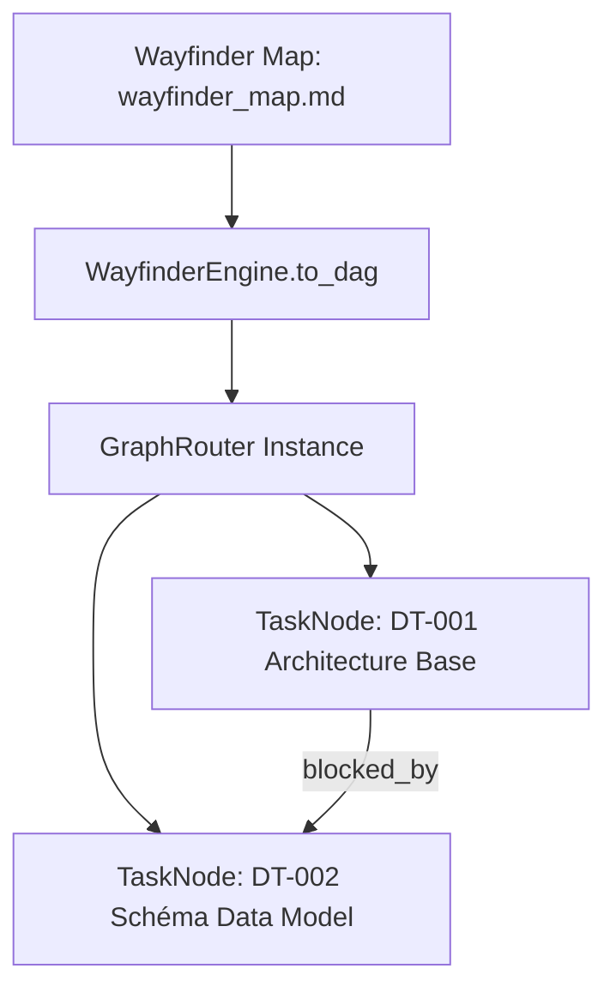

# [EPIC-4-SKILL-ECOSYSTEM] Compétence Wayfinder et Exploration Multi-Chemins via DAG (MLOOP-031-BE)

---

## Description
**En tant qu'** Agent Explorateur ou Architecte Système en situation d'incertitude initiale,  
**je veux** cartographier les tickets de décision et les dépendances bloquantes au sein d'une carte d'initiative convertible en DAG (`to_dag`),  
**afin d'** ordonnancer déterministement la levée du brouillard et acheminer l'exécution vers les agents appropriés via `GraphRouter`.

---

## Contexte & Périmètre

### Contexte Métier
Face à des initiatives complexes où les choix d'architecture s'entrecroisent, le composant `WayfinderEngine` structure les tickets de décision sous forme d'une carte markdown persistante (`backlog/wayfinder_map.md`). Il permet de convertir cette carte en un graphe orienté acyclique (DAG) de `TaskNode` ordonnancés selon leurs prérequis (`blocked_by`).

### In-Scope
- Moteur `WayfinderEngine` dans `src/pipelines/wayfinder.py`.
- Initialisation et persistance de la carte `backlog/wayfinder_map.md` (`init_map`).
- Parsing des tickets et conversion dynamique en graphe exécutable `GraphRouter` (`to_dag`).
- Assignation contextuelle des catégories et niveaux de risque des nœuds de tâche.
- Suite de tests unitaire dédiée dans `tests/test_wayfinder.py`.

### Out-of-Scope
- Exécution distribuée multi-serveurs du DAG (gérée par le runtime Swarm).

---

## Maquettes & Diagrammes



---

## Spécifications & Contrats d'Interface

### Classes & Méthodes Backend
- `WayfinderEngine(project_path: Path)` : Constructeur lié au répertoire projet.
- `init_map(initiative_name: str) -> Path` : Initialisation idempotente de la carte.
- `to_dag(initiative_name: str) -> GraphRouter` : Conversion en graphe orienté acyclique.

---

## Critères d'acceptation

### Règles d'affaires

- **RM-001 Idempotence de l'Initialisation de Carte** : L'appel à `init_map` ne doit pas écraser une carte existante; elle doit être préservée si le fichier `wayfinder_map.md` existe déjà.
- **RM-002 Résolution Exacte des Dépendances DAG** : La conversion `to_dag` doit extraire fidèlement les identifiants de tickets et peupler les listes `blocked_by` de chaque `TaskNode`.
- **RM-003 Qualification Automatique du Risque** : Tout ticket dont le titre fait référence à un 'ADR' ou une 'Règle' doit être qualifié avec un niveau de risque élevé (`RiskLevel.HIGH`).

---

## Scénarios de test

```gherkin
# language: fr
Fonctionnalité: Compétence Wayfinder et Exploration Multi-Chemins via DAG

  # CHEMIN NOMINAL
  Scénario: Conversion d'une carte de tickets en graphe DAG ordonné
    Étant donné une carte Wayfinder contenant deux tickets dépendants DT-1 et DT-2
    Quand le moteur invoque la méthode to_dag
    Alors une instance de GraphRouter est retournée avec les 2 nœuds configurés
    Et le nœud DT-2 possède le blocage déclaré vers DT-1

  # EXCEPTIONS & REJETS MÉTIER
  Scénario: Évaluation du risque élevé sur tickets critiques
    Étant donné un ticket de décision titré "Choix de l'ADR de Persistance"
    Quand le ticket est transformé en TaskNode
    Alors son niveau de risque est qualifié à HIGH

  # RÉSILIENCE TECHNIQUE & MODE DÉGRADÉ
  Scénario: Conversion sécurisée en l'absence de fichier wayfinder_map.md
    Étant donné un projet sans carte Wayfinder matérialisée
    Quand la méthode to_dag est exécutée
    Alors un GraphRouter vide est retourné sans lever d'exception

  # UX, OBSERVABILITÉ & EMPTY STATE
  Scénario: Initialisation initiale d'une nouvelle carte d'initiative
    Étant donné un projet vierge sans fichier wayfinder_map.md
    Quand init_map est invoqué avec le nom de l'initiative
    Alors le fichier markdown est créé avec la structure et les callouts de base
```
