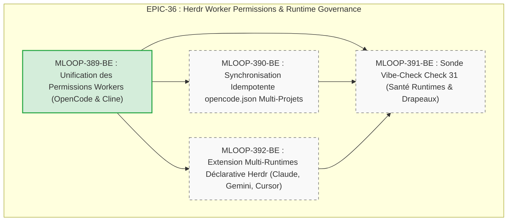

# 🏛️ Épopée — `EPIC-36-HERDR-WORKER-PERMISSIONS-AND-RUNTIME-GOVERNANCE` : Gouvernance & Unification des Permissions des Workers Herdr, Auto-Approbation Zéro-Blindspot & Runtimes Multi-Agents

---

> **Référence d'Architecture** : [ADR-0389](../../../../standards/adr-system/0389-worker-permissions-zero-blindspot.md) (Gouvernance Permissions Workers Herdr) · [ADR-0029](../../../../standards/adr-system/0029-herdr-agent-runtime-integration.md) (Intégration Runtime Herdr) · [ADR-0205](../../../../standards/adr-system/0205-herdr-subagent-lifecycle-context-isolation.md) (Isolation Contexte Sous-Agents) · [ADR-0346](../../../../standards/adr-system/0346-specialized-agent-delegation-gates.md) (Portes de Délégation Spécialisées) · [ADR-0376](../../../../standards/adr-system/0376-standard-rigueur-zero-blindspot-ecosysteme-mloop.md) (Rigueur 360° Zéro Blindspot) · [ADR-0377](../../../../standards/adr-system/0377-runtimes-agents-aval-et-herdr-operationnels.md) (Runtimes Aval & Herdr) · [ADR-0202](../../../../standards/adr-system/0202-modularite-interne-agents.md) (Modularité ≤ 300L)  
> **Composant(s)** : `Core/WorkerRuntimes` · `Core/HerdrWorkerCore` · `Pipelines/Delegation` · `Pipelines/VibeCheck` · `Commands/Sync` · `Standards/Blueprints`  
> **Origine / Déclencheur** : Découverte d'un angle mort critique lors du spawn de workers OpenCode et Cline via `herdr.exe` v0.8.2 :
> 1. OpenCode 1.18.30 démarrait sans drapeau d'auto-approbation valide (`--yolo` est inexistant dans cette version, le flag officiel étant `--auto`), et sous la persona par défaut `orchestrator` qui requiert une confirmation interactive pour chaque édition de fichier (`edit: ask`).
> 2. Cline 3.0.65 démarrait dans les sous-volets PTY sans le drapeau `--auto-approve true`, déclenchant l'invite `[act mode] execute command? yes / no` et faisant basculer l'agent en état `blocked` dans la table de détection interne de Herdr (`tool_permission`).
> 3. L'exécution de commandes transverses (`python src/swarm.py resume`) depuis le répertoire d'un sous-projet (`Projects/<nom>`) déclenchait la barrière de sécurité `external_directory: ask` d'OpenCode, gelant le terminal en attente d'une touche `Enter`.
> **Statut** : `OPEN` — Récits Palier 1 (`MLOOP-389-BE` certifié QA, 3 récits en `status: DRAFT`)  
> **Décideurs** : Marco (PO) / Architecte Agentique  

---

## 🎯 1. Contexte & Intention Stratégique

L'architecture mLoop repose sur un paradigme de délégation massive et asynchrone : l'orchestrateur central distribue les récits et tâches de build à des sous-agents autonomes s'exécutant dans des terminaux PTY multiplexés par **Herdr**. Pour que cette délégation soit véritablement autonome (*unattended*), aucun sous-agent ne doit jamais se trouver bloqué en attente d'une interaction humaine pour accorder un droit de lecture, d'écriture ou d'exécution d'outil.

Cette épopée unifie la gouvernance complète des permissions et du cycle de vie des workers :
1. **Éradication des Blocages Terminaux PTY** : Assurer que chaque worker spawned (OpenCode, Cline) dispose des arguments déterministes d'auto-approbation et des personas adéquates dès sa naissance (`MLOOP-389-BE`).
2. **Harmonisation Rétroactive du Parc Multi-Projets** : Mettre à niveau les configurations `opencode.json` de tous les projets existants pour éliminer la barrière d'accès aux répertoires externes (`external_directory`) (`MLOOP-390-BE`).
3. **Surveillance Continue & Barrière Anti-Régression** : Intégrer une sonde dynamique dédiée dans le harnais Vibe-Check (Check 31) pour certifier l'intégrité des configurations et des drapeaux avant et pendant l'exécution (`MLOOP-391-BE`).
4. **Ouverture Multi-Runtimes Déclarative** : Étendre le registre `WORKER_RUNTIMES` aux agents émergents (Claude Code, Gemini CLI, Cursor CLI, Codex) avec leurs sémantiques propres de contournement d'invites (`MLOOP-392-BE`).

---

## 🧭 2. Vérité Terrain & Ancrage Normatif

> En application de l'**ADR-0375** (Traçabilité Radicale) et de l'**ADR-0376** (Zéro Blindspot), cette épopée s'ancre sur les sources vérifiées suivantes :

* **Binaire Herdr v0.8.2** (`herdr.exe`) :
  - Détection binaire native des prompts bloquants via deux heuristiques internes :
    - `opencode_permission` : patterns `"Permission required"`, `"esc dismiss"`, `"enter confirm"`.
    - `tool_permission` : patterns `"let cline use this tool"`, `"[act mode] execute command? yes"`, `"[plan mode] use this tool? yes"`.
* **Binaires et CLIs Cibles** :
  - OpenCode 1.18.30 : flags officiels `--auto` (auto-approbation), `--agent <name>` (sélection persona).
  - Cline 3.0.65 : flag officiel `--auto-approve true`, `--plan` (mode plan).
* **Codebase Source Locale mLoop** :
  - Registre central des runtimes : [`src/core/worker_runtimes.py`](src/core/worker_runtimes.py)
  - Mixin de spawn et cycle de vie : [`src/core/herdr_worker_core.py`](src/core/herdr_worker_core.py)
  - Configuration racine OpenCode : [`opencode.json`](opencode.json)
  - Blueprint de projet : [`standards/blueprints/project_opencode_template.json`](standards/blueprints/project_opencode_template.json)
  - Générateur de configuration de projet : [`src/commands/handlers/opencode.py`](src/commands/handlers/opencode.py)
  - Gardien de conformité : [`src/pipelines/vibe_check/`](src/pipelines/vibe_check/)

---

## 🗺️ 3. Cartographie de l'Épopée (Story Mapping)

---

## 📋 4. Liste Détaillée des Récits

| Récit | Composant | Titre | Statut | Estimation |
| :--- | :--- | :--- | :---: | :---: |
| **MLOOP-389-BE** | `Core/WorkerRuntimes` | Gouvernance & Unification des Permissions des Workers Herdr (OpenCode & Cline) | 🟢 `QA_CERTIFIED` | 6/6 INVEST |
| **MLOOP-390-BE** | `Commands/Sync` | Migration & Synchronisation Idempotente des Permissions `opencode.json` Multi-Projets | ⚪ `DRAFT` | 6/6 INVEST |
| **MLOOP-391-BE** | `Pipelines/VibeCheck` | Sonde Vibe-Check Check 31 (Audit Dynamique de Santé des Permissions & Runtimes Workers) | ⚪ `DRAFT` | 6/6 INVEST |
| **MLOOP-392-BE** | `Core/WorkerRuntimes` | Extension Multi-Runtimes Déclarative Herdr (Claude Code, Gemini CLI, Cursor CLI, Codex) | ⚪ `DRAFT` | 6/6 INVEST |

---

## 🛡️ 5. Critères de Clôture & Définition de Terminé (DoD) de l'Épopée

1. **Zéro Agent Bloqué en Unattended** : Aucun worker OpenCode, Cline ou tiers ne doit s'arrêter dans l'état `blocked` suite à une invite de permission interactive.
2. **Couverture Intégrale des Projets** : 100% des fichiers `opencode.json` sous `Projects/` sont conformes au standard de permissions sans régression sur la sécurité locale.
3. **Sonde Vibe-Check Opérationnelle** : La sonde Check 31 est exécutée dans le pré-vol standard et bloque toute tentative de mise en production avec des flags obsolètes ou mal configurés.
4. **Plafond Modulaire Respecté** : Chaque fichier implémenté ou modifié respecte strictement la limite de 300 lignes de code (ADR-0202).
