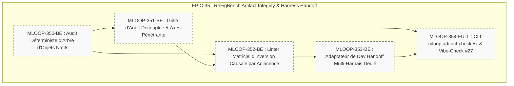

# 🏛️ Épopée — `EPIC-35-REFIGBENCH-ARTIFACT-HARNESS-V2` : Audit d'Artefacts 5-Axes, Détection d'Inversion Causale & Handoff Multi-Harnais

---

> **Référence d'Architecture** : [ADR-0396](../../../../standards/adr-system/0396-audit-artefacts-5-axes-et-anti-inversion-causale-refigbench.md) (Proposé) · [ADR-0392](../../../../standards/adr-system/0392-harnais-fidelite-visuelle-integrite-artefacts-topologiques.md) (Standard Topologique Artefacts v1) · [ADR-0202](../../../../standards/adr-system/0202-modularite-interne-agents.md) (Modularité ≤ 300L) · [ADR-0375](../../../../standards/adr-system/0375-standard-preuve-epistemique-et-tracabilite-radicale.md) (Traçabilité Radicale) · [ADR-0376](../../../../standards/adr-system/0376-standard-rigueur-zero-blindspot-ecosysteme-mloop.md) (Rigueur 360° Zéro Blindspot) · [ADR-0377](../../../../standards/adr-system/0377-runtimes-agents-aval-et-herdr-operationnels.md) (Runtimes Aval & Herdr) · [ADR-0394](../../../../standards/adr-system/0394-tracabilite-bidirectionnelle-code-exigences-preuves-programmation-ast.md) (EvidencePack 2.0)  
> **Composant(s)** : `Pipelines/Audit` · `Pipelines/Connectors` · `Pipelines/Handoff` · `Tools/Archify` · `QA/VibeCheck`  
> **Origine / Déclencheur** : Étude scientifique de référence **ReFigBench: Benchmarking Scientific Figure Reconstruction as Editable PowerPoint Artifacts** (*arXiv:2609.18844*, Septembre 2026) :
> 1. Découplage complet de l'évaluation à travers un **Rubric 5-Axes** calibré ($T_{20} + S_{30} + L_{15} + E_{25} + V_{10}$) séparant formellement l'exactitude textuelle, la structure sémantique, la géométrie spatiale, l'éditabilité native et les détails visuels.
> 2. Démonstration de l'illusion cosmétique et de l'**inversion causale silencieuse** : des schémas graphiquement parfaits avec flèches de dépendances complètement inversées (Figure 6 de ReFigBench).
> 3. Confirmation que les workflows spécialisés éliminent 91% à 100% des connecteurs relationnels natifs au profit de formes dessinées statiques non manipulables.
> 4. Démonstration de la primauté du Harnais (*Harness Primacy*) sur le retour sur investissement d'un même modèle selon la structure d'outils et de prompts fournie.  
> **Statut** : `OPEN` — Récits Palier 1 (`status: DRAFT`, `grill_me: PENDING`)  
> **Décideurs** : Marco (PO) / Architecte Agentique  

---

## 🎯 1. Contexte & Intention Stratégique

L'épopée **EPIC-30** (initiée via l'ADR-0392) a posé les premiers jalons d'intégrité visuelle dans mLoop (barrière binaire anti-raster $g(P) \in \{0, 1\}$, anti-connector collapse basique, moisson ORBIT). Cependant, l'étude ReFigBench fournit une armature conceptuelle et empirique beaucoup plus profonde qui reste à déployer :

1. **Remplacer la formule 2-variables simplifiée** de `src/pipelines/audit_decoupler.py` par le **Rubric Standard 5-Axes ReFigBench** calibré sur 100 points, garantissant une décomposition analytique fine de la qualité des livrables d'architecture (Archify IR, SVG, Canvas).
2. **Détecter mécaniquement l'inversion causale de flux** : comparer formellement la matrice d'adjacence dirigée théorique du code/spécifications ($\mathbf{A}_{\text{spec}}$) avec la matrice d'adjacence observée sur le diagramme ($\mathbf{A}_{\text{diag}}$) pour interdire tout contresens d'architecture logicielle.
3. **Auditer l'arbre d'objets natifs** : interdire le remplacement de connecteurs relationnels vivants par des formes libres ou des lignes décoratives inertes.
4. **Optimiser le Universal Dev Handoff selon la Doctrine du Harnais** : adapter la structuration des artefacts transmis aux agents avals (Claude Code vs OpenCode vs Codex vs Cursor) afin d'éviter qu'ils ne simplifient ou n'écrasent la sémantique modulaire.

---

## 🧭 2. Vérité Terrain & Ancrage Normatif

> En application de l'**ADR-0375** (Traçabilité Radicale) et de l'**ADR-0376** (Zéro Blindspot), cette épopée s'ancre sur les sources vérifiées suivantes :

* **Publication Scientifique** : *ReFigBench: Benchmarking Scientific Figure Reconstruction as Editable PowerPoint Artifacts* (arXiv:2609.18844, 2026).
* **Codebase Source Locale mLoop** :
  * Porte d'artefacts déterministe : [`src/pipelines/artifact_gate.py`](src/pipelines/artifact_gate.py)
  * Validation des connecteurs : [`src/pipelines/connector_validator.py`](src/pipelines/connector_validator.py)
  * Grille d'audit découplée : [`src/pipelines/audit_decoupler.py`](src/pipelines/audit_decoupler.py)
  * Générateur de Dev Handoff : [`src/pipelines/handoff.py`](src/pipelines/handoff.py)
  * Sonde Check 27 Vibe-Check : [`src/pipelines/vibe_check.py`](src/pipelines/vibe_check.py)

---

## 🗺️ 3. Cartographie de l'Épopée (Story Mapping)

---

## 📋 4. Découpage en Récits Utilisateurs (Palier 1 Drafts)

| Récit ID | Rôle | Titre du Récit | Taille | Dépendances | Statut Initial | Fichier Story |
| :--- | :---: | :--- | :---: | :--- | :---: | :--- |
| **`MLOOP-350-BE`** | `BE` | Moteur d'Audit Déterministe d'Arbre d'Objets Natifs pour Livrables d'Architecture | `M` | Aucune | `DRAFT` (Palier 1) | [`stories/MLOOP-350-BE.md`](../stories/MLOOP-350-BE.md) |
| **`MLOOP-351-BE`** | `BE` | Grille d'Audit Découplée 5-Axes Pénétrante ($T_{20} + S_{30} + L_{15} + E_{25} + V_{10}$) | `M` | `MLOOP-350-BE` | `DRAFT` (Palier 1) | [`stories/MLOOP-351-BE.md`](../stories/MLOOP-351-BE.md) |
| **`MLOOP-352-BE`** | `BE` | Linter Matriciel d'Inversion Causale par Comparaison d'Adjacence ($\mathbf{A}_{\text{spec}} \text{ vs } \mathbf{A}_{\text{diag}}$) | `M` | `MLOOP-350-BE`, `MLOOP-351-BE` | `DRAFT` (Palier 1) | [`stories/MLOOP-352-BE.md`](../stories/MLOOP-352-BE.md) |
| **`MLOOP-353-BE`** | `BE` | Adaptateur de Dev Handoff Multi-Harnais Dédié (Claude Code, OpenCode, Codex, Cursor) | `M` | `MLOOP-351-BE` | `DRAFT` (Palier 1) | [`stories/MLOOP-353-BE.md`](../stories/MLOOP-353-BE.md) |
| **`MLOOP-354-FULL`** | `FULL`| Extension CLI `mloop artifact-check --rubric-5x`, Enrichissement Vibe-Check Check 27 & Preuves EvidencePack 2.0 | `L` | Tous précédents | `DRAFT` (Palier 1) | [`stories/MLOOP-354-FULL.md`](../stories/MLOOP-354-FULL.md) |

---

## 🛡️ 5. Matrice d'Impact en 7 Couches Zéro Blindspot (ADR-0376)

1. **Blueprints / Standards** : Enrichissement des critères de validation de livrables d'architecture sous `standards/blueprints/`.
2. **Protocols** : Formalisation du protocole d'audit 5-axes dans `standards/protocols/ECOSYSTEM_RIGOR_PROTOCOL.md`.
3. **ADR System** : Référencement de l'**ADR-0396** (Audit 5-Axes & Inversion Causale par Adjacence).
4. **Directives Agents** : Consignes explicites aux agents avals sur la conservation impérative des connecteurs natifs et la non-inversion de flux.
5. **Skills Portables** : Extension du skill `archify` et de l'outil `drawdb` pour extraire automatiquement les matrices d'adjacence.
6. **Code (`src/` & `tools/`)** : Extension de `src/pipelines/audit_decoupler.py`, `src/pipelines/connector_validator.py` et `src/pipelines/handoff.py` (respect strict du plafond modulaire ≤ 300L, `RULE-AST-01`).
7. **Tests & Vibe-Check** : Enrichissement de `tests/test_artifact_harness.py` et mise à niveau du Check 27 dans `vibe-check.py`.

---

## 🏁 6. Critères de Sortie & Clôture de l'Épopée (DoD)

1. [ ] Les 5 récits utilisateurs ont atteint le statut `DONE_TESTED` ou `SHIPPED`.
2. [ ] Le rubric 5-axes calcule de façon déterministe les notes partielles $T, S, L, E, V$ sur tout schéma SVG / Archify / Canvas.
3. [ ] Tout schéma présentant une inversion causale par rapport au code AST ou aux specs déclenche immédiatement `CAUSAL_FLOW_INVERSION_DETECTED` avec note $S=0$.
4. [ ] L'arbre d'objets natifs détecte et rejette tout schéma remplaçant les connecteurs relationnels par des formes libres (`CONNECTOR_COLLAPSE_DETECTED`).
5. [ ] Les bundles de handoff générés pour Claude Code, OpenCode et Codex intègrent les garde-fous spécifiques à leur harnais.
6. [ ] Aucun dépassement modulaire (`RULE-AST-01`, plafond 300L) n'est présent.
7. [ ] La suite de tests de non-régression est au vert (`pytest tests/`).
