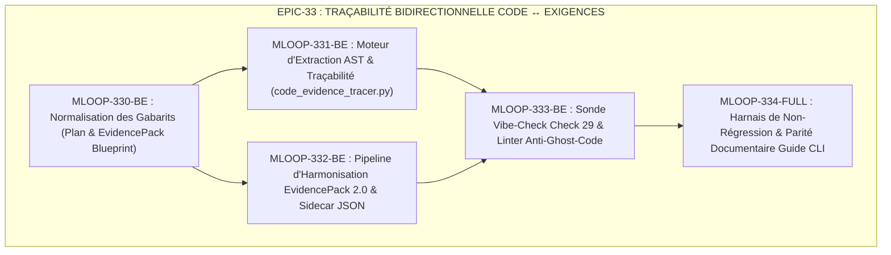

# 🏛️ Épopée — `EPIC-33-REQUIREMENT-TO-CODE-TRACEABILITY-AND-CODE-EVIDENCE` : Traçabilité Bidirectionnelle Code ↔ Exigences, Preuves de Programmation AST & EvidencePack 2.0

---

> **Référence d'Architecture** : [ADR-0394](../../../../standards/adr-system/0394-tracabilite-bidirectionnelle-code-exigences-preuves-programmation-ast.md) · [ADR-0320](../../../../standards/adr-system/0320-grill-me-frontier-design-tree-alignment.md) · [ADR-0326](../../../../standards/adr-system/0326-fact-search-and-substantive-content-review.md) · [ADR-0369](../../../../standards/adr-system/0369-standards-robustesse-python-senior.md) · [ADR-0375](../../../../standards/adr-system/0375-orchestration-canonique-5-phases-cycle-de-vie.md) · [ADR-0376](../../../../standards/adr-system/0376-standard-rigueur-zero-blindspot-ecosysteme-mloop.md) (Rigueur 360° Zéro Blindspot) · [ADR-0391](../../../../standards/adr-system/0391-harmonisation-cycle-de-vie-recits-5-phases-fsm.md) · [ECOSYSTEM_RIGOR_PROTOCOL.md](../../../../standards/protocols/ECOSYSTEM_RIGOR_PROTOCOL.md)  
> **Composant(s)** : `Standards/Blueprints` · `Core/AST` · `Pipelines/EvidencePack` · `QA/VibeCheck` · `Tests/Traceability`  
> **Origine / Déclencheur** : Besoin fondamental d'ingénierie et d'auditabilité formulé en session le 25/09/2026 : lier formellement chaque bloc de code physique (fonctions, classes, branches critiques) à la règle métier (`RM-XXX`) et au critère d'acceptation Gherkin qui justifie son existence. Élimination complète du "code fantôme" (*Ghost Code* / sur-ingénierie non spécifiée) et préservation de la pureté no-code du récit Markdown.  
> **Statut** : `OPEN` — 1 récit Palier 2 `READY_FOR_DEV` (MLOOP-330-BE) / 4 récits Palier 1 `DRAFT`.  
> **Décideurs** : Marco (PO) / Architecte Agentique mLoop  

---

## 🎯 1. Contexte & Intention Stratégique

Dans le modèle de maturité de **Memory Loop**, le Dossier de Preuves Documentaires (`memory/evidence/<STORY_ID>_fact_dossier.md`) assure le **Grounding Amont** : il prouve *pourquoi* une exigence existe en citant mot-à-mot les sources brutes (ateliers, maquettes Figma/SVG, règles métiers).

Cependant, il subsistait un **angle mort d'aval** en Phase 3 (**BUILD & DEV**) :
- Comment prouver de manière déterministe qu'un bloc de code physique écrit sous `src/` découle strictement d'une règle métier ou d'un critère Gherkin ?
- Comment détecter le code superflu, les branches défensives injustifiées ou les endpoints orphelins sans surcharger le récit fonctionnel ?
- Comment maintenir cette traçabilité sans violer la règle inviolable de pureté no-code du récit Markdown (Gate G4) ?
- Comment s'aligner sur **OpenSpec ([openspec.dev](https://openspec.dev/))**, le standard officiellement retenu par l'équipe d'architecture pour le pair-programming assisté par IA ?

### Objectifs Mesurables :
1. **Traçabilité Symbole AST ↔ Règle Métier ↔ Gherkin** : Chaque fonction/méthode substantielle créée ou modifiée dispose d'un ancrage formel dans l'EvidencePack sidecar (`<STORY_ID>_evidence.json`) et le plan d'implémentation.
2. **Confinement No-Code Strict du Récit** : La User Story reste 100% déclarative en langage d'affaires pur ; les preuves d'implémentation physique sont confinées dans les artefacts de dev (plans et EvidencePacks sidecars).
3. **Détection Automatisée du Code Fantôme (*Ghost Code*)** : Contrôle déterministe Vibe-Check (Check 29) alertant sur les fonctions ou mutations sans exigence parente déclarée.
4. **Interopérabilité Native OpenSpec (Standard Pair-Programming IA)** : Structuration de la matrice pour alimenter sans friction les changesets OpenSpec (`requirements`, `scenarios`, `tasks.md`) consommés par Cursor, Claude Code, Cline, Antigravity et OpenCode.

---

## 🧭 2. Vérité Terrain & Analyse des 4 Angles Morts

| Angle Mort Identifié | Risque pour le Système | Contre-Mesure Inviolable dans l'Épopée |
| :--- | :--- | :--- |
| **1. Dérive de Code / Ghost Code** | Code écrit sans spécification, masquant de la dette ou des failles. | Matrice de Traçabilité Code ↔ Exigences obligatoire dans le plan et l'EvidencePack. |
| **2. Fragilité des Liens aux Lignes** | Les numéros de lignes changent à chaque commit et invalident les preuves. | Ancrage déterministe au niveau **Symbole AST** (`chemin/fichier.py::NomFonction`). |
| **3. Violation No-Code du Récit** | Injection de détails techniques physiques dans le Markdown de la Story. | Confinement absolu : le récit reste no-code, la preuve vit dans le sidecar `_evidence.json`. |
| **4. Asymétrie Framework vs Client** | Confusion entre les règles applicatives client et l'auto-développement mLoop. | Standard dual : Handoff Pack pour les clients, vérification AST active pour `src/`. |

---

## 🗺️ 3. Cartographie de l'Épopée (Story Mapping)

---

## 📋 4. Backlog Détaillé des Récits (INVEST)

### 1. `MLOOP-330-BE` : Normalisation des Gabarits & Blueprints de Traçabilité
* **Statut** : 🟢 `READY_FOR_DEV` (Palier 2 / DoR 6/6 validé Gate 2 le 25/09/2026)
* **Composant** : `Standards/Blueprints` (ADR-0394)
* **Périmètre** : Enrichissement de `standards/blueprints/plan_template.md` (section Matrice Code Evidence), mise à jour du schéma EvidencePack (`gates_fact_search_evidence.template.md`) et distinction normée Preuves Amont vs Preuves Aval dans `dossier_de_preuves_template.md`.

### 2. `MLOOP-331-BE` : Moteur d'Extraction AST & Résolution des Symboles
* **Composant** : `Core/AST` (`src/engine/code_evidence_tracer.py`)
* **Périmètre** : Analyseur statique Python AST (extensible TS) extrayant les fonctions/méthodes modifiées et résolvant leur correspondance avec les identifiants de règles métier (`RM-XXX`) et les critères Gherkin.

### 3. `MLOOP-332-BE` : Pipeline de Génération Synchrone EvidencePack 2.0
* **Composant** : `Pipelines/EvidencePack` (`src/pipelines/eval_harvester.py`)
* **Périmètre** : Injection automatique du bloc `code_traceability_matrix` dans `memory/evidence/<STORY_ID>_evidence.json` lors de l'archivage d'un plan d'implémentation et de l'exécution des tests.

### 4. `MLOOP-333-BE` : Sonde Déterministe Vibe-Check Check 29 & Commande CLI
* **Composant** : `QA/VibeCheck` & `Commands/CLI`
* **Périmètre** : Implémentation du Check 29 dans Vibe-Check (*Intégrité Traçabilité Code ↔ Exigences*) et nouvelle commande CLI `python src/swarm.py code-trace --story <ID>`.

### 5. `MLOOP-334-FULL` : Harnais de Non-Régression & Parité Documentaire
* **Composant** : `Tests/Traceability` & `Standards/Protocols`
* **Périmètre** : Suite de tests automatisés pytest (`tests/test_code_evidence_tracer.py`), synchronisation du guide CLI (`python src/swarm.py guide --sync`), et mise à jour de parité miroir `AGENTS.md` / `CLAUDE.md` / `GEMINI.md`.
