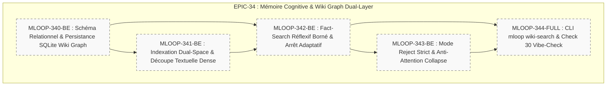

# 🏛️ Épopée — `EPIC-34-WFM-COGNITIVE-WIKI-GRAPH` : Mémoire Cognitive mLoop & Moteur Wiki Graph Dual-Layer

---

> **Référence d'Architecture** : [ADR-0395](../../../../standards/adr-system/0395-wiki-graph-dual-layer-et-fact-search-reflexif-wfm.md) (Proposé) · [ADR-0202](../../../../standards/adr-system/0202-modularite-interne-agents.md) (Modularité ≤ 300L) · [ADR-0375](../../../../standards/adr-system/0375-standard-preuve-epistemique-et-tracabilite-radicale.md) (Traçabilité Radicale) · [ADR-0376](../../../../standards/adr-system/0376-standard-rigueur-zero-blindspot-ecosysteme-mloop.md) (Rigueur 360° Zéro Blindspot) · [ADR-0390](../../../../standards/adr-system/0390-fact-search-indexation-arbres-niches-docs-domaine-couche.md) (Fact-Search Niche Indexing) · [ADR-0394](../../../../standards/adr-system/0394-tracabilite-bidirectionnelle-code-exigences-preuves-programmation-ast.md) (Traçabilité Code-Exigences)  
> **Composant(s)** : `Pipelines/LLMWiki` · `Core/Memory` · `Pipelines/FactSearch` · `Pipelines/HybridContext` · `QA/VibeCheck`  
> **Origine / Déclencheur** : Étude scientifique de rupture **WFM: Wiki Foundation Model for Complex Agentic Reasoning** (*arXiv:2609.18182*, Tencent Youtu Lab / Monash Univ, 16/09/2026) :
> 1. Démonstration de la supériorité du paradigme **LLM-Wiki** face aux limites du RAG vectoriel (aveugle aux liens) et du GraphRAG (triplets épars vidés de substance textuelle).
> 2. Schéma formel d'un graphe hybride $\mathcal{W} = (\mathcal{E}_w, \mathcal{R}_w, \mathcal{D})$ unissant la topologie d'entités discrètes aux passages textuels denses continus par des hyper-arêtes transversales.
> 3. Boucle de recherche itérative avec auto-réflexion bornée ($B \le 4$) et arrêt anticipé adaptatif ($f^{(t)} \in \{\text{Continue}, \text{Final}\}$), économisant ~37% de requêtes sans perte de précision.
> 4. Mode de validation strict *Reject* (+4 à +5 points d'exactitude) interdisant l'hallucination paramétrique et exigeant un ancrage documentaire probant.  
> **Statut** : `OPEN` — Récits Palier 1 (`status: DRAFT`, `grill_me: PENDING`)  
> **Décideurs** : Marco (PO) / Architecte Agentique  

---

## 🎯 1. Contexte & Intention Stratégique

Dans son rôle de Cerveau et Backend d'État Déterministe du cycle de vie logiciel, **Memory Loop (mLoop)** assure la préservation de l'état cognitif et lutte contre l'amnésie des agents tout au long des 5 phases canoniques. 

Aujourd'hui, l'ingestion documentaire et la recherche de contexte reposent sur un index lexical FTS5 (`memory/loop_mem.db`), un graphe de code AST (`CodeGraph`), et un script heuristique élémentaire (`src/pipelines/llm_wiki.py` de 152 lignes basé sur des regex de titres). Ces briques coexistent sans schéma unifié.

L'étude scientifique **WFM** prouve qu'un système agentique exploitant un **LLM-Wiki dual-layer** surpasse nettement le RAG classique et le GraphRAG sur le raisonnement complexe et la mémoire long-terme (+8.4 pts sur PersonaMem 1M, +5.4 pts sur RHELM, +14.4 pts sur le Recall@20). L'objectif d'**EPIC-34** est de doter mLoop de ce moteur cognitif de nouvelle génération, unissant entités métier et passages textuels denses, et instrumentant une recherche réflexive avec arrêt adaptatif et mode Reject rigoureux.

---

## 🧭 2. Vérité Terrain & Ancrage Normatif

> En application de l'**ADR-0375** (Traçabilité Radicale) et de l'**ADR-0376** (Zéro Blindspot), cette épopée s'ancre sur les sources vérifiées suivantes :

* **Publication Scientifique** : *WFM: Wiki Foundation Model for Complex Agentic Reasoning* (arXiv:2609.18182, 2026).
* **Codebase Source Locale mLoop** :
  * Moteur LLM-Wiki : [`src/pipelines/llm_wiki.py`](src/pipelines/llm_wiki.py)
  * Moteur de contexte hybride : [`src/pipelines/hybrid_context_engine.py`](src/pipelines/hybrid_context_engine.py)
  * Base de données cognitive : [`memory/loop_mem.db`](memory/loop_mem.db) et tables FTS5
  * Référentiel des règles et entités : [`src/utils/lexicon/`](src/utils/lexicon/) et [`standards/adr-system/`](standards/adr-system/)

---

## 🗺️ 3. Cartographie de l'Épopée (Story Mapping)

---

## 📋 4. Découpage en Récits Utilisateurs (Palier 1 Drafts)

| Récit ID | Rôle | Titre du Récit | Taille | Dépendances | Statut Initial | Fichier Story |
| :--- | :---: | :--- | :---: | :--- | :---: | :--- |
| **`MLOOP-340-BE`** | `BE` | Schéma Relationnel & Persistance SQLite du Wiki Graph Dual-Layer ($\mathcal{E}_w, \mathcal{R}_w, \mathcal{D}$) | `M` | Aucune | `DRAFT` (Palier 1) | [`stories/MLOOP-340-BE.md`](../stories/MLOOP-340-BE.md) |
| **`MLOOP-341-BE`** | `BE` | Moteur d'Ingestion & Indexation Dual-Space (Passages Denses & Hyper-Arêtes) | `M` | `MLOOP-340-BE` | `DRAFT` (Palier 1) | [`stories/MLOOP-341-BE.md`](../stories/MLOOP-341-BE.md) |
| **`MLOOP-342-BE`** | `BE` | Boucle de Fact-Search Réflexif à Budget Borné ($B \le 4$) & Arrêt Adaptatif ($f^{(t)}$) | `M` | `MLOOP-340-BE`, `MLOOP-341-BE` | `DRAFT` (Palier 1) | [`stories/MLOOP-342-BE.md`](../stories/MLOOP-342-BE.md) |
| **`MLOOP-343-BE`** | `BE` | Mode *Reject* Souverain Anti-Hallucination & Régularisation de Variance de Scoring | `S` | `MLOOP-342-BE` | `DRAFT` (Palier 1) | [`stories/MLOOP-343-BE.md`](../stories/MLOOP-343-BE.md) |
| **`MLOOP-344-FULL`** | `FULL`| Commande CLI `mloop wiki-search`, Intégration Grill-Me Phase 2 & Sonde Vibe-Check Check 30 | `L` | Tous précédents | `DRAFT` (Palier 1) | [`stories/MLOOP-344-FULL.md`](../stories/MLOOP-344-FULL.md) |

---

## 🛡️ 5. Matrice d'Impact en 7 Couches Zéro Blindspot (ADR-0376)

1. **Blueprints / Standards** : Enrichissement du modèle de données de mémoire persistante sous `standards/blueprints/`.
2. **Protocols** : Amendement de `CLI_PIPELINE_GUIDE.md` et de `STORY_LIFECYCLE_PROTOCOL.md` pour intégrer le mode Reject en Phase 2.
3. **ADR System** : Rédaction et référencement formel de l'**ADR-0395** (Wiki Graph Dual-Layer & Fact-Search Réflexif).
4. **Directives Agents** : Fourniture aux personas de la règle d'abstention stricte (*Reject mode*) en cas d'absence de preuve documentaire dans le panier de recherche.
5. **Skills Portables** : Enrichissement du skill `fact-search` et `llm-wiki` pour piloter la recherche réflexive adaptative.
6. **Code (`src/`)** : Refonte modulaire de `src/pipelines/llm_wiki.py`, `src/pipelines/hybrid_context_engine.py` (respect strict du plafond modulaire ≤ 300L, `RULE-AST-01`).
7. **Tests & Vibe-Check** : Création de `tests/test_wiki_graph.py`, `tests/test_reflective_search.py` et intégration de la sonde Check 30 dans `vibe-check.py`.

---

## 🏁 6. Critères de Sortie & Clôture de l'Épopée (DoD)

1. [ ] Les 5 récits utilisateurs ont franchi les Gates de Phase (Palier 1 $\to$ Palier 2 $\to$ Dev $\to$ QA $\to$ Ship).
2. [ ] La table SQLite `wiki_cross_links` lie les entités ADR, RM et symboles AST aux passages continus.
3. [ ] La recherche réflexive $B \le 4$ avec drapeau $f^{(t)} = \text{Final}$ démontre un arrêt anticipé moyen $\le 3$ passes sur les requêtes simples.
4. [ ] Le mode Reject s'abstient rigoureusement sur les requêtes dénuées de preuve documentaire sans hallucination.
5. [ ] Aucun fichier ne dépasse le plafond strict de 300 lignes (`RULE-AST-01`).
6. [ ] La suite des tests unitaires et d'intégration est 100% verte (`pytest tests/test_wiki_graph*.py`).
7. [ ] La sonde Vibe-Check Check 30 valide l'intégrité du graphe sans anomalie bloquante.
