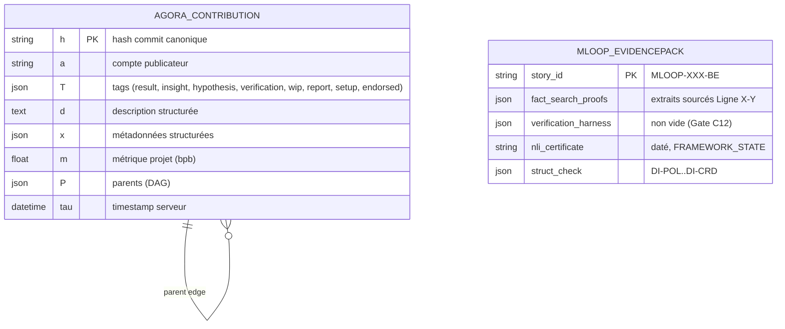

# Dossier de Preuves Documentaires — Analyse Agora ↔ mLoop

- **ID analyse** : `ANALYSE-AGORA-2609-18094`
- **Projet** : mLoop (auto-développement framework — exception Herméticité)
- **Date** : 2026-09-21
- **Source primaire (crawl mLoop)** : `C:\Memory Loop\memory\crawler\cache\crawl_arxiv_org_873782b3b5ce.md` (sha256:873782b3b5ce, 884 lignes / 72,5 Ko, MarkItDown, last_modified 2026-09-17)
- **Source web** : [arXiv:2609.18094](https://arxiv.org/abs/2609.18094) — « Agora: Git as Shared Memory for Collective AutoResearch », Zhang et al. (NVIDIA), soumis 2026-09-16, cs.LG/cs.AI/cs.CL
- **Sources mLoop citées** : `standards/adr-system/0201-orchestration-dag-multi-agents.md`, `standards/adr-system/0362-context-hygiene-skill-doctor-and-write-path-ceiling.md`, `standards/adr-system/README.md`, constitution racine (AGENTS.md)

---

## 1. Matrice de résolution des correspondances

| Dimension | Agora (papier) | mLoop (SSOT) | Verdict |
| :--- | :--- | :--- | :--- |
| État partagé | Git append-only DAG = **seul** état ; SQLite (8 tables) = index dérivé reconstruisable | Markdown SSOT (`docs/`) + JSON d'état (`memory/*.json`) + SQLite FTS5 + Graphify ; Git = transport (Sync #1) | Convergence partielle, substrat différent |
| Lignage | Chaque contribution = commit immuable ; parent edge = « builds on » | DAG orchestration (ADR-0201), `supersession_ledger.json`, `execution_traces.json` | mLoop a le lignage, sans adressage par contenu |
| Anti-duplication | UCB diversity-aware + 3 slots exploit/explore ; clustering cosinus 0.90 | Delegation Gate + Red Team + rubber-duck (contradiction) ; **aucune métrique de concentration sémantique** | Gap identifié |
| Vérification | Reproduction tierce = type de contribution (+20/0/−20), jamais son propre travail | Zero-Ask EvidencePack + certification QA Phase 4 (NLI, CEL, AST) + Red Team | Agora décentralise, mLoop gate centralisé |
| Résultats négatifs | Tag first-class (53 contributions), cités pour éviter les chemins | OQ-XXX + Admission of Limits ; **pas de registre global des échecs** | Gap identifié |
| Anti-amnésie | L'historique Git EST la mémoire ; sessions jetables | `resume`, hooks pre_compact (ADR-0364), plafond 200 lignes (ADR-0362) | Même problème, solutions compatibles |
| Coordination | Zéro planificateur central, zéro tâche assignée | Orchestrateur déterministe + Gates HITL (ADR-0305) | Philosophies opposées mais complémentaires |

## 2. Extraits verbatim sourcés

**Extrait 1 — Abstract (L11-23) : « more agents tend to mean more duplicated search rather than more discovery. Agora is a shared memory for such agents: research is recorded as an append-only directed acyclic graph (DAG) stored in Git, so that every claim is a commit anyone can check out and rerun. » ➔ Fait établi : Agora = mémoire partagée, chaque affirmation est un commit re-exécutable.**

**Extrait 2 — §1 Introduction (L56-59) : « The Git history is the only state: workers read and write it, and nothing else passes between them. » ➔ Fait établi : Git est l'unique substrat ; tout le reste est dérivé.**

**Extrait 3 — §3.2 Table 2 (L235-236) : « verification +20/+10/−20 Confirmed, partial, or failed reproduction. Exactly one target; never one's own work. » ➔ Fait établi : la vérification tierce est un type de contribution scorer, auto-citation exclue.**

**Extrait 4 — §3.3 (L282-284) : formule UCB `U(v) = 100Q(v) + C·√(log(N+1)/(n(v)+1)) + √(100D/(1+ρ(v)))` avec Q = percentile qualité, n = follow-on work, ρ = quasi-duplicata ; slots exploit / explore known / explore novel (L289-291). ➔ Fait établi : allocation d'attention diversity-aware en 3 slots.**

**Extrait 5 — §4.6 (L573-577) : « Of 696 pairs of different accounts posting identical scores, 63% are within an hour of each other and 80% within six. » ➔ Fait établi : la mémoire partagée seule n'élimine pas le travail dupliqué.**

**Extrait 6 — §4.7 (L592-597) : « On May 2 (…) more than a third of all activity sat in a single semantic cluster and the leaderboard had stalled, we deployed the clustering, diversity summary, and diversity-aware UCB (…) the first sub-1.90 result was published the next morning by a worker that chose to follow the thin state-space cluster. » ➔ Fait établi : monoculture détectée par métrique de concentration sémantique ; sortie de basin en < 1 jour après la carte.**

**Extrait 7 — §4.5/4.4 (L508) : « Those 18 scored contributions account for about 98% of the total reduction. » (première nuit) et (L537) « 53 contributions explicitly tagged as negative results ». ➔ Fait établi : l'essentiel du gain vient tôt ; le DAG a surtout affiné et permis la sortie de monoculture.**

**Extrait 8 — §4.5 (L538-544) : « The best contribution at cutoff has 145 commits in its ancestry, written by 15 of the 17 accounts; 115 of the 144 parent edges cross account boundaries (…) 165 verification contributions covering 95 distinct targets (…) none reports a failure. » ➔ Fait établi : lignage multi-comptes et reproductions croisées à grande échelle.**

**Extrait 9 — §5 Conclusion (L625-628) : « we did not run the same models and compute without Agora or with a plain leaderboard, and the community left its first basin only after we showed it a map. The next step is measurement: the matched comparison in Appendix C. » ➔ Fait établi : aucune preuve causale publiée ; comparaison appariée restée à faire.**

**Extrait 10 — ADR-0201 mLoop (L16-18) : « Pattern Diamant & Fan-Out (…) EvidencePacks JSON Typés : Transport d'informations strictement typé et validé entre les arêtes du DAG (`src/pipelines/evidence.py`). » ➔ Fait établi : mLoop orchestre un DAG d'agents avec packs de preuves typés.**

**Extrait 11 — ADR-0362 mLoop (L18-19, L48) : « L'instanciation de sous-agents communicants en équipes maillées (*Agent Teams*) engendre un facteur multiplicateur de tokens de 3x à 7x (…) » et « le fichier SESSION_MEMORY_HEALTH.md ne doit jamais excéder 200 lignes ni 25 Ko ». ➔ Fait établi : mLoop plafonne la mémoire et chiffre le coût de la délégation — préoccupations homologues à celles d'Agora (découverte par unité de compute).**

## 3. Structure de données comparée

**Contrats déclaratifs (comparaison API)** : Agora expose 26 routes HTTP + 15 groupes CLI, bearer auth, rate limits (L302-305). mLoop : 121 commandes CLI SSOT (Vibe-Check #15) + 8 cibles de synchronisation. Aucune route fictive à consigner : le papier ne publie pas d'OpenAPI (conforme « zéro fausse route »).

## 4. Frontière active & Admission of Limits

- Le papier **ne démontre pas** la causalité « mémoire partagée ➔ plus de découverte par unité de compute » (Extrait 9) ; ne pas sur-interpréter.
- Run mono-domaine (transfert de poids), un seul évaluateur dev (200 textes FineWeb-Edu), tolérance inter-GPU 1.3×10⁻³ bpb.
- Le nombre à retenir est la trajectoire 3.39 ➔ 1.90 bpb, pas les décimales finales (dernier changement : 9×10⁻⁶).
- Côté mLoop : aucune modification du framework n'est effectuée dans ce tour (ADR-0376 : audit 360° + approbation humaine bloquante requis) ; les recommandations restent des propositions.

