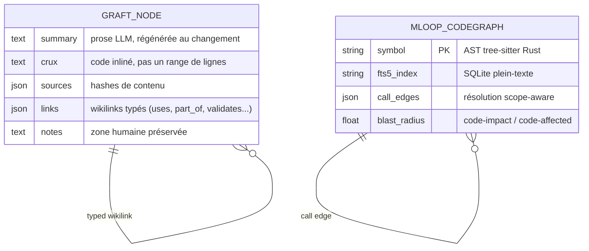

# Dossier de Preuves Documentaires — Analyse Graft/Trail ↔ mLoop

- **ID analyse** : `ANALYSE-GRAFT-TRAILHQ`
- **Projet** : mLoop (auto-développement framework — exception Herméticité)
- **Date** : 2026-09-21
- **Sources primaires (crawl mLoop)** :
  - `memory/crawler/cache/repo_trailhq_Graft/README.md` (sha256:4ac55e8a147d, 598 lignes / 43,4 Ko — dépôt `NanoNets/context-graph-engine`)
  - `memory/crawler/cache/repo_trailhq_Graft/.claude/skills/graft/SKILL.md` (150 lignes / 9,3 Ko)
  - `memory/crawler/cache/crawl_trailhq_com_6069fdcd6fa6.md` (llms.txt, 66 lignes / 4,1 Ko)
  - `memory/crawler/cache/crawl_github_com_4ac55e8a147d.md` (43,5 Ko)
- **Sources mLoop citées** : `standards/adr-system/0204-dual-engine-graph-architecture-graphify-codegraph.md`, constitution racine (AGENTS.md), ADR-0362, sidecars LOD (Vibe-Check #11), `memory/token_ledger.jsonl`
- **Identité produit** : Graft (MIT, TypeScript, 8.9k stars) = couche de contexte open-source pour gros codebases, éditée par Nanonets/Trail ; Trail = couche commerciale « Context Graph + Rule Engine gouvernés » pour documents d'entreprise.

---

## 1. Matrice de résolution des correspondances

| Dimension | Graft/Trail | mLoop (SSOT) | Verdict |
| :--- | :--- | :--- | :--- |
| Graphe code déterministe | Tier 1 tree-sitter, wiring.json, `$0`, sans LLM | CodeGraph AST Rust tree-sitter + SQLite FTS5 (ADR-0204) | Équivalence fonctionnelle |
| Anti « Grep-Glob-Read Loop » | Cold start : 39,8s / 4,2 calls / 8 070 tokens par tâche | « 180k à 990k tokens par question, jusqu'à 43 tool calls » (ADR-0204) | Même pathologie, même remède |
| Nœuds prose pour le code | graft/*.md : Summary + Crux + Sources + Links + Notes | Graphify (docs seulement) ; CodeGraph (symboles) ; sidecars `.overview.md` par fichier | Gap : pas de nœud prose de sous-système pour le code |
| Discipline d'économie | SKILL.md « Most tasks need one call » + `[graft] tokens saved ≈ N` par appel | Budget boot 15k jetons (ADR-0362), `token_ledger.jsonl` au niveau session | Gap : pas de métrage par appel remonté à l'agent |
| Ancrage des citations | Crux = texte stocké, pas des numéros de ligne (survit au drift) | Citations fact-search ancrées lignes (« L48-L53 ») | Gap : vulnérabilité au drift documentaire |
| Fraîcheur | Rebuild à la volée à chaque requête (~3ms stat) | File Watcher OS natif, sync incrémentale debounce 2s (ADR-0204) | Approches complémentaires (pull vs event) |
| Règles gouvernées | Trail : « the review gate is the product » ; règles citées, approuvées avant service | RM-XXX + Gates HITL + Grill (ADR-0305) ; preuves citées Lignes X-Y | Convergence quasi isomorphe |
| Blast radius | Hook post-édition : rayon d'impact inline automatique | `code-impact` / `code-affected` à la demande (CLI) | Gap : pas de hook post-édition mLoop |

## 2. Extraits verbatim sourcés

**Extrait 1 — README (L96-104) : « Every task, your coding agent starts blind (…) It is rebuilding a picture of a codebase it mapped an hour ago and threw away (…) Humans onboard to a codebase once. Agents onboard every single time. » ➔ Fait établi : la pathologie ciblée est l'onboarding répété, non la compétence de l'agent.**

**Extrait 2 — README (L17-19) : « Real explanations, not a list of symbols (…) It is not a dump of function names. » et (L117) « No embeddings, no similarity search, no index to keep warm. » ➔ Fait établi : le pari Graft = nœuds en prose anglaise + graphe de fichiers lisibles, zéro embedding.**

**Extrait 3 — README (L234-244) : nœud = Summary (prose LLM) + **Crux** (« Lifted straight from the source and stored inline ») + Sources (content hash) + Links (wikilinks typés) + Notes (préservées). « The crux is stored as the code itself, not as a line range, on purpose (…) stays correct even as the file around it moves. » ➔ Fait établi : ancrage par contenu, immunisé au drift de lignes.**

**Extrait 4 — SKILL.md (L18) : « There are six of them. Pick the one that fits the task (…) Most tasks need one call. » et (L125-131) : « Each retrieval tool opens its output with a `[graft] tokens saved ≈ N` line (…) close your reply with a one-line tally. » ➔ Fait établi : la discipline d'économie est injectée dans la compétence, avec comptabilité visible par appel.**

**Extrait 5 — README (L135) : « Cost is cache-aware: reads ≈ 0.1×, writes 1.25×, the billing model agents actually run under. » et (L137) : « 162 runs, two repos, 3 trials each. » (L147) : « The pull variant (…) correctness jumped to 98%, +5 points over cold. » ➔ Fait établi : benchmark à trois bras (cold/push/pull), juge Opus 4.8 avec plancher de mots-clés obligatoires.**

**Extrait 6 — README (L153-166) : SWE-bench Verified, 50 instances, Claude Sonnet 5, harnais officiel `swebench` 4.1.0 : 66 % vs 54 % de résolution (+12 pts), −23 % tokens, −25 % tool calls, −32 % wall-clock. « Every correctness win has the same shape: the baseline patches one file and misses its siblings. » ➔ Fait établi : le gain de correction vient du blast radius multi-fichiers.**

**Extrait 7 — README (L176-190) : construction en deux passes LLM (résumé par fichier → groupement en nœuds), tier 1 tree-sitter sans modèle, « Every pass is cached by content hash », 124 fichiers : 0,74s cold / 0,18s incrémental. ➔ Fait établi : hybride LLM/AST avec cache par hash de contenu.**

**Extrait 8 — README (L192) : « A retrieval call stats the tree against the last build's fingerprint (~3ms), and rebuilds only if something moved (…) The refresh is structural and $0; it never calls the LLM. » ➔ Fait établi : fraîcheur pull-based à la volée.**

**Extrait 9 — llms.txt Trail (L18-22) : « The distinction from retrieval (RAG) is structural (…) Trail resolves a question to entities and walks named edges (…) An unreviewed rule is never reachable by an agent — the review gate is the product, not a setting. » ➔ Fait établi : Trail = gouvernance de règles avec porte humaine ; cite document, page et ligne.**

**Extrait 10 — llms.txt (L24-26) : « Trail is pre-launch and publishes no accuracy or benchmark figures. Confidence values (…) labelled as illustrative. » ➔ Fait établi : admission honnête de l'absence de preuves — à ne pas sur-interpréter.**

**Extrait 11 — ADR-0204 mLoop (L15-19) : « Le Piège du "Grep-Glob-Read Loop" (…) 180k à 990k tokens par question d'architecture (…) jusqu'à 43 tool calls (…) risque de dérive et d'amnésie par pollution du contexte. » et (L51-53) : CodeGraph = « AST compilé en Rust via grammaires tree-sitter, SQLite locale avec FTS5 (…) File Watcher OS natif, sync incrémentale debounce 2s ». ➔ Fait établi : mLoop a déjà diagnostiqué et traité la même pathologie.**

## 3. Structure de données comparée

**Contrats déclaratifs** : Graft expose 6 outils MCP (`graft_find_code`, `graft_find_all`, `graft_file_api`, `graft_trace_calls`, `graft_repo_map`, `graft_check_freshness`) + CLI (ask/grep/skeleton/callers/map/viz/build/check/telemetry) ; langages : 8 full-fidelity + 15 broad + 5 LSP opt-in = 23. mLoop : MCP `codegraph_explore` + CLI `code-explore`/`code-impact`/`code-affected`. Aucune route fictive à consigner (specs vérifiées dans les artefacts crawlés).

## 4. Frontière active & Admission of Limits

- Les chiffres Graft (4×/3×, 162 runs, SWE-bench 50 instances) sont **auto-déclarés**, non répliqués indépendamment ; le harnaisPocketBase inclut 5 PR re-implémentées notées sur fichiers touchés (proxy de qualité, pas d'équivalence fonctionnelle).
- La variante la plus honnête est le benchmark à 3 bras (cold/push/pull) : le mode *pull* (outils seulement) bat le mode *push* (injection) en correction — mais Graft recommande le push par défaut dans son SKILL.md.
- Trail ne publie **aucun** chiffre de précision (Extrait 10) ; l'ancrage documentaire « page et ligne » est revendiqué mais non prouvé publiquement.
- Côté mLoop : aucune modification du framework dans ce tour (ADR-0376) ; les recommandations restent des propositions soumises à Grill + audit 360°.

---

## 5. COMPLÉMENT — Confrontation directe CodeGraph (mLoop) vs Graft ( vérification runtime + src/ du 3ᵉ tour )

**Extrait 12 — src/commands/handlers/code_intelligence.py (L76-78) : `def _get_codegraph_binary() -> Optional[str]: return shutil.which("codegraph")` et (L156-158) : « La CLI 'codegraph' n'est pas installee dans le PATH. Executez 'npm install -g @colbymchenry/codegraph'. » ➔ Fait établi : CodeGraph mLoop est un wrapper subprocess autour d'un binaire npm externe (@colbymchenry/codegraph) — dépendance externe vérifiée présente (C:\Users\mlefrancois\AppData\Roaming\npm\codegraph.ps1).**

**Extrait 13 — code_intelligence.py (L82-106) : `timeout: float = 30.0` avec gestion `subprocess.TimeoutExpired` → returncode 124 et message explicite. ➔ Fait établi : mLoop applique ADR-0369 (deadline stricte) sur CodeGraph ; Graft ne documente aucun deadline équivalent.**

**Extrait 14 — code_intelligence.py (L109-141) : Token Budget Guardrail `--compact` (max 8 lignes verbatim par bloc, « Corps de code tronque pour preserver le budget de tokens ») + (L22) cache singleton `_CODEGRAPH_CACHE`. ➔ Fait établi : mLoop plafonne et cache mais n'affiche aucun compteur de jetons par appel (absence du « tokens saved ≈ N » de Graft — Gap 3 confirmé au niveau implémentation).**

**Extrait 15 — code_intelligence.py (L25-73) : `_find_target_source_path` avec chaîne de fallback explicite → .codegraph → projet actif SQLite → racine workspace (« la racine du workspace ou reside la base globale (928 Mo) »). + vérification runtime : `.codegraph` présent à la racine du workspace, ABSENT de Projects\mLoop. ➔ Fait établi : index physique global hors projet — cohérent ADR-0204 (Pilier 4 isolation) mais aucun périmètre multi-tenant par projet à l'inverse du reste du framework.**

**Extrait 16 — src/core/lod_generator.py (L15-19) : `class LODGenerator` « pour les répertoires documentaires de mLoop (notamment docs/00-ingested/ et docs/06-knowledge/) ». ➔ Fait établi : mLoop a un générateur de nœuds LOD en prose mais pour le DOCUMENTAIRE uniquement — l'équivalent « sous-système » pour le code (nœud Graft Summary+Crux) n'existe pas (Gap 1 confirmé au niveau implémentation).**

**Extrait 17 — ADR-0204 (L79-84) : « -62 % de jetons consommés » et « -44 % sur la facture d'API », « 2.2× à 3.6× plus rapides », « Cross-Language Intelligence » ponts React Native/Swift/ObjC. ➔ Fait établi : les gains mLoop sont aussi auto-déclarés — AUCUN des deux moteurs n'a de benchmark croisé : la comparaison CodeGraph vs Graft reste qualitative (zéro chiffre mutuellement comparable).**

### Synthèse confrontative 6 axes (CodeGraph vs Graft)

| Axe | CodeGraph (mLoop) | Graft | Verdict affronté |
| :--- | :--- | :--- | :--- |
| Dépendance | Subprocess + binaire npm externe (SPOF si PATH vide) | Parsers embarqués (tree-sitter natif) | **Graft** — zéro dépendance externe |
| Représentation | SQLite `.codegraph/codegraph.db` + FTS5 (index, Git-ignoré) | Fichiers Markdown `graft/` versionnés (livrable) | **Double** — Graft lisible/auditable, CodeGraph performant sur gros corpus |
| Fraîcheur | Push (File Watcher OS, debounce 2s) — actif en continu | Pull (re-stat ~3ms, rebuild si drift) — à la demande | **mLoop** en UX temps réel ; **Graft** en vérifiabilité (mode pull > push en correction : 98 % vs 93 %) |
| Granularité | Symbole/ligne (AST chirurgical) | Sous-système (prose + Crux) | **Complémentaires** — zonal, pas concurrent (G1 comble le niveau intermédiaire) |
| Blast radius | `code-impact`/`code-affected` à la demande (manuel) | Hook PostToolUse inline + resync auto | **Graft** sur le timing — mLoop a la même puissance non câblée (G4) |
| Résilience | Timeout 30s (ADR-0369), cache mémoire, erreurs explicites | Non documenté | **mLoop** — seule implémentation des deux à publier des deadlines |

### Impact sur les recommandations G1-G5
- **G1 (sidecars sous-système)** : le benchmark 3 bras de Graft impose le mode **pull** (outils, pas injection) — le sidecar doit être consultable, jamais injecté automatiquement dans le contexte.
- **G3 (compteur jetons)** : confirmé absente au niveau implémentation (Extrait 14) ; le `--compact` existant est le socle naturel.
- **G4 (hook post-édition)** : chevauchement le plus direct — CodeGraph possède déjà `code-impact`, il ne manque que le déclencheur.
- **Nouveau G6 (proposition)** : périmètre multi-tenant de l'index CodeGraph par projet (`Projects/<nom>/.codegraph`) pour lever l'Extrait 15 (index global 928 Mo hors périmètre projet). Niveau 2.

