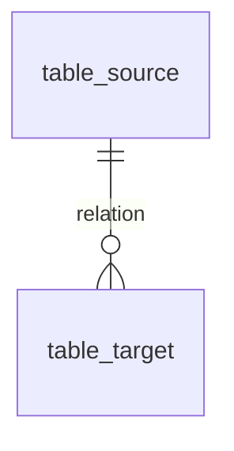

# 📂 Dossier de Preuves Documentaires & Cadrage SSOT — MLOOP-074-FULL

**Titre Métier** : Runway de Handoffs Multi-Agents et Trajectory Diff Viewer  
**Identifiant Story** : `MLOOP-074-FULL`  
**Clé Jira Officielle** : `'-'`  
**Date d'Extraction & Cadrage** : 2026-09-19  
**Auditeur mLoop** : Agentic Pair Programmer  

---

## 🧭 1. Sources Physiques & Matrice de Vérité

* 🗄️ **Modèle de données SSOT (référence canonique)** :  
* 📋 **Cas d'affaires (Analyse Fonctionnelle)** :  
* 🎨 **Maquette Figma Interactive (Live SSOT Visuel)** :  

### 1.1 Hiérarchie de Vérité
1. **Niveau 1 (Suprême)** : Arbitrage formel PO.
2. **Niveau 2 (Structure de données SSOT)** : Modèle de données canonique.
3. **Niveau 3 (Visuel SSOT)** : Maquettes Figma officielles.
4. **Niveau 4 (Cas d'affaires AF)** : Spécifications fonctionnelles.

---

## 🔬 2. Faits Extraits & Verbatims (Passage-Level Grounding)

| # | Table / Source | Définition DBML Exacte | Rôle dans le Payload API |
| :---: | :--- | :--- | :--- |
| **F-01** | `table_source` | `Table table_source { id uuid [pk] }` | Description de la règle métier ou verbatim... |

---

## 🗄️ 3. Schéma Relationnel SSOT



---

## 🎯 4. Contrats Déclaratifs Cibles (Endpoints REST 1:1)

* **Méthode** : `GET`
* **Route** : `/api/v1/...`
* **Query Parameters** :
  * `id` : `uuid` (obligatoire)

* **Réponse 200 OK** :
```json
{
  "id": "00000000-0000-0000-0000-000000000000"
}
```

---

## 🏁 5. Évaluation de la Frontière Active (Frontier Design Tree)

* **Arbitrages retenus** :
  * Zéro extrapolation : toutes les tables et règles proviennent du modèle SSOT.
