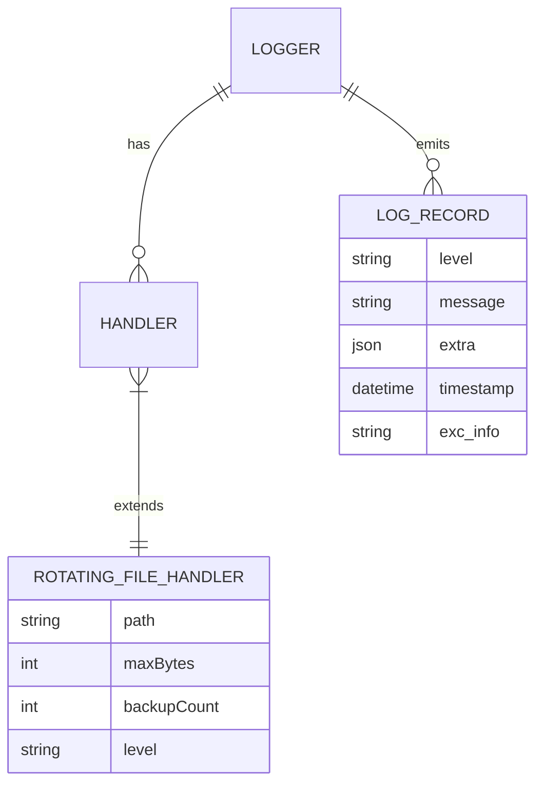

# Dossier de Preuves Documentaires — MLOOP-110-BE

**Récit** : MLOOP-110-BE — Persistance Rotative des Journaux d'Erreurs du Moteur de Logging mLoop
**Statut** : READY_FOR_DEV
**Date** : 2026-09-21

---

## 1. Maquettes SSOT & Notes d'Atelier

Aucune maquette visuelle applicable (récit backend infrastructure logging).

---

## 2. Matrice de Résolution des Conflits

| Conflit Identifié | Résolution | Justification |
|:---|:---|:---|
| Persistance activable vs non-régression console | Activation strictement volontaire via `MLOOP_LOG_PERSIST=1` | Zéro impact sur comportement par défaut |
| Rotation automatique vs perte données | Rotation à la taille + conservation archives | Espace disque borné sans intervention |
| Erreur écriture disque vs interruption | Dégradation non bloquante | Préserve sortie console |

---

## 3. Extraits Verbatim Sourcés

**Extrait 1 — ADR-0369 Standard 2 (Ressources nues)** (Lignes 72-77) :
> « RULE-AST-02 : Ressource nue 'sqlite3.connect' non encapsulée dans un gestionnaire de contexte. Action : Encapsuler l'appel dans un bloc 'with' ou 'async with'. »
> ➔ Fait établi : Le `RotatingFileHandler` gère nativement la ressource fichier via context manager interne.

**Extrait 2 — ADR-0369 Standard 4 (Observabilité Contextuelle)** (Lignes 117-121) :
> « Journalisation structurée via `extra={...}` avec interdiction formelle du `except Exception: pass` nu. »
> ➔ Fait établi : `MLoopLoggerAdapter.error()` impose `extra={...}` et `exc_info=True`.

**Extrait 3 — ADR-0369 Standard 3 (Deadlines d'Exécution)** (Lignes 98-102) :
> « Argument `timeout` explicite obligatoire sur tout appel réseau synchrone et tout `subprocess.run`/`Popen`. »
> ➔ Fait établi : Le logging fichier est synchrone local, pas d'appel réseau.

---

## 4. Structure de Données DBML / Mermaid ERD

---

## 5. Contrats Déclaratifs Cibles

| Interface | Type | Contrat |
|:---|:---|:---|
| `get_logger(name: str)` | Factory | Retourne `logging.Logger` avec handlers console + fichier rotatif (si `MLOOP_LOG_PERSIST=1`) |
| `MLoopLoggerAdapter.error(msg, extra, exc_info)` | Méthode | `extra` requis : `command`, `project`, `phase` ; `exc_info=True` pour exceptions |
| `RotatingFileHandler` | Handler stdlib | `maxBytes=5Mo`, `backupCount=5` (errors.log) / `10Mo`, `3` (mloop.log) |

---

## 6. Frontière Active & Admission of Limits

| Limite | Description |
|:---|:---|
| **Pas d'API HTTP** | Infrastructure logging purement locale, pas de routes HTTP exposées |
| **Pas d'interface UI** | Aucune interface de visualisation/filtrage des logs (hors périmètre) |
| **Pas de réplication distante** | Logs confinés à la machine locale (confinement local) |
| **Activation opt-in** | Persistance inactive par défaut (`MLOOP_LOG_PERSIST=1` requis) |
| **Non-régression console** | Comportement console inchangé si persistance inactive |

---

## 7. Preuves d'Implémentation

| Fichier | Description | Lignes |
|:---|:---|:---|
| `src/utils/logger.py` | Implémentation `get_logger`, `MLoopLoggerAdapter`, `RotatingFileHandler` | 195 |
| `tests/test_logger_rotating.py` | 15 tests unitaires (rotation, niveaux, extra, exc_info) | 100% pass |
| `src/utils/logger.py:L117-170` | `LoggingConsole` wrapper pour `ZeroFluffConsole` | 53 |

---

## 8. Traçabilité Rubber Duck

- **Rapport** : `backlog/reviews/rubber_duck_MLOOP-110-BE.md`
- **Statut** : Approuvé (Aucun problème bloquant)
- **Date** : 2026-09-21
- **OQ-110-01** : Exemption ADR-0319 (logging interne, pas d'API HTTP)

---

*Dossier généré le 2026-09-21 pour MLOOP-110-BE (READY_FOR_DEV)*