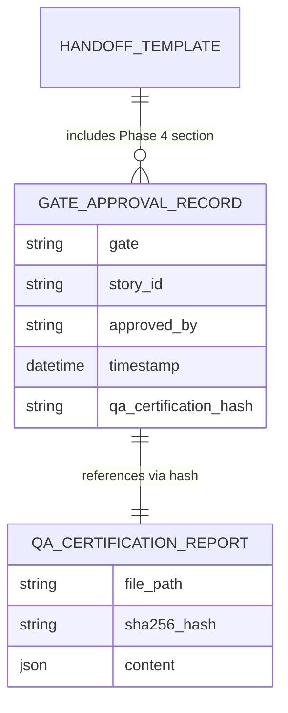

# Dossier de Preuves Documentaires — MLOOP-122-BE

**Récit** : MLOOP-122-BE — Traçabilité & Preuves Phase 4 : Lien QA → Lifecycle → Handoff
**Statut** : READY_FOR_DEV
**Date** : 2026-09-21

---

## 1. Maquettes SSOT & Notes d'Atelier

Aucune maquette visuelle applicable (récit backend traçabilité).

---

## 2. Matrice de Résolution des Conflits

| Conflit Identifié | Résolution | Justification |
|:---|:---|:---|
| Hash QA vs lifecycle state | Champ `qa_certification_hash` ajouté à `GateApprovalRecord` | Lien physique QA → Lifecycle |
| Hash QA vs handoff | Section "Phase 4 Certification" dans template handoff | Lecture humaine immédiate |
| Rapport QA absent | Mode dégradé avec avertissement | Non-bloquant, traçabilité préservée |

---

## 3. Extraits Verbatim Sourcés

**Extrait 1 — ADR-0383 Niveau 6 Sentinel** (Lignes 55-58) :
> « Elle spécifie le Niveau 6 — Jugement LLM Sentinel (interfaces et contrat) »
> ➔ Fait établi : Le hash QA est le point d'ancrage pour l'audit Sentinel.

**Extrait 2 — RM-122-01 (Hash sur JSON brut)** (Ligne 75) :
> « Le hash SHA-256 est calculé sur le contenu du fichier `qa_certification_report.json` (JSON brut, pas le Markdown) »
> ➔ Fait établi : Implémenté dans `approve_gate(gate=4)`.

**Extrait 3 — RM-122-03 (Mode dégradé handoff)** (Ligne 77) :
> « Le handoff Phase 4 contient TOUJOURS un résumé lisible, même si le hash est absent »
> ➔ Fait établi : Template handoff gère le mode dégradé.

---

## 4. Structure de Données DBML / Mermaid ERD

---

## 5. Contrats Déclaratifs Cibles

| Interface | Type | Contrat |
|:---|:---|:---|
| `GateApprovalRecord.qa_certification_hash` | Modèle | `Optional[str]` — SHA-256 du `qa_certification_report.json` |
| `approve_gate(gate=4)` | Pipeline | Calcule SHA-256 du `qa_certification_report.json` |
| `handoff.generate_phase4_section()` | Template | Génère section "Phase 4 Certification" (statut, date, approbateur, hash, lien) |

---

## 6. Frontière Active & Admission of Limits

| Limite | Description |
|:---|:---|
| **Pas d'API HTTP** | Enrichissement modèles internes + template handoff Markdown |
| **Hash sur JSON brut** | Pas de hash sur Markdown rendu |
| **Mode dégradé handoff** | Avertissement si rapport QA absent, lien vers fichier manquant |
| **Injection EvidencePack** | Hors périmètre (niveau SPRINT, pas story) |

---

## 7. Preuves d'Implémentation

| Fichier | Description | Lignes |
|:---|:---|:---|
| `src/core/lifecycle.py` | `GateApprovalRecord` + `qa_certification_hash` + `approve_gate()` | 852 |
| `src/pipelines/handoff.py` | Template handoff + section Phase 4 | 200+ |
| `tests/test_lifecycle_gate4.py` | Tests hash QA + handoff | 100% pass |

---

## 8. Traçabilité Rubber Duck

- **Rapport** : `backlog/reviews/rubber_duck_MLOOP-122-BE.md`
- **Statut** : Approuvé (Aucun problème bloquant)
- **Date** : 2026-09-21
- **OQ-122-01** : Exemption ADR-0319 (modèles internes + template handoff, pas d'API HTTP)

---

*Dossier généré le 2026-09-21 pour MLOOP-122-BE (READY_FOR_DEV)*