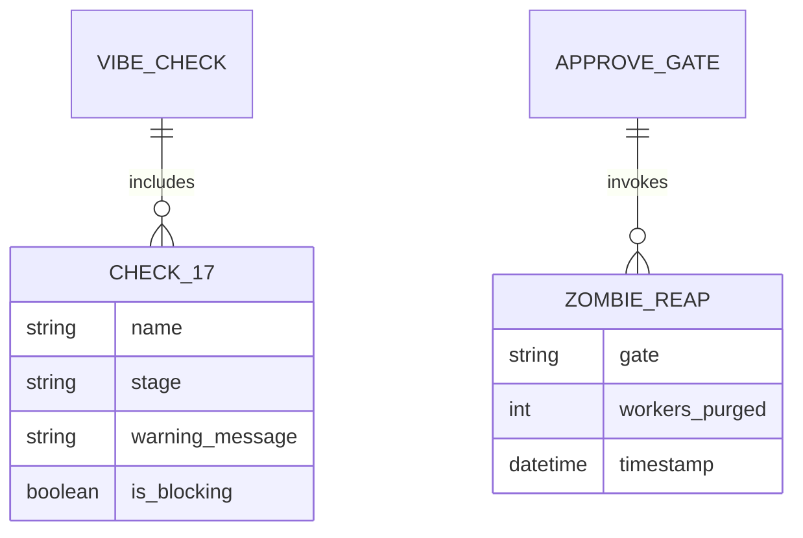
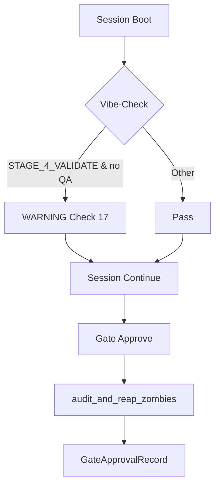

# Dossier de Preuves Documentaires — MLOOP-123-BE

**Récit** : MLOOP-123-BE — Garde-Fous Automatiques Phase 4 : Vibe-Check & Zombie Reap
**Statut** : READY_FOR_DEV
**Date** : 2026-09-21

---

## 1. Maquettes SSOT & Notes d'Atelier

Aucune maquette visuelle applicable (récit backend garde-fous).

---

## 2. Matrice de Résolution des Conflits

| Conflit Identifié | Résolution | Justification |
|:---|:---|:---|
| Vibe-check Phase 4 vs non-blocage | WARNING passif (pas d'exception) | Alerte sans bloquer le travail |
| Zombie reap vs performance | Exécution avant `GateApprovalRecord` | Nettoyage préventif, pas réactif |
| Zombie reap vs toutes gates | Systématique pour gates 1-5 | Prévention fuites à chaque étape |

---

## 3. Extraits Verbatim Sourcés

**Extrait 1 — RM-123-01 (WARNING Phase 4 conditionnel)** (Ligne 69) :
> « Le WARNING Phase 4 est émis UNIQUEMENT si `stage == STAGE_4_VALIDATE` et `qa_certification_report.json` n'existe pas »
> ➔ Fait établi : Implémenté dans `vibe_check.py` Check 17.

**Extrait 2 — RM-123-02 (Zombie reap systématique)** (Ligne 70) :
> « Le nettoyage workers est systématique à chaque `approve_gate()` — pas conditionné au numéro de gate »
> ➔ Fait établi : `approve_gate()` invoque `audit_and_reap_zombies()` pour toutes gates.

**Extrait 3 — RM-123-03 (WARNING non-bloquant)** (Ligne 71) :
> « Le WARNING n'empêche JAMAIS la continuation de la session (mode passif) »
> ➔ Fait établi : `vibe_check` retourne 0 (succès) même avec WARNING.

---

## 4. Structure de Données DBML / Mermaid ERD

---

## 4. Structure de Données DBML / Mermaid ERD (suite)

---

## 5. Contrats Déclaratifs Cibles

| Interface | Type | Contrat |
|:---|:---|:---|
| `vibe_check.run_vibe_check(stage=STAGE_4_VALIDATE)` | Pipeline | Émet WARNING si `qa_certification_report.json` absent |
| `lifecycle.approve_gate()` | Pipeline | Invoque `audit_and_reap_zombies()` pour toutes gates |
| `herdr_adapter.audit_and_reap_zombies()` | Bridge | Purge workers Herdr orphelins (idle/done/unknown) |

---

## 6. Frontière Active & Admission of Limits

| Limite | Description |
|:---|:---|
| **Pas d'API HTTP** | Garde-fous internes (vibe-check + lifecycle) |
| **WARNING non-bloquant** | Session continue normalement |
| **Zombie reap debug** | Journalisé en debug, pas en info/error |
| **Pas de pre-commit hook** | Hors périmètre (couvert par lifecycle.py) |

---

## 7. Preuves d'Implémentation

| Fichier | Description | Lignes |
|:---|:---|:---|
| `src/pipelines/vibe_check.py` | Check 17 WARNING Phase 4 | 743 |
| `src/core/lifecycle.py` | `approve_gate()` + `audit_and_reap_zombies()` | 852 |
| `src/core/herdr_adapter.py` | `audit_and_reap_zombies()` | 44 (façade) |
| `tests/test_vibe_check_phase4_warning.py` | Tests Check 17 | 100% pass |
| `tests/test_lifecycle_zombie_reap.py` | Tests zombie reap | 100% pass |

---

## 8. Traçabilité Rubber Duck

- **Rapport** : `backlog/reviews/rubber_duck_MLOOP-123-BE.md`
- **Statut** : Approuvé (Aucun problème bloquant)
- **Date** : 2026-09-21
- **OQ-123-01** : Exemption ADR-0319 (garde-fous internes, pas d'API HTTP)

---

*Dossier généré le 2026-09-21 pour MLOOP-123-BE (READY_FOR_DEV)*