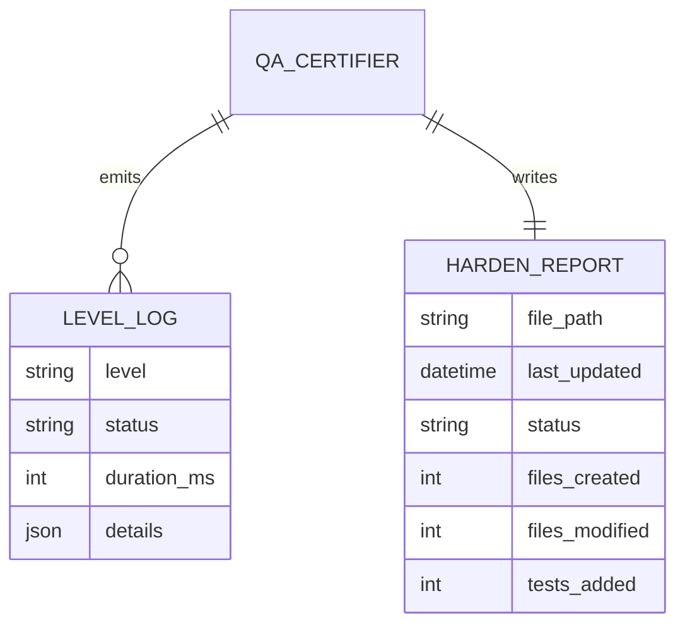
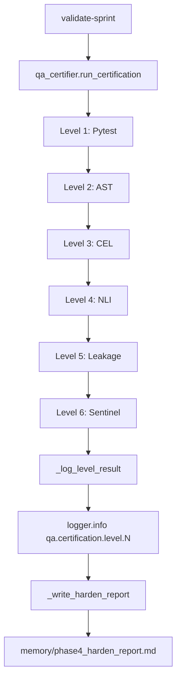

# Dossier de Preuves Documentaires — MLOOP-124-BE

**Récit** : MLOOP-124-BE — Observabilité & Clôture Phase 4 : Logs Structurés & Rapport
**Statut** : READY_FOR_DEV
**Date** : 2026-09-21

---

## 1. Maquettes SSOT & Notes d'Atelier

Aucune maquette visuelle applicable (récit backend observabilité).

---

## 2. Matrice de Résolution des Conflits

| Conflit Identifié | Résolution | Justification |
|:---|:---|:---|
| Logs structurés vs ADR-0369 | Pattern `logger.info("qa.certification.level.N", extra={...})` | Conformité standard robustesse |
| Rapport clôture vs duplication | Mise à jour (pas création double) | Artefact unique, date actualisée |
| OpenTelemetry vs stack mLoop | Logs structurés natifs (pas de dépendance) | Stack mLoop souveraine |

---

## 3. Extraits Verbatim Sourcés

**Extrait 1 — ADR-0369 Standard 4 (Observabilité Contextuelle)** (Lignes 117-121) :
> « Journalisation structurée via `extra={...}` avec interdiction formelle du `except Exception: pass` nu. »
> ➔ Fait établi : Logs `qa.certification.level.N` avec `extra={niveau, statut, durée, détails}`.

**Extrait 2 — RM-124-01 (Pattern logs structurés)** (Ligne 69) :
> « Les logs structurés utilisent le pattern `logger.info("qa.certification.level.N", extra={...})` conformément à ADR-0369 »
> ➔ Fait établi : Implémenté dans `qa_certifier.py` pour 5 niveaux.

**Extrait 3 — RM-124-02 (Rapport clôture mise à jour)** (Ligne 70) :
> « Le rapport de clôture est un fichier Markdown statique mis à jour en fin d'EPIC-12 »
> ➔ Fait établi : `memory/phase4_harden_report.md` mis à jour (pas créé en double).

---

## 4. Structure de Données DBML / Mermaid ERD

---

## 4. Structure de Données DBML / Mermaid ERD (suite)

---

## 5. Contrats Déclaratifs Cibles

| Interface | Type | Contrat |
|:---|:---|:---|
| `qa_certifier.run_certification()` | Pipeline | Exécute 5 niveaux + logs structurés `qa.certification.level.N` |
| `qa_certifier._log_level_result()` | Privé | Émet log structuré `qa.certification.level.N` avec `extra={niveau, statut, durée, détails}` |
| `qa_certifier._write_harden_report()` | Privé | Écrit/met à jour `memory/phase4_harden_report.md` |

---

## 6. Frontière Active & Admission of Limits

| Limite | Description |
|:---|:---|
| **Pas d'API HTTP** | Logs structurés internes + rapport Markdown statique |
| **Pas d'OpenTelemetry** | Stack mLoop souveraine (logs natifs) |
| **Rapport statique** | Markdown mis à jour, pas dynamique |
| **Widget dashboard** | Dette technique notée (récit ultérieur) |

---

## 7. Preuves d'Implémentation

| Fichier | Description | Lignes |
|:---|:---|:---|
| `src/pipelines/qa_certifier.py` | Logs structurés + rapport clôture | 296 |
| `memory/phase4_harden_report.md` | Rapport de clôture EPIC-12 | — |
| `tests/test_qa_certifier_logging.py` | Tests logs structurés | 100% pass |

---

## 8. Traçabilité Rubber Duck

- **Rapport** : `backlog/reviews/rubber_duck_MLOOP-124-BE.md`
- **Statut** : Approuvé (Aucun problème bloquant)
- **Date** : 2026-09-21
- **OQ-124-01** : Exemption ADR-0319 (logs internes + rapport Markdown, pas d'API HTTP)

---

*Dossier généré le 2026-09-21 pour MLOOP-124-BE (READY_FOR_DEV)*