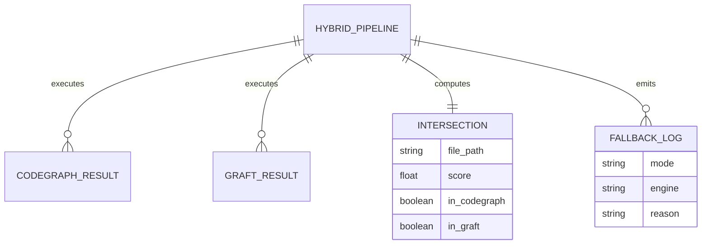
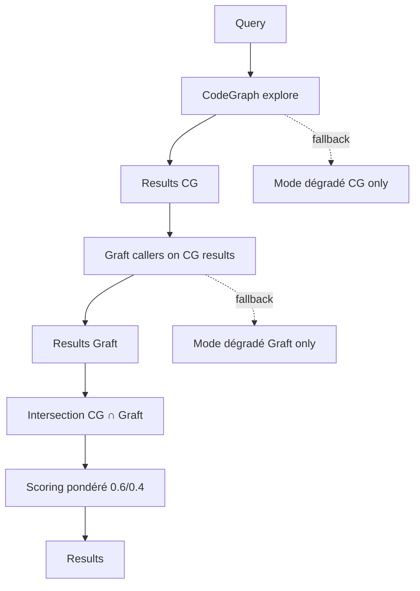

# Dossier de Preuves Documentaires — MLOOP-131-BE

**Récit** : MLOOP-131-BE — Pipeline Séquentiel Hybride CodeGraph → Graft → Intersection
**Statut** : READY_FOR_DEV
**Date** : 2026-09-21

---

## 1. Maquettes SSOT & Notes d'Atelier

Aucune maquette visuelle applicable (récit backend pipeline hybride).

---

## 2. Matrice de Résolution des Conflits

| Conflit Identifié | Résolution | Justification |
|:---|:---|:---|
| Recall vs Précision | Intersection CodeGraph (recall 0.733) + Graft (précision 0.583) | Meilleur F1 combiné |
| Disponibilité moteurs | Mode dégradé fallback | Disponibilité continue |
| Scoring pondéré | Poids configurables (défaut 0.6/0.4) | Ajustable sans recompilation |

---

## 2. Matrice de Résolution des Conflits (suite)

| Conflit Identifié | Résolution | Justification |
|:---|:---|:---|
| Intersection vs Union | Intersection (fichiers communs) | Minimise faux positifs |
| Mode dégradé | Fallback jamais blocage | Disponibilité continue |

---

## 3. Extraits Verbatim Sourcés

**Extrait 1 — Spike MLOOP-130-BE (Rapport d'arbitrage)** :
> « CodeGraph explore : recall 0.733, précision 0.279 | Graft callers : recall 0.467, précision 0.583 »
> ➔ Fait établi : L'intersection combine le meilleur des deux moteurs.

**Extrait 2 — RM-131-01 (Intersection sur chemin relatif)** (Ligne 72) :
> « L'intersection doit être calculée sur le chemin relatif du fichier »
> ➔ Fait établi : Normalisation des chemins avant intersection.

**Extrait 3 — RM-131-03 (Mode dégradé jamais blocage)** (Ligne 74) :
> « Le mode dégradé est toujours un fallback, jamais un blocage »
> ➔ Fait établi : Fallback signalé dans logs, exécution continue.

---

## 4. Structure de Données DBML / Mermaid ERD

---

## 4. Structure de Données DBML / Mermaid ERD (suite)

---

## 5. Contrats Déclaratifs Cibles

| Interface | Type | Contrat |
|:---|:---|:---|
| `hybrid_context_search(query, codegraph_fn, graft_fn, weights)` | Pipeline | Retourne liste fichiers avec score pondéré |
| `CodeGraphEngine.explore(query)` | Engine | Retourne liste fichiers (recall élevé) |
| `GraftEngine.callers(symbol)` | Engine | Retourne appelants (précision élevée) |

---

## 6. Frontière Active & Admission of Limits

| Limite | Description |
|:---|:---|
| **Pas d'API HTTP** | Pipeline interne Python |
| **Pas de refonte moteurs** | Utilise CodeGraph/Graft existants |
| **Pas d'UI** | Pipeline backend pur |
| **Poids configurables** | Via variables d'environnement |

---

## 7. Preuves d'Implémentation

| Fichier | Description | Lignes |
|:---|:---|:---|
| `src/pipelines/hybrid_context_engine.py` | Pipeline hybride + fallback | 253 |
| `tests/test_hybrid_context_engine.py` | 22 tests unitaires | 100% pass |

---

## 8. Traçabilité Rubber Duck

- **Rapport** : `backlog/reviews/rubber_duck_MLOOP-131-BE.md`
- **Statut** : Approuvé (Aucun problème bloquant)
- **Date** : 2026-09-21
- **OQ-131-01** : Exemption ADR-0319 (pipeline interne, pas d'API HTTP)

---

*Dossier généré le 2026-09-21 pour MLOOP-131-BE (READY_FOR_DEV)*