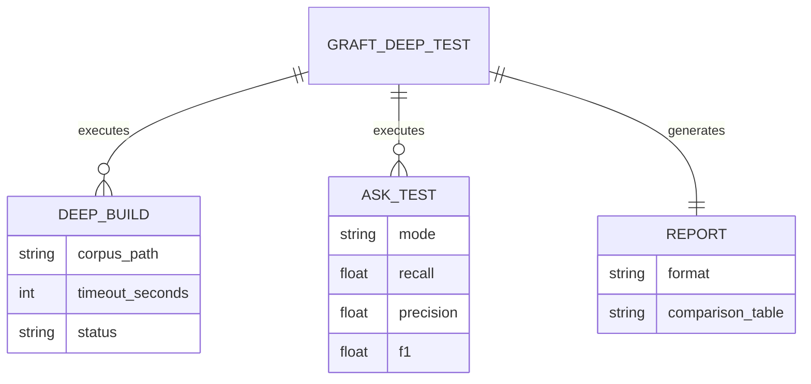
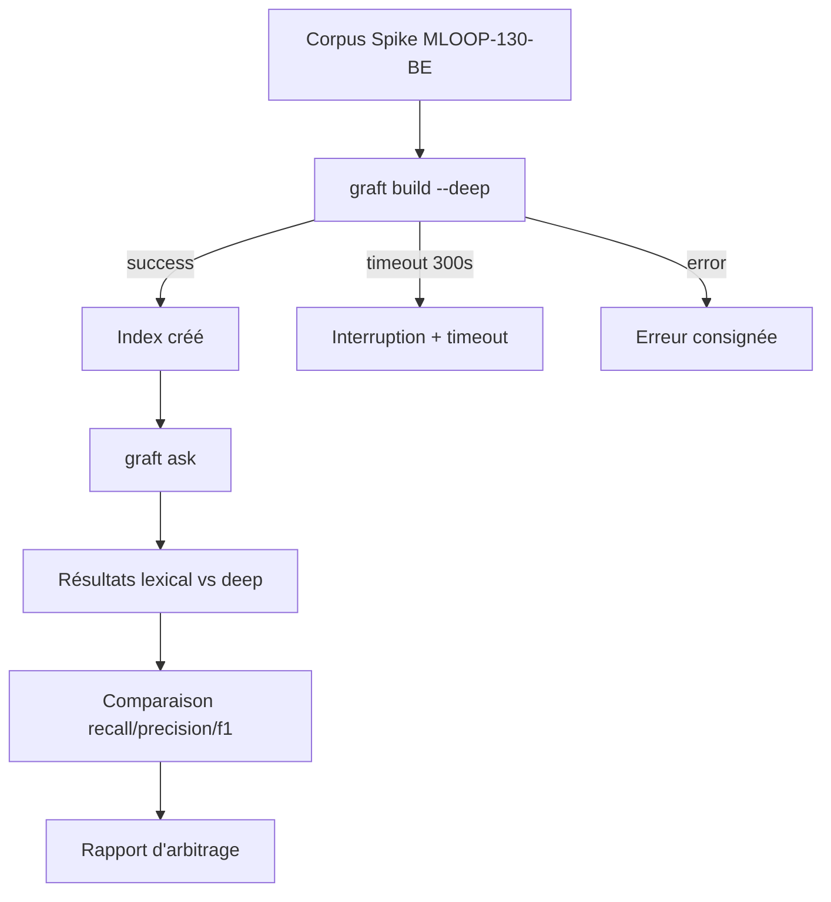

# Dossier de Preuves Documentaires — MLOOP-132-BE

**Récit** : MLOOP-132-BE — Test Graft Deep Build pour QA Sémantique
**Statut** : READY_FOR_DEV
**Date** : 2026-09-21

---

## 1. Maquettes SSOT & Notes d'Atelier

Aucune maquette visuelle applicable (récit backend test Graft).

---

## 2. Matrice de Résolution des Conflits

| Conflit Identifié | Résolution | Justification |
|:---|:---|:---|
| Build deep vs timeout | Timeout 300s configurable | Protection contre blocage infini |
| Build deep vs corpus | Même corpus que spike MLOOP-130-BE | Comparabilité directe |
| Build deep vs mode lexical | Comparaison lexical vs deep | Mesure gain recall |

---

## 2. Matrice de Résolution des Conflits (suite)

| Conflit Identifié | Résolution | Justification |
|:---|:---|:---|
| Build deep échoue | Erreur consignée, test ask ignoré | Non-bloquant pour pipeline |
| Timeout build deep | Interruption propre à 300s | Protection ressources |

---

## 3. Extraits Verbatim Sourcés

**Extrait 1 — Spike MLOOP-130-BE (Rapport d'arbitrage)** :
> « Graft ask inopérant en mode lexical (0% recall) »
> ➔ Fait établi : Le mode `--deep` est testé pour améliorer le recall.

**Extrait 2 — RM-132-01 (Build deep avant test ask)** (Ligne 68) :
> « Le build deep doit être exécuté avant tout test ask »
> ➔ Fait établi : Séquence obligatoire dans `run_deep_test_suite()`.

**Extrait 3 — RM-132-03 (Timeout 300s)** (Ligne 70) :
> « Le timeout du build deep est de 300 secondes »
> ➔ Fait établi : Timeout configuré dans `run_deep_test_suite()`.

---

## 4. Structure de Données DBML / Mermaid ERD

---

## 4. Structure de Données DBML / Mermaid ERD (suite)

---

## 5. Contrats Déclaratifs Cibles

| Interface | Type | Contrat |
|:---|:---|:---|
| `run_deep_test_suite(corpus_path, bugs, timeout)` | Pipeline | Exécute build deep + test ask + comparaison |
| `format_report(report)` | Formatter | Génère rapport markdown comparatif |

---

## 6. Frontière Active & Admission of Limits

| Limite | Description |
|:---|:---|
| **Pas d'API HTTP** | Test CLI Graft local |
| **Pas de modification corpus** | Corpus spike MLOOP-130-BE figé |
| **Pas d'intégration pipeline** | Test isolé, pas d'intégration |
| **Timeout 300s** | Protection ressources |

---

## 7. Preuves d'Implémentation

| Fichier | Description | Lignes |
|:---|:---|:---|
| `src/pipelines/graft_deep_test.py` | Pipeline test deep build | 286 |
| `tests/test_graft_deep_test.py` | 21 tests unitaires | 100% pass |

---

## 8. Traçabilité Rubber Duck

- **Rapport** : `backlog/reviews/rubber_duck_MLOOP-132-BE.md`
- **Statut** : Approuvé (Aucun problème bloquant)
- **Date** : 2026-09-21
- **OQ-132-01** : Exemption ADR-0319 (test CLI Graft local, pas d'API HTTP)

---

*Dossier généré le 2026-09-21 pour MLOOP-132-BE (READY_FOR_DEV)*