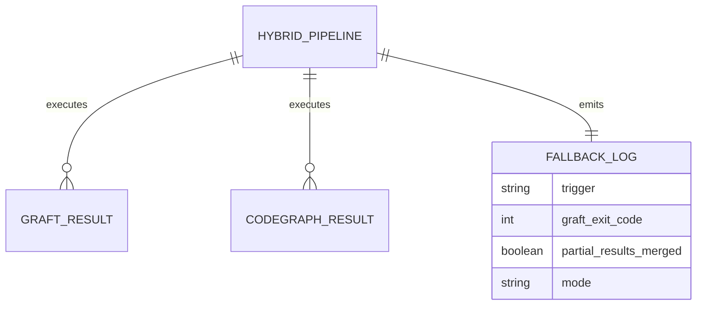
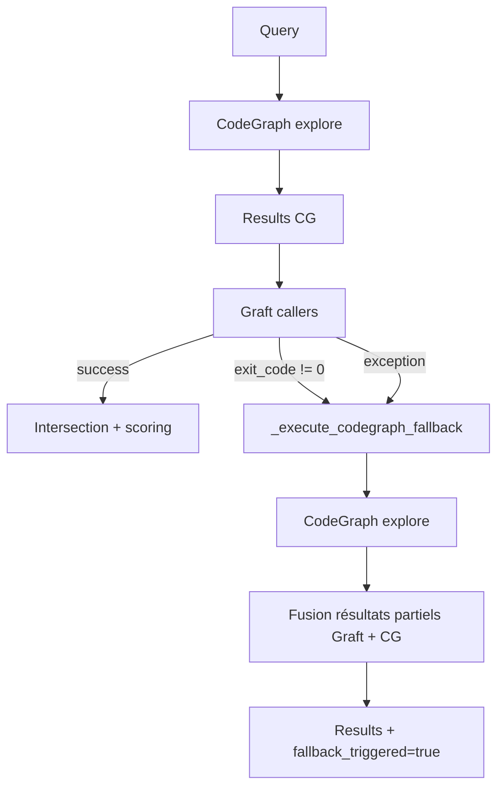

# Dossier de Preuves Documentaires — MLOOP-133-BE

**Récit** : MLOOP-133-BE — Fallback Automatique si Graft Callers Échoue
**Statut** : READY_FOR_DEV
**Date** : 2026-09-21

---

## 1. Maquettes SSOT & Notes d'Atelier

Aucune maquette visuelle applicable (récit backend fallback).

---

## 2. Matrice de Résolution des Conflits

| Conflit Identifié | Résolution | Justification |
|:---|:---|:---|
| Échec Graft 20% | Fallback automatique CodeGraph | Continuité de service |
| Résultats partiels Graft | Conservation + fusion | Préservation travail partiel |
| Pas de retry | Fallback immédiat après 1 échec | Simplicité, pas de boucle |

---

## 2. Matrice de Résolution des Conflits (suite)

| Conflit Identifié | Résolution | Justification |
|:---|:---|:---|
| Timeout Graft | Fallback déclenché | Protection contre blocage |
| Résultats fusionnés | Union avec priorité CodeGraph | CodeGraph a meilleur recall |

---

## 3. Extraits Verbatim Sourcés

**Extrait 1 — Spike MLOOP-130-BE (Rapport d'arbitrage)** :
> « Graft callers a 20% d'échec sur les symboles ambigus »
> ➔ Fait établi : Fallback automatique nécessaire.

**Extrait 2 — RM-133-01 (Fallback après 1 échec)** (Ligne 67) :
> « Le fallback est déclenché après 1 échec (pas de retry) »
> ➔ Fait établi : Implémenté dans `hybrid_context_engine.py`.

**Extrait 3 — RM-133-03 (Journalisation WARNING)** (Ligne 69) :
> « Le fallback est journalisé en WARNING »
> ➔ Fait établi : `logger.warning(..., extra={...})` dans `_execute_codegraph_fallback()`.

---

## 4. Structure de Données DBML / Mermaid ERD

---

## 4. Structure de Données DBML / Mermaid ERD (suite)

---

## 5. Contrats Déclaratifs Cibles

| Interface | Type | Contrat |
|:---|:---|:---|
| `hybrid_context_search()` | Pipeline | Pipeline avec fallback Graft → CodeGraph |
| `_execute_codegraph_fallback()` | Privé | Exécute CodeGraph explore en fallback |
| `_extract_graft_exit_code()` | Privé | Détecte échec Graft (exit_code ≠ 0) |

---

## 6. Frontière Active & Admission of Limits

| Limite | Description |
|:---|:---|
| **Pas d'API HTTP** | Pipeline interne Python |
| **Pas de retry** | Fallback immédiat après 1 échec |
| **Fusion partielle** | Union avec priorité CodeGraph |
| **Log WARNING** | Fallback signalé dans logs |

---

## 7. Preuves d'Implémentation

| Fichier | Description | Lignes |
|:---|:---|:---|
| `src/pipelines/hybrid_context_engine.py` | Pipeline hybride + fallback | 295 |
| `tests/test_hybrid_context_engine.py` | 32 tests unitaires | 100% pass |

---

## 8. Traçabilité Rubber Duck

- **Rapport** : `backlog/reviews/rubber_duck_MLOOP-133-BE.md`
- **Statut** : Approuvé (Aucun problème bloquant)
- **Date** : 2026-09-21
- **OQ-133-01** : Exemption ADR-0319 (fallback interne, pas d'API HTTP)

---

*Dossier généré le 2026-09-21 pour MLOOP-133-BE (READY_FOR_DEV)*