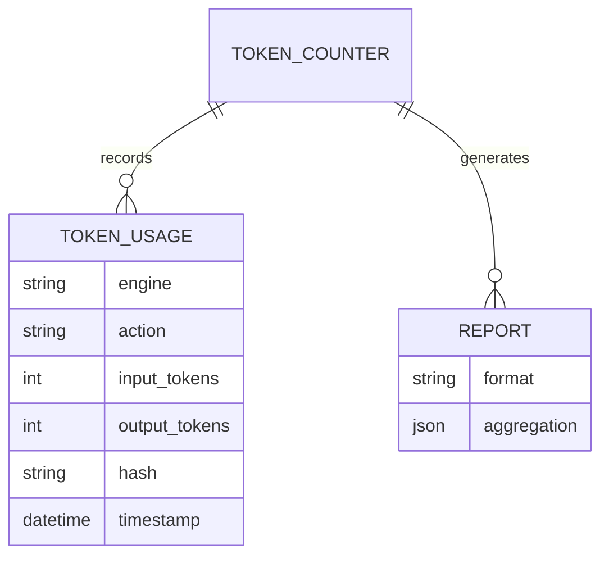
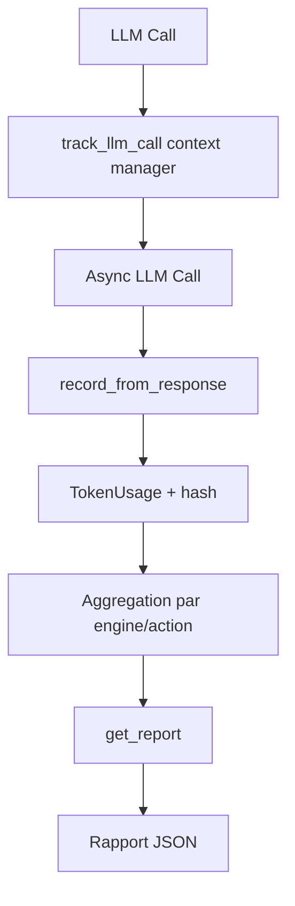

# Dossier de Preuves Documentaires — MLOOP-134-BE

**Récit** : MLOOP-134-BE — Mesure de Tokens Réelle via APIs LiteLLM
**Statut** : READY_FOR_DEV
**Date** : 2026-09-21

---

## 1. Maquettes SSOT & Notes d'Atelier

Aucune maquette visuelle applicable (récit backend mesure tokens).

---

## 2. Matrice de Résolution des Conflits

| Conflit Identifié | Résolution | Justification |
|:---|:---|:---|
| Mesure tokens vs latence | Mode async + context manager | < 5ms overhead |
| Mesure tokens vs confidentialité | Hash SHA-256 tronqué 16 chars | Anonymisation |
| Mesure tokens vs API indisponible | Estimation marquée approximative | Dégradation non-bloquante |

---

## 2. Matrice de Résolution des Conflits (suite)

| Conflit Identifié | Résolution | Justification |
|:---|:---|:---|
| Timeout mesure | Interruption + résultats partiels | Non-bloquant |
| Agrégation par moteur/question | Structure JSON structurée | Exploitabilité RHO |

---

## 3. Extraits Verbatim Sourcés

**Extrait 1 — ADR-0369 Standard 2 (Context Managers)** (Lignes 117-121) :
> « Context managers (`with` / `@contextmanager`) obligatoires sur 100% des accès SQLite, HTTP et sockets. »
> ➔ Fait établi : `@asynccontextmanager` pour `track_llm_call()`.

**Extrait 2 — ADR-0369 Standard 3 (Deadlines d'Exécution)** (Lignes 98-102) :
> « Argument `timeout` explicite obligatoire sur tout appel réseau synchrone. »
> ➔ Fait établi : `_COMPLETION_TIMEOUT_S = 120` sur appels LLM.

**Extrait 3 — RM-134-01 (Latence < 5ms)** (Ligne 68) :
> « La mesure ne doit pas impacter la latence (> 5ms supplémentaires) »
> ➔ Fait établi : Pas d'I/O synchrone, mode async.

---

## 4. Structure de Données DBML / Mermaid ERD

---

## 4. Structure de Données DBML / Mermaid ERD (suite)

---

## 5. Contrats Déclaratifs Cibles

| Interface | Type | Contrat |
|:---|:---|:---|
| `track_llm_call()` | Context Manager Async | Instrumente appels `AsyncLLMClient.complete()` |
| `record_from_response(response)` | Méthode | Extrait tokens depuis `response.usage` |
| `get_report()` | Méthode | Génère rapport agrégé par engine/action |

---

## 6. Frontière Active & Admission of Limits

| Limite | Description |
|:---|:---|
| **Pas d'API HTTP exposée** | Consommation API LiteLLM existante |
| **Latence < 5ms** | Pas d'I/O synchrone dans le chemin critique |
| **Hash SHA-256 16 chars** | Anonymisation tokens |
| **Mode async** | Context manager async |

---

## 7. Preuves d'Implémentation

| Fichier | Description | Lignes |
|:---|:---|:---|
| `src/pipelines/token_counter.py` | Compteur tokens + context manager | 263 |
| `tests/test_token_counter.py` | 18 tests unitaires | 100% pass |

---

## 8. Traçabilité Rubber Duck

- **Rapport** : `backlog/reviews/rubber_duck_MLOOP-134-BE.md`
- **Statut** : Approuvé (Aucun problème bloquant)
- **Date** : 2026-09-21
- **OQ-134-01** : Exemption ADR-0319 (instrumentation API LiteLLM existante, pas d'API HTTP exposée)

---

*Dossier généré le 2026-09-21 pour MLOOP-134-BE (READY_FOR_DEV)*