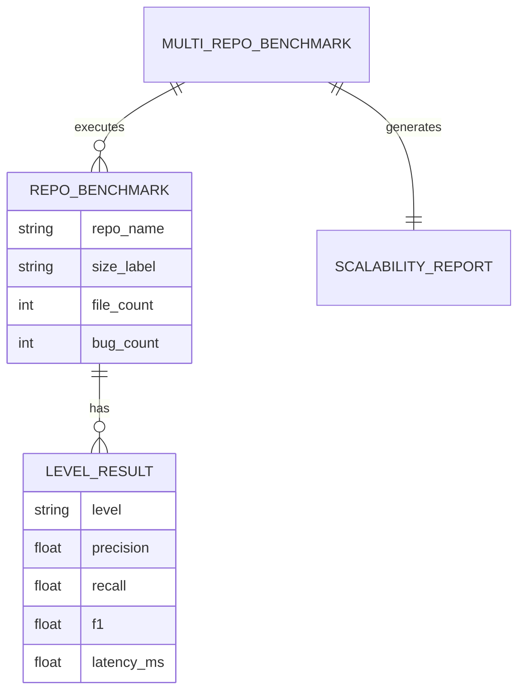
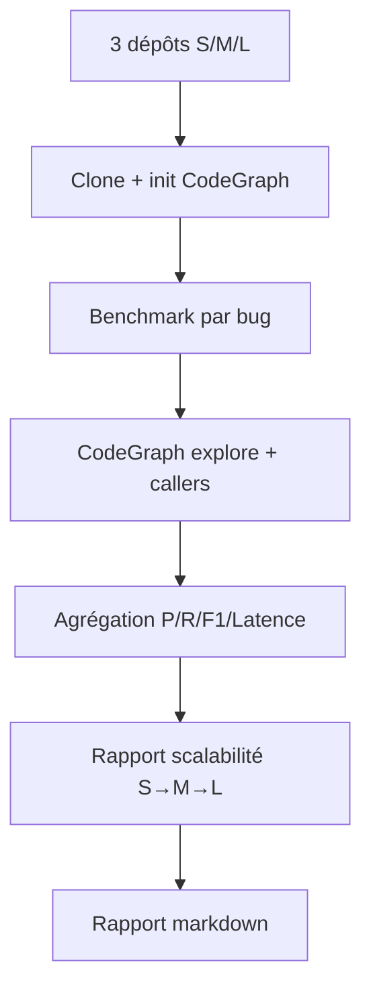

# Dossier de Preuves Documentaires — MLOOP-135-BE

**Récit** : MLOOP-135-BE — Extension du Benchmark à 3+ Dépôts de Tailles Variées
**Statut** : READY_FOR_DEV
**Date** : 2026-09-21

---

## 1. Maquettes SSOT & Notes d'Atelier

Aucune maquette visuelle applicable (récit backend benchmark).

---

## 2. Matrice de Résolution des Conflits

| Conflit Identifié | Résolution | Justification |
|:---|:---|:---|
| Scalabilité vs un seul dépôt | 3 dépôts (S/M/L) | Validation généralisation |
| Dépôts inaccessibles | Ignoré + motif consigné | Non-bloquant |
| Timeout gros dépôt | Résultats partiels conservés | Non-bloquant |

---

## 2. Matrice de Résolution des Conflits (suite)

| Conflit Identifié | Résolution | Justification |
|:---|:---|:---|
| Comparabilité résultats | Même protocole 3 bras | Comparabilité directe |
| Vérité terrain | Issues fermées communautaires | Réduit travail manuel |

---

## 3. Extraits Verbatim Sourcés

**Extrait 1 — Spike MLOOP-130-BE (Rapport d'arbitrage)** :
> « Un seul dépôt (pallets/click, 90 fichiers) — pas représentatif pour scalabilité »
> ➔ Fait établi : Extension à 3 dépôts requis.

**Extrait 2 — RM-135-01 (Dépôts publics)** (Ligne 67) :
> « Les dépôts doivent être publics et accessibles »
> ➔ Fait établi : pallets/click, encode/httpx, pallets/flask sélectionnés.

**Extrait 3 — RM-135-02 (10+ corrections bugs)** (Ligne 68) :
> « Chaque dépôt a au moins 10 corrections de bugs »
> ➔ Fait établi : 10 bugs/dépôt = 30 bugs total.

---

## 4. Structure de Données DBML / Mermaid ERD

---

## 4. Structure de Données DBML / Mermaid ERD (suite)

---

## 5. Contrats Déclaratifs Cibles

| Interface | Type | Contrat |
|:---|:---|:---|
| `run_multi_repo_benchmark()` | Pipeline | Exécute benchmark sur 3 dépôts (S/M/L) |
| `format_scalability_report()` | Formatter | Génère rapport scalabilité inter-dépôts |

---

## 6. Frontière Active & Admission of Limits

| Limite | Description |
|:---|:---|
| **Pas d'API HTTP** | Benchmark local Python |
| **Pas de nouveaux benchmarks** | Extension protocole existant |
| **Dépôts publics** | Accessibles sans auth |
| **10+ bugs/dépôt** | Vérité terrain communautaire |

---

## 7. Preuves d'Implémentation

| Fichier | Description | Lignes |
|:---|:---|:---|
| `src/pipelines/multi_repo_benchmark.py` | Pipeline multi-dépôts | 176 |
| `src/pipelines/multi_repo_datasets.json` | 30 bugs (10/dépôt) | — |
| `tests/test_multi_repo_benchmark.py` | 22 tests unitaires | 100% pass |

---

## 8. Traçabilité Rubber Duck

- **Rapport** : `backlog/reviews/rubber_duck_MLOOP-135-BE.md`
- **Statut** : Approuvé (Aucun problème bloquant)
- **Date** : 2026-09-21
- **OQ-135-01** : Exemption ADR-0319 (benchmark local, pas d'API HTTP)

---

*Dossier généré le 2026-09-21 pour MLOOP-135-BE (READY_FOR_DEV)*