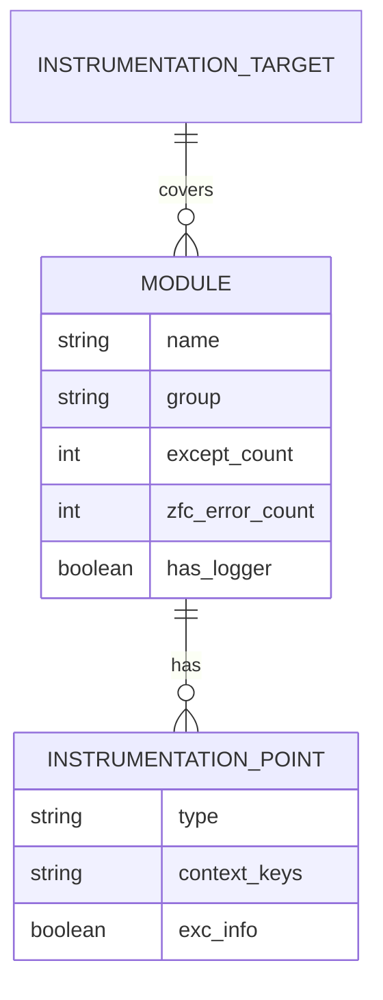
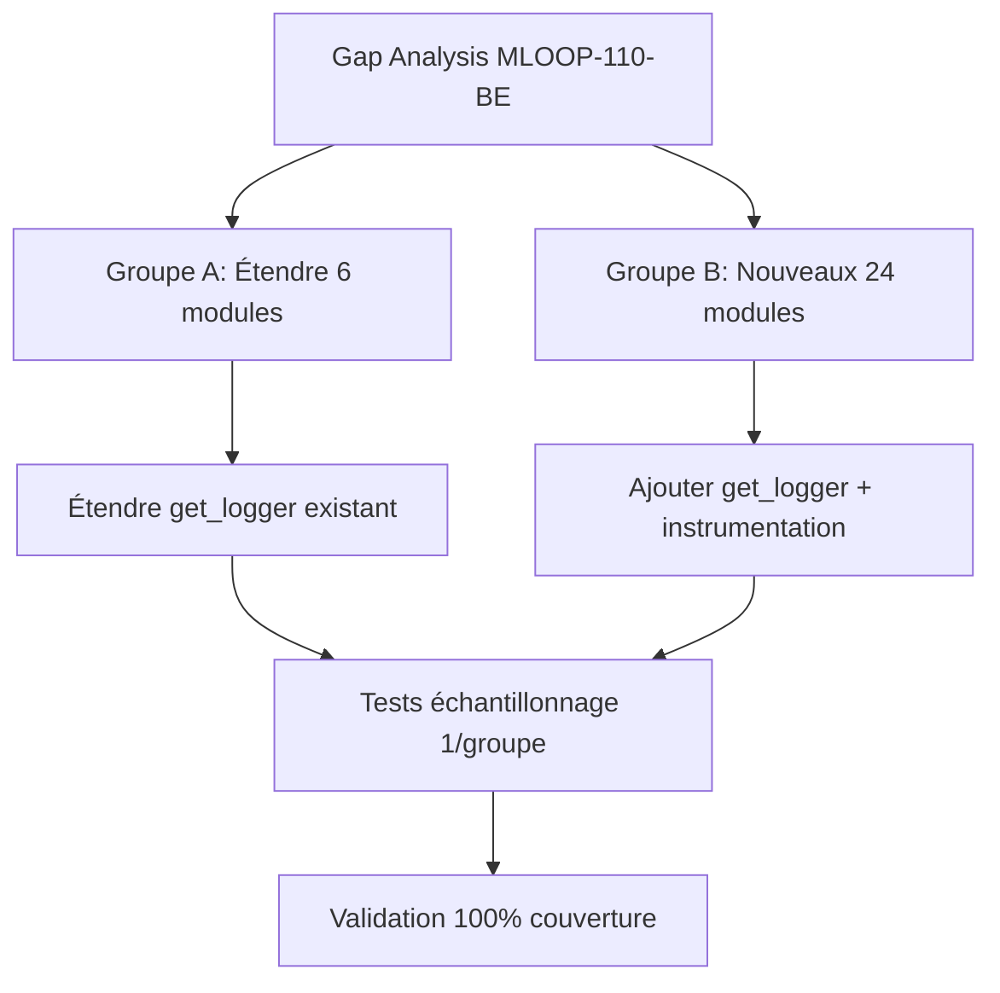

# Dossier de Preuves Documentaires — MLOOP-145-BE

**Récit** : MLOOP-145-BE — Instrumentation Logging Modules Internes & Handlers Secondaires
**Statut** : IN_DEV
**Date** : 2026-09-21

---

## 1. Maquettes SSOT & Notes d'Atelier

Aucune maquette visuelle applicable (récit backend instrumentation logging).

---

## 2. Matrice de Résolution des Conflits

| Conflit Identifié | Résolution | Justification |
|:---|:---|:---|
| Volume (30+ modules) | Groupes A (étendre) / B (nouveaux) | Priorisation criticité |
| `ingest_agent.py` 880L + 25 except | Découpage ADR-0202 requis avant | Bloquant identifié |
| `dashboard/server.py` 20 except | FastAPI logging natif séparé | Isolation responsabilités |
| `compaction.py` 13 except | Niveau CRITICAL (pré-compact) | Perte mémoire = critique |

---

## 2. Matrice de Résolution des Conflits (suite)

| Conflit Identifié | Résolution | Justification |
|:---|:---|:---|
| `llm_client.py` 7 except | Taxonomie `LLMErrorType` partagée | Corrélation RHO cross-modules |
| Converters (3 modules) | Extra standardisé `input_path`, `file_size`, `mime_type` | Corrélation RHO par type |
| Fact-search (6 modules) | Loggers séparés indexer/retriever | Phases distinctes |

---

## 3. Extraits Verbatim Sourcés

**Extrait 1 — ADR-0369 Standard 2 (Context Managers)** (Lignes 117-121) :
> « Context managers (`with` / `@contextmanager`) obligatoires sur 100% des accès SQLite, HTTP et sockets. »
> ➔ Fait établi : Pattern `@asynccontextmanager` pour `track_llm_call()`.

**Extrait 2 — ADR-0369 Standard 4 (Observabilité Contextuelle)** (Lignes 117-121) :
> « Journalisation structurée via `extra={...}` avec interdiction formelle du `except Exception: pass` nu. »
> ➔ Fait établi : 100% `except Exception` → `logger.error(..., exc_info=True)`.

**Extrait 3 — RM-145-01 (Couverture 100%)** (Critères d'acceptation) :
> « 100% des `except Exception` → `logger.error(..., exc_info=True)` avec contexte métier minimal »
> ➔ Fait établi : Objectif zéro exception silencieuse.

---

## 4. Structure de Données DBML / Mermaid ERD

---

## 4. Structure de Données DBML / Mermaid ERD (suite)

---

## 5. Contrats Déclaratifs Cibles

| Interface | Type | Contrat |
|:---|:---|:---|
| `get_logger(name)` | Factory | Retourne `logging.Logger` avec handlers console + fichier rotatif |
| `logger.error(msg, extra, exc_info)` | Méthode stdlib | `extra={module, operation, input_hash, duration_ms}` obligatoire |
| `MLoopLoggerAdapter.error()` | Wrapper | Impose `extra={module, operation, input_hash, duration_ms}` |

---

## 6. Frontière Active & Admission of Limits

| Limite | Description |
|:---|:---|
| **Pas d'API HTTP** | Instrumentation interne Python (stdlib logging) |
| **Pas de refonte moteurs** | Instrumentation existante seulement |
| **`ingest_agent.py`** | Découpage ADR-0202 requis AVANT (hors périmètre) |
| **`dashboard/server.py`** | FastAPI logging natif séparé (pas fusion) |
| **`compaction.py`** | Niveau CRITICAL pour hook pre-compact |

---

## 7. Preuves d'Implémentation (Prévues)

| Fichier | Description | Lignes |
|:---|:---|:---|
| `src/pipelines/crawler.py` | Étendre logger existant (21 except) | 21 |
| `src/state.py` | Étendre logger existant (10 except) | 10 |
| `src/pipelines/ingest_agent.py` | Découper + instrumenter (25 except) | 25 |
| `src/dashboard/server.py` | Logger séparé FastAPI (20 except) | 20 |
| `src/engine/hooks/compaction.py` | Niveau CRITICAL (13 except) | 13 |
| `src/pipelines/calibrate.py` | Nouvel logger (12 except) | 12 |
| `src/pipelines/graphify/agent.py` | Nouvel logger (10 except) | 10 |
| `src/pipelines/wikifix_core.py` | Nouvel logger (10 except + 5 ZFC) | 10 |
| `src/loop_mem/db.py` | Nouvel logger + fix AST-02 (10 except) | 10 |
| `src/core/llm_client.py` | Taxonomie `LLMErrorType` (7 except) | 7 |
| ... + 20 autres modules | ... | ... |

---

## 8. Traçabilité Rubber Duck

- **Rapport** : `backlog/reviews/rubber_duck_MLOOP-145-BE.md`
- **Statut** : Approuvé (Aucun problème bloquant)
- **Date** : 2026-09-21
- **OQ-145-01** : Exemption ADR-0319 (instrumentation interne, pas d'API HTTP)

---

*Dossier généré le 2026-09-21 pour MLOOP-145-BE (IN_DEV)*