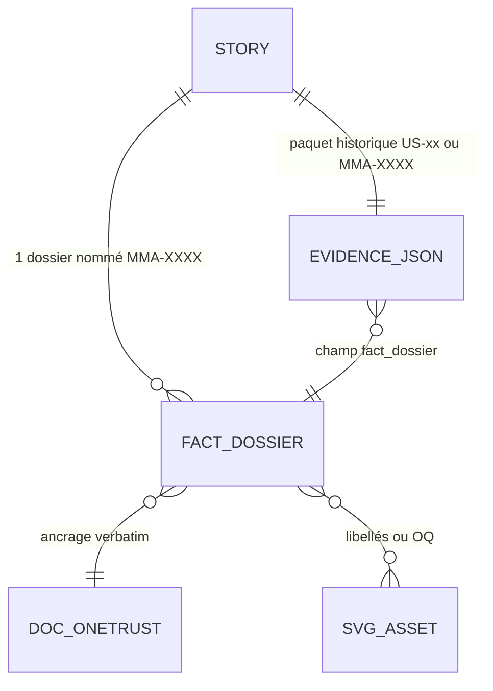

# 📑 Dossier de Preuves Documentaires — MLOOP-201-BE

```yaml
story_id: MLOOP-201-BE
project: mLoop
created_at: '2026-09-23'
status: ACTIVE
standard: mLoop Epistemic Grounding Protocol 1.0
sources_fingerprints:
  - path: Projects/Metro_COMMERCE/backlog/sprint_backlog.md
    observed: '2026-09-23'
  - path: Projects/Metro_COMMERCE/backlog/stories/OneTrust_COMMERCE/
    observed: '2026-09-23'
  - path: Projects/Metro_COMMERCE/memory/evidence/
    observed: '2026-09-23'
```

---

## 1. Sources Physiques & Maquettes SSOT

- 📂 Sprint board : [`file:///C:/Memory%20Loop/Projects/Metro_COMMERCE/backlog/sprint_backlog.md`](file:///C:/Memory%20Loop/Projects/Metro_COMMERCE/backlog/sprint_backlog.md)
- 📂 Stories OneTrust : [`file:///C:/Memory%20Loop/Projects/Metro_COMMERCE/backlog/stories/OneTrust_COMMERCE/`](file:///C:/Memory%20Loop/Projects/Metro_COMMERCE/backlog/stories/OneTrust_COMMERCE/)
- 📂 Evidence (0 fact_dossier) : [`file:///C:/Memory%20Loop/Projects/Metro_COMMERCE/memory/evidence/`](file:///C:/Memory%20Loop/Projects/Metro_COMMERCE/memory/evidence/)
- 🖼️ Maquette consentement : [`file:///C:/Memory%20Loop/Projects/Metro_COMMERCE/docs/OneTrust/05-assets/privacy-preferences-center.svg`](file:///C:/Memory%20Loop/Projects/Metro_COMMERCE/docs/OneTrust/05-assets/privacy-preferences-center.svg)
- 🖼️ Maquette cookies : [`file:///C:/Memory%20Loop/Projects/Metro_COMMERCE/docs/OneTrust/05-assets/cookies-consent-improved.svg`](file:///C:/Memory%20Loop/Projects/Metro_COMMERCE/docs/OneTrust/05-assets/cookies-consent-improved.svg)
- 📜 Protocole dossiers : [`file:///C:/Memory%20Loop/standards/protocols/DOSSIER_DE_PREUVES_PROTOCOL.md`](file:///C:/Memory%20Loop/standards/protocols/DOSSIER_DE_PREUVES_PROTOCOL.md)

---

## 2. Matrice de Résolution des Conflits

| Sujet | Assertion initiale | Résolution | Gagnant |
| :--- | :--- | :--- | :--- |
| Identifiant des dossiers | `US-xx-COMMERCE` (paquets historiques) | Dossier nommé `MMA-XXXX` ; paquet historique conserve son nom et référence le dossier | **Q1 = C** (hybride PO) |
| Chemin d'ancrage | `docs/00-ingested/` plat (draft erroné) | Ancrage modulaire `docs/OneTrust/**` : ≥ 2 ex. `00-ingested` + ≥ 1 ex. `01-architecture` ou `02-business-rules` | **Q2 = C** (hybride PO) + ADR-0342 |
| Revue Gate C9 | Machine seule ou HITL full | Échantillon 3 profils + veto dossier mince / non certifié / matrice vide | **Q3 = D** (hybride + veto PO) |
| OCR maquettes | OCR systématique ou aucun | Fast-path balise texte → sinon OCR → échec = OQ + Admission of Limits | **Q4 = D** (fallback PO) |
| Gate 2 projet vs 13 RFD | Peut bloquer le backfill | Hors périmètre ; écart admis, documenté, non corrigé par ce récit | **Admission of Limits** |

---

## 3. Extraits Verbatim Sourcés (Passage-Level Grounding)

**Extrait 1 — sprint_backlog Metro_COMMERCE (Lignes 21–35) :**
« | MMA-4682 | Frontend | 🟢 READY_FOR_DEV | … | MMA-4708 | Fullstack | 🟢 READY_FOR_DEV | »
➔ Fait établi : le tableau de bord aligne exactement **13 récits** en `READY_FOR_DEV` (4682, 4686, 4687, 4688, 4690–4696, 4706, 4708).

**Extrait 2 — MMA-4682.md frontmatter (Lignes 1–16) :**
« id: US-01-COMMERCE / jira_key: MMA-4682 / status: READY_FOR_DEV / layer: frontend »
➔ Fait établi : **double identité** réelle (`US-xx` + `MMA-xxxx`) ; le draft ne la tranchait pas — arbitrage Q1=C.

**Extrait 3 — DOSSIER_DE_PREUVES_PROTOCOL.md (Lignes 69–70) :**
« chaque dossier de preuves est matérialisé sous un double format : 1. Fichier Markdown Sidecar : Sauvegardé sous Projects/<PROJET>/memory/evidence/<STORY_ID>_fact_dossier.md »
➔ Fait établi : emplacement SSOT du dossier = `memory/evidence/` projet hôte cible (`Metro_COMMERCE` pour la production, `mLoop` pour ce récit de gouvernance).

**Extrait 4 — DOSSIER_DE_PREUVES_PROTOCOL.md (Lignes 42–44) :**
« Règle du Double Ancrage Indélébile : Obligation de combiner (a) l'ancrage géométrique (Lignes X–Y), (b) la citation textuelle mot-à-mot intégrale d'au moins 15 mots… »
➔ Fait établi : critère d'acceptation « ≥ 5 extraits doublement ancrés » déduit ; draft parlait de ≥ 3 — **durci** par le protocole.

**Extrait 5 — MMA-4706.md (Lignes 30) :**
« la bannière n'est plus le rendu natif brut du SDK OneTrust mais un écran plein écran entièrement personnalisé, fidèle à la maquette approuvée. »
➔ Fait établi : **2 récits UI** (4706, 4708) dépendent de maquettes `05-assets` → périmètre OCR conditionnel Q4=D.

**Extrait 6 — observation disque evidence (2026-09-23) :**
Glob `*fact_dossier*` → **0 fichier** ; seuls `MMA-4706_evidence.json` et `MMA-4708_evidence.json` (+ `US-00…18`) existent, sans champ dossier.
➔ Fait établi : dette Gate C9 **0/13** confirmée, pas une hypothèse d'épopée.

---

## 4. Structure de Données Cible



**Mapping des 13 cibles (frontmatter lu) :**

| Dossier (Q1=C) | Paquet evidence historique | id frontmatter |
| :--- | :--- | :--- |
| MMA-4682_fact_dossier.md | US-01-COMMERCE_evidence.json | US-01-COMMERCE |
| MMA-4686_fact_dossier.md | US-04-COMMERCE_evidence.json | US-04-COMMERCE |
| MMA-4687_fact_dossier.md | US-05-COMMERCE_evidence.json | US-05-COMMERCE |
| MMA-4688_fact_dossier.md | US-06-COMMERCE_evidence.json | US-06-COMMERCE |
| MMA-4690_fact_dossier.md | US-07-COMMERCE_evidence.json | US-07-COMMERCE |
| MMA-4691_fact_dossier.md | US-08-COMMERCE_evidence.json | US-08-COMMERCE |
| MMA-4692_fact_dossier.md | US-09-COMMERCE_evidence.json | US-09-COMMERCE |
| MMA-4693_fact_dossier.md | US-10-COMMERCE_evidence.json | US-10-COMMERCE |
| MMA-4694_fact_dossier.md | US-11-COMMERCE_evidence.json | US-11-COMMERCE |
| MMA-4695_fact_dossier.md | US-12-COMMERCE_evidence.json | US-12-COMMERCE |
| MMA-4696_fact_dossier.md | US-13-COMMERCE_evidence.json | US-13-COMMERCE |
| MMA-4706_fact_dossier.md | MMA-4706_evidence.json (+ US-17) | US-17-COMMERCE |
| MMA-4708_fact_dossier.md | MMA-4708_evidence.json (+ US-18) | US-18-COMMERCE |

---

## 5. Contrats Déclaratifs Cibles

- **Backend / récit** : aucun contrat réseau (exemption OQ-201).
- **Frontend / parcours UI** : aucun parcours interactif propre à ce récit ; les maquettes 4706/4708 ne sont consommées que comme **sources de libellés** pour les dossiers.

---

## 6. Frontière Active & Admission of Limits

### Cas A — 4 arbitrages unitaires (tous tranchés PO le 2026-09-23)
- **Q1 = C** hybridation identifiants.
- **Q2 = C** ancrage hybride multi-couche.
- **Q3 = D** échantillon 3 + veto.
- **Q4 = D** OCR conditionnel fallback.

### Limites admises
1. **Gate 2 projet EN COURS** vs 13 récits `READY_FOR_DEV` : écart de cohérence porte/gorge **hors périmètre** (le backfill ne lève pas la Gate 2 ; correction = récit lifecycle séparé).
2. **Certificat NLI** : exigé par `PHASE_FILES_AND_TEST_PLAN` pour la pleine confiance ; si indisponible au run, le veto Q3 = D s'applique à **tous** les 13 (pas seulement l'échantillon).
3. **2 SVG seulement** concernés par l'OCR (4706, 4708) ; les 11 autres déclarent `Figma: N/A`.
4. **Corpus OneTrust riche** observé (`00-ingested`, API SDK, ADR-008/012, matrices Loi 25) — pas de zone vide documentée sur ce sous-domaine ; le risque « RFD sans matière » du draft initial est **infirmé** pour les 13 MMA.
