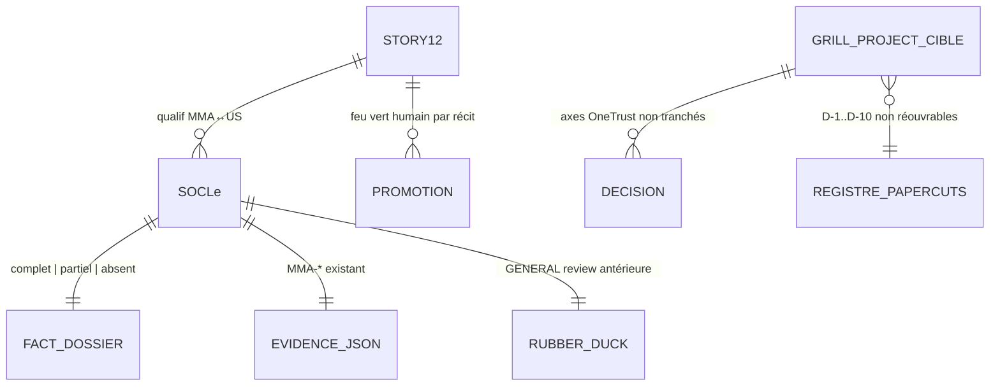

# 📑 Dossier de Preuves Documentaires — MLOOP-202-BE

```yaml
story_id: MLOOP-202-BE
project: mLoop
created_at: '2026-09-23'
status: ACTIVE
standard: mLoop Epistemic Grounding Protocol 1.0
sources_fingerprints:
  - path: Projects/Metro_FOOD/backlog/sprint_backlog.md
    observed: '2026-09-23'
  - path: Projects/Metro_FOOD/backlog/stories/OneTrust_FOOD/
    observed: '2026-09-23'
  - path: Projects/Metro_FOOD/memory/evidence/
    observed: '2026-09-23'
  - path: Projects/Metro_FOOD/docs/PAPERCUTS/04-transverse/grill-project-decisions-2026-09-23.md
    observed: '2026-09-23'
```

---

## 1. Sources Physiques & Maquettes SSOT

- 📂 Sprint board FOOD : [`file:///C:/Memory%20Loop/Projects/Metro_FOOD/backlog/sprint_backlog.md`](file:///C:/Memory%20Loop/Projects/Metro_FOOD/backlog/sprint_backlog.md)
- 📂 Stories OneTrust FOOD : [`file:///C:/Memory%20Loop/Projects/Metro_FOOD/backlog/stories/OneTrust_FOOD/`](file:///C:/Memory%20Loop/Projects/Metro_FOOD/backlog/stories/OneTrust_FOOD/)
- 📂 Evidence FOOD : [`file:///C:/Memory%20Loop/Projects/Metro_FOOD/memory/evidence/`](file:///C:/Memory%20Loop/Projects/Metro_FOOD/memory/evidence/)
- 📜 Registre macro PAPERCUTS : [`file:///C:/Memory%20Loop/Projects/Metro_FOOD/docs/PAPERCUTS/04-transverse/grill-project-decisions-2026-09-23.md`](file:///C:/Memory%20Loop/Projects/Metro_FOOD/docs/PAPERCUTS/04-transverse/grill-project-decisions-2026-09-23.md)
- 📜 Note légale hors-ligne : [`file:///C:/Memory%20Loop/Projects/Metro_FOOD/docs/OneTrust/04-transverse/NOTE_LEGAL_OFFLINE_CONSENT_ERWAN_2026-09-23.md`](file:///C:/Memory%20Loop/Projects/Metro_FOOD/docs/OneTrust/04-transverse/NOTE_LEGAL_OFFLINE_CONSENT_ERWAN_2026-09-23.md)
- 📜 Protocole dossiers : [`file:///C:/Memory%20Loop/standards/protocols/DOSSIER_DE_PREUVES_PROTOCOL.md`](file:///C:/Memory%20Loop/standards/protocols/DOSSIER_DE_PREUVES_PROTOCOL.md)

---

## 2. Matrice de Résolution des Conflits

| Sujet | Assertion initiale | Résolution | Gagnant |
| :--- | :--- | :--- | :--- |
| Portée macro | Skip ou réutiliser D-1→D-10 telles quelles | Hybride : non réouvrables + mini-grill OneTrust ciblé avant micro | **Q1 = C** (PO) |
| Socle des 12 | Tout depuis zéro ou confiance aveugle aux dossiers | Qualification MMA↔US préalable, zéro auto-validation CA, Sentinel relancé | **Q2 = C** (PO) |
| 7 ON_HOLD + Offline | Embraquer ou silence | Out-of-Scope dur + clause Légal OQ-OFF-05 porte séparée | **Q3 = C** (PO) |
| Comptage cibles | « 12 IN_REVIEW » épopée | Confirmé disque : exactement 12 (4658…4705), tous OneTrust_FOOD | **Constat** |
| Commande CLI | `grill-me` dans le draft | CLI réelle = `grill --story` | **Constat CLI** |

---

## 3. Extraits Verbatim Sourcés (Passage-Level Grounding)

**Extrait 1 — sprint_backlog Metro_FOOD (Lignes 24–37) :**
« | MMA-4658 | Backend | 🟠 IN_REVIEW | … | MMA-4705 | Frontend | 🟠 IN_REVIEW | »
➔ Fait établi : **12 récits** exactement en `IN_REVIEW` (4658, 4659, 4661, 4663, 4664, 4668, 4673, 4674, 4676, 4677, 4704, 4705).

**Extrait 2 — grill-project-decisions-2026-09-23.md frontmatter (Lignes 6–7) :**
« status: "TERMINÉE — session grill-project clôturée le 2026-09-23 (10 décisions D-1 → D-10)" / scope: "Codebase FOOD uniquement (Metro / Super C / Food Basics)" »
➔ Fait établi : macro PAPERCUTS **clôturée** mais `scope` ≠ programme OneTrust des 12 → Q1=C (hybride, pas de réouverture ni de confiance aveugle).

**Extrait 3 — grill-project-decisions D-10 (Lignes 32–36) :**
« Auth/SSO/Guest Checkout reste HORS périmètre Papercuts… OQ-N maintenue ouverte pour l'atelier. »
➔ Fait établi : SSO/Circulaire **partiellement** touché hors scope des 12 → mini-grill ciblé requis (Q1).

**Extrait 4 — MMA-OFFLINE-DRAFT (Lignes 75–78) :**
« OQ-OFF-05 (LÉGAL — BLOQUANT READY_FOR_DEV)… Arbitrage formel requis du Département Légal (Erwan Mollard) avant tout passage à READY_FOR_DEV. »
➔ Fait établi : Offline = **porte légale séparée**, jamais dans la séquence des 12 (Q3=C).

**Extrait 5 — observation disque evidence Metro_FOOD (2026-09-23) :**
14× `US-xx-FOOD_fact_dossier.md` + 12× `MMA-{4658…4705}_evidence.json` + rubber_duck `backlog/reviews/GENERAL/`.
➔ Fait établi : socle **existe mais inégal** → qualification obligatoire (Q2=C), pas « tous à zéro » ni « tous complets ».

**Extrait 6 — sprint_backlog ON_HOLD (Lignes 46–52) :**
« | MMA-4050 | Frontend | 🔴 ON_HOLD | … | MMA-4056 | Frontend | 🔴 ON_HOLD | »
➔ Fait établi : **7 ON_HOLD** Offers hors 12 → Out-of-Scope confirmé (Q3=C).

---

## 4. Structure de Données Cible



**Mapping à figer en qualif (Q2) — 12 cibles :**
`MMA-4658, 4659, 4661, 4663, 4664, 4668, 4673, 4674, 4676, 4677, 4704, 4705` → `US-xx-FOOD` via frontmatter (non figé ici : **phase de qualification** du run).

---

## 5. Contrats Déclaratifs Cibles

- **Aucun contrat réseau** (exemption OQ-202).
- **Parcours UI** : sans interface propre ; corpus maquettes FOOD = source documentaire pour les revues, pas un contrat CTA de ce récit.

---

## 6. Frontière Active & Admission of Limits

### Cas A — 3 arbitrages unitaires (tranchés PO 2026-09-23)
- **Q1 = C** macro ciblée hybride.
- **Q2 = C** qualification du socle.
- **Q3 = C** hors périmètre Offers + porte Légal séparée.

### Limites admises
1. **Mapping MMA↔US des 12 non figé dans ce dossier** : produit en phase de qualification (Q2), pas inventé à l'avance. → **FIGÉ 2026-09-24** (voir §7).
2. **`grill-project` PAPERCUTS ≠ grill OneTrust** : mini-grill ciblé requis ; si axes déjà tranchés chez Tink/Légal ailleurs, référencer, ne pas reposer.
3. **Budget L (3–5 j)** : 1 macro ciblée + 12 micros interactifs — non automatisable.
4. **7 ON_HOLD + Offline** : exclus ; Offline bloqué OQ-OFF-05.
5. **Draft initial** portait `status: IN_REVIEW` (incohérent Palier) et citait `grill-me` (inexistant) — corrigés dans la haute fidélité.

---

## 7. Registre Macro Transverse — Session ciblée OneTrust FOOD (CLÔTURÉE 2026-09-24)

> Session transverse ciblée sur les axes consentement / synchronisation / circulaire-vue-externe.
> Registre PAPERCUTS (D-1→D-10) **référencé, jamais reposé**. Papercuts scope ≠ programme consentement.

| ID | Axe | Question | Décision | Statut |
| :--- | :--- | :--- | :--- | :--- |
| **MACRO-T1** | Circulaire vue externe | Périmètre exact de « circulaire en vue externe » ? | **A** — surfaces de consultation de la circulaire **hors session app authentifiée** avec tagger OneTrust actif ; FBT/OQ-H référencé, non reposé | ✅ Tranchée (PO) |
| **MACRO-T2** | Synchronisation consentement | Périmètre de la synchronisation pour la session macro ? | **B** — cohérence **inter-apps FOOD** (6 apps) via serveur OneTrust (`domainId`/`localeId`) ; **hors-ligne et cross-device non documenté exclus** (porte légale fermée) | ✅ Tranchée (PO) |
| **MACRO-T3** | Conflit serveur/local | Serveur OneTrust vs réglage local app — qui l'emporte ? | **A** — **serveur OneTrust prioritaire** ; divergence locale = retry de sync + log, **jamais** d'override client | ✅ Tranchée (PO) |
| **MACRO-T4** | Défaut opt-in strict | « Tout désactivé par défaut » — optionnelles vs strictement nécessaires ? | **RÉFÉRENCÉE, NON REPOSÉE** — C0002/C0003/C0004 « Désactivé par défaut » (`MMA-4652.md`) ; Consent Mode v2 `default=false` (guide banner V1 L45–58) ; C0001 OS runtimes exempt (Blindage Natif, Scan OneTrust) ; Firebase blindé (MMA-4661) | 📜 SSOT existant |

**Épuisement de frontière** : PO a confirmé la clôture (Q-M5 = clôture macro). Aucun autre axe transverse non tranché porté par les 12.

---

## 8. Qualification du Socle des 12 Récits (déterministe, 2026-09-24)

Appariement MMA↔US via frontmatter ; fact_dossier inspecté (comptage `Extrait N`) ; EvidencePack `MMA-*` apparié.
Seuils : COMPLET = fd ≥ 5 extraits **et** pack présent ; PARTIEL = fd présent mais < 5 extraits ; ABSENT = pas de fd.

| # | MMA | id | Story | fact_dossier | Extraits | EvidencePack | **Socle** |
| :-: | :--- | :--- | :-: | :-: | :-: | :--- | :--- |
| 1 | MMA-4658 | US-05-FOOD | ✅ | ✅ 12.7 Ko | **8** | MMA-4658_evidence.json | 🟢 **COMPLET** |
| 2 | MMA-4659 | US-06-FOOD | ✅ | ✅ 9.4 Ko | 4 | MMA-4659_evidence.json | 🟠 PARTIEL |
| 3 | MMA-4661 | US-07-FOOD | ✅ | ✅ 9.2 Ko | 4 | MMA-4661_evidence.json | 🟠 PARTIEL |
| 4 | MMA-4663 | US-08-FOOD | ✅ | ✅ 10.8 Ko | 4 | MMA-4663_evidence.json | 🟠 PARTIEL |
| 5 | MMA-4664 | US-09-FOOD | ✅ | ✅ 8.6 Ko | 4 | MMA-4664_evidence.json | 🟠 PARTIEL |
| 6 | MMA-4668 | US-10-FOOD | ✅ | ✅ 9.9 Ko | 4 | MMA-4668_evidence.json | 🟠 PARTIEL |
| 7 | MMA-4673 | US-13-FOOD | ✅ | ✅ 9.2 Ko | 4 | MMA-4673_evidence.json | 🟠 PARTIEL |
| 8 | MMA-4674 | US-14-FOOD | ✅ | ✅ 9.7 Ko | 4 | MMA-4674_evidence.json | 🟠 PARTIEL |
| 9 | MMA-4676 | US-15-FOOD | ✅ | ✅ 9.6 Ko | 4 | MMA-4676_evidence.json | 🟠 PARTIEL |
| 10 | MMA-4677 | US-16-FOOD | ✅ | ✅ 9.8 Ko | **2** | MMA-4677_evidence.json | 🟠 PARTIEL |
| 11 | MMA-4704 | US-17-FOOD | ✅ | ✅ 9.9 Ko | **3** | MMA-4704_evidence.json | 🟠 PARTIEL |
| 12 | MMA-4705 | US-18-FOOD | ✅ | ✅ 11.0 Ko | 4 | MMA-4705_evidence.json | 🟠 PARTIEL |

**Bilan : COMPLET=1 · PARTIEL=11 · ABSENT=0 / 12.**
- Zéro socle ambigu (appariement MMA↔US déterministe via frontmatter).
- 11 PARTIEL → réécriture des 4 piliers **uniquement si trou détecté en revue unitaire** (règle : zéro auto-validation, zéro réécriture préventive).
- 1 COMPLET (MMA-4658) → socle réutilisable sous inspection en session.

### Exclusions hors séquence (tracées)
- **7 récits ON_HOLD** initiative Offers (MMA-4050…4056) — sort porté par registre papercuts.
- **MMA-OFFLINE-DRAFT** — porte légale séparée (OQ-OFF-05, Erwan Mollard), jamais dans les 12.

---

## 9. Journal des Feu Verts Humains (2026-09-24)

| Récit | Feu vert | Effet |
| :--- | :--- | :--- |
| MMA-4658…MMA-4705 (les 12) | ✅ **OUI global** (PO, 2026-09-24) — connaissance expresse du statut POST-GRILL ADR-027 sur MMA-4658 | frontmatter → `READY_FOR_DEV` + `grill_me: DONE` ; sprint FOOD aligné (14 RFD / 0 IN_REVIEW) |

### État final de séquence MLOOP-202-BE
1. **Macro transverse** : clôturée — MACRO-T1→T4 (§7), frontière épuisée confirmée.
2. **Qualification socle** : COMPLET=1 · PARTIEL=11 · ABSENT=0 (§8).
3. **Revue unitaire 12/12** : vérité réutilisée (zéro re-grill) — `rubber_duck_MMA-*` = 11× CONFORME + 1× POST-GRILL (4658), tous APPROVED ; EvidencePacks déjà `READY_FOR_DEV`.
4. **Feu vert humain** : ✅ global 2026-09-24 (ci-dessus).
5. **Tableau de bord** : FOOD mis à jour — les 12 en `🟢 READY_FOR_DEV` / phase `BUILD`.


---

## 9. Journal des Décisions Micro (Grill-Me unitaire, 1 question/tour)

| # | Récit | Q | Sujet | Décision | Effet |
| :-: | :--- | :-: | :--- | :--- | :--- |
| 1 | MMA-4658 | Q1 | Scénario « Bascule hors-ligne » — empiètement OQ-OFF-05 ? | **A** — Réécrit : mapping mémoire du dernier état serveur connu **sans écriture locale ni sync** ; OQ-OFF-05 = frontière active | ✅ Scénario réécrit dans `MMA-4658.md` |
