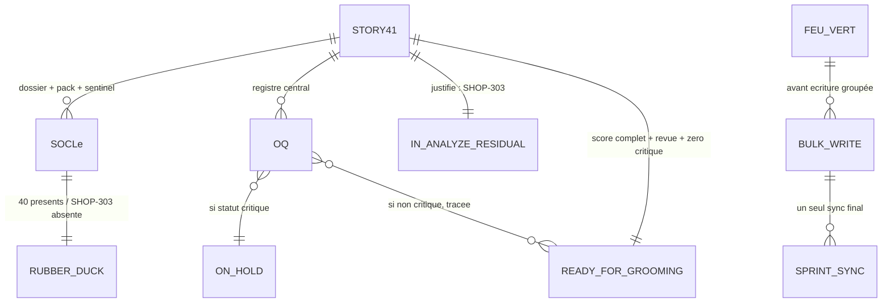

# 📑 Dossier de Preuves Documentaires — MLOOP-203-BE

```yaml
story_id: MLOOP-203-BE
project: mLoop
created_at: '2026-09-23'
status: ACTIVE
standard: mLoop Epistemic Grounding Protocol 1.0
sources_fingerprints:
  - path: Projects/Shopify_AI_Item_Creator/backlog/sprint_backlog.md
    observed: '2026-09-24'
  - path: Projects/Shopify_AI_Item_Creator/backlog/stories/
    observed: '2026-09-24'
  - path: Projects/Shopify_AI_Item_Creator/memory/evidence/
    observed: '2026-09-24'
  - path: Projects/Shopify_AI_Item_Creator/backlog/reviews/
    observed: '2026-09-24'
  - path: Projects/Shopify_AI_Item_Creator/docs/04-transverse/questions_ouvertes.md
    observed: '2026-09-24'
  - path: Projects/Shopify_AI_Item_Creator/docs/01-architecture/SOW_Shopify_AI_Item_Creator.md
    observed: '2026-09-24'
```

---

## 1. Sources Physiques & Maquettes SSOT

- 📂 Sprint board Shopify : [`file:///C:/Memory%20Loop/Projects/Shopify_AI_Item_Creator/backlog/sprint_backlog.md`](file:///C:/Memory%20Loop/Projects/Shopify_AI_Item_Creator/backlog/sprint_backlog.md)
- 📂 Stories Shopify (41) : [`file:///C:/Memory%20Loop/Projects/Shopify_AI_Item_Creator/backlog/stories/`](file:///C:/Memory%20Loop/Projects/Shopify_AI_Item_Creator/backlog/stories/)
- 📂 Evidence Shopify (41 dossiers + 41 paquets) : [`file:///C:/Memory%20Loop/Projects/Shopify_AI_Item_Creator/memory/evidence/`](file:///C:/Memory%20Loop/Projects/Shopify_AI_Item_Creator/memory/evidence/)
- 📂 Revues Sentinel (40/41, SHOP-303 absent) : [`file:///C:/Memory%20Loop/Projects/Shopify_AI_Item_Creator/backlog/reviews/`](file:///C:/Memory%20Loop/Projects/Shopify_AI_Item_Creator/backlog/reviews/)
- 📋 Registre des questions (41/41) : [`file:///C:/Memory%20Loop/Projects/Shopify_AI_Item_Creator/docs/04-transverse/questions_ouvertes.md`](file:///C:/Memory%20Loop/Projects/Shopify_AI_Item_Creator/docs/04-transverse/questions_ouvertes.md)
- 📜 SOW découpage macro E1–E10 : [`file:///C:/Memory%20Loop/Projects/Shopify_AI_Item_Creator/docs/01-architecture/SOW_Shopify_AI_Item_Creator.md`](file:///C:/Memory%20Loop/Projects/Shopify_AI_Item_Creator/docs/01-architecture/SOW_Shopify_AI_Item_Creator.md)
- 📜 Échantillon récit Gold Standard : [`file:///C:/Memory%20Loop/Projects/Shopify_AI_Item_Creator/backlog/stories/SHOP-101.md`](file:///C:/Memory%20Loop/Projects/Shopify_AI_Item_Creator/backlog/stories/SHOP-101.md)
- 📜 Protocole dossiers : [`file:///C:/Memory%20Loop/standards/protocols/DOSSIER_DE_PREUVES_PROTOCOL.md`](file:///C:/Memory%20Loop/standards/protocols/DOSSIER_DE_PREUVES_PROTOCOL.md)

---

## 2. Matrice de Résolution des Conflits

| Sujet | Assertion initiale | Résolution | Gagnant |
| :--- | :--- | :--- | :--- |
| Cibles de statut | DRAFT / BACKLOG / retour client (draft) | READY_FOR_GROOMING / ON_HOLD+OQ ; zéro DRAFT (inexistant) ; zéro régression BACKLOG | **Q1 = A** (PO) |
| Process « retour client » | Communication formelle externe | Levée interne registre OQ + sync ; zéro envoi dans 203 | **Q2 = A** (PO) |
| DoR existant | Relancer scoring INVEST + Sentinel ×41 | Hériter 6/6 + rubber_duck ; relance neuf SHOP-303 seul | **Q3 = A** (PO) |
| Autorité d'écriture | Liste d'éligibles seulement | Bulk sous feu vert sur 203 + evidence + 1 sync | **Q4 = A** (PO) |
| Veto OQ / résidu | Toute OQ ouverte bloque ; 0 résidu absolu | Seul 🔴 pose veto ; résidu IN_ANALYZE = justifié (SHOP-303) | **Q5 = A** (PO) |
| Regroupements thématiques | Question ouverte du draft | Épics SHOP-E1→E10 déjà figés au SOW §4 | **Constat SSOT** |
| Contrats API des 41 | Question ouverte du draft | Patern OQ + Matrice Contrats déjà dans les récits (ex. SHOP-101) | **Constat SSOT** |
| `blocked_by` | [MLOOP-200-BE] | 200 déjà READY_FOR_DEV (humain « 1 ») → levé | **Constat** |

---

## 3. Extraits Verbatim Sourcés (Passage-Level Grounding)

**Extrait 1 — sprint_backlog Shopify (Lignes 4–6) :**
« **Avancement Global** : [████████░░] 80% — **Intégralité du backlog cadrée : 41 récits en IN_ANALYZE**… Chaque récit dispose de son dossier de preuves et de son EvidencePack. … Reste la revue PO et la validation formelle (transition vers READY_FOR_GROOMING), conditionnée à la levée des questions ouvertes bloquantes. »
➔ Fait établi : le SSOT dit **revue PO → READY_FOR_GROOMING** bloquée par OQ, pas un triage vers DRAFT/BACKLOG (Q1=A).

**Extrait 2 — sprint_backlog Shopify, matrice des statuts (Lignes 13–20) :**
« BACKLOG ➡️ ⚪ Product Backlog · OPEN ➡️ ⚪ Sprint Backlog · IN_ANALYZE ➡️ 🔵 IA mLoop / OpenCode · READY_FOR_GROOMING ➡️ 🟡 PO / Humain · READY_FOR_DEV ➡️ 🟢 Dev Team · CLOSED ➡️ 🔒 · ON-HOLD ➡️ 🔴 Bloqué / En attente d'arbitrage client »
➔ Fait établi : **`DRAFT` absent** de la matrice ; « retour client » = **`ON-HOLD`** (Q1=A).

**Extrait 3 — SHOP-101 frontmatter + corps (L12–14, L53–57, L91–123) :**
« status: IN_ANALYZE · invest_score: 6/6 » · section `#### Matrice des Contrats API` avec `[API de soumission à définir]` et OQ-101 · 4 piliers Gherkin complets.
➔ Fait établi : échantillon **déjà Gold Standard** ; double scoring INVEST = travail déjà fait (Q3=A).

**Extrait 4 — inventaires disque (2026-09-24) :**
41× stories `SHOP-*.md` · 41× `*_fact_dossier.md` · 41× `*_evidence.json` · **40×** `rubber_duck_SHOP-*.md` (**SHOP-303 absent**) · 0 plan sous `memory/plan/`.
➔ Fait établi : DoR partiel scellé 40/41 → exception nominative SHOP-303 (Q3/Q5).

**Extrait 5 — registre questions, Phase 1 🔴 (Lignes 53–70) :**
« OQ-403 (route LiteLLM) · OQ-501 / OQ-503 · OQ-601 · OQ-605 » marquées 🔴 « à trancher avant développement ».
➔ Fait établi : des **vrais veto 🔴 existent déjà** et sont le bon signal de tri (Q5=A).

**Extrait 6 — registre questions, Phase 2 🔴 (Lignes 154–159) :**
« OQ-208, OQ-212, OQ-311 … OQ-704, OQ-802, OQ-804, OQ-806 … OQ-706, OQ-708 … OQ-904, OQ-905, OQ-906 … OQ-207, OQ-408, OQ-916 ».
➔ Fait établi : population ON-HOLD dérivable **sans inventer** de critère (18 récits à 🔴).

**Extrait 7 — SOW §4 (Lignes 82–93) :**
Table SHOP-E1 … SHOP-E10 avec périmètres et SP.
➔ Fait établi : regroupements thématiques **déjà documentés** (zone d'ombre n°1 du draft caduque).

---

## 4. Structure de Données Cible



**Matrice de classification (cibles figées) :**

| Cible | Critère | Population attendue |
| :--- | :--- | :--- |
| `READY_FOR_GROOMING` | 6/6 + rubber_duck + zéro OQ 🔴 | **22** : SHOP-101,102,103,104,201,203,301,302,304,306,401,503,602,604,701,804,805,806,901,904,1001,1002 |
| `ON-HOLD` | ≥1 OQ 🔴 dans le registre | **18** : SHOP-202,204,305,402,403,501,502,601,603,702,703,704,801,802,803,902,903,1003 |
| `IN_ANALYZE` résiduel justifié | rubber_duck absent | **1** : SHOP-303 (OQ-305 ⚪ seule, pas de rapport Sentinel) |

*Total 22 + 18 + 1 = 41. Les OQ ⚪/🟡 (dont OQ-201/101/105/202 Phase 0) ne posent pas veto (Q5).*

---

## 5. Contrats Déclaratifs Cibles

- **Aucun contrat réseau** (exemption OQ-203).
- **Parcours UI** : sans interface propre ; les maquettes Shopify du dépôt cible restent SSOT pour les récits produit, pas un contrat CTA du triage.
- **Écritures autorisées** (sous feu vert) : frontmatter `status` des 41 + ligne/colonne statut `sprint_backlog.md` Shopify + paquet `MLOOP-203-BE_evidence.json`.

---

## 6. Frontière Active & Admission of Limits

### Cas A — 5 arbitrages unitaires (tranchés PO 2026-09-23/24)
- **Q1 = A** statuts réels (READY_FOR_GROOMING / ON-HOLD).
- **Q2 = A** levée interne registre, zéro envoi externe.
- **Q3 = A** héritage DoR, exception SHOP-303.
- **Q4 = A** bulk sous feu vert.
- **Q5 = A** 🔴 seul veto, résidu justifié.

### Limites admises
1. **Découpage des 41 en 3 jeux** fondé sur le registre OQ du disque ; toute requalif 🔴↔⚪ ultérieure (journal de résolution) peut déplacer un récit — vivant, pas figé à jamais.
2. **OQ Phase 0 ⚪ critiques** (boutique, marchand, MV, Location ID) ne bloquent pas la revue de poche mais restent le vrai risque projet — listées pour l'humain, hors 203.
3. **SHOP-303** : seul résidu ; relance Sentinel faite partie de l'exécution du récit, pas du cadrage.
4. **Écriture cross-projet** : 203 modifie le dépôt Shopify sous feu vert sur 203 (héritage 200–202) ; le corps métier reste hors périmètre.
5. **Draft initial** portait `blocked_by: [MLOOP-200-BE]` et des cibles DRAFT/BACKLOG — corrigés en haute fidélité.
