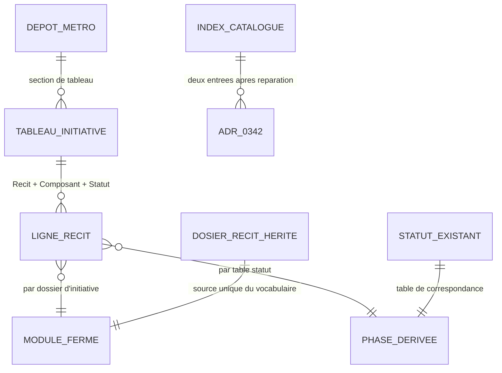

# 📑 Dossier de Preuves Documentaires — MLOOP-205-BE

```yaml
story_id: MLOOP-205-BE
project: mLoop
created_at: '2026-09-24'
status: ACTIVE
standard: mLoop Epistemic Grounding Protocol 1.0
sources_fingerprints:
  - path: Projects/mLoop/backlog/epic_portfolio_governance_2026q4.md
    observed: '2026-09-24'
  - path: Projects/mLoop/backlog/stories/MLOOP-205-BE.md
    observed: '2026-09-24'
  - path: standards/adr-system/0342-modular-project-architecture-and-subdomain-isolation.md
    observed: '2026-09-24'
  - path: standards/adr-system/0342-declarative-yaml-extraction-blueprints.md
    observed: '2026-09-24'
  - path: standards/adr-system/README.md
    observed: '2026-09-24'
  - path: Projects/Metro_FOOD/backlog/sprint_backlog.md
    observed: '2026-09-24'
  - path: Projects/Metro_COMMERCE/backlog/sprint_backlog.md
    observed: '2026-09-24'
  - path: Projects/Metro_SANTE/backlog/sprint_backlog.md
    observed: '2026-09-24'
```

---

## 1. Sources Physiques & Notes d'Atelier

- 📂 Épopée gouvernance : [`file:///C:/Memory%20Loop/Projects/mLoop/backlog/epic_portfolio_governance_2026q4.md`](file:///C:/Memory%20Loop/Projects/mLoop/backlog/epic_portfolio_governance_2026q4.md)
- 📂 Récit cible (haute fidélité) : [`file:///C:/Memory%20Loop/Projects/mLoop/backlog/stories/MLOOP-205-BE.md`](file:///C:/Memory%20Loop/Projects/mLoop/backlog/stories/MLOOP-205-BE.md)
- 📜 ADR modulaire : [`file:///C:/Memory%20Loop/standards/adr-system/0342-modular-project-architecture-and-subdomain-isolation.md`](file:///C:/Memory%20Loop/standards/adr-system/0342-modular-project-architecture-and-subdomain-isolation.md)
- 📜 ADR extraction (collision de numéro) : [`file:///C:/Memory%20Loop/standards/adr-system/0342-declarative-yaml-extraction-blueprints.md`](file:///C:/Memory%20Loop/standards/adr-system/0342-declarative-yaml-extraction-blueprints.md)
- 📇 Index du catalogue : [`file:///C:/Memory%20Loop/standards/adr-system/README.md`](file:///C:/Memory%20Loop/standards/adr-system/README.md)
- 📋 Tableau FOOD : [`file:///C:/Memory%20Loop/Projects/Metro_FOOD/backlog/sprint_backlog.md`](file:///C:/Memory%20Loop/Projects/Metro_FOOD/backlog/sprint_backlog.md)
- 📋 Tableau COMMERCE : [`file:///C:/Memory%20Loop/Projects/Metro_COMMERCE/backlog/sprint_backlog.md`](file:///C:/Memory%20Loop/Projects/Metro_COMMERCE/backlog/sprint_backlog.md)
- 📋 Tableau SANTÉ : [`file:///C:/Memory%20Loop/Projects/Metro_SANTE/backlog/sprint_backlog.md`](file:///C:/Memory%20Loop/Projects/Metro_SANTE/backlog/sprint_backlog.md)
- 📂 Dossiers de récits FOOD : [`file:///C:/Memory%20Loop/Projects/Metro_FOOD/backlog/stories/`](file:///C:/Memory%20Loop/Projects/Metro_FOOD/backlog/stories/)
- 📂 Dossiers de récits COMMERCE : [`file:///C:/Memory%20Loop/Projects/Metro_COMMERCE/backlog/stories/`](file:///C:/Memory%20Loop/Projects/Metro_COMMERCE/backlog/stories/)
- 📂 Dossiers de récits SANTÉ : [`file:///C:/Memory%20Loop/Projects/Metro_SANTE/backlog/stories/`](file:///C:/Memory%20Loop/Projects/Metro_SANTE/backlog/stories/)
- 📜 Protocole dossiers : [`file:///C:/Memory%20Loop/standards/protocols/DOSSIER_DE_PREUVES_PROTOCOL.md`](file:///C:/Memory%20Loop/standards/protocols/DOSSIER_DE_PREUVES_PROTOCOL.md)

---

## 2. Matrice de Résolution des Conflits

| Sujet | Assertion initiale | Résolution | Gagnant |
| :--- | :--- | :--- | :--- |
| Source du vocabulaire de modules | Liste fermée §3 de l'ADR-0342 (prémisse du draft) | **Prémisse rejetée** : ADR-0342 modulaire n'expose aucun §3 de noms ; vocabulaire = initiatives inventoriées sur disque | **Constat SSOT** (lecture intégrale ADR) |
| Forme des colonnes | Module fonctionnel vs technique dans une seule colonne ou deux | **C** deux colonnes : `module` = initiative métier (vocabulaire disque) + `composant` technique déjà présent + `phase` dérivée | **Q1 = C** (PO) |
| Portée des écritures | Colonnes seules ou aussi frontmatter des 56 récits | **i** colonnes sur les 3 `sprint_backlog.md` uniquement ; frontmatter = dette | **Q2a = i** (PO) |
| Schéma hétérogène Metro_SANTE | Harmoniser sur FOOD/COMMERCE (perte Taille/Effort/Valeur) | **β** préservation intégrale, ajout non régressif des 2 colonnes | **Q2b = β** (PO) |
| Collision d'index ADR-0342 | Hors scope / réparation minimale / renumérotation complète | **y** réparation de l'index en 2 références ; zéro renumérotation (dette) | **Q2c = y** (PO) |
| Validation post-normalisation | Graphe seul / contrôle texte seul / séquence complète | **P** contrôle texte, puis 3 syncs séquentiels, puis `graph-query` | **Q3a = P** (PO) |
| Taille d'exécution | M maintenu (1–2 j) | **XS** : 3 tableaux + 1 index + contrôles ; renommage et ADR hors scope | **Q3b = XS** (PO) |
| Dossiers de récits hérités | Renommer en `01-<module>` façon ADR-0342 | **Hors scope** : blast radius Jira/evidence ; vocabulaire vit dans le tableau | **Q1=C** (corollaire) |
| Jira `jira_sync` des libellés | Pousser les modules vers les tickets | **Hors périmètre** : normalisation locale mLoop ; deviendrait OQ nominative si requis | **Out-of-scope** (draft) |

---

## 3. Extraits Verbatim Sourcés (Passage-Level Grounding)

**Extrait 1 — épopée gouvernance (dette structurelle) :**
« Dette structurelle — Naming modulaire inégal, OneTrust ×3, RBC ×2, phase badge-atomique »
➔ Fait établi : le chantier vise le vocabulaire module + la colonne phase dans les tableaux ; les doublons OneTrust/RBC sont explicitement scindés vers la story transverse dédiée (206).

**Extrait 2 — draft MLOOP-205-BE avant grill (L64, zones d'ombre) :**
« ADR-0342 §3 définit-il une liste **fermée** de noms de modules autorisés pour les projets Metro_* ? »
➔ Fait établi : le draft posait la question ; la lecture intégrale de l'ADR (Extrait 3) la résout par la négative — la prémisse « liste fermée §3 » du draft (L37, L51) était **fausse**.

**Extrait 3 — `0342-modular-project-architecture-and-subdomain-isolation.md` (sections) :**
Structure : `Contexte & Problème` · `Décision Retenue` (1–4) · `Conséquences`. La §2 montre `01-<module_a>` / `02-<module_b>` ; la §3 = baux `OWNS:` ; la §4 = matrice d'arbitrage.
➔ Fait établi : **zéro liste fermée de noms de modules** ; les motifs sont génériques et projet-dépendants → normaliser sur le vocabulaire de fait inventorié (Q1=C).

**Extrait 4 — collision de numéro 0342 (inventaire `standards/adr-system/`) :**
Deux fichiers : `0342-modular-project-architecture-and-subdomain-isolation.md` **et** `0342-declarative-yaml-extraction-blueprints.md`.
➔ Fait établi : duplication de numéro réelle → réparation d'index en scope (Q2c=y), renumérotation = dette.

**Extrait 5 — `standards/adr-system/README.md` (L83) :**
`* **[ADR-0342](0342-declarative-yaml-extraction-blueprints.md)** : Blueprints d'Extraction Déclarative YAML…`
➔ Fait établi : l'index ne référence **qu'un** des deux fichiers ; l'ADR modulaire est absent de l'index → défaut de cohérence à corriger par ajout de ligne.

**Extrait 6 — `Metro_FOOD/backlog/sprint_backlog.md` (L17, L44, L58, L62, L75–78) :**
Tableaux : `| Récit | Composant | Statut |` sous sections « OneTrust FOOD » (20), « Metro Food Offers » (9), « Programme Avion RBC » (1), « Initiatives Futures ». Comptage : 30 récits.
➔ Fait établi : pas de colonne module ni phase ; initiatives = section de tableau ; `Composant` = Frontend/Backend/Fullstack/Technique/Cross (couche technique, pas module métier).

**Extrait 7 — `Metro_COMMERCE/backlog/sprint_backlog.md` (L18, L44, L52–56) :**
`| Récit | Composant | Statut |` sous « OneTrust COMMERCE » (16) et « Programme Avion RBC » (1). Total 17.
➔ Fait établi : schéma identique à FOOD ; 2 initiatives ; zéro colonne module/phase.

**Extrait 8 — `Metro_SANTE/backlog/sprint_backlog.md` (L15, L37–39) :**
`| ID | Clé Jira | Titre Métier du Récit | Taille T-Shirt | Effort (Jours) | Valeur ($ CAD) | Statut |` sous « Accès Dossier » (US-RX-01…06 + EXCL) ; OneTrust SANTÉ référencé en prose (9 stories). Phase en prose : « STAGE_TSHIRT_SIZE (Phase 0 Complétée ➔ Phase 1 SOW en cours) ».
➔ Fait établi : schéma **radicalement hétérogène** (Taille/Effort/Valeur) → harmonisation forcée = perte d'information → Q2b=β (ajout non régressif).

**Extrait 9 — inventaire des dossiers de récits (glob 2026-09-24) :**
FOOD : `OneTrust_FOOD/` (20), `Metro_Food_Offers/` (2), `RBC_Avion/` (1) · COMMERCE : `OneTrust_COMMERCE/` (16), `RBC_Avion/` (1) · SANTÉ : `OneTrust_SANTE/` (9), Accès Dossier déclaré en prose `AccesDossier/`.
➔ Fait établi : vocabulaire de fait = noms de dossiers d'initiatives ; **zéro** préfixe numérique `01-`/`02-` façon ADR-0342 ; renommage hors scope (blast radius).

**Extrait 10 — grep frontmatter `module:` / `phase:` (3 dépôts, 56 récits) :**
Aucun match.
➔ Fait établi : rien à normaliser côté frontmatter aujourd'hui → Q2a=i (colonnes tableau seules ; frontmatter = dette nominative).

---

## 4. Structure de Données Cible



**Vocabulaire fermé inventorié (état disque 2026-09-24) :**

| Dépôt | Module | Dossier source |
| :--- | :--- | :--- |
| Metro_FOOD | `onetrust-food` | `backlog/stories/OneTrust_FOOD/` |
| Metro_FOOD | `metro-food-offers` | `backlog/stories/Metro_Food_Offers/` |
| Metro_FOOD | `rbc-avion` | `backlog/stories/RBC_Avion/` |
| Metro_COMMERCE | `onetrust-commerce` | `backlog/stories/OneTrust_COMMERCE/` |
| Metro_COMMERCE | `rbc-avion` | `backlog/stories/RBC_Avion/` |
| Metro_SANTE | `onetrust-sante` | `backlog/stories/OneTrust_SANTE/` |
| Metro_SANTE | `acces-dossier` | `backlog/stories/AccesDossier/` (déclaré) |

**Table de correspondance statut → phase (déterministe) :**

| Statut source | Phase dérivée |
| :--- | :--- |
| `DRAFT`, `BACKLOG`, `OPEN`, `IN_ANALYZE`, `READY_FOR_GROOMING`, `ESTIMATED` | `PLAN` |
| `IN_REVIEW` | `VALIDATE` |
| `READY_FOR_DEV` | `BUILD` |
| `CLOSED`, `SUPERSEDED`, `EXCLUDED` | `SHIP` |
| `ON_HOLD` | `PLAN` *(retenu, statut inchangé portant l'information de blocage)* |

---

## 5. Contrats Déclaratifs Cibles

- **Aucun contrat réseau** (exemption OQ-205).
- **Écritures autorisées** (sous feu vert sur le présent récit) : ajout de colonnes `module` et `phase` dans `Projects/Metro_{FOOD,COMMERCE,SANTE}/backlog/sprint_backlog.md` ; ajout d'une ligne d'index dans `standards/adr-system/README.md` ; dossier de preuves et paquet de preuve du présent récit ; ligne du tableau de bord de sprint du projet de gouvernance.
- **Interdits** : renommage de dossiers ou fichiers de récits ; écriture de frontmatter `module:`/`phase:` sur les récits ; suppression ou réordonnancement de colonnes existantes ; modification du corps des deux fichiers 0342 ; renumérotation ; poussée Jira ; exécution des doublons OneTrust/RBC (206) ; normalisation hors Metro.

---

## 6. Frontière Active & Admission of Limits

### Cas A — 6 arbitrages unitaires (tranchés PO 2026-09-24)
- **Q1 = C** deux colonnes (module initiative + phase dérivée), zéro renommage de dossiers ; prémisse §3 rejetée.
- **Q2a = i** écritures limitées aux 3 `sprint_backlog.md` ; frontmatter = dette.
- **Q2b = β** schéma SANTE préservé, ajout non régressif.
- **Q2c = y** index 0342 réparé (2 références), zéro renumérotation.
- **Q3a = P** contrôle texte → 3 syncs séquentiels → `graph-query`.
- **Q3b = XS** macro révisé de M à XS.

### Limites admises
1. **Vocabulaire de fait** : le vocabulaire fermé = dossiers réellement inventoriés ; un futur ajout d'initiative doit d'abord exister sur disque avant d'apparaître dans une colonne.
2. **Phase dérivée** : la colonne phase ne porte aucune vérité nouvelle ; le statut reste le maître. Un statut inconnu de la table est refusé, jamais deviné.
3. **Frontmatter hors scope** : l'absence de `module:`/`phase:` en tête de récit est une dette nominative reportée (généralement vers la Gate 5 ou un epic dédié), pas un oubli silencieux.
4. **Renommage d'arborescence hors scope** : le motif `01-<module>` de l'ADR-0342 n'est pas appliqué aux dossiers hérités — blast radius Jira, liens, EvidencePacks ; dette tracée.
5. **Numérotation 0342** : les deux fichiers coexistent ; seule l'index est réparé ; la renumérotation est une dette ADR-0376 (toucher les références) explicitement écartée.
6. **Schéma hétérogène SANTE** : préservé par choix ; l'harmonisation complète des trois tableaux serait un projet de standard (gabarit blueprint), hors story XS.
7. **Jira hors périmètre** : la normalisation ne modifie aucun ticket ; une demande future de poussée de libellés deviendrait une question ouverte nominative.
8. **Synchronisations séquentielles** : contrainte Windows (conflits de verrou fichier observés en sessions antérieures) — toute parallélisation est proscrite par la règle d'affaires.
9. **Macro XS** : revisé à la baisse car le scope réel (3 tableaux + 1 index) est très en deçà de l'estimation initiale M qui intégrait renommage et extension d'ADR — ces deux items sont désormais Out-of-Scope documentés.
