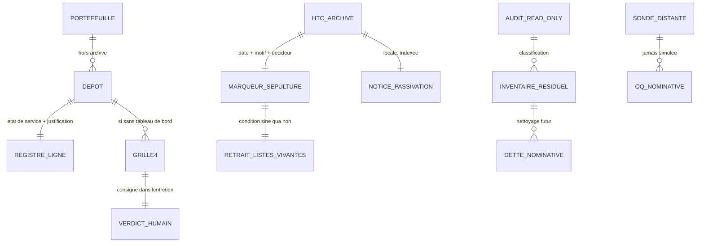

# 📑 Dossier de Preuves Documentaires — MLOOP-207-BE

```yaml
story_id: MLOOP-207-BE
project: mLoop
created_at: '2026-09-24'
status: ACTIVE
standard: mLoop Epistemic Grounding Protocol 1.0
sources_fingerprints:
  - path: Projects/mLoop/backlog/epic_portfolio_governance_2026q4.md
    observed: '2026-09-24'
  - path: Projects/mLoop/backlog/stories/MLOOP-207-BE.md
    observed: '2026-09-24'
  - path: Projects/_archive/HTC/
    observed: '2026-09-24'
  - path: Projects/Metro_SHARED/
    observed: '2026-09-24'
  - path: Projects/App_Sante/
    observed: '2026-09-24'
  - path: Projects/mLoop/docs/04-transverse/
    observed: '2026-09-24'
```

---

## 1. Sources Physiques & Notes d'Atelier

- 📂 Épopée gouvernance : [`file:///C:/Memory%20Loop/Projects/mLoop/backlog/epic_portfolio_governance_2026q4.md`](file:///C:/Memory%20Loop/Projects/mLoop/backlog/epic_portfolio_governance_2026q4.md)
- 📂 Récit cible (draft avant grill) : [`file:///C:/Memory%20Loop/Projects/mLoop/backlog/stories/MLOOP-207-BE.md`](file:///C:/Memory%20Loop/Projects/mLoop/backlog/stories/MLOOP-207-BE.md)
- 📂 Dépôt archivé HTC : [`file:///C:/Memory%20Loop/Projects/_archive/HTC/`](file:///C:/Memory%20Loop/Projects/_archive/HTC/)
- 📂 Dépôt Metro_SHARED : [`file:///C:/Memory%20Loop/Projects/Metro_SHARED/`](file:///C:/Memory%20Loop/Projects/Metro_SHARED/)
- 📂 Dépôt App_Sante : [`file:///C:/Memory%20Loop/Projects/App_Sante/`](file:///C:/Memory%20Loop/Projects/App_Sante/)
- 📂 Couche transverse mLoop (registre cible) : [`file:///C:/Memory%20Loop/Projects/mLoop/docs/04-transverse/`](file:///C:/Memory%20Loop/Projects/mLoop/docs/04-transverse/)
- 📜 Protocole dossiers : [`file:///C:/Memory%20Loop/standards/protocols/DOSSIER_DE_PREUVES_PROTOCOL.md`](file:///C:/Memory%20Loop/standards/protocols/DOSSIER_DE_PREUVES_PROTOCOL.md)

---

## 2. Matrice de Résolution des Conflits

| Sujet | Assertion initiale | Résolution | Gagnant |
| :--- | :--- | :--- | :--- |
| Portée passivation HTC | Formalisation seule ou + nettoyage résiduel | **C** formalisation + audit read-only ; nettoyage = dette séparée tracée | **Q1 = C** (PO) |
| Lieu notice passivation | Entrée au catalogue commun des décisions du cadre | Notice locale dans le dépôt archivé + marqueur de sépulture ; zéro pollution du catalogue | **Q2 Axe1 = b** (PO) |
| Lieu verdicts SHARED / Sante | Registre des questions ouvertes (hack sémantique) ou ADR portefeuille unique | **Registre des projets** créé sous la couche transverse ; questions ouvertes réservées aux questions | **Q2 Axe2 = b** (PO) |
| Forme du verdict | Binaire initialisation ou abandon | **B** grille de quatre critères à trois issues (initialisation / maintien non standard / abandon) + verdict humain dans l'entretien | **Q3 = B** (PO) |
| Périmètre audit résiduel | Strictement le projet de gouvernance, ou tout le portefeuille hors archive | **B** balayage hors archive sur trois motifs ciblés ; actifs homonymes bénins ; sonde distante = question ouverte | **Q4 = B** (PO) |
| Registre | Étendre un artefact existant ou créer à neuf | **5a = i** création à neuf après vérification d'absence (vérifié : aucun registre existant) | **Q5a = i** (PO) |
| Taille d'exécution | Extraite petite ou petite | **XS maintenu** car verdicts humains rendus dans l'entretien même | **Q5b = XS** (PO) |
| État Metro_SHARED | « sans tableau de bord = anomalie » (épopée L24) | Rôle de diffusion en amont **sans tableau de bord par conception** (AGENTS.md) → **maintien non standard** | **Verdict humain** |
| État App_Sante | Dépôt de référence sans parcours | Projet de conformité Santé annoncé → **initialisation à venir**, hors récit | **Verdict humain** |
| HTC déjà archivé | Épopée L24 au futur (« à archiver ») | Dépôt **déjà résidant** sous `_archive/HTC` (constat disque) ; le travail réel = marqueur + notice | **Constat SSOT** |

---

## 3. Extraits Verbatim Sourcés (Passage-Level Grounding)

**Extrait 1 — épopée gouvernance (Ligne 24) :**
« Passivation | HTC (legacy non normalisé) à archiver ; Metro_SHARED / App_Sante sans backlog »
➔ Fait établi : l'intention d'épopée est l'archivage de HTC et le constat d'absence de tableau de bord pour SHARED et Sante ; le futur « à archiver » est caduque au vu du disque (Extrait 3).

**Extrait 2 — épopée gouvernance (Ligne 76) :**
« P9–P10 | MLOOP-207-BE | Passivation HTC → _archive + décisions SHARED / App_Sante | backend | XS | 🟡 »
➔ Fait établi : couche arrière, taille extraite petite, jaune non critique ; aligné sur le récit après grill.

**Extrait 3 — inventaire disque `_archive/HTC` (2026-09-24) :**
Dépôt résidant avec `README.md`, `Backlog/`, `memory/`, `graphify-out/`, `Code/`, `Documentation/`, `Reference/`, `Config/` — **`README_ARCHIVE.md` absent**.
➔ Fait établi : le déplacement physique est fait ; le marqueur de sépulture demandé par le draft **n'existe pas encore** → vrai travail d'apposition.

**Extrait 4 — `Metro_SHARED/AGENTS.md` (Lignes 1–25) :**
« Metro_SHARED n'est pas un endroit que les développeurs consultent directement. C'est le point de vérité unique (master) à partir duquel la documentation transverse est dupliquée verbatim dans chaque codebase… il n'y a aucun backlog de stories ni de repo Wiki DevOps dédié consulté au quotidien pour ce projet : son unique fonction est la propagation en amont, pas la lecture en aval. »
➔ Fait établi : l'absence de tableau de bord est **par conception**, non une anomalie → verdict **maintien non standard** (pas abandon, pas initialisation d'exécution).

**Extrait 5 — `Metro_SHARED/memory/lifecycle_state.json` :**
`current_stage: STAGE_0_TSHIRT`, créé/mis à jour `2026-09-16T15:51:34Z`.
➔ Fait établi : activité interne récente (< 90 j), lifecycle non engagé au-delà de la chemise taille → cohérent avec un rôle non standard.

**Extrait 6 — inventaire `App_Sante` (2026-09-24) :**
`memory/` minimal, `reference/Health/` (codebase Pharma .NET), **zéro `backlog/`, zéro `docs/`** ; derniers événements `2026-08-17` (exploration de code).
➔ Fait établi : dépôt de référence sans parcours de développement ; pas d'abandon possible (Extrait 7).

**Extrait 7 — citations croisées audits (grep `App_Sante` dans le portefeuille) :**
Présent dans les rapports d'audit OneTrust de Metro_SANTE, Metro_SHARED, Metro_COMMERCE, Metro_FOOD : « Preuve (SANTÉ - Jean Coutu): App_Sante\reference\Health\Pharma.PJC\MauiProgram.cs (Ligne 68) ».
➔ Fait établi : le dépôt est **consommé par des dépôt en service** → critère 3 de la grille positif ; interdit un verdict d'abandon.

**Extrait 8 — verdict humain consigné (Grill-Me 2026-09-24) :**
« shared=passif, sante le projet onetrust s'en vient »
➔ Fait établi : Metro_SHARED = maintien non standard ; App_Sante = **initialisation à venir** (projet de conformité Santé annoncé), exécution hors récit.

**Extrait 9 — vérification d'absence de registre concurrent (2026-09-24) :**
Glob `**/*REGISTRE_PROJETS*` sous `Projects/` et `Projects/mLoop/docs/` → **aucun fichier**.
➔ Fait établi : la création à neuf du registre ne crée pas de doublon (Q5a = i sûr).

**Extrait 10 — actifs homonymes dans le domaine partagé :**
`Metro_SHARED/docs/OneTrust/05-assets/htc_maconnerie_*.png` (captures de maquette).
➔ Fait établi : faux positif garanti d'un balayage naïf → classification **actif bénin** obligatoire (Q4).

---

## 4. Structure de Données Cible



**Grille 4 critères (verdicts figés) :**

| Critère | Metro_SHARED | App_Sante |
| :--- | :--- | :--- |
| 1. Tableau de bord actif ? | Non — **par conception** (master de propagation) | Non |
| 2. Activité < 90 j ? | Oui (2026-09-16 lifecycle) | Oui (2026-08-17) |
| 3. Consommé par actifs ? | Oui (FOOD+COMMERCE+SANTÉ, 14 apps) | Oui (audits OneTrust multi-dépôt) |
| 4. Valeur future ? | Oui (OneTrust, Loi 25, SDK-MAUI…) | Oui (projet de conformité Santé à venir) |
| **Verdict humain** | **maintien non standard** (passif) | **initialisation à venir** (init) |

---

## 5. Contrats Déclaratifs Cibles

- **Aucun contrat réseau** (exemption OQ-207).
- **Écritures autorisées** (sous feu vert sur le présent récit) : marqueur de sépulture + notice locale dans `_archive/HTC/` ; `Projects/mLoop/docs/04-transverse/REGISTRE_PROJETS.md` ; retrait de HTC des listes vivantes du cadre ; dossier de preuves et paquet de preuve du présent récit ; ligne du tableau de bord de sprint du projet de gouvernance.
- **Interdits** : suppression ou mutation du contenu archivé ; nettoyage des résidus inventoriés ; squelette de projet pour l'initialisation ; entrée au catalogue commun des décisions du cadre ; second registre concurrent.

---

## 6. Frontière Active & Admission of Limits

### Cas A — 5 arbitrages unitaires (tranchés PO 2026-09-24)
- **Q1 = C** audit read-only + dette de nettoyage tracée séparément.
- **Q2 = Axe1(b) + Axe2(b)** notice locale archivée + registre des projets sous la couche transverse.
- **Q3 = B** grille 4 critères à 3 issues + verdict humain dans l'entretien.
- **Q4 = B** balayage hors archive, 3 motifs, actifs homonymes bénins, sonde distante = question ouverte.
- **Q5 = i + XS** registre créé à neuf, taille extraite petite maintenue.

### Limites admises
1. **Audit read-only** : aucun résidu n'est effacé dans le présent récit ; les dettes de nettoyage sont nominatives et tracées, jamais exécutées en sous-main.
2. **Sonde de suivi de travaux distants** (si existante hors disque) = question ouverte nominative, jamais simulée ni appelée depuis le récit.
3. **Initialisation d'App_Sante** : verdict consigné, squelette hors périmètre — ouvre un futur chantier dédié, pas un glissement de scope.
4. **Notice locale vs catalogue commun** : la passivation de dépôt client ne rejoint pas le catalogue des décisions d'architecture du cadre ; la frontière framework / portefeuille est préservée.
5. **Actifs homonymes** : les captures de maquette portant un préfixe homonyme dans le domaine partagé restent bénins — un balayage non filtré produirait de faux fantômes.
6. **Taille extraite petite** : maintenue car les deux verdicts humains sont rendus dans l'entretien même ; un verdict différé aurait basculé en petite.
7. **Épopée au futur** (« à archiver ») : caduque au vu du disque ; le récit haute fidélité décrit l'apposition d'épitaphe, pas un déplacement.

---

## 7. Audit Résiduel READ-ONLY des Références HTC hors Archive (Exécution 2026-09-24)

> **Balayage déterministe** hors `Projects/_archive/`, hors bruit (`node_modules/`, `.git/`, `graphify-out/cache/`, HTML générés archify), sur les **3 motifs ciblés** de la story. Regex à limite de mot (`\bHTC\b`) pour écarter les faux positifs de sous-chaîne (ex. `rig**htC**andidate` dans les HTML archify — écartés). **Aucune suppression, aucune mutation.** Chaque nettoyage devient une dette nominative séparée (Q1 = C).

### Inventaire ligne à ligne classé

| # | Référence | Fichier | Ligne | Motif | Classification | Suite tracée |
| :-- | :--- | :--- | :--- | :--- | :--- | :--- |
| R1 | `if "htc" in ck: return "HTC"` (résolveur de nom de projet) | `src/dashboard/project_utils.py` | 72-73 | Mention dans tableau de bord vivant | ⚠️ **Potentiel de fantôme (neutralisé)** | **DETTE-HTC-01** : retirer les 2 entrées de résolution legacy. Non-fantôme prouvé au runtime (voir falsification ci-dessous). Retrait hors récit. |
| R2 | `"HTC": "🧱 HTC Maçonnerie"` (label convivial) | `src/dashboard/project_utils.py` | 226 | Mention dans tableau de bord vivant | ⚠️ **Potentiel de fantôme (neutralisé)** | **DETTE-HTC-01** (même dette) : entrée `FRIENDLY_PROJECT_NAMES` legacy. Retrait hors récit. |
| R3 | `"project": "HTC"` (2 événements WikiFix/Graphify) | `memory/events.jsonl` | 1962-1963 | Clé HTC dans journal d'état | ✅ **Actif bénin** | Journal d'événements append-only historique (2026-08-28). Immuable par nature ; aucun retrait. |
| R4 | `Projects/HTC` (projet pilote initial) | `CHANGELOG.md` | 862-863 | Mention historique | ✅ **Actif bénin** | Journal de version figé ; trace historique légitime. Aucun retrait. |
| R5 | `HTC` — Client Ancien, RESTRUCTURER | `docs/01-architecture/AUDIT_ECOSYSTEME_GLOBAL_MLOOP.md` | 20, 148, 198-199, 242 | Mention dans rapport d'audit | ✅ **Actif bénin** | Rapport d'audit d'écosystème daté (snapshot figé). Trace historique ; aucun retrait. |
| R6 | `HTC` — Client Ancien, RESTRUCTURER | `docs/01-architecture/AUDIT_ECOSYSTEME_GLOBAL_MLOOP_2026-09-08.md` | 208, 214, 269 | Mention dans rapport d'audit | ✅ **Actif bénin** | Rapport d'audit d'écosystème daté (snapshot figé). Trace historique ; aucun retrait. |
| R7 | « archive HTC » (origine décision) + ligne story 207 | `Projects/mLoop/backlog/sprint_backlog.md` | 66, 77 | Mention dans tableau de suivi | ✅ **Actif bénin** | Traces de la **décision de passivation** elle-même (narratif d'origine + récit MLOOP-207-BE). Non un projet vivant. Aucun retrait. |
| R8 | `htc_maconnerie_*.png` (captures de maquette) | `Metro_SHARED/docs/OneTrust/05-assets/` | (préfixe homonyme) | Actif à préfixe homonyme | ✅ **Actif bénin (homonyme)** | Captures de maquette du domaine partagé portant un préfixe homonyme. Classification bénigne obligatoire (règle Q4) ; jamais requalifié en fantôme ; aucun retrait. |

### Falsification Niveau 2 (AST/Runtime) — HTC absent des listes vivantes

- **`list_available_projects()`** (`src/dashboard/project_utils.py` L236-274) scanne `Projects/` et **exclut** tout dossier préfixé `_` (L255) et explicitement `_archive` (L247). HTC résidant sous `Projects/_archive/HTC/`, il **n'est jamais énuméré** comme projet vivant. Les entrées R1/R2 sont des tables de résolution de labels statiques (activées uniquement si un ID « HTC » est déjà fourni en entrée) → elles **ne génèrent aucun fantôme** dans les listes vivantes.
- **`python src/swarm.py lifecycle-status --project mLoop`** (exit 0) → **aucune ligne HTC**. HTC absent du lifecycle vivant du cadre.
- **`FRAMEWORK_STATE.md` (mLoop)** → aucune occurrence HTC.

➔ **Conclusion** : HTC est **absent de toutes les listes vivantes du cadre** au runtime. La seule dette actionnable (DETTE-HTC-01 : nettoyage des 2 entrées legacy de `project_utils.py`) est **nominative et tracée séparément** ; elle n'est **pas exécutée** dans le présent récit (Q1 = C). Aucun nettoyage silencieux.

### Questions ouvertes (sondes distantes)

- **OQ-207-AUDIT-01** : aucune sonde de suivi de travaux distants (Jira/Azure Boards) n'a été interrogée — l'inventaire s'arrête au disque (Q4). Toute vérification d'un ticket HTC résiduel côté outil de suivi distant reste une **question ouverte nominative**, jamais simulée ni appelée depuis le récit.

### Récapitulatif par classification

| Classification | Nombre d'occurrences (regroupées) |
| :--- | :--- |
| Potentiel de fantôme (neutralisé, dette tracée) | 2 (R1, R2 → DETTE-HTC-01) |
| Actif bénin | 6 groupes (R3, R4, R5, R6, R7, R8) |
| Question ouverte | 1 (OQ-207-AUDIT-01) |
| Suppressions exécutées | **0** (audit strictement read-only) |
