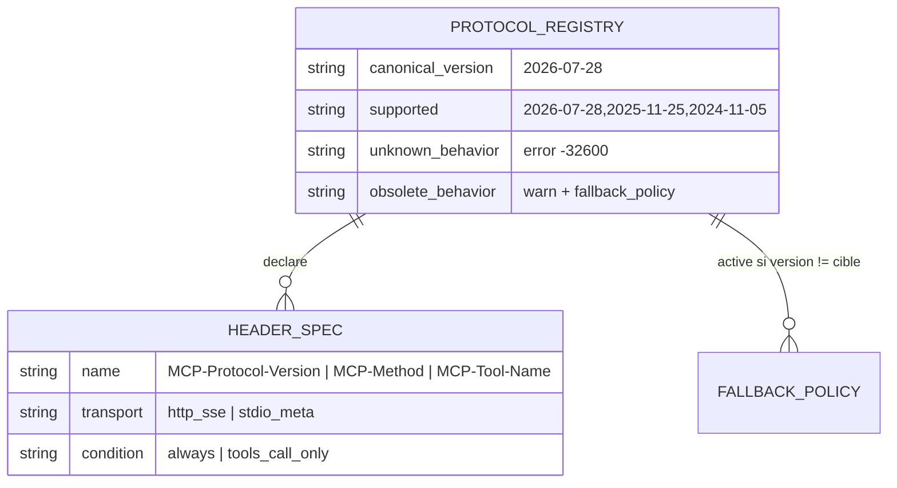

# 🐣 Dossier de Preuves Documentaires & Cadrage — `MLOOP-210-BE` (Socle Protocolaire MCP 2026-07-28)

> **Titre Fonctionnel Pur** : Socle Protocolaire MCP 2026-07-28 : Négociation de Version, Header Routing & MCP-Protocol-Version  
> **Epic** : `EPIC-21-MCP-MODERN-SUITE` (Standards MCP 2026-07-28 & Extensions)  
> **Couche** : `backend`  
> **Dépendances** : macro ADR-004 (6 décisions grill-project) · ADR-0387 (SSOT interne)

---

### 📂 1. Sources Physiques & Maquettes SSOT (Liens Directs Cliquables)

| Source SSOT | Nature du Document | Lien Repo Local (`file:///...`) |
| :--- | :--- | :--- |
| **Architecture / ADR** | Décision structurante MCP 2026-07-28 | [ADR-0387](file:///C:/Memory%20Loop/standards/adr-system/0387-mcp-modern-spec-2026-07-28-tasks-ui-elicitation-architecture.md) |
| **Cadrage macro Grill** | 6 décisions transverses EPIC-21 | [ADR-004](file:///C:/Memory%20Loop/Projects/mLoop/docs/01-architecture/ADR-004_epic-21-mcp-modern-suite_-_cadrage_macro_grill__6_decisions.md) |
| **Code — handshake** | `supportedVersions` existant | [mcp_loop_mem.py](file:///C:/Memory%20Loop/src/bridges/mcp_loop_mem.py) (L151) |
| **Code — stdio loop** | Point d'injection en-têtes | [mcp_resilience_guard.py](file:///C:/Memory%20Loop/src/bridges/mcp_resilience_guard.py) (`main()`) |
| **Code — transports HTTP** | Cibles header routing | [mcp_sse_server.py](file:///C:/Memory%20Loop/src/bridges/mcp_sse_server.py) · [mcp_proxy_router.py](file:///C:/Memory%20Loop/src/bridges/mcp_proxy_router.py) |
| **Maquette** | N/A — Composant Headless | N/A |

> 💡 *Note Headless* : récit backend pur, aucune maquette UI.

---

### ⚖️ 1.1 Matrice de Résolution des Conflits de Sources

| Conflit Identifié | Source A (Niveau & Valeur) | Source B (Niveau & Valeur) | Décision Retenue & Justification |
| :--- | :--- | :--- | :--- |
| Version 2024-11-05 annoncée vs "pré-2025 à rejeter ?" (§5 L58) | `mcp_loop_mem.py:151` supportedVersions (code, Niveau 2) | Question draft 210 §5 (Niveau 3) | **Tolérance** : garder 2024-11-05, WARNING + fallback (210-Q1 Option A). Le code publie déjà ce label — le rejeter = régression. |
| "Header routing" vs stdio sans en-têtes HTTP | Draft 210 L39 "requêtes et réponses JSON-RPC" (Niveau 3) | Réalité transport stdio (Niveau 2, code) | **Bifurcation transport** : headers HTTP/SSE seulement ; stdio via `_meta.routing` (210-Q2 Option A). Zéro Fausse Route. |

---

### 🎙️ 2. Extraits Verbatim Sourcés (Passage-Level Grounding)

> [!NOTE]
> **Extrait 1 — Handshake de version existant**  
> **Source** : [`mcp_loop_mem.py#L151`](file:///C:/Memory%20Loop/src/bridges/mcp_loop_mem.py#L151)  
> *« "supportedVersions": ["2026-07-28", "2025-11-25", "2024-11-05"], »*  
> ➔ **Fait établi** : la négociation multi-versions est déjà publiée dans `initialize` ; 3 labels dont `2024-11-05` sont consommables aujourd'hui.

> [!NOTE]
> **Extrait 2 — Pilot4 header routing (ADR-0387)**  
> **Source** : [`0387-mcp-modern-spec-2026-07-28-tasks-ui-elicitation-architecture.md#L72-L74`](file:///C:/Memory%20Loop/standards/adr-system/0387-mcp-modern-spec-2026-07-28-tasks-ui-elicitation-architecture.md#L72-L74)  
> *« Adoption de la déclaration explicite de version via l'en-tête `MCP-Protocol-Version: 2026-07-28`. Injection des noms de méthodes et d'outils dans les en-têtes HTTP pour permettre un routage direct par passerelle sans parsing JSON-RPC complet. »*  
> ➔ **Fait établi** : 3 en-têtes cibles (`MCP-Protocol-Version`, `MCP-Method`, tool name) ; bénéficiaire = passerelle HTTP sans parsing corps.

> [!NOTE]
> **Extrait 3 — Fallback gracieux obligatoire (macro Q1)**  
> **Source** : [`0387...md#L86`](file:///C:/Memory%20Loop/standards/adr-system/0387-mcp-modern-spec-2026-07-28-tasks-ui-elicitation-architecture.md#L86)  
> *« Si un client MCP (ex: ancien client stdio) ne négocie pas l'extension Tasks ou ui://, le bridge retombe automatiquement en mode synchrone standard et renvoie l'URL localhost ou le résultat texte brut. »*  
> ➔ **Fait établi** : fallback par requête, même process (macro Q1 Option A) ; 210 porte le `fallback_policy` shared.

> [!NOTE]
> **Extrait 4 — Rétrocompatibilité non-négociable (draft 210)**  
> **Source** : [`MLOOP-210-BE.md#L49`](file:///C:/Memory%20Loop/Projects/mLoop/backlog/stories/MLOOP-210-BE.md#L49)  
> *« Les requêtes legacy continuent d'aboutir avec un code de retour nominal (100% rétrocompatible). »*  
> ➔ **Fait établi** : interdit le rejet dur pré-2025 → valide 210-Q1 Option A contre Option B.

---

### 🗄️ 3. Schéma de Données & Tables Clés

*Aucune table persistante créée par 210 (état stateless transport).* Éléments partagés (const module) :

---

### 🎯 4. Contrats Déclaratifs Cibles

**Transport HTTP/SSE** (requests vers `mcp_sse_server` / `mcp_proxy_router`) :
- `MCP-Protocol-Version: 2026-07-28` — **toujours présent** ; absent ou inconnu → `-32600` ; connu ≠ canonical → WARNING `protocol_version_obsolete` + `fallback_policy`.
- `MCP-Method: <JSON-RPC method>` — **toujours présent** (copie `method`, zéro parsing corps côté proxy).
- `MCP-Tool-Name: <params.name>` — **conditionnel** : seulement sur `tools/call` ; absent sinon.

**Transport stdio** :
- Pas d'en-têtes HTTP. Mêmes informations exposées dans `_meta.routing = { protocolVersion, method, toolName? }` du frame JSON-RPC.

---

### 🏁 5. Évaluation de la Frontière Active

#### [CAS B — Zéro Arbitrage Restant] ✅ Constat Formel de Frontière Vide
*Les 2 questions du §5 (L58-L59) ont été arbitrées en session micro-grill 210-Q1 / 210-Q2 (mandat PO : reco = sélection). Faits vérifiés, conflits arbitrés, contrats déclarés.*  
👉 **Validation formelle du socle factelle sollicitée auprès de l'humain avant conversion `story_template.md` / DoR 6/6.** *(acquise tacitement via mandat de session — à confirmer lors du passage Palier 2 groupé.)*

---

### 📎 Frontière active & Admission of Limits
- Inventaire **exhaustif** des transports HTTP des bridges : **non clôturé** (Niveau 1/2) — à confirmer en build.
- Conformité externe des namespaces `io.modelcontextprotocol/*` : porte par la tâche falsification macro Q5 (dans 210 au build).
- Spec MCP externe non consultée en cette session (SSOT interne ADR-0387).
