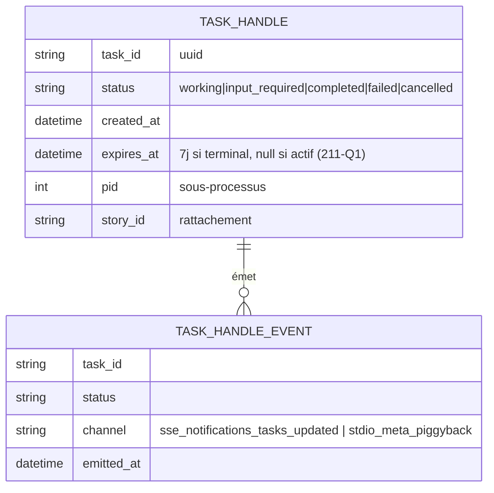

# 🐣 Dossier de Preuves Documentaires & Cadrage — `MLOOP-211-BE` (Extension Tasks : Handles Asynchrones Herdr)

> **Titre Fonctionnel Pur** : Extension Tasks — Handles Asynchrones & Call-Now-Fetch-Later pour Herdr  
> **Epic** : `EPIC-21-MCP-MODERN-SUITE`  
> **Couche** : `backend`  
> **Dépendances** : `MLOOP-210-BE` (socle + `_meta.routing` + registre partagé) · macro ADR-004 (Q2 rétention, Q3 `input_required`) · ADR-0387 Pilier 1

---

### 📂 1. Sources Physiques & Maquettes SSOT

| Source SSOT | Nature | Lien Repo Local (`file:///...`) |
| :--- | :--- | :--- |
| **Architecture / ADR** | Pilier 1 Tasks, états, intégration Herdr | [ADR-0387 §Pilier1](file:///C:/Memory%20Loop/standards/adr-system/0387-mcp-modern-spec-2026-07-28-tasks-ui-elicitation-architecture.md) (L59-62) |
| **Cadrage macro** | Q2 purge / Q3 `input_required` | [ADR-004](file:///C:/Memory%20Loop/Projects/mLoop/docs/01-architecture/ADR-004_epic-21-mcp-modern-suite_-_cadrage_macro_grill__6_decisions.md) |
| **Code — cycle worker** | spawn/harvest/cleanup existants | [herdr_worker.py](file:///C:/Memory%20Loop/src/core/herdr_worker.py) · [herdr_worker_core.py](file:///C:/Memory%20Loop/src/core/herdr_worker_core.py) |
| **Code — bus événements** | SSE notifications réutilisables | [mcp_event_bus.py](file:///C:/Memory%20Loop/src/bridges/mcp_event_bus.py) |
| **Maquette** | N/A — Composant Headless | N/A |

---

### ⚖️ 1.1 Matrice de Résolution des Conflits

| Conflit | Source A | Source B | Décision |
| :--- | :--- | :--- | :--- |
| Purge des logs de tâches (§5 L58) | Draft 211 (question ouverte) | Macro Q2 ADR-004 (EPIC-23 propriétaire) | **Tranché macro** : 211 ne déclare que `expires_at` (211-Q1 : 7j terminal / null actif). |
| Notification `input_required` (§5 L59) | Draft 211 (« sans polling agressif ») | `mcp_event_bus.py` existant (SSE) | **Réutiliser EventBus** (211-Q2) : pas de canal parallèle, pas de polling. |
| Double jargon d'état | Cycle Herdr `WORKING` (code) | États MCP `working` (ADR-0387) | **Mapping 1:1 obligatoire** dans l'implémentation — pas de second moteur d'état. |

---

### 🎙️ 2. Extraits Verbatim Sourcés

> [!NOTE]
> **Extrait 1 — États de cycle de vie Tasks (ADR-0387)**  
> **Source** : [`0387...md#L61`](file:///C:/Memory%20Loop/standards/adr-system/0387-mcp-modern-spec-2026-07-28-tasks-ui-elicitation-architecture.md#L61)  
> *« Le pont MCP renvoie immédiatement un task handle persistant avec les statuts : working, input_required, completed, failed, cancelled. »*  
> ➔ **Fait établi** : 5 états fermés ; `input_required` existe déjà dans la spec → macro Q3 le réutilise pour l'élicitation.

> [!NOTE]
> **Extrait 2 — Persistance des handles (draft 211)**  
> **Source** : [`MLOOP-211-BE.md#L39`](file:///C:/Memory%20Loop/Projects/mLoop/backlog/stories/MLOOP-211-BE.md#L39)  
> *« Enregistrement persistant des handles de tâches dans `Projects/<projet>/memory/tasks/` avec horodatage et PIDs de sous-processus. »*  
> ➔ **Fait établi** : répertoire cible + champs minimaux (horodatage, PID) ; dossier **inexistant** aujourd'hui (grep 0).

> [!NOTE]
> **Extrait 3 — Bus SSE existant (réutilisation notif)**  
> **Source** : [`mcp_event_bus.py#L101-L114`](file:///C:/Memory%20Loop/src/bridges/mcp_event_bus.py#L101-L114)  
> *« def build_tools_list_changed_notification(...) → "method": "notifications/tools/list_changed" … broadcast … »*  
> ➔ **Fait établi** : pattern de notification SSE opérationnel → 211-Q2 étend le pattern, ne l'invente pas.

> [!NOTE]
> **Extrait 4 — Webhooks hors-périmètre**  
> **Source** : [`MLOOP-211-BE.md#L43`](file:///C:/Memory%20Loop/Projects/mLoop/backlog/stories/MLOOP-211-BE.md#L43)  
> *« Webhooks push distants (la première mouture se concentre sur le polling local JSON-RPC). »*  
> ➔ **Fait établi** : interdit l'Option C webhook → valide 211-Q2.

> [!NOTE]
> **Extrait 5 — Cycle worker préexistant (anti-redite)**  
> **Source** : [`herdr_worker.py#L51-L78`](file:///C:/Memory%20Loop/src/core/herdr_worker.py#L51-L78)  
> *« def spawn_story_worker(...) … def harvest_story_evidence(...) … def cleanup_worker(...) »*  
> ➔ **Fait établi** : 211 encapsule ce cycle existant (`tasks/create`→spawn, `tasks/status`→sonde, `tasks/cancel`→cleanup), il ne le duplique pas.

---

### 🗄️ 3. Schéma de Données & Tables Clés

*Fichier physique* : `Projects/<projet>/memory/tasks/<task_id>.json` (purge déléguée EPIC-23, lecture via `expires_at`).

---

### 🎯 4. Contrats Déclaratifs Cibles

- `tasks/create` → spawn + retour `< 500 ms` avec `task_id` (critère L48).
- `tasks/status` → état + logs incrémentaux, non bloquant (critère L49).
- `tasks/cancel` → cleanup sans zombie (critère L50), aligné `cleanup_worker`.
- `tasks/result` → harvest d'évidence une fois terminal.
- Notification : `notifications/tasks/updated` (SSE) / piggyback `_meta.routing` (stdio).

---

### 🏁 5. Évaluation de la Frontière Active

#### [CAS B — Zéro Arbitrage Restant] ✅ Constat Formel de Frontière Vide
*Les 2 questions du §5 (L58-L59) arbitrées (211-Q1 / 211-Q2, mandat PO). Rétention : macro Q2 + résidu TTL acté. Notification : EventBus réutilisé, webhooks exclus par le draft lui-même.*  
👉 **Validation formelle du socle factuel sollicitée avant conversion Palier 2.**

---

### 📎 Frontière active & Admission of Limits
- Portée exacte de l'EventBus (quels bridges abonnés) : **non vérifiée** (Niveau 1).
- Mapping précis Herdr `WORKING` ↔ MCP `working|input_required` : à figer en build.
- Charge SSE sous haute concurrence (queue 256) : risque overflow documenté, non benchmarké.
