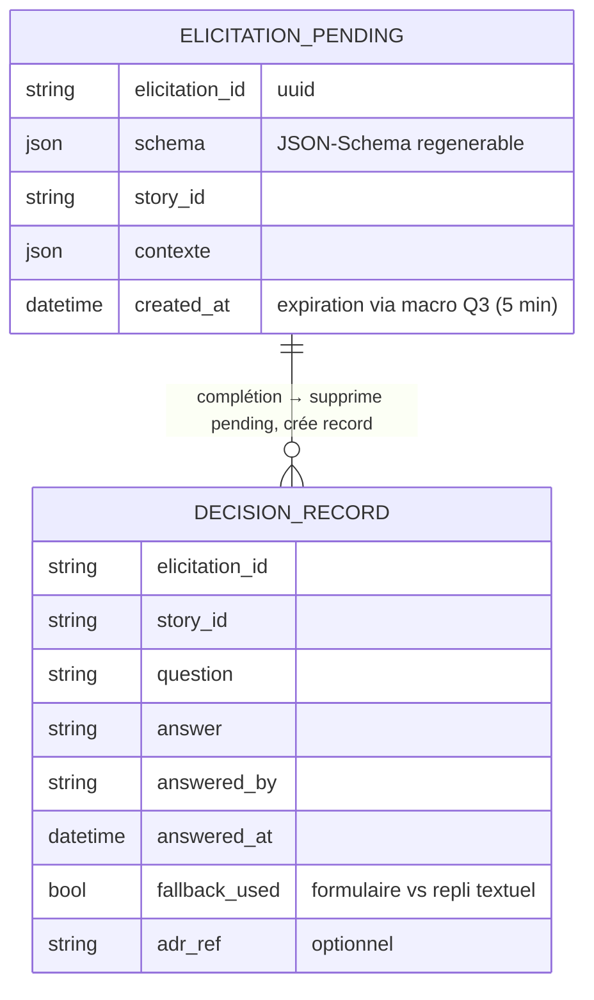

# 🐣 Dossier de Preuves Documentaires & Cadrage — `MLOOP-213-BE` (Extension Elicitation Form Mode)

> **Titre Fonctionnel Pur** : Extension Elicitation — Formulaire Interactif Form Mode pour Grill-with-Docs  
> **Epic** : `EPIC-21-MCP-MODERN-SUITE`  
> **Couche** : `backend`  
> **Dépendances** : `MLOOP-210-BE` · macro Q3 (timeout `input_required`) · ADR-0387 Pilier 3

---

### 📂 1. Sources Physiques & Maquettes SSOT

| Source SSOT | Nature | Lien Repo Local (`file:///...`) |
| :--- | :--- | :--- |
| **Architecture / ADR** | Pilier 3, Form Mode, JSON-Schema | [ADR-0387 §Pilier3](file:///C:/Memory%20Loop/standards/adr-system/0387-mcp-modern-spec-2026-07-28-tasks-ui-elicitation-architecture.md) (L68-70) |
| **Cadrage macro** | Q3 timeout → `input_required` | [ADR-004](file:///C:/Memory%20Loop/Projects/mLoop/docs/01-architecture/ADR-004_epic-21-mcp-modern-suite_-_cadrage_macro_grill__6_decisions.md) |
| **Code — moteur grill réel** | fact-search, record_adr, mark_story_grilled | [src/pipelines/grill_engine.py](file:///C:/Memory%20Loop/src/pipelines/grill_engine.py) |
| **Maquette** | N/A — widget rendu par l'IDE | N/A |

---

### ⚖️ 1.1 Matrice de Résolution des Conflits

| Conflit | Source A | Source B | Décision |
| :--- | :--- | :--- | :--- |
| Timeout élicitation (§5 L57) | Draft 213 (question ouverte) | Macro Q3 ADR-004 (timeout 5 min → `input_required`) | **Résolu macro** — Search-Before-Ask : non reposé. Résidu seul arbitré (213-Q1). |
| Chemin d'implémentation | Draft 213 : `src/pipelines/grill/` | Code réel : `src/pipelines/grill_engine.py` | **Drift corrigé** : toute planification vise `grill_engine.py`. |
| `decision_records` | Draft 213 §5 (« injecter dans decision_records ») | grep 0 dans `src/` | **Store à créer** : JSONL append-only minimal (213-Q2). |

---

### 🎙️ 2. Extraits Verbatim Sourcés

> [!NOTE]
> **Extrait 1 — Form Mode JSON-Schema (ADR-0387)**  
> **Source** : [`0387...md#L69`](file:///C:/Memory%20Loop/standards/adr-system/0387-mcp-modern-spec-2026-07-28-tasks-ui-elicitation-architecture.md#L69)  
> *« l'agent émet une demande d'élicitation structurée via JSON-Schema (options A/B, choix de profils d'API, validation de DoR). »*  
> ➔ **Fait établi** : format d'entrée = JSON-Schema → `pending_elicitation` persiste ce schéma (213-Q1), pas un état UI.

> [!NOTE]
> **Extrait 2 — Repli textuel exigé**  
> **Source** : [`MLOOP-213-BE.md#L49`](file:///C:/Memory%20Loop/Projects/mLoop/backlog/stories/MLOOP-213-BE.md#L49)  
> *« En mode dégradé, la question est retranscrite en Markdown lisible sans provoquer d'erreur bloquante. »*  
> ➔ **Fait établi** : le repli est un chemin d'écriture `decision_records` à part entière (`fallback_used: true`).

> [!NOTE]
> **Extrait 3 — Moteur grill existant (anti-doublon)**  
> **Source** : [`grill_engine.py#L172-L197`](file:///C:/Memory%20Loop/src/pipelines/grill_engine.py#L172-L197)  
> *« def record_adr(...) → docs/01-architecture/ ADR-{id}.md … ADR_TEMPLATE »*  
> ➔ **Fait établi** : `record_adr` reste réservé aux ADR ; les réponses de formulaire n'y vont PAS (éviterait la pollution du catalogue).

---

### 🗄️ 3. Schéma de Données

*Fichier* : `Projects/<projet>/memory/evidence/decision_records.jsonl` (append-only).

---

### 🎯 4. Contrats Déclaratifs Cibles

- `elicitation/create` (payload JSON-Schema) → widget formulaire dans clients compatibles (critère L47).
- Soumission → déblocage immédiat sans perte de contexte (critère L48) + écriture `decision_records`.
- Client sans élicitation → prompt Markdown (critère L49) + écriture `decision_records` (`fallback_used: true`).
- Absence de réponse 5 min → macro Q3 : `input_required` + `pending_elicitation` persistant.

---

### 🏁 5. Évaluation de la Frontière Active

#### [CAS B — Zéro Arbitrage Restant] ✅ Constat Formel de Frontière Vide
*§5 L57 résolu macro (doublon reconnu) + résidu 213-Q1 acté ; §5 L58 arbitré 213-Q2.*  
👉 **Validation formelle du socle factuel avant conversion Palier 2.**

---

### 📎 Frontière active & Admission of Limits
- Payload exact `elicitation/create` : **non vérifié** en spec externe (macro Q5).
- Expiration réelle du timer côté hôte IDE (5 min macro) : dépend du runtime hôte, non contrôlable en bridge.
- `decision_records.jsonl` à ajouter au périmètre de rétention EPIC-23 (cohérence macro Q2).
