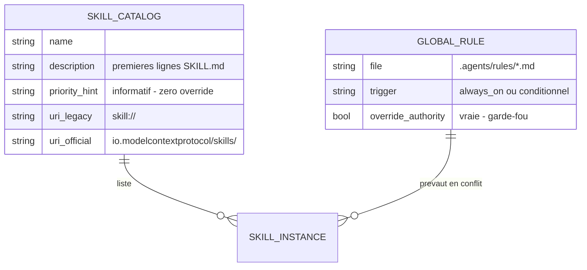

# 🐣 Dossier de Preuves Documentaires & Cadrage — `MLOOP-214-BE` (Skills over MCP)

> **Titre Fonctionnel Pur** : Standard Skills over MCP — Exposition Dynamique des Compétences mLoop  
> **Epic** : `EPIC-21-MCP-MODERN-SUITE`  
> **Couche** : `backend`  
> **Dépendances** : `MLOOP-210-BE` · macro Q4 (métrique budget) · Standard SEP-2640 · ADR-0387

---

### 📂 1. Sources Physiques & Maquettes SSOT

| Source SSOT | Nature | Lien Repo Local (`file:///...`) |
| :--- | :--- | :--- |
| **Architecture / ADR** | Progressive Disclosure, namespaces | [ADR-0387](file:///C:/Memory%20Loop/standards/adr-system/0387-mcp-modern-spec-2026-07-28-tasks-ui-elicitation-architecture.md) · [ADR-0308](file:///C:/Memory%20Loop/standards/adr-system/0308-mcp-prompts-and-evals-engine.md) |
| **Cadrage macro** | Q4 métrique budget 15 000 jetons | [ADR-004](file:///C:/Memory%20Loop/Projects/mLoop/docs/01-architecture/ADR-004_epic-21-mcp-modern-suite_-_cadrage_macro_grill__6_decisions.md) |
| **Code — exposition actuelle** | `discover_skills()` + `skill://` SEP-2640 | [mcp_resources.py](file:///C:/Memory%20Loop/src/bridges/mcp_resources.py) (L10-65) |
| **Code — outil lecture** | `read_skill` | [mcp_tools.py](file:///C:/Memory%20Loop/src/bridges/mcp_tools.py) (L66, L143, L219) |
| **Inventaire compétences** | 39 skills actives | [.agents/skills/](file:///C:/Memory%20Loop/.agents/skills/) |
| **Inventaire règles** | 3 règles always-on | [.agents/rules/](file:///C:/Memory%20Loop/.agents/rules/) |

---

### ⚖️ 1.1 Matrice de Résolution des Conflits

| Conflit | Source A | Source B | Décision |
| :--- | :--- | :--- | :--- |
| "Implémenter skills/list" (L30) | Draft 214 | `discover_skills()` + `read_skill` déjà codés | **Adaptateur, pas greenfield** : mapping namespace officielle sur le scan existant. |
| Règles always-on vs skills dynamiques (§5 L57) | Draft 214 (question ouverte) | `.agents/rules/` = garde-fous | **Hiérarchie stricte règles > skills** (214-Q1, déterministe). |
| Support IDE natif (§5 L58) | Draft 214 (question PO) | Search-Before-Ask / macro Q5 | **Fact-quest 210**, pas PO ; comportement contractuel acté (214-Q2). |
| Critère −30% (L49) | Draft 214 | Macro Q4 (budget 15 000 + doctor) | **Macro Q4 gagne** : drift à corriger à la conversion Palier 2. |

---

### 🎙️ 2. Extraits Verbatim Sourcés

> [!NOTE]
> **Extrait 1 — Exposition existante SEP-2640**  
> **Source** : [`mcp_resources.py#L10-L14`](file:///C:/Memory%20Loop/src/bridges/mcp_resources.py#L10-L14)  
> *« def discover_skills() -> list[dict]: Découvre les compétences sous .agents/skills et standards/skills (Standard SEP-2640). … search_dirs = [Path(".agents/skills"), Path("standards/skills")] »*  
> ➔ **Fait établi** : le scan est codé → 214 = adaptateur `skills/list|get` sur cette base.

> [!NOTE]
> **Extrait 2 — Outil `read_skill` déjà exposé**  
> **Source** : [`mcp_tools.py#L143-L149`](file:///C:/Memory%20Loop/src/bridges/mcp_tools.py#L143-L149)  
> *« "name": "read_skill" … "skill_name": {"type": "string", "description": "Nom de la compétence (ex: 'triage')."} »*  
> ➔ **Fait établi** : le chemin de lecture streamée existe → repli dual-stack (214-Q2) non régression.

> [!NOTE]
> **Extrait 3 — Régime des règles always-on**  
> **Source** : [`.agents/rules/phase_1_ingest_exploration_guardrails.md`](file:///C:/Memory%20Loop/.agents/rules/phase_1_ingest_exploration_guardrails.md) (frontmatter)  
> *« trigger: "Toute session d'amorçage … Phase 1" »*  
> ➔ **Fait établi** : `.agents/rules/` porte des garde-fous à déclenchement systématique → ne peuvent être abrogés par une skill (214-Q1).

---

### 🗄️ 3. Schéma de Données

---

### 🎯 4. Contrats Déclaratifs Cibles

- `skills/list` → inventaire typé (nom, description, `priority_hint`) partageant `discover_skills()` (critère L47).
- `skills/get` → contenu `SKILL.md` exact < 100 ms (critère L48).
- Repli absence namespace → `skill://` + `read_skill` (code existant).
- Métrique : budget boot AGENTS.md + rules ≤ 15 000 jetons (macro Q4, remplace −30% L49).

---

### 🏁 5. Évaluation de la Frontière Active

#### [CAS B — Zéro Arbitrage Restant] ✅ Constat Formel de Frontière Vide
*§5 L57 arbitré (214-Q1) ; §5 L58 = fact-quest routée macro Q5 avec comportement contractuel acté (214-Q2).*  
👉 **Validation formelle du socle factuel avant conversion Palier 2.**

---

### 📎 Frontière active & Admission of Limits
- Support IDE natif `io.modelcontextprotocol/skills` : **non vérifié** (fact-quest 210).
- Performance `< 100 ms` (L48) : non benchmarkée.
- Critère L49 du draft à **réécrire** avec la métrique macro Q4 lors de la conversion Palier 2.
