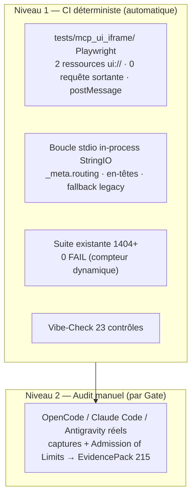

# 🐣 Dossier de Preuves Documentaires & Cadrage — `MLOOP-215-FULL` (Harnais de Certification E2E MCP)

> **Titre Fonctionnel Pur** : Harnais de Certification & Conformité E2E MCP 2026-07-28 & Non-Régression Multi-IDE  
> **Epic** : `EPIC-21-MCP-MODERN-SUITE`  
> **Couche** : `fullstack`  
> **Dépendances** : `MLOOP-210-BE` à `MLOOP-214-BE` · macro Q6 (certification 2 niveaux) · ADR-0387

---

### 📂 1. Sources Physiques & Maquettes SSOT

| Source SSOT | Nature | Lien Repo Local (`file:///...`) |
| :--- | :--- | :--- |
| **Architecture / ADR** | Non-régression, hybride dégradé | [ADR-0387 §Rétrocompatibilité](file:///C:/Memory%20Loop/standards/adr-system/0387-mcp-modern-spec-2026-07-28-tasks-ui-elicitation-architecture.md) (L85-87) |
| **Cadrage macro** | Q6 certification 2 niveaux | [ADR-004](file:///C:/Memory%20Loop/Projects/mLoop/docs/01-architecture/ADR-004_epic-21-mcp-modern-suite_-_cadrage_macro_grill__6_decisions.md) |
| **Tests MCP existants** | Base de non-régression | [tests/test_mcp_loop_mem.py](file:///C:/Memory%20Loop/tests/test_mcp_loop_mem.py) · [test_mcp_resilience_guard.py](file:///C:/Memory%20Loop/tests/test_mcp_resilience_guard.py) · [test_mcp_sse_transport.py](file:///C:/Memory%20Loop/tests/test_mcp_sse_transport.py) |
| **Compteur réel** | Suite pytest | 1404 tests collectés (2026-09-24) |
| **Maquette** | N/A — harnais QA | N/A |

---

### ⚖️ 1.1 Matrice de Résolution des Conflits

| Conflit | Source A | Source B | Décision |
| :--- | :--- | :--- | :--- |
| Compteur de tests (L51) | Draft : « 1 386 tests » | Collecte réelle : **1404** | **Compteur dynamique** (215-Q1) : « 0 FAIL sur la suite complète », zéro chiffre périmé. |
| Simulation iframe (§5 L60) | Draft (question ouverte) | Macro Q6 (2 niveaux) | **Doubles macro reconnu** — résidu composition Playwright acté (215-Q1). |
| Mocks stdio Windows (§5 L61) | Draft (question ouverte) | ADR-0369 (timeout/ctx) | **in-process StringIO + Popen borné** (215-Q2). |

---

### 🎙️ 2. Extraits Verbatim Sourcés

> [!NOTE]
> **Extrait 1 — Critère périmé**  
> **Source** : [`MLOOP-215-FULL.md#L51`](file:///C:/Memory%20Loop/Projects/mLoop/backlog/stories/MLOOP-215-FULL.md#L51)  
> *« La suite de 1 386 tests existants de mLoop continue de réussir à 100 %. »*  
> ➔ **Fait établi** : 1404 collectés au 2026-09-24 → critère reformulé en compteur dynamique (215-Q1).

> [!NOTE]
> **Extrait 2 — Dégradation gracieuse à certifier**  
> **Source** : [`MLOOP-215-FULL.md#L41`](file:///C:/Memory%20Loop/Projects/mLoop/backlog/stories/MLOOP-215-FULL.md#L41)  
> *« Vérification de la dégradation gracieuse pour les clients legacy (2025-11-25). »*  
> ➔ **Fait établi** : scénario legacy à couvrir dans le harnais (lien direct macro Q1 / 210-Q1).

> [!NOTE]
> **Extrait 3 — Playwright déjà présent (transitif)**  
> **Source** : [`tests/test_svg_ocr_bridge.py#L81`](file:///C:/Memory%20Loop/tests/test_svg_ocr_bridge.py#L81)  
> *« return_value=_mock_completed(1, stderr="ERREUR : playwright introuvable") »*  
> ➔ **Fait établi** : la dépendance existe en écosystème mais aucun harnais iframe (lot à créer).

---

### 🗄️ 3. Schéma du Harnais (2 niveaux — macro Q6)

---

### 🎯 4. Contrats Déclaratifs Cibles

- 1 test Playwright par ressource `ui://` (fixture `tests/mcp_ui_iframe/`).
- Mocks stdio in-process (StringIO) niveau 1 ; `Popen(PIPE, timeout)` + `tmp_path` niveau 2.
- Critère L51 : « 0 FAIL sur compteur dynamique pytest » (remplace « 1 386 »).
- Intégration contrôle bridges dans le Vibe-Check (L52).

---

### 🏁 5. Évaluation de la Frontière Active

#### [CAS B — Zéro Arbitrage Restant] ✅ Constat Formel de Frontière Vide
*Les 2 questions du §5 arbitrées (215-Q1 / 215-Q2 ; doublon macro Q6 reconnu pour L60).*  
👉 **Validation formelle du socle factuel avant conversion Palier 2.**

---

### 📎 Frontière active & Admission of Limits
- Rendu `ui://` par IDE réels : **jamais observé** (Niveau 2 macro Q6, non exécuté ici).
- Dépendance Playwright : actuellement **transitive** — à verrouiller explicitement au build.
- Nombre de tests en croissance continue (1404 → …) : sharding CI non dans ce périmètre.
