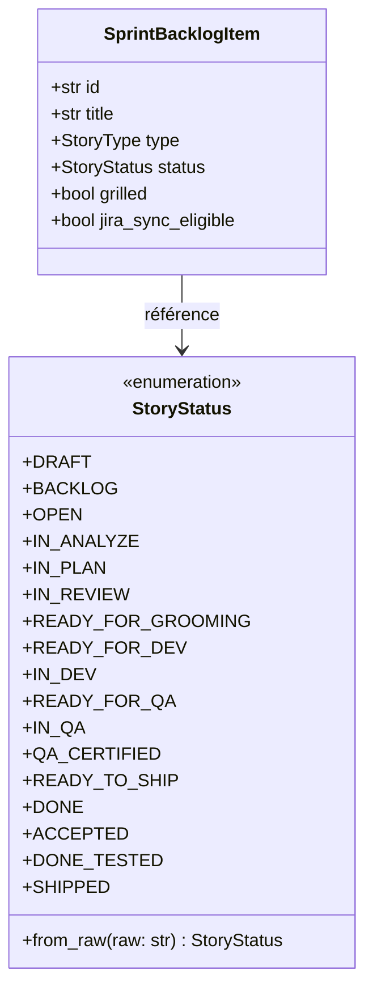

# 📋 Fact Dossier — `MLOOP-310-BE` : Unification du Modèle d'États `StoryStatus` & Rétrocompatibilité Tolérante

---

- **Récit Cible** : `MLOOP-310-BE`
- **Épopée** : `EPIC-31-FSM-ANTI-HARDCODING-AND-LIFECYCLE-HARMONIZATION`
- **Composant** : `Core/State` (`src/state/_state_core.py`)
- **Établi le** : 2026-09-25 — Session Grill-Me 1:1 VALIDÉE (PO Marco)
- **Autorité** : PO mLoop (Marco) / Architecte Framework

---

## ⚖️ 1. Matrice des Décisions Validées en Session Grill-Me 1:1

| # | Question Grillée | Option Retenue | Justification & Impact Technique |
| :- | :--- | :---: | :--- |
| **Q1** | Comportement de `StoryStatus.from_raw("DONE_TESTED")` au parsing | **Option A (Préservation stricte)** | `DONE_TESTED = "DONE_TESTED"` est maintenu dans `StoryStatus`. Le parsing ne mute pas l'historique des 91 récits archivés. La migration du cycle vers `READY_FOR_QA` est confiée aux transitions FSM (`MLOOP-312-BE`). |
| **Q2** | Traitement du statut `SHIPPED` dans l'enum et dans `_GRILLED_STATUSES` | **Option A (Statut terminal legacy)** | `SHIPPED = "SHIPPED"` est maintenu dans l'enum et explicitement adjoint à `_GRILLED_STATUSES`. Les récits scellés existants restent conformes sans migration destructive. Les nouveaux récits atteignent `DONE`. |

---

## 🔍 2. Extraits Sourcés & Passage-Level Grounding (Vérité Terrain)

### Extrait 1 — `src/state/_state_core.py` (Lignes 79–116) : Scission artificielle et membres manquants
```python
class StoryStatus(str, Enum):
    # ─── Commun aux deux modes ─────────────────────────────────────
    DRAFT = "DRAFT"
    BACKLOG = "BACKLOG"
    OPEN = "OPEN"
    IN_ANALYZE = "IN_ANALYZE"
    IN_PLAN = "IN_PLAN"
    IN_REVIEW = "IN_REVIEW"
    IN_VALIDATE = "IN_VALIDATE"
    ON_HOLD = "ON_HOLD"
    ERROR = "ERROR"
    # ─── Mode CLIENT ───────────────────────────────────────────────
    READY_FOR_GROOMING = "READY_FOR_GROOMING"
    READY_FOR_DEV = "READY_FOR_DEV"
    IN_DEV = "IN_DEV"
    IN_QA = "IN_QA"
    DONE = "DONE"
    ACCEPTED = "ACCEPTED"
    # ─── Mode MLOOP uniquement ─────────────────────────────────────
    IN_BUILD = "IN_BUILD"
    DONE_TESTED = "DONE_TESTED"
    SHIPPED = "SHIPPED"
```
* **Fait Établi** : Les états des phases 4 et 5 (`READY_FOR_QA`, `QA_CERTIFIED`, `READY_TO_SHIP`) sont totalement absents. La distinction CLIENT / MLOOP crée une dette conceptuelle. L'ajout des 3 membres sans supprimer les anciens garantit 100% d'étanchéité.

### Extrait 2 — `src/state/_state_core.py` (Lignes 154–157) : Hardcoding par chaînes brutes
```python
_GRILLED_STATUSES = frozenset({
    "IN_REVIEW", "READY_FOR_GROOMING", "READY_FOR_DEV",
    "IN_DEV", "IN_QA", "DONE_TESTED", "DONE", "ACCEPTED",
})
```
* **Fait Établi** : `_GRILLED_STATUSES` utilise des chaînes littérales non typées et omettait curieusement `SHIPPED`. Il doit être converti en un ensemble typé basé sur `StoryStatus` incluant les nouveaux états : `READY_FOR_QA`, `QA_CERTIFIED`, `READY_TO_SHIP`, `DONE`, `SHIPPED`.

### Extrait 3 — `tests/test_story_status.py` (Lignes 42–85) : Contrat de non-régression
```python
def test_from_raw_exact_match():
    assert StoryStatus.from_raw("SHIPPED") == StoryStatus.SHIPPED
    assert StoryStatus.from_raw("ACCEPTED") == StoryStatus.ACCEPTED
    assert StoryStatus.from_raw("DONE") == StoryStatus.DONE
    assert StoryStatus.from_raw("IN_DEV") == StoryStatus.IN_DEV
    assert StoryStatus.from_raw("IN_QA") == StoryStatus.IN_QA
```
* **Fait Établi** : Tout échec sur `from_raw("SHIPPED")` casse immédiatement la suite unitaire. Le maintien de `SHIPPED` est un impératif de non-régression.

---

## 🏛️ 3. Structure de Données & Typage Cible



### Collection Typée `_GRILLED_STATUSES`
```python
_GRILLED_STATUSES: frozenset[str] = frozenset({
    StoryStatus.IN_REVIEW.value,
    StoryStatus.READY_FOR_GROOMING.value,
    StoryStatus.READY_FOR_DEV.value,
    StoryStatus.IN_DEV.value,
    StoryStatus.IN_QA.value,
    StoryStatus.READY_FOR_QA.value,
    StoryStatus.QA_CERTIFIED.value,
    StoryStatus.READY_TO_SHIP.value,
    StoryStatus.DONE.value,
    StoryStatus.ACCEPTED.value,
    StoryStatus.DONE_TESTED.value,
    StoryStatus.SHIPPED.value,
})
```

---

## 🚪 4. Frontière Active & Admission of Limits

- **In-Scope MLOOP-310-BE** :
  - Mise à niveau de l'enum `StoryStatus` dans `src/state/_state_core.py`.
  - Normalisation robuste dans `StoryStatus.from_raw()`.
  - Refonte typée de `_GRILLED_STATUSES` et propriétés de `SprintBacklogItem`.
  - Tests unitaires dédiés dans `tests/test_story_status.py`.
- **Out-of-Scope (Délégué aux récits suivants)** :
  - `MLOOP-311-BE` : Nettoyage du hardcoding des verticaux clients dans `state_machine.py`.
  - `MLOOP-312-BE` : Mise à jour de la matrice `ALLOWED_TRANSITIONS` et Gate 5 autonome.
  - `MLOOP-313-BE` : Harmonisation des regex de parsing Markdown dans `_sync_backlog_parser.py` et Dashboard.
  - `MLOOP-314-FULL` : Rédaction formelle de l'ADR et certification E2E.
