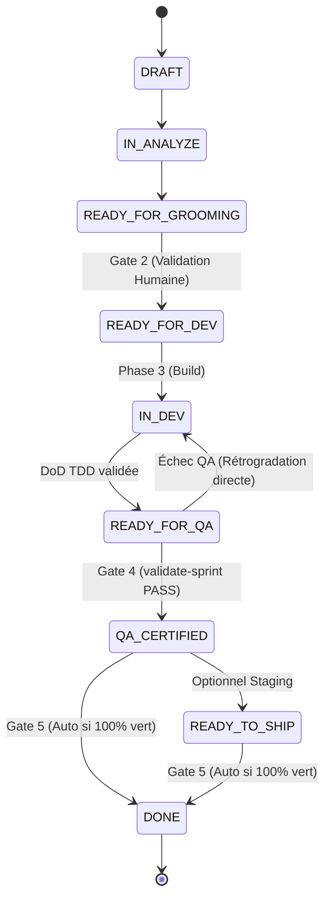

# 📋 Fact Dossier — `MLOOP-312-BE` : Graphe de Transitions Déterministe & Auto-Clôture Gate 5 sans Validation Humaine

---

- **Récit Cible** : `MLOOP-312-BE`
- **Épopée** : `EPIC-31-FSM-ANTI-HARDCODING-AND-LIFECYCLE-HARMONIZATION`
- **Composant** : `Pipelines/Lifecycle` (`src/pipelines/state_machine.py`, `src/core/lifecycle/_lc_models.py`)
- **Établi le** : 2026-09-25 — Session Macro-Grill VALIDÉE (PO Marco)
- **Autorité** : PO mLoop (Marco) / Architecte Framework

---

## ⚖️ 1. Matrice des Décisions Validées en Session Macro-Grill

| # | Question Grillée | Option Retenue | Justification & Impact Technique |
| :- | :--- | :---: | :--- |
| **Q3** | Rétrogradation sur échec QA en Phase 4 | **Option 3.A (Rétrogradation directe `IN_DEV`)** | En cas d'échec de la certification QA (`validate-sprint`), le récit repasse immédiatement à `IN_DEV` pour correction unitaire TDD sans surcoût bureaucratique. |
| **Q4** | Clôture automatique de la Gate 5 (Zero-Fluff) | **Option 4.A (Auto-clôture 100% autonome)** | `GATE_DEFINITIONS[5]["requires_human"] = False`. Si 100% des tests pré-vol sont verts (Pytest, Vibe-Check, AST, Anti-Leak, Pre-Flight), la FSM autorise la clôture automatique vers `DONE` sans confirmation humaine. |

---

## 🔍 2. Extraits Sourcés & Passage-Level Grounding (Vérité Terrain)

### Extrait 1 — `src/pipelines/state_machine.py` (Lignes 46–172) : Table actuelle `ALLOWED_TRANSITIONS`
```python
    StoryStatus.IN_DEV: [
        StoryStatus.DONE_TESTED,
        StoryStatus.IN_REVIEW,
        StoryStatus.ON_HOLD,
        StoryStatus.ERROR,
    ],
```
* **Fait Établi** : La transition directe `IN_DEV ➔ DONE_TESTED` saute la Phase 4 (QA). Elle doit être refactorisée vers `IN_DEV ➔ [READY_FOR_QA, DONE_TESTED, IN_REVIEW, ON_HOLD, ERROR]`, avec `READY_FOR_QA ➔ [QA_CERTIFIED, IN_DEV, IN_REVIEW, ON_HOLD]`, et `QA_CERTIFIED ➔ [READY_TO_SHIP, DONE, SHIPPED]`.

### Extrait 2 — `src/core/lifecycle/_lc_models.py` (Ligne 45) : Configuration de Gate 5
```python
5: {
    "name": "Phase 5 : SHIP & SYNC",
    "requires_human": True,  # Actuellement à True
}
```
* **Fait Établi** : Exiger une validation humaine manuelle sur Gate 5 alors que 100% des contrôles pré-vol sont automatisés et verts ralentit inutilement la chaîne de livraison continue (Zero-Fluff violation).

---

## 🏛️ 3. Structure de Données & Typage Cible



---

## 🚪 4. Frontière Active & Admission of Limits

- **In-Scope MLOOP-312-BE** :
  - Mise à jour de `ALLOWED_TRANSITIONS` dans `state_machine.py`.
  - Configuration `GATE_DEFINITIONS[5]["requires_human"] = False`.
  - Levée systématique de `StateTransitionError` sur sauts illégitimes.
- **Out-of-Scope** :
  - Parsing de backlog Markdown (`MLOOP-313-BE`).
  - Documentation normative ADR-0391 (`MLOOP-314-FULL`).
