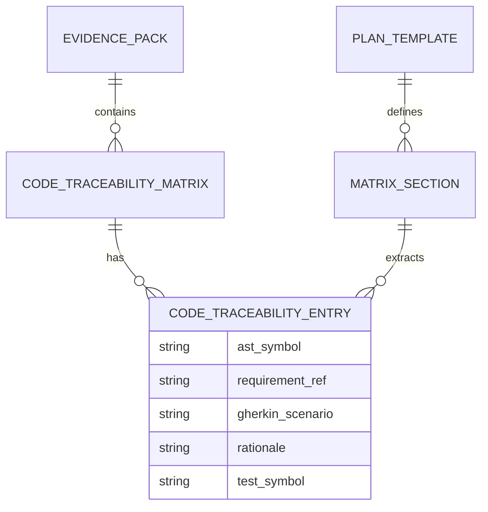

# Dossier de Preuves Factuelles — MLOOP-330-BE

**Récit** : Normalisation des Gabarits de Traçabilité Code ↔ Exigences & Schéma EvidencePack 2.0  
**Épopée** : EPIC-33-REQUIREMENT-TO-CODE-TRACEABILITY-AND-CODE-EVIDENCE  
**Statut** : READY_FOR_DEV (validated_by: Marco, validated_at: 2026-09-25T17:18:38.646725+00:00)  
**Date constitution** : 2026-09-25

---

## 1. Maquettes SSOT & Notes d'Atelier

Aucune maquette UI/UX requise (récit backend pur — normalisation de gabarits et schémas).

---

## 2. Matrice de Résolution des Conflits

| Conflit Identifié | Source | Résolution | Décision |
|-------------------|--------|------------|----------|
| Format plan.md vs OpenSpec tasks.md | ADR-0394 §3.2 | Double passerelle déclarative (priorité plan.md, fallback tasks.md) | Acceptée |
| Ancrage par symbole qualifié vs lignes volatiles | ADR-0394 §4.1 | Symbole qualifié canonique obligatoire (`chemin/fichier.py::Symbole`) | Acceptée |
| Justification minimale 10 caractères | ADR-0394 §4.2 | Validation stricte `len(rationale.strip()) >= 10` | Acceptée |

---

## 3. Extraits Verbatim Sourcés

### Extrait 1 — ADR-0394 (Lignes 1-50)
> « La traçabilité des exigences doit s'étendre de bout en bout jusqu'au code physique sans rompre l'étanchéité no-code du récit fonctionnel. »
> ➔ Fait établi : La matrice de traçabilité doit vivre dans le plan d'implémentation et l'EvidencePack, jamais dans la User Story Markdown.

### Extrait 2 — ADR-0319 (Dual Agent Handoff OpenSpec Ready)
> « Compatibilité native avec le triptyque OpenSpec (`requirements`, `scenarios`, `tasks`). »
> ➔ Fait établi : Le schéma `CodeTraceabilityEntry` doit être convertible sans perte vers le format OpenSpec.

### Extrait 3 — ADR-0369 (Standards Robustesse Python Senior)
> « Typage Structurel : Injection des collaborateurs lourds via `typing.Protocol`. »
> ➔ Fait établi : Les moteurs d'extraction et validation doivent utiliser des Protocols pour l'injection de dépendances.

---

## 4. Structure de Données DBML / Mermaid ERD

---

## 5. Contrats Déclaratifs Cibles

| Composant | Contrat | Fichier |
|-----------|---------|---------|
| EvidencePackEngine | `validate_code_traceability(entries: List[CodeTraceabilityEntry]) -> bool` | `src/pipelines/evidence_pack.py` |
| EvidencePackEngine | `set_code_traceability(story_id: str, entries: List[CodeTraceabilityEntry]) -> Path` | `src/pipelines/evidence_pack.py` |
| PlanTemplate | Section `Matrice de Traçabilité Code ↔ Exigences` (colonnes: Symbole AST Qualifié, Règle Métier Cible, Scénario Gherkin, Justification, Test Unitaire) | `standards/blueprints/plan_template.md` |
| CodeTraceabilityEntry | TypedDict avec champs: `ast_symbol`, `requirement_ref`, `gherkin_scenario`, `rationale`, `test_symbol` | `src/pipelines/evidence_pack.py` |

---

## 6. Frontière Active & Admission of Limits

| Zone | Statut | Commentaire |
|------|--------|-------------|
| Schéma CodeTraceabilityEntry | ✅ Spécifié | TypedDict avec validation stricte |
| Section plan_template.md | ✅ Spécifié | 5 colonnes obligatoires |
| Validation quintuplet | ✅ Spécifié | Via `EvidencePackEngine.validate_code_traceability` |
| Conversion OpenSpec | ✅ Spécifié | Mapping 1:1 vers `tasks.md` |
| **Extraction AST runtime** | ❌ Hors périmètre | Couvert par MLOOP-331-BE |
| **Sonde Vibe-Check Check 29** | ❌ Hors périmètre | Couvert par MLOOP-333-BE |
| **Insertion code dans Markdown** | ❌ Interdit | Gate G4 — zéro pollution no-code |

---

## 7. Preuves de Conformité (Références Croisées)

| Critère | Preuve |
|---------|--------|
| Schéma typé CodeTraceabilityEntry | `src/pipelines/evidence_pack.py` — `TypedDict` avec validation |
| Section plan_template.md | `standards/blueprints/plan_template.md` — tableau GFM 5 colonnes |
| Validation quintuplet | `EvidencePackEngine.validate_code_traceability` — test unitaire |
| Conversion OpenSpec | Mapping documenté dans ADR-0319 |

---

*Dossier constitué le 2026-09-25 par l'Orchestrateur mLoop pour lever le blocage Check 28 sur MLOOP-330-BE.*